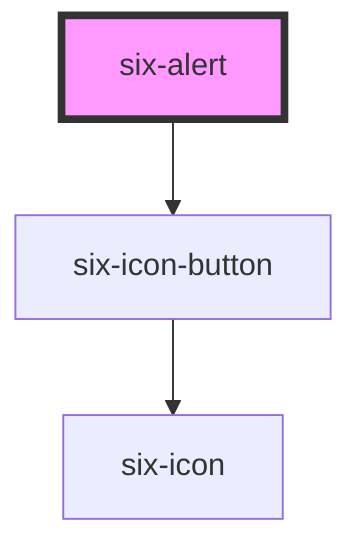

# Alert

Alerts are used to display important messages either inline or as toast notifications.


<docs-demo-six-alert-0></docs-demo-six-alert-0>

```html
<six-alert open>
  <six-icon slot="icon">info</six-icon>
  This is a standard alert. You can customize its content and even the icon.
</six-alert>
```


warning

Alerts will not be visible if the `open` attribute is not present.

## Types

Set the `type` attribute to change the alert's type

<docs-demo-six-alert-1></docs-demo-six-alert-1>

```html
<six-alert type="primary" open>
  <six-icon slot="icon">info</six-icon>
  <strong>This is super informative</strong><br>
  You can tell by how pretty the alert is.
</six-alert>

<br>

<six-alert type="success" open>
  <six-icon slot="icon">check_circle</six-icon>
  <strong>Your changes have been saved</strong><br>
  You can safely exit the app now.
</six-alert>

<br>

<six-alert type="info" open>
  <six-icon slot="icon">info</six-icon>
  <strong>Your settings have been updated</strong><br>
  Settings will take affect on next login.
</six-alert>

<br>

<six-alert type="warning" open>
  <six-icon slot="icon">warning_amber</six-icon>
  <strong>Your session has ended</strong><br>
  Please login again to continue.
</six-alert>

<br>

<six-alert type="danger" open>
  <six-icon slot="icon">error_outline</six-icon>
  <strong>Your account has been deleted</strong><br>
  We're very sorry to see you go!
</six-alert>
```


## closable

Add the `closable` attribute to show a close button that will hide the alert.

<docs-demo-six-alert-2></docs-demo-six-alert-2>

```html
<six-alert type="primary" open closable class="alert-closable">
  <six-icon slot="icon">info</six-icon>
  You can close this alert any time!
</six-alert>

<script type="module">
  (() => {
    const alert = document.querySelector('.alert-closable');
    alert.addEventListener('six-alert-after-hide', () => {
      setTimeout(() => {
        alert.open = true;
      }, 2000);
    });
  })();
</script>
```


## Without Icons

Icons are optional. Simply omit the `icon` slot if you don't want them.

<docs-demo-six-alert-3></docs-demo-six-alert-3>

```html
<six-alert type="primary" open> Nothing fancy here, just a simple alert. </six-alert>
```


## Duration

Set the `duration` prop to automatically hide an alert after a period of time. This is useful for alerts that don't require acknowledgement.

<docs-demo-six-alert-4></docs-demo-six-alert-4>

```html
<div class="alert-duration">
  <six-button type="primary">Show Alert</six-button>

  <six-alert type="primary" duration="3000" closable>
    <six-icon slot="icon">info</six-icon>
    This alert will automatically hide itself after three seconds, unless you interact with it.
  </six-alert>
</div>

<script type="module">
  (() => {
    const container = document.querySelector('.alert-duration');
    const button = container.querySelector('six-button');
    const disappearingAlert = container.querySelector('six-alert');

    button.addEventListener('click', () => disappearingAlert.show());
  })();
</script>

<style>
  .alert-duration six-alert {
    margin-top: var(--six-spacing-medium);
  }
</style>
```


## Toast Notifications

To display an alert as a toast notification, or "toast", create the alert and call its \`toast()\` method. This will move the alert out of its position in the DOM and into the toast stack where it will be shown. Once dismissed, it will be removed from the DOM completely. To reuse a toast, store a reference to it and call `toast()` again later on.

You should always use the `closable` prop so users can dismiss the notification. It's also common to set a reasonable `duration` when the notification doesn't require acknowledgement.

<docs-demo-six-alert-5></docs-demo-six-alert-5>

```html
<div class="alert-toast">
  <six-button id="primary-button" type="primary">Primary</six-button>
  <six-button id="success-button" type="success">Success</six-button>
  <six-button id="secondary-button" type="secondary">Info</six-button>
  <six-button id="warning-button" type="warning">Warning</six-button>
  <six-button id="danger-button" type="danger">Danger</six-button>

  <six-alert id="primary-alert" type="primary" duration="3000" closable>
    <six-icon slot="icon">info</six-icon>
    <strong>This is super informative</strong><br>
    You can tell by how pretty the alert is.
  </six-alert>

  <six-alert id="success-alert" type="success" duration="3000" closable>
    <six-icon slot="icon">check_circle</six-icon>
    <strong>Your changes have been saved</strong><br>
    You can safely exit the app now.
  </six-alert>

  <six-alert id="info-alert" type="info" duration="3000" closable>
    <six-icon slot="icon">info</six-icon>
    <strong>Your settings have been updated</strong><br>
    Settings will take affect on next login.
  </six-alert>

  <six-alert id="warning-alert" type="warning" duration="3000" closable>
    <six-icon slot="icon">warning_amber</six-icon>
    <strong>Your session has ended</strong><br>
    Please login again to continue.
  </six-alert>

  <six-alert id="danger-alert" type="danger" duration="3000" closable>
    <six-icon slot="icon">error_outline</six-icon>
    <strong>Your account has been deleted</strong><br>
    We're very sorry to see you go!
  </six-alert>
</div>

<script type="module">
  (() => {
    const alertToastContainer = document.querySelector('.alert-toast');

    Object.entries({
      primary: 'primary',
      success: 'success',
      info: 'secondary',
      warning: 'warning',
      danger: 'danger',
    }).map(([alertType, buttonType]) => {
      const button = alertToastContainer.querySelector(`#${buttonType}-button`);
      const alert = alertToastContainer.querySelector(`#${alertType}-alert`);

      button.addEventListener('click', () => alert.toast());
    });
  })();
</script>
```


## Angular and Vue Utilities

The wrapper libraries for Angular and Vue offer a simpler way to create toast alerts:

*   **Angular**: Inject the \`alertService\` and utilize the \`showAlert\` method `this.alertService.showAlert('The Alert Message');`
*   **Vue**: Use `showAlert` by importing it from `'@six-group/ui-library'` and then invoke it `showAlert('The Alert Message');`

## Creating Toasts Imperatively

You can also create your own utility that emits toast notifications with a function call rather than composing them in your HTML. To do this, generate the alert with JavaScript, append it to the body, and call the `toast()` method as shown in the example below.

<docs-demo-six-alert-6></docs-demo-six-alert-6>

```html
<div class="alert-toast-wrapper">
  <six-button type="primary">Create Toast</six-button>
</div>

<script type="module">
  (() => {
    const alertToastImpContainer = document.querySelector('.alert-toast-wrapper');
    const toastCreatorButton = alertToastImpContainer.querySelector('six-button');
    let count = 0;

    // Always escape HTML for text arguments!
    function escapeHtml(html) {
      const div = document.createElement('div');
      div.textContent = html;
      return div.innerHTML;
    }

    // Custom function to emit toast notifications
    function notify(message, type = 'primary', icon = 'info', duration = 3000) {
      const alert = Object.assign(document.createElement('six-alert'), {
        type: type,
        closable: true,
        duration: duration,
        innerHTML: `
            <six-icon slot="icon">${icon}</six-icon>
            ${escapeHtml(message)}`,
      });

      document.body.append(alert);
      return alert.toast();
    }

    toastCreatorButton.addEventListener('click', () => {
      const possibleTypes = ['primary', 'success', 'info', 'warning', 'danger'];
      const drawnNumber = Math.round(Math.random(0, 1) * 5) + 1;
      notify(`This is custom toast #${++count}`, possibleTypes[drawnNumber]);
    });
  })();
</script>
```


## The Toast Stack

The toast stack is a fixed position singleton element created and managed internally by the alert component. It will be added and removed from the DOM as needed when toasts are shown. When more than one toast is visible, they will stack vertically in the toast stack.

By default, the toast stack is positioned at the top-right of the viewport. You can change its position by targeting `.six-toast-stack` in your stylesheet. To make toasts appear at the top-left of the viewport, for example, use the following styles.

By design, it is not possible to show toasts in more than one stack simultaneously. Such behavior is confusing and makes for a poor user experience.


<!-- Auto Generated Below -->


## Properties

| Property   | Attribute  | Description                                                                                                                                                                                   | Type                                                        | Default     |
| ---------- | ---------- | --------------------------------------------------------------------------------------------------------------------------------------------------------------------------------------------- | ----------------------------------------------------------- | ----------- |
| `closable` | `closable` | Set to true to make the alert closable.                                                                                                                                                       | `boolean`                                                   | `false`     |
| `duration` | `duration` | The length of time, in milliseconds, the alert will show before closing itself. If the user interacts with the alert before it closes (e.g. moves the mouse over it), the timer will restart. | `number`                                                    | `Infinity`  |
| `open`     | `open`     | Indicates whether or not the alert is open. You can use this in lieu of the show/hide methods.                                                                                                | `boolean`                                                   | `false`     |
| `type`     | `type`     | The type of alert.                                                                                                                                                                            | `"danger" \| "info" \| "primary" \| "success" \| "warning"` | `'primary'` |


## Events

| Event                  | Description                                                                                        | Type                     |
| ---------------------- | -------------------------------------------------------------------------------------------------- | ------------------------ |
| `six-alert-after-hide` | Emitted after the alert closes and all transitions are complete.                                   | `CustomEvent<undefined>` |
| `six-alert-after-show` | Emitted after the alert opens and all transitions are complete.                                    | `CustomEvent<undefined>` |
| `six-alert-hide`       | Emitted when the alert closes. Calling `event.preventDefault()` will prevent it from being closed. | `CustomEvent<undefined>` |
| `six-alert-show`       | Emitted when the alert opens. Calling `event.preventDefault()` will prevent it from being opened.  | `CustomEvent<undefined>` |


## Methods

### `hide() => Promise<void>`

Hides the alert

#### Returns

Type: `Promise<void>`


### `show() => Promise<void>`

Shows the alert.

#### Returns

Type: `Promise<void>`


### `toast(adjustPosition?: boolean) => Promise<void>`

Displays the alert as a toast notification. This will move the alert out of its position in the DOM and, when
dismissed, it will be removed from the DOM completely. By storing a reference to the alert, you can reuse it by
calling this method again. The returned promise will resolve after the alert is hidden.

#### Parameters

| Name             | Type      | Description                                                                                                                                           |
| ---------------- | --------- | ----------------------------------------------------------------------------------------------------------------------------------------------------- |
| `adjustPosition` | `boolean` | If true, the top and right position of the toast stack is shifted according to the six-root header's height and the presence of a vertical scrollbar. |

#### Returns

Type: `Promise<void>`


## Slots

| Slot     | Description                   |
| -------- | ----------------------------- |
|          | The alert's content.          |
| `"icon"` | An icon to show in the alert. |


## Shadow Parts

| Part             | Description                              |
| ---------------- | ---------------------------------------- |
| `"base"`         | The component's base wrapper.            |
| `"close-button"` | The close button.                        |
| `"icon"`         | The container that wraps the alert icon. |
| `"message"`      | The alert message.                       |


## CSS Custom Properties

| Name           | Description             |
| -------------- | ----------------------- |
| `--box-shadow` | The alert's box shadow. |


## Dependencies

### Depends on

- [six-icon-button](six-icon-button.html)

### Graph


----------------------------------------------

Copyright © 2021-present SIX-Group
