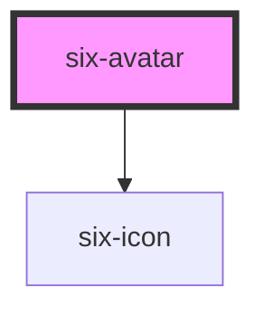

# six-avatar


# Avatar

Avatars are used to represent a person or object.

<docs-demo-six-avatar-7></docs-demo-six-avatar-7>

```html
<six-avatar></six-avatar>
```


## Examples

### Images

To use an image for the avatar, set the `image` and `alt` attributes. This will take priority and be shown over initials and icons.

<docs-demo-six-avatar-8></docs-demo-six-avatar-8>

```html
<six-avatar           image="https://images.unsplash.com/photo-1529778873920-4da4926a72c2?ixlib=rb-1.2.1&auto=format&fit=crop&w=300&q=80"
  alt="Gray tabby kitten looking down"
></six-avatar>
```


### Initials

When you don't have an image to use, you can set the `initials` attribute to show something more personalized than an icon.

<docs-demo-six-avatar-9></docs-demo-six-avatar-9>

```html
<six-avatar initials="SL"></six-avatar>
```


### Custom Icons

When no image or initials are set, an icon will be shown. The default avatar shows a generic "user" icon, but you can customize this with the `icon` slot.

<docs-demo-six-avatar-10></docs-demo-six-avatar-10>

```html
<six-avatar>
  <six-icon slot="icon">image</six-icon>
</six-avatar>

<six-avatar>
  <six-icon slot="icon">archive</six-icon>
</six-avatar>

<six-avatar>
  <six-icon slot="icon">work</six-icon>
</six-avatar>
```


### Shapes

Avatars can be shaped using the `shape` attribute.

<docs-demo-six-avatar-11></docs-demo-six-avatar-11>

```html
<six-avatar shape="square"></six-avatar>

<six-avatar shape="rounded"></six-avatar>

<six-avatar shape="circle"></six-avatar>
```


### Avatar Groups

You can group avatars with a few lines of CSS.

<docs-demo-six-avatar-12></docs-demo-six-avatar-12>

```html
<div class="avatar-group">
  <six-avatar             id="cat1"
    image="https://images.unsplash.com/photo-1490150028299-bf57d78394e0?ixid=MXwxMjA3fDB8MHxwaG90by1wYWdlfHx8fGVufDB8fHw%3D&ixlib=rb-1.2.1&auto=format&fit=crop&w=256&h=256&q=80&crop=right"
  ></six-avatar>
  <six-avatar             image="https://images.unsplash.com/photo-1503454537195-1dcabb73ffb9?ixid=MXwxMjA3fDB8MHxwaG90by1wYWdlfHx8fGVufDB8fHw%3D&ixlib=rb-1.2.1&auto=format&fit=crop&w=256&h=256&crop=left&q=80"
  ></six-avatar>
  <six-avatar             image="https://images.unsplash.com/photo-1456439663599-95b042d50252?ixid=MXwxMjA3fDB8MHxwaG90by1wYWdlfHx8fGVufDB8fHw%3D&ixlib=rb-1.2.1&auto=format&fit=crop&w=256&h=256&crop=left&q=80"
  ></six-avatar>
  <six-avatar             image="https://images.unsplash.com/flagged/photo-1554078875-e37cb8b0e27d?ixid=MXwxMjA3fDB8MHxwaG90by1wYWdlfHx8fGVufDB8fHw%3D&ixlib=rb-1.2.1&auto=format&fit=crop&w=256&h=256&crop=top&q=80"
  ></six-avatar>
</div>

<style>
  .avatar-group six-avatar:not(:first-of-type) {
    margin-left: -1rem;
  }

  .avatar-group six-avatar::part(base) {
    border: solid 2px white;
  }
</style>
```


<!-- Auto Generated Below -->


## Properties

| Property   | Attribute  | Description                                                                                | Type                                | Default    |
| ---------- | ---------- | ------------------------------------------------------------------------------------------ | ----------------------------------- | ---------- |
| `alt`      | `alt`      | Alternative text for the image.                                                            | `string`                            | `''`       |
| `image`    | `image`    | The image source to use for the avatar.                                                    | `string`                            | `''`       |
| `initials` | `initials` | Initials to use as a fallback when no image is available (1-2 characters max recommended). | `string`                            | `''`       |
| `shape`    | `shape`    | The shape of the avatar.                                                                   | `"circle" \| "rounded" \| "square"` | `'circle'` |


## Slots

| Slot     | Description                                                    |
| -------- | -------------------------------------------------------------- |
| `"icon"` | The default icon to use when no image or initials are present. |


## Shadow Parts

| Part         | Description                                   |
| ------------ | --------------------------------------------- |
| `"base"`     | The component's base wrapper.                 |
| `"icon"`     | The container that wraps the avatar icon.     |
| `"image"`    | The avatar image.                             |
| `"initials"` | The container that wraps the avatar initials. |


## CSS Custom Properties

| Name     | Description             |
| -------- | ----------------------- |
| `--size` | The size of the avatar. |


## Dependencies

### Depends on

- [six-icon](six-icon.html)

### Graph


----------------------------------------------

Copyright © 2021-present SIX-Group
