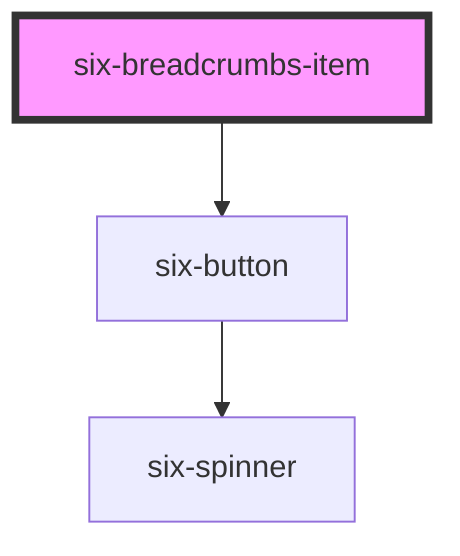

# Breadcrumbs Item


Breadcrumb items are intended for use with the six-breadcrumbs component. For usage details, see the [six-breadcrumbs documentation](six-breadcrumbs.html).

<docs-demo-six-breadcrumbs-item-0></docs-demo-six-breadcrumbs-item-0>

```html
<six-breadcrumbs>
  <six-breadcrumbs-item>A</six-breadcrumbs-item>
  <six-breadcrumbs-item>B</six-breadcrumbs-item>
  <six-breadcrumbs-item>C</six-breadcrumbs-item>
</six-breadcrumbs>
```


<!-- Auto Generated Below -->


## Overview

Breadcrumb items are used inside breadcrumbs to represent different links.

## Properties

| Property   | Attribute   | Description                                                                                            | Type                                                      | Default     |
| ---------- | ----------- | ------------------------------------------------------------------------------------------------------ | --------------------------------------------------------- | ----------- |
| `href`     | `href`      | When set, the underlying button will be rendered as an `<a>` with this `href` instead of a `<button>`. | `string \| undefined`                                     | `undefined` |
| `readonly` | `read-only` | Set to true to readonly the breadcrumb item.                                                           | `boolean`                                                 | `false`     |
| `size`     | `size`      | The breadcrumbs item size.                                                                             | `"large" \| "medium" \| "small"`                          | `'medium'`  |
| `target`   | `target`    | Tells the browser where to open the link. Only used when `href` is set.                                | `"_blank" \| "_parent" \| "_self" \| "_top" \| undefined` | `undefined` |


## Slots

| Slot          | Description                                                                                                                                                                                         |
| ------------- | --------------------------------------------------------------------------------------------------------------------------------------------------------------------------------------------------- |
|               | The breadcrumb item’s label.                                                                                                                                                                        |
| `"prefix"`    | An optional prefix, usually an icon or icon button.                                                                                                                                                 |
| `"separator"` | The separator to use for the breadcrumb item. This will only change the separator for this item. If you want to change it for all items in the group, set the separator on six-breadcrumbs instead. |
| `"suffix"`    | An optional suffix, usually an icon or icon button.                                                                                                                                                 |


## Shadow Parts

| Part          | Description                      |
| ------------- | -------------------------------- |
| `"base"`      | The component's base wrapper.    |
| `"button"`    | The button that renders the item |
| `"separator"` | The separator                    |


## CSS Custom Properties

| Name                | Description                            |
| ------------------- | -------------------------------------- |
| `--last-item-color` | The color of the last breadcrumbs item |
| `--separator-color` | The color of the separator             |


## Dependencies

### Depends on

- [six-button](six-button.html)

### Graph


----------------------------------------------

Copyright © 2021-present SIX-Group
