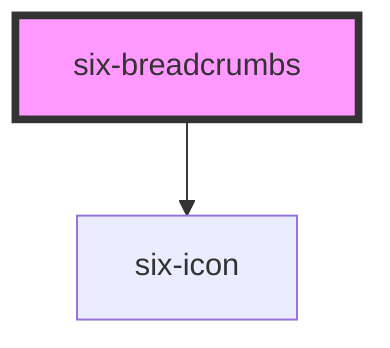

# Breadcrumbs


Breadcrumbs provide a group of links so users can easily navigate a website’s hierarchy. Breadcrumbs are usually placed before a page’s main content with the current page shown last to indicate the user’s position in the navigation.

<docs-demo-six-breadcrumbs-0></docs-demo-six-breadcrumbs-0>

```html
<six-breadcrumbs>
  <six-breadcrumbs-item>A</six-breadcrumbs-item>
  <six-breadcrumbs-item>B</six-breadcrumbs-item>
  <six-breadcrumbs-item>C</six-breadcrumbs-item>
</six-breadcrumbs>
```


## Custom Separators

Use the separator slot to change the separator that goes between breadcrumb items. Icons work well, but you can also use text or an image.

<docs-demo-six-breadcrumbs-1></docs-demo-six-breadcrumbs-1>

```html
<six-breadcrumbs>
  <six-icon slot="separator" size="small">arrow_forward</six-icon>
  <six-breadcrumbs-item>A</six-breadcrumbs-item>
  <six-breadcrumbs-item>B</six-breadcrumbs-item>
  <six-breadcrumbs-item>Current</six-breadcrumbs-item>
</six-breadcrumbs>
```


Using `separator-icon` attribute

<docs-demo-six-breadcrumbs-2></docs-demo-six-breadcrumbs-2>

```html
<six-breadcrumbs separator-icon="arrow_forward">
  <six-breadcrumbs-item>A</six-breadcrumbs-item>
  <six-breadcrumbs-item>B</six-breadcrumbs-item>
  <six-breadcrumbs-item>Current</six-breadcrumbs-item>
</six-breadcrumbs>
```


## Prefixes

Use the prefix slot to add content before any breadcrumb item.

<docs-demo-six-breadcrumbs-3></docs-demo-six-breadcrumbs-3>

```html
<six-breadcrumbs>
  <six-icon slot="separator" size="small">arrow_forward</six-icon>
  <six-breadcrumbs-item>
    <six-icon slot="prefix" size="small">house</six-icon>
    Home
  </six-breadcrumbs-item>
  <six-breadcrumbs-item>Page</six-breadcrumbs-item>
  <six-breadcrumbs-item>Current</six-breadcrumbs-item>
</six-breadcrumbs>
```


## Suffixes

Use the suffix slot to add content after any breadcrumb item.

<docs-demo-six-breadcrumbs-4></docs-demo-six-breadcrumbs-4>

```html
<six-breadcrumbs>
  <six-icon slot="separator" size="small">arrow_forward</six-icon>
  <six-breadcrumbs-item>Home</six-breadcrumbs-item>
  <six-breadcrumbs-item>Page</six-breadcrumbs-item>
  <six-breadcrumbs-item>
    <six-icon slot="suffix" size="small">lock</six-icon>
    Current
  </six-breadcrumbs-item>
</six-breadcrumbs>
```


## Styling

Use CSS custom properties to customize the appearance of breadcrumb items.

<docs-demo-six-breadcrumbs-5></docs-demo-six-breadcrumbs-5>

```html
<div class="parent">
  <six-breadcrumbs>
    <six-icon slot="separator" size="small">arrow_forward</six-icon>
    <six-breadcrumbs-item>Home</six-breadcrumbs-item>
    <six-breadcrumbs-item>Page</six-breadcrumbs-item>
    <six-breadcrumbs-item>Current</six-breadcrumbs-item>
  </six-breadcrumbs>
</div>
```


## Dynamically Add/Remove Items

Items can be dynamically added and removed.

<docs-demo-six-breadcrumbs-6></docs-demo-six-breadcrumbs-6>

```html
<six-button type="secondary" id="remove-button">Remove</six-button>
<six-button type="secondary" id="add-button">Add</six-button>

<six-breadcrumbs id="dynamic-breadcrumbs">
  <six-breadcrumbs-item>Item 0</six-breadcrumbs-item>
  <six-breadcrumbs-item>Item 1</six-breadcrumbs-item>
</six-breadcrumbs>

<script type="module">
  let counter = 2;
  const breadcrumbs = document.getElementById('dynamic-breadcrumbs');

  document.getElementById('remove-button').addEventListener('click', () => {
    breadcrumbs.lastElementChild?.remove();
  });

  document.getElementById('add-button').addEventListener('click', () => {
    const item = document.createElement('six-breadcrumbs-item');
    item.textContent = `Item ${counter++}`;
    breadcrumbs.append(item);
  });
</script>
```


<!-- Auto Generated Below -->


## Overview

Breadcrumbs provide a group of links so users can easily navigate a website's hierarchy.

## Properties

| Property        | Attribute        | Description                                                     | Type     | Default |
| --------------- | ---------------- | --------------------------------------------------------------- | -------- | ------- |
| `separatorIcon` | `separator-icon` | Defines an icon as a separator without having to place a slot * | `string` | `''`    |


## Slots

| Slot          | Description                                                              |
| ------------- | ------------------------------------------------------------------------ |
|               | One or more breadcrumb items to display.                                 |
| `"separator"` | The separator to use between breadcrumb items. Works best with six-icon. |


## Shadow Parts

| Part     | Description                   |
| -------- | ----------------------------- |
| `"base"` | The component's base wrapper. |


## Dependencies

### Depends on

- [six-icon](six-icon.html)

### Graph


----------------------------------------------

Copyright © 2021-present SIX-Group
