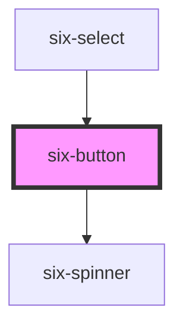

# Button


Buttons represent actions that are available to the user.

<docs-demo-six-button-0></docs-demo-six-button-0>

```html
<six-button>Button</six-button>
```


## Examples

### Types

Use the `type` attribute to set the button's type.

<docs-demo-six-button-1></docs-demo-six-button-1>

```html
<six-button>Primary</six-button>
<six-button type="secondary">Secondary</six-button>
<six-button type="link">Link</six-button>
<six-button type="success">Success</six-button>
<six-button type="warning">Warning</six-button>
<six-button type="danger">Danger</six-button>
<six-button type="action">Action</six-button>
<six-button type="action-outline">Action Outline</six-button>
```


Notice on different background colors that the Link button has no background

<docs-demo-six-button-2></docs-demo-six-button-2>

```html
<div style="padding: 1em; background-color: #f6f6f6">
  <six-button>Primary</six-button>
  <six-button type="secondary">Secondary</six-button>
  <six-button type="link">Link</six-button>
  <six-button type="success">Success</six-button>
  <six-button type="warning">Warning</six-button>
  <six-button type="danger">Danger</six-button>
  <six-button type="action">Action</six-button>
  <six-button type="action-outline">Action Outline</six-button>
</div>
<div style="padding: 1em; background-color: #262626">
  <six-button>Primary</six-button>
  <six-button type="secondary">Secondary</six-button>
  <six-button type="link">Link</six-button>
  <six-button type="success">Success</six-button>
  <six-button type="warning">Warning</six-button>
  <six-button type="danger">Danger</six-button>
  <six-button type="action">Action</six-button>
  <six-button type="action-outline">Action Outline</six-button>
</div>
```


### Sizes

Use the `size` prop to change a button's size.

<docs-demo-six-button-3></docs-demo-six-button-3>

```html
<six-button size="small">Small</six-button>
<six-button size="medium">Medium</six-button>
<six-button size="large">Large</six-button>
```


### Pill Buttons

Use the `pill` prop to give buttons rounded edges.

<docs-demo-six-button-4></docs-demo-six-button-4>

```html
<six-button size="small" pill>Small</six-button>
<six-button size="medium" pill>Medium</six-button>
<six-button size="large" pill>Large</six-button>
```


### Circle buttons

Use the `circle` prop to create circular icon buttons.

<docs-demo-six-button-5></docs-demo-six-button-5>

```html
<six-button size="small" circle>
  <six-icon size="xSmall">settings</six-icon>
</six-button>
<six-button size="small" circle>
  <six-icon size="small">settings</six-icon>
</six-button>
<six-button size="medium" circle>
  <six-icon size="small">settings</six-icon>
</six-button>
<six-button size="large" circle>
  <six-icon size="medium">settings</six-icon>
</six-button>
<six-button size="large" circle>
  <six-icon size="large">settings</six-icon>
</six-button>
<six-button size="large" circle>
  <six-icon size="xLarge">settings</six-icon>
</six-button>
```


### Link Buttons

Use the `link` type to create text buttons that share the same size as regular buttons but don't have backgrounds or borders.

<docs-demo-six-button-6></docs-demo-six-button-6>

```html
<six-button type="link" size="small">Small</six-button>
<six-button type="link" size="medium">Medium</six-button>
<six-button type="link" size="large">Large</six-button>
```


### Link buttons

It's often helpful to have a button that works like a link. This is possible by setting the `href` attribute, which will make the component render an `<a>` under the hood. This gives you all the default link behavior the browser provides (e.g. CMD/CTRL/SHIFT + CLICK) and exposes the `target` and `download` attributes.

<docs-demo-six-button-7></docs-demo-six-button-7>

```html
<six-button href="https://www.six-group.com/">Link</six-button>
<six-button href="https://www.six-group.com/" target="_blank">New Window</six-button>
<six-button href="/assets/images/wordmark.svg" download="wordmark.svg">Download</six-button>
<six-button href="https://www.six-group.com/" disabled>Disabled</six-button>
```


When a `target` is set, the link will receive `rel="noreferrer noopener"` [for security reasons](https://mathiasbynens.github.io/rel-noopener/).

### Setting a Custom Width

As expected, buttons can be given a custom width by setting its `width`. This is useful for making buttons span the full width of their container on smaller screens.

<docs-demo-six-button-8></docs-demo-six-button-8>

```html
<six-button type="secondary" size="small" style="width: 100%; margin-bottom: 1rem">Small</six-button>
<six-button type="secondary" size="medium" style="width: 100%; margin-bottom: 1rem">Medium</six-button>
<six-button type="secondary" size="large" style="width: 100%">Large</six-button>
```


### Prefix and Suffix Icons

Use the `prefix` and `suffix` slots to add icons.

<docs-demo-six-button-9></docs-demo-six-button-9>

```html
<six-button size="small">
  
  <span slot="prefix"><six-icon size="xSmall">settings</six-icon></span>
  Settings
</six-button>

<six-button size="small">
  <span slot="suffix"><six-icon size="xSmall">refresh</six-icon></span>
  Refresh
</six-button>

<six-button size="small">
  <span slot="prefix"><six-icon size="xSmall">settings</six-icon></span>
  <span slot="suffix"><six-icon size="xSmall">refresh</six-icon></span>
  Open
</six-button>

<br><br>

<six-button>
  <span slot="prefix"><six-icon size="small">settings</six-icon></span>
  Settings
</six-button>

<six-button>
  <span slot="suffix"><six-icon size="small">refresh</six-icon></span>
  Refresh
</six-button>

<six-button>
  <span slot="prefix"><six-icon size="small">settings</six-icon></span>
  <span slot="suffix"><six-icon size="small">refresh</six-icon></span>
  Open
</six-button>

<br><br>

<six-button size="large">
  <span slot="prefix"><six-icon size="medium">settings</six-icon></span>
  Settings
</six-button>

<six-button size="large">
  <span slot="suffix"><six-icon size="medium">refresh</six-icon></span>
  Refresh
</six-button>

<six-button size="large">
  <span slot="prefix"><six-icon size="medium">settings</six-icon></span>
  <span slot="suffix"><six-icon size="medium">refresh</six-icon></span>
  Open
</six-button>
```


### Caret

Use the `caret` prop to add a dropdown indicator when a button will trigger a dropdown, menu, or popover.

<docs-demo-six-button-10></docs-demo-six-button-10>

```html
<six-button size="small" caret>Small</six-button>
<six-button size="medium" caret>Medium</six-button>
<six-button size="large" caret>Large</six-button>
```


### Loading

Use the `loading` prop to make a button busy. The width will remain the same as before, preventing adjacent elements from moving around. Clicks will be suppressed until the loading state is removed.

<docs-demo-six-button-11></docs-demo-six-button-11>

```html
<six-button type="secondary" loading>Secondary</six-button>
<six-button loading>Primary</six-button>
```


### Disabled

Use the `disabled` prop to disable a button. Clicks will be suppressed until the disabled state is removed.

<docs-demo-six-button-12></docs-demo-six-button-12>

```html
<six-tooltip content="My Toolip">
  <six-button disabled onclick="alert('should not appear')">Primary</six-button>
</six-tooltip>
<six-button type="secondary" disabled>Secondary</six-button>
<six-button type="link" disabled>Link</six-button>
<six-button type="success" disabled>Success</six-button>
<six-button type="warning" disabled>Warning</six-button>
<six-button type="danger" disabled>Danger</six-button>
<six-button type="action" disabled>Action</six-button>
<six-button type="action-outline" disabled>Action Outline</six-button>
```


<!-- Auto Generated Below -->


## Properties

| Property   | Attribute  | Description                                                                                            | Type                                                                                                       | Default     |
| ---------- | ---------- | ------------------------------------------------------------------------------------------------------ | ---------------------------------------------------------------------------------------------------------- | ----------- |
| `caret`    | `caret`    | Set to true to draw the button with a caret for use with dropdowns, popovers, etc.                     | `boolean`                                                                                                  | `false`     |
| `circle`   | `circle`   | Set to true to draw a circle button.                                                                   | `boolean`                                                                                                  | `false`     |
| `disabled` | `disabled` | Set to true to disable the button.                                                                     | `boolean`                                                                                                  | `false`     |
| `download` | `download` | Tells the browser to download the linked file as this filename. Only used when `href` is set.          | `string \| undefined`                                                                                      | `undefined` |
| `href`     | `href`     | When set, the underlying button will be rendered as an `<a>` with this `href` instead of a `<button>`. | `string \| undefined`                                                                                      | `undefined` |
| `loading`  | `loading`  | Set to true to draw the button in a loading state.                                                     | `boolean`                                                                                                  | `false`     |
| `name`     | `name`     | An optional name for the button. Ignored when `href` is set.                                           | `string`                                                                                                   | `''`        |
| `pill`     | `pill`     | Set to true to draw a pill-style button with rounded edges.                                            | `boolean`                                                                                                  | `false`     |
| `reset`    | `reset`    | Indicates if activating the button should reset the form.                                              | `boolean`                                                                                                  | `false`     |
| `size`     | `size`     | The button's size.                                                                                     | `"large" \| "medium" \| "small"`                                                                           | `'medium'`  |
| `submit`   | `submit`   | Indicates if activating the button should submit the form. Ignored when `href` is set.                 | `boolean`                                                                                                  | `false`     |
| `target`   | `target`   | Tells the browser where to open the link. Only used when `href` is set.                                | `"_blank" \| "_parent" \| "_self" \| "_top" \| undefined`                                                  | `undefined` |
| `type`     | `type`     | The button's type.                                                                                     | `"action" \| "action-outline" \| "danger" \| "link" \| "primary" \| "secondary" \| "success" \| "warning"` | `'primary'` |
| `value`    | `value`    | An optional value for the button. Ignored when `href` is set.                                          | `string`                                                                                                   | `''`        |


## Events

| Event              | Description                          | Type                     |
| ------------------ | ------------------------------------ | ------------------------ |
| `six-button-blur`  | Emitted when the button loses focus. | `CustomEvent<undefined>` |
| `six-button-focus` | Emitted when the button gains focus. | `CustomEvent<undefined>` |


## Methods

### `removeFocus() => Promise<void>`

Removes focus from the button.

#### Returns

Type: `Promise<void>`


### `setFocus(options?: FocusOptions) => Promise<void>`

Sets focus on the button.

#### Parameters

| Name      | Type                        | Description |
| --------- | --------------------------- | ----------- |
| `options` | `FocusOptions \| undefined` |             |

#### Returns

Type: `Promise<void>`


## Slots

| Slot       | Description                                               |
| ---------- | --------------------------------------------------------- |
|            | The button's label.                                       |
| `"prefix"` | Used to prepend an icon or similar element to the button. |
| `"suffix"` | Used to append an icon or similar element to the button.  |


## Shadow Parts

| Part       | Description                   |
| ---------- | ----------------------------- |
| `"base"`   | The component's base wrapper. |
| `"caret"`  | The button's caret.           |
| `"label"`  | The button's label.           |
| `"prefix"` | The prefix container.         |
| `"suffix"` | The suffix container.         |


## Dependencies

### Used by

 - [six-select](six-select.html)

### Depends on

- [six-spinner](six-spinner.html)

### Graph


----------------------------------------------

Copyright © 2021-present SIX-Group
