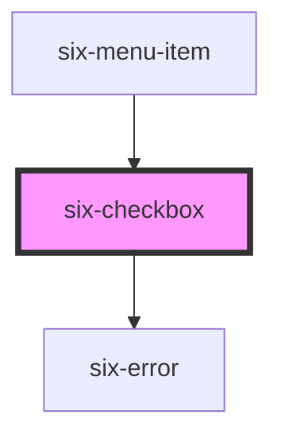

# Checkbox


Checkboxes allow the user to toggle an option on or off.

<docs-demo-six-checkbox-0></docs-demo-six-checkbox-0>

```html
<six-checkbox>Checkbox</six-checkbox>
```


## Examples

### Checked

Use the `checked` attribute to activate the checkbox.

<docs-demo-six-checkbox-1></docs-demo-six-checkbox-1>

```html
<six-checkbox checked>Checked</six-checkbox>
```


### Indeterminate

Use the `indeterminate` attribute to make the checkbox indeterminate.

<docs-demo-six-checkbox-2></docs-demo-six-checkbox-2>

```html
<six-checkbox indeterminate>Indeterminate</six-checkbox>
```


### Disabled

Use the `disabled` attribute to disable the checkbox.

<docs-demo-six-checkbox-3></docs-demo-six-checkbox-3>

```html
<six-checkbox checked disabled>Disabled</six-checkbox>
<six-checkbox indeterminate disabled>Disabled</six-checkbox>
<six-checkbox disabled>Disabled</six-checkbox>
```


### Labels

Use the `label` attribute to give the checkbox an accessible label. For labels that contain HTML, use the `label`slot instead.

<docs-demo-six-checkbox-4></docs-demo-six-checkbox-4>

```html
<six-checkbox label="Terms and conditions">I totally agree</six-checkbox>
<br>
<br>
<six-checkbox>
  <div slot="label">Terms <span style="color: red">and</span> conditions</div>
  I totally agree
</six-checkbox>
```


## Error Text

Add a descriptive error message using either the `error-text` prop, or the equally named slot.

warning There are two caveats when using the `error-text` prop/slot:

1.  Remember to set the `invalid` prop as well! If you only provide some content to the `error-text` prop/slot, it won't be shown unless the `invalid` prop is set to true
2.  When using the prop, and you need to show more than one message, remember to also set the `error-text-count` prop to a value that is the same or bigger than the length of the list of messages you are using. Otherwise only one message will be shown at a time

The `error-text` prop accepts either a simple string message, or a list of messages.

<docs-demo-six-checkbox-5></docs-demo-six-checkbox-5>

```html
<six-checkbox label="Simple string message" error-text="This is a simple string message" invalid>
</six-checkbox>
```


<docs-demo-six-checkbox-6></docs-demo-six-checkbox-6>

```html
<six-checkbox id="multiple-error-text" label="List of string message" invalid></six-checkbox>
<script type="module">
  const sixCheckbox = document.getElementById('multiple-error-text');
  sixCheckbox.errorText = ['Message 1', 'Message 2'];
  sixCheckbox.errorTextCount = 3;
</script>
```


When using the `error-text` slot, it is recommended to use the `six-error` component to wrap the error message(s). This will provide the correct styling out of the box

<docs-demo-six-checkbox-7></docs-demo-six-checkbox-7>

```html
<six-checkbox invalid>
  <div slot="error-text">
    <six-error               >An error message
      <a href="https://github.com/six-group/six-webcomponents" target="_blank">with a link</a></six-error>
  </div>
</six-checkbox>
```


<!-- Auto Generated Below -->


## Properties

| Property         | Attribute          | Description                                                                                                                                                                                                                                                  | Type                  | Default     |
| ---------------- | ------------------ | ------------------------------------------------------------------------------------------------------------------------------------------------------------------------------------------------------------------------------------------------------------ | --------------------- | ----------- |
| `checked`        | `checked`          | Set to true to draw the checkbox in a checked state.                                                                                                                                                                                                         | `boolean`             | `false`     |
| `disabled`       | `disabled`         | Set to true to disable the checkbox.                                                                                                                                                                                                                         | `boolean`             | `false`     |
| `errorText`      | `error-text`       | The error message shown, if `invalid` is set to true.                                                                                                                                                                                                        | `string \| string[]`  | `''`        |
| `errorTextCount` | `error-text-count` | The number of error texts to be shown (if the error-text slot isn't used). Defaults to 1                                                                                                                                                                     | `number \| undefined` | `undefined` |
| `indeterminate`  | `indeterminate`    | Set to true to draw the checkbox in an indeterminate state.                                                                                                                                                                                                  | `boolean`             | `false`     |
| `invalid`        | `invalid`          | If this property is set to true and an error message is provided by `errorText`, the error message is displayed.                                                                                                                                             | `boolean`             | `false`     |
| `label`          | `label`            | The label text.                                                                                                                                                                                                                                              | `string`              | `''`        |
| `name`           | `name`             | The checkbox's name attribute.                                                                                                                                                                                                                               | `string`              | `''`        |
| `required`       | `required`         | Set to true to show an asterisk beneath the label.                                                                                                                                                                                                           | `boolean`             | `false`     |
| `value`          | `value`            | The value of the checkbox does not mean if it's checked or not, use the `checked` property for that.  The value of a checkbox is analogous to the value of an `<input type="checkbox">`, it's only used when the checkbox participates in a native `<form>`. | `string`              | `'on'`      |


## Events

| Event                 | Description                                       | Type                     |
| --------------------- | ------------------------------------------------- | ------------------------ |
| `six-checkbox-blur`   | Emitted when the control loses focus.             | `CustomEvent<undefined>` |
| `six-checkbox-change` | Emitted when the control's checked state changes. | `CustomEvent<undefined>` |
| `six-checkbox-focus`  | Emitted when the control gains focus.             | `CustomEvent<undefined>` |


## Methods

### `removeFocus() => Promise<void>`

Removes focus from the checkbox.

#### Returns

Type: `Promise<void>`


### `setFocus(options?: FocusOptions) => Promise<void>`

Sets focus on the checkbox.

#### Parameters

| Name      | Type                        | Description |
| --------- | --------------------------- | ----------- |
| `options` | `FocusOptions \| undefined` |             |

#### Returns

Type: `Promise<void>`


## Slots

| Slot           | Description                                                                                     |
| -------------- | ----------------------------------------------------------------------------------------------- |
| `"error-text"` | Error text that is shown for validation errors. Alternatively, you can use the error-text prop. |
| `"label"`      | The checkbox label.                                                                             |


## Shadow Parts

| Part                   | Description                                      |
| ---------------------- | ------------------------------------------------ |
| `"base"`               | The component's base wrapper.                    |
| `"checked-icon"`       | The container the wraps the checked icon.        |
| `"control"`            | The checkbox control.                            |
| `"indeterminate-icon"` | The container that wraps the indeterminate icon. |
| `"text"`               | The checkbox text rendered to the right.         |


## Dependencies

### Used by

 - [six-menu-item](six-menu-item.html)

### Depends on

- [six-error](six-error.html)

### Graph


----------------------------------------------

Copyright © 2021-present SIX-Group
