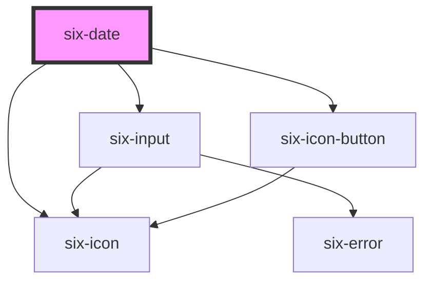

# Date


The Date component allows users to enter a date manually or select one from a calendar popup.


## Basic Usage

A standard date with a label.

<docs-demo-six-date-0></docs-demo-six-date-0>

```html
<six-date label="Select a date"></six-date>
```


## Setting a Value

Use the `value` attribute to set the date date's value.

<docs-demo-six-date-1></docs-demo-six-date-1>

```html
<six-button type="secondary" id="set-value-button">Set Value</six-button>
<six-date id="set-value-date" label="Date with initial value" value="2025-01-15"></six-date>

<script type="module">
  (() => {
    const openButton = document.getElementById('set-value-button');
    const dateComponent = document.getElementById('set-value-date');
    openButton.addEventListener('click', () => (dateComponent.value = '2030-01-01'));
  })();
</script>
```


## Date Constraints

You can set minimum and maximum allowable dates using the `min` and `max` attributes.

<docs-demo-six-date-2></docs-demo-six-date-2>

```html
<six-date label="Date with constraints" min="2025-01-01" max="2025-12-31" value="2025-01-15"></six-date>
```


Use the `allowedDates` property to specify which dates can be selected. Provide a function that receives an date string and returns a boolean indicating if the date is allowed.

<docs-demo-six-date-3></docs-demo-six-date-3>

```html
<six-date id="allowed-dates-example" label="Only weekends allowed"></six-date>

<script type="module">
  const weekendOnlyDate = document.getElementById('allowed-dates-example');
  weekendOnlyDate.allowedDates = (isoDate) => {
    const day = new Date(isoDate).getDay();
    return day === 0 || day === 6; // Only allow Saturday (6) and Sunday (0)
  };
</script>
```


## Placeholder

Use the `placeholder` attribute to override the default placeholder.

<docs-demo-six-date-4></docs-demo-six-date-4>

```html
<section>
  <six-date placeholder="Enter a date"></six-date>
</section>
```


## Clearable

Add the `clearable` attribute to show a clear button when the date it has a value.

<docs-demo-six-date-5></docs-demo-six-date-5>

```html
<six-date label="Clearable date" clearable value="2025-01-15"></six-date>
```


## Disabled

Add the `disabled` attribute to disable the date component.

<docs-demo-six-date-6></docs-demo-six-date-6>

```html
<six-date label="Disabled date" disabled value="2025-01-15"></six-date>
```


## Required

Add the `required` attribute to make it a required field.

<docs-demo-six-date-7></docs-demo-six-date-7>

```html
<six-date label="Required date" required></six-date>
```


## Help Text

Add descriptive help text. For help texts that contain HTML, use the `help-text` slot instead.

<docs-demo-six-date-8></docs-demo-six-date-8>

```html
<six-date label="Name" help-text="Help text"></six-date>
```


## Handling Events

Listen for the `change` event to detect when the user selects a date.

<docs-demo-six-date-9></docs-demo-six-date-9>

```html
<div id="event-example-label">No Date selected yet!</div>
<six-date id="event-example-picker" label="Select a date"></six-date>

<script type="module">
  const datepicker = document.getElementById('event-example-picker');
  const selectedDate = document.getElementById('event-example-label');

  datepicker.addEventListener('change', (event) => {
    selectedDate.innerHTML = `Selected: ${event.target.value}`;
  });
</script>
```


## Custom Date Format

You can customize the date format using the `date-format` attribute. By default, the component uses the format `dd.MM.yyyy`.

Example with `dd/MM/yy` format:

<docs-demo-six-date-10></docs-demo-six-date-10>

```html
<six-date label="Date with dd/MM/yy format" date-format="dd/MM/yy"></six-date>
```


## Error Text and Help Text

The `help-text` `error-text`, `error-text-count`, and `invalid` properties and slots work the same as for the `six-input` component. For more details, refer to the [six-input documentation](six-input#help-text).

<docs-demo-six-date-11></docs-demo-six-date-11>

```html
<six-date label="Date with help text" help-text="Select your preferred date"></six-date>
<six-date label="Date with error text" error-text="The date entered is invalid" invalid></six-date>
<six-date           label="Invalid date example"
  error-text="You can only enter dates starting from 01/01/2025"
  min="2025-01-01"
  max="2025-12-31"
  invalid
></six-date>
<six-date label="Help text slot example">
  <div slot="help-text">This help text is rendered via the <strong>slot</strong>.</div>
</six-date>
<six-date label="Error text slot example" invalid>
  <div slot="error-text">This error text is rendered via the <strong>slot</strong>.</div>
</six-date>
```


<!-- Auto Generated Below -->


## Overview

A date picker component that allows users to select dates via a calendar popup or direct input.

## Properties

| Property         | Attribute          | Description                                                                                                                                                                                                                                                                                                                                                                                                                                                                                                                                                                                                                                                                                                       | Type                                   | Default        |
| ---------------- | ------------------ | ----------------------------------------------------------------------------------------------------------------------------------------------------------------------------------------------------------------------------------------------------------------------------------------------------------------------------------------------------------------------------------------------------------------------------------------------------------------------------------------------------------------------------------------------------------------------------------------------------------------------------------------------------------------------------------------------------------------- | -------------------------------------- | -------------- |
| `allowedDates`   | --                 | Callback to determine which dates in the picker should be selectable.                                                                                                                                                                                                                                                                                                                                                                                                                                                                                                                                                                                                                                             | `(date: string) => boolean`            | `() => true`   |
| `clearable`      | `clearable`        | Set to true to add a clear button when the input is populated.                                                                                                                                                                                                                                                                                                                                                                                                                                                                                                                                                                                                                                                    | `boolean`                              | `false`        |
| `dateFormat`     | `date-format`      | Defines the format pattern for displaying dates and how dates can be entered via keyboard.  The parser accepts flexible input that doesn't strictly match the format pattern. Input with missing leading zeros or incomplete years will be automatically normalized. For example, with the pattern "dd.MM.yyyy": "1.1.2025" becomes "01.01.2025" and "1.1.225" becomes "01.01.0225".  Defaults to "dd.MM.yyyy".  Available patterns: - Year: "yyyy" (e.g., "2021") - Month: "MM" (e.g., "01" for January) or "M" (e.g., "1" for January) - Day: "dd" (e.g., "08" for the 8th) or "d" (e.g., "8" for the 8th)  Examples: - "dd.MM.yyyy" -> "31.01.2024" - "yyyy-MM-dd" -> "2024-01-31" - "d.M.yyyy" -> "31.1.2024" | `string`                               | `'dd.MM.yyyy'` |
| `disabled`       | `disabled`         | If `true` the component is disabled.                                                                                                                                                                                                                                                                                                                                                                                                                                                                                                                                                                                                                                                                              | `boolean`                              | `false`        |
| `errorText`      | `error-text`       | The error message shown, if `invalid` is set to true.                                                                                                                                                                                                                                                                                                                                                                                                                                                                                                                                                                                                                                                             | `string \| string[]`                   | `''`           |
| `errorTextCount` | `error-text-count` | The number of error texts to be shown (if the error-text slot isn't used). Defaults to 1                                                                                                                                                                                                                                                                                                                                                                                                                                                                                                                                                                                                                          | `number \| undefined`                  | `undefined`    |
| `helpText`       | `help-text`        | The input's help text. Alternatively, you can use the help-text slot.                                                                                                                                                                                                                                                                                                                                                                                                                                                                                                                                                                                                                                             | `string`                               | `''`           |
| `invalid`        | `invalid`          | If this property is set to true and an error message is provided by `errorText`, the error message is displayed.                                                                                                                                                                                                                                                                                                                                                                                                                                                                                                                                                                                                  | `boolean`                              | `false`        |
| `label`          | `label`            | The label text.                                                                                                                                                                                                                                                                                                                                                                                                                                                                                                                                                                                                                                                                                                   | `string`                               | `''`           |
| `language`       | `language`         | The language used to render the weekdays and months.                                                                                                                                                                                                                                                                                                                                                                                                                                                                                                                                                                                                                                                              | `"de" \| "en" \| "es" \| "fr" \| "it"` | `'en'`         |
| `max`            | `max`              | The maximum allowed selectable date in ISO format (yyyy-MM-dd). Dates after this value will be disabled in the date picker. Example: '2025-01-01'                                                                                                                                                                                                                                                                                                                                                                                                                                                                                                                                                                 | `string \| undefined`                  | `undefined`    |
| `min`            | `min`              | The minimum allowed selectable date in ISO format (yyyy-MM-dd). Dates before this value will be disabled in the date picker. Example: '2024-01-01'                                                                                                                                                                                                                                                                                                                                                                                                                                                                                                                                                                | `string \| undefined`                  | `undefined`    |
| `name`           | `name`             | The input's name attribute.                                                                                                                                                                                                                                                                                                                                                                                                                                                                                                                                                                                                                                                                                       | `string`                               | `''`           |
| `placeholder`    | `placeholder`      | The placeholder defines what text to be shown on the input element                                                                                                                                                                                                                                                                                                                                                                                                                                                                                                                                                                                                                                                | `string \| undefined`                  | `undefined`    |
| `readonly`       | `readonly`         | If `true` the user can only select a date via the component in the popup but not directly edit the input field.                                                                                                                                                                                                                                                                                                                                                                                                                                                                                                                                                                                                   | `boolean`                              | `false`        |
| `required`       | `required`         | Set to true to show an asterisk beneath the label.                                                                                                                                                                                                                                                                                                                                                                                                                                                                                                                                                                                                                                                                | `boolean`                              | `false`        |
| `size`           | `size`             | The size of the date input field.                                                                                                                                                                                                                                                                                                                                                                                                                                                                                                                                                                                                                                                                                 | `"large" \| "medium" \| "small"`       | `'medium'`     |
| `value`          | `value`            | The value of the form field in ISO 8601 date format (yyyy-MM-dd). Example: '2024-01-01'.  When an invalid date is provided, it will be replaced with an empty string (''), matching the behavior of native HTML <input type="date">.  The displayed format can be customized using the dateFormat property, but the underlying value will always be stored in ISO format.                                                                                                                                                                                                                                                                                                                                         | `string`                               | `''`           |


## Events

| Event        | Description                                                                                                                                  | Type                  |
| ------------ | -------------------------------------------------------------------------------------------------------------------------------------------- | --------------------- |
| `six-blur`   | Emitted when the control loses focus or the date picker popup is closed. Does not contain event details.                                     | `CustomEvent<any>`    |
| `six-change` | Emitted when the control's value changes. Event detail contains the new date value in ISO format (yyyy-MM-dd) or an empty string if cleared. | `CustomEvent<string>` |


## Methods

### `setFocus(options?: FocusOptions) => Promise<void>`

Sets focus on the input.

#### Parameters

| Name      | Type                        | Description |
| --------- | --------------------------- | ----------- |
| `options` | `FocusOptions \| undefined` |             |

#### Returns

Type: `Promise<void>`


## Slots

| Slot           | Description                                                                                         |
| -------------- | --------------------------------------------------------------------------------------------------- |
| `"error-text"` | Error text that is shown for validation errors. Alternatively, you can use the error-text property. |
| `"help-text"`  | Help text that describes the usage.                                                                 |
| `"label"`      | The date's label. Alternatively, you can use the label prop.                                        |


## Dependencies

### Depends on

- [six-input](six-input.html)
- [six-icon](six-icon.html)
- [six-icon-button](six-icon-button.html)

### Graph


----------------------------------------------

Copyright © 2021-present SIX-Group
