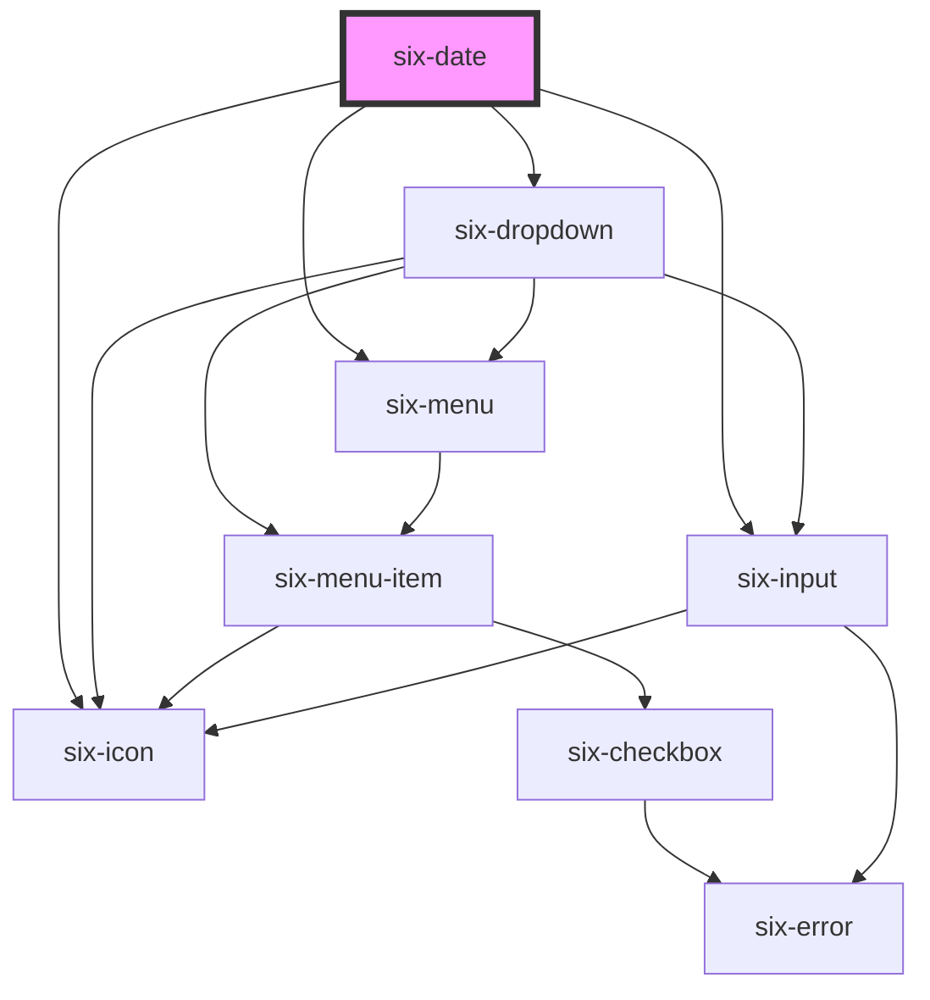

# Datepicker


Datepickers allow the user to manually enter a date or open a popup calendar to select a date.

<docs-demo-six-date-0></docs-demo-six-date-0>

```html
<six-date></six-date>
<six-date type="time"></six-date>
```


## Examples

### Reading selected date

Either manually enter a date in the input field or select a date from the popup. You can read the selected date by listening to the `six-date-select` event on the datepicker The selected date will be shown below the datepicker.

<docs-demo-six-date-1></docs-demo-six-date-1>

```html
<six-date id="read-select-date-picker"></six-date>
<div id="read-select-date-label">No Date selected yet!</div>

<script type="module">
  const datepicker = document.getElementById('read-select-date-picker');
  const selectedDate = document.getElementById('read-select-date-label');

  datepicker.addEventListener('six-date-select', (event) => {
    selectedDate.innerHTML = `selected: ${event.detail}`;
  });
</script>
<style>
  six-date {
    max-width: 25rem;
  }
</style>
```


### Date and Time

If you need to select a time as well, just set the `type` and `date-format` and the datepicker will include a timepicker too.

<docs-demo-six-date-2></docs-demo-six-date-2>

```html
<six-date date-format="dd.mm.yyyy hh:MM:ss" type="date-time" id="read-select-datetime-picker"></six-date>
<div id="read-select-datetime-label">No Date selected yet!</div>

<script type="module">
  const datepicker = document.getElementById('read-select-datetime-picker');
  const selectedDate = document.getElementById('read-select-datetime-label');

  datepicker.addEventListener('six-date-select', (event) => {
    selectedDate.innerHTML = `selected: ${event.detail}`;
  });
</script>
<style>
  six-date {
    max-width: 25rem;
  }
</style>
```


### Disabled State

<docs-demo-six-date-3></docs-demo-six-date-3>

```html
<six-date disabled></six-date>
<style>
  six-date {
    max-width: 25rem;
  }
</style>
```


### Inline State

If you wish you can have the datepicker as an inline component i.e. the popup will always be open

<docs-demo-six-date-4></docs-demo-six-date-4>

```html
<six-date inline="true"></six-date>
<style>
  six-date {
    max-width: 25rem;
  }
</style>
```


### Readonly State

If you want to force the user to use the popup instead of manually enter a date, you can simply add the `readonly` property

<docs-demo-six-date-5></docs-demo-six-date-5>

```html
<six-date readonly></six-date>
<style>
  six-date {
    max-width: 25rem;
  }
</style>
```


### Placement

By default the datepicker will render either below or above the input field depending on the available space.

If you want to enforce a certain placement you can use the `placement` attribute

<docs-demo-six-date-6></docs-demo-six-date-6>

```html
<six-date placement="bottom"></six-date>
<style>
  six-date {
    max-width: 25rem;
  }
</style>
```


### Placeholder

You can define the datepickers placeholder via `placeholder`

<docs-demo-six-date-7></docs-demo-six-date-7>

```html
<six-date placeholder="DD.MM.YYYY"></six-date>
<style>
  six-date {
    max-width: 25rem;
  }
</style>
```


### Locale

You can change the language in which the datepicker is shown by using the `locale` attribute

<docs-demo-six-date-8></docs-demo-six-date-8>

```html
<six-date locale="fr"></six-date>
<style>
  six-date {
    max-width: 25rem;
  }
</style>
```


### Footer

You can add content to the footer by simply using the datepicker's slot

<docs-demo-six-date-9></docs-demo-six-date-9>

```html
<six-date>
  <p style="text-align: center">Choose your birthdate!</p>
</six-date>
<style>
  six-date {
    max-width: 25rem;
  }
</style>
```


Of course you can also enhance the datepicker footer with special functions

<docs-demo-six-date-10></docs-demo-six-date-10>

```html
<six-date id="datepicker-adv-footer">
  <div             style="
      display: flex;
      justify-content: space-between;
      padding: 1rem 0.5rem 0 0.5rem;
      border-top: solid 1px #c3c3c3;
    "
  >
    <six-button id="datepicker-adv-footer-btn1">Today</six-button>
    <six-button id="datepicker-adv-footer-btn2">Clear</six-button>
  </div>
</six-date>
<script type="module">
  const datepicker = document.getElementById('datepicker-adv-footer');
  datepicker.addEventListener('six-date-select', (event) => {
    console.log(`[ six-date-select ]`, { date: event.detail });
  });

  const btn1 = document.getElementById('datepicker-adv-footer-btn1');
  btn1.addEventListener('click', () => (datepicker.value = new Date()));

  const btn2 = document.getElementById('datepicker-adv-footer-btn2');
  btn2.addEventListener('click', () => (datepicker.value = null));
</script>
<style>
  six-date {
    max-width: 25rem;
  }
</style>
```


### Date Format

The SIX datepicker supports the following different formats:

<docs-demo-six-date-11></docs-demo-six-date-11>

```html
<div id="datepicker-formats-container" style="display: flex; flex-wrap: wrap">
  <six-date placeholder="dd.mm.yyyy" date-format="dd.mm.yyyy"></six-date>
  <six-date placeholder="yyyy-mm-dd" date-format="yyyy-mm-dd"></six-date>
  <six-date placeholder="dd-mm-yyyy" date-format="dd-mm-yyyy"></six-date>
  <six-date placeholder="dd/mm/yyyy" date-format="dd/mm/yyyy"></six-date>
  <six-date placeholder="yyyy/mm/dd" date-format="yyyy/mm/dd"></six-date>
  <six-date placeholder="dd.mm.yy" date-format="dd.mm.yy"></six-date>
  <six-date placeholder="yy-mm-dd" date-format="yy-mm-dd"></six-date>
  <six-date placeholder="dd-mm-yy" date-format="dd-mm-yy"></six-date>
  <six-date placeholder="dd/mm/yy" date-format="dd/mm/yy"></six-date>
  <six-date placeholder="yy/mm/dd" date-format="yy/mm/dd"></six-date>
</div>

<six-button id="datepicker-formats-btn">Apply dates</six-button>

<script type="module">
  const datepickerContainer = document.getElementById('datepicker-formats-container');
  const datepickers = datepickerContainer.querySelectorAll('six-date');
  datepickers.forEach((dtpicker) => {
    dtpicker.style.marginBottom = '1rem';
    dtpicker.style.marginRight = '1rem';
  });

  const btn = document.getElementById('datepicker-formats-btn');
  btn.addEventListener('click', () => {
    datepickers.forEach((dtpicker) => {
      dtpicker.value = new Date();
    });
  });
</script>
<style>
  #datepicker-formats-container six-date {
    max-width: 25rem;
    min-width: 10rem;
  }
</style>
```


### Define Min & Max

You can set the min and max dates. Please be aware that only date objects are accepted and n:

<docs-demo-six-date-12></docs-demo-six-date-12>

```html
<div class="min-max-demo">
  <six-date id="min-max-date-picker"></six-date>
  <six-date id="only-min-date-picker"></six-date>
  <six-date id="only-max-date-picker"></six-date>
</div>

<div style="margin-top: 1rem">
  <span style="font-weight: bold">Selected: </span><span id="min-max-date-selected">No Date selected yet!</span>
  <style>
    six-date {
      max-width: 25rem;
    }
  </style>
</div>

<style>
  .min-max-demo {
    display: flex;
    flex-wrap: wrap;
  }

  .min-max-demo six-date {
    min-width: 15rem;
    margin-right: 1rem;
    margin-bottom: 1rem;
  }
</style>

<script type="module">
  const minMaxDatepicker = document.getElementById('min-max-date-picker');
  const minDatepicker = document.getElementById('only-min-date-picker');
  const maxDatepicker = document.getElementById('only-max-date-picker');
  const selectedDate = document.getElementById('min-max-date-selected');

  const getDateFromNow = (days) => new Date(new Date().setDate(new Date().getDate() + days));

  minMaxDatepicker.value = new Date();
  minMaxDatepicker.min = getDateFromNow(-3);
  minMaxDatepicker.max = getDateFromNow(2);

  minDatepicker.min = getDateFromNow(-3);
  maxDatepicker.max = getDateFromNow(2);

  minMaxDatepicker.addEventListener('six-date-select', (event) => {
    selectedDate.innerHTML = `${event.detail}`;
  });
</script>
```


### Allowed Dates

If the set of allowed dates is more complex than just passing a min and max date you can define a allow dates callback function

<docs-demo-six-date-13></docs-demo-six-date-13>

```html
<six-date id="allowed-date-picker"></six-date>

<script type="module">
  const datepicker = document.getElementById('allowed-date-picker');
  datepicker.allowedDates = (date) => date.getDate() % 2 === 0;
</script>
<style>
  six-date {
    max-width: 25rem;
  }
</style>
```


### Custom Start Date

You can define a custom default date which will be shown on first appearance of the popup

<docs-demo-six-date-14></docs-demo-six-date-14>

```html
<six-date default-date="2021-02-20" date-format="yyyy-mm-dd"></six-date>
<style>
  six-date {
    max-width: 25rem;
  }
</style>
```


### Clearable

Add the `clearable` property to add a clear button when the input has content.

<docs-demo-six-date-15></docs-demo-six-date-15>

```html
<six-date clearable></six-date>
<style>
  six-date {
    max-width: 25rem;
  }
</style>
```


### Icon position

Could be adjusted providing `icon-position` property.

<docs-demo-six-date-16></docs-demo-six-date-16>

```html
<six-date icon-position="right"></six-date>
<br>
<six-date icon-position="right" clearable></six-date>
<br>
<six-date icon-position="right" custom-icon clearable>
  
</six-date>
<style>
  six-date {
    max-width: 25rem;
  }
</style>
```


### Custom icon

The slot `custom-icon` is used to provide a custom datepicker icon.

<docs-demo-six-date-17></docs-demo-six-date-17>

```html
<six-date custom-icon>
  
</six-date>
<style>
  six-date {
    max-width: 25rem;
  }
</style>
```


### Sizes

Use the `size` attribute to change a datepicker size.

<docs-demo-six-date-18></docs-demo-six-date-18>

```html
<six-date size="small" clearable></six-date>
<br>
<six-date size="medium" clearable></six-date>
<br>
<six-date size="large" clearable></six-date>
<style>
  six-date {
    max-width: 25rem;
  }
</style>
```


### Hoisting

Dropdown panels will be clipped if they're inside a container that has overflow: auto|hidden. The hoist attribute forces the panel to use a fixed positioning strategy, allowing it to break out of the container. In this case, the panel will be positioned relative to its containing block, which is usually the viewport unless an ancestor uses a transform, perspective, or filter.

<docs-demo-six-date-19></docs-demo-six-date-19>

```html
<div style="overflow: hidden; border: solid 1px grey; padding: 0.5em; display: flex">
  <six-date placement="bottom" placeholder="no hoisting"></six-date>
  <six-date hoist placement="bottom" placeholder="with hoisting"></six-date>
</div>
<style>
  six-date {
    max-width: 25rem;
    min-width: 10rem;
  }
</style>
```


### Dynamic changes

The datepicker value can be changed dynamically by setting the `value` attribute.

<docs-demo-six-date-20></docs-demo-six-date-20>

```html
<six-date id="dynamic-datepicker"></six-date>
<div style="margin-top: 1rem">
  <span style="font-weight: bold">Selected: </span><span id="dynamic-datepicker-selected">No Date selected yet!</span>
</div>
<div style="margin-top: 1rem">
  <six-button id="dynamic-datepicker-btn1">01.01.2020</six-button>
  <six-button id="dynamic-datepicker-btn2">15.06.3020</six-button>
  <six-button id="dynamic-datepicker-btn3">31.12.1420</six-button>
</div>
<script type="module">
  const datepicker = document.getElementById('dynamic-datepicker');
  const selectedDate = document.getElementById('dynamic-datepicker-selected');

  const btn1 = document.getElementById('dynamic-datepicker-btn1');
  btn1.addEventListener('click', () => (datepicker.value = new Date('2020-01-01')));

  const btn2 = document.getElementById('dynamic-datepicker-btn2');
  btn2.addEventListener('click', () => (datepicker.value = new Date('3020-06-15')));

  const btn3 = document.getElementById('dynamic-datepicker-btn3');
  btn3.addEventListener('click', () => (datepicker.value = new Date('1420-12-31')));

  datepicker.addEventListener('six-date-select', (event) => {
    console.log(`[ six-date-select ]`, { date: event.detail });
    selectedDate.innerHTML = `${event.detail.toLocaleDateString()}`;
  });
</script>
<style>
  six-date {
    max-width: 25rem;
  }
</style>
```


### Open State

If you wish you can have the datepicker open on startup. It will close as usual (clicking outside etc.)

<docs-demo-six-date-21></docs-demo-six-date-21>

```html
<six-date open="true" placement="bottom"></six-date>
<style>
  six-date {
    max-width: 25rem;
  }
</style>
```


## Datepicker in a Modal

<docs-demo-six-date-22></docs-demo-six-date-22>

```html
<six-button id="modal-ex-dt">Toggle Modal</six-button>

<div id="dt-modal" class="dt-modal">
  <six-date placement="top"></six-date>
  <six-date placement="bottom"></six-date>
</div>

<script>
  let modalIsShown = false;

  const btn = document.getElementById('modal-ex-dt');
  const dtModal = document.getElementById('dt-modal');
  btn.addEventListener('click', () => {
    if (modalIsShown) {
      dtModal.style.display = 'none';
    } else {
      dtModal.style.display = 'flex';
    }

    modalIsShown = !modalIsShown;
  });
</script>

<style>
  .dt-modal {
    display: none;
    flex-wrap: wrap;
    width: 25vw;
    height: 25vh;
    margin-top: 25vh;
    background: white;
    position: fixed;
    z-index: 999;
    left: 25vw;
    top: 0;
    border: solid 2px lightgray;
    box-shadow: 0 4px 16px #00000038;
  }

  .dt-modal six-date {
    width: 100%;
    height: calc(100vh - 2.5rem);
    max-width: unset;
  }
</style>
```


## Error Text

Add a descriptive error message using either the `error-text` prop, or the equally named slot.

warning There are two caveats when using the `error-text` prop/slot:

1.  Remember to set the `invalid` prop as well! If you only provide some content to the `error-text` prop/slot, it won't be shown unless the `invalid` prop is set to true
2.  When using the prop, and you need to show more than one message, remember to also set the `error-text-count` prop to a value that is the same or bigger than the length of the list of messages you are using. Otherwise only one message will be shown at a time

The `error-text` prop accepts either a simple string message, or a list of messages.

<docs-demo-six-date-23></docs-demo-six-date-23>

```html
<six-date label="Simple string message" error-text="This is a simple string message" invalid> </six-date>
```


<docs-demo-six-date-24></docs-demo-six-date-24>

```html
<six-date id="multiple-error-text" label="List of string message" invalid></six-date>
<script type="module">
  const sixDatePicker = document.getElementById('multiple-error-text');
  sixDatePicker.errorText = ['Message 1', 'Message 2'];
  sixDatePicker.errorTextCount = 3;
</script>
```


When using the `error-text` slot, it is recommended to use the `six-error` component to wrap the error message(s). This will provide the correct styling out of the box

<docs-demo-six-date-25></docs-demo-six-date-25>

```html
<six-date invalid>
  <div slot="error-text">
    <six-error               >An error message
      <a href="https://github.com/six-group/six-webcomponents" target="_blank">with a link</a></six-error>
  </div>
</six-date>
```


<!-- Auto Generated Below -->


## Properties

| Property            | Attribute          | Description                                                                                                                                                                                                                                                                                                                      | Type                                   | Default                      |
| ------------------- | ------------------ | -------------------------------------------------------------------------------------------------------------------------------------------------------------------------------------------------------------------------------------------------------------------------------------------------------------------------------- | -------------------------------------- | ---------------------------- |
| `allowedDates`      | --                 | Callback to determine which date in the datepicker should be selectable. the callback function will get a datestring as an argument, e.g. '2021-07-04'  Usage e.g.: const datepicker = document.getElementById('allowed-date-picker'); datepicker.allowedDates = datestring => parseInt(datestring.split('-')[2], 10) % 2 === 0; | `(date: string) => boolean`            | `() => true`                 |
| `clearable`         | `clearable`        | Set to true to add a clear button when the input is populated.                                                                                                                                                                                                                                                                   | `boolean`                              | `false`                      |
| `containingElement` | --                 | The dropdown will close when the user interacts outside of this element (e.g. clicking).                                                                                                                                                                                                                                         | `HTMLElement \| undefined`             | `undefined`                  |
| `dateFormat`        | `date-format`      | Define the dateFormat. Valid formats are: 'dd.mm.yyyy' 'yyyy-mm-dd' 'dd-mm-yyyy' 'dd/mm/yyyy' 'yyyy/mm/dd' 'dd.mm.yy' 'yy-mm-dd' 'dd-mm-yy' 'dd/mm/yy' 'yy/mm/dd'                                                                                                                                                                | `SixDateFormats`                       | `SixDateFormats.DDMMYYY_DOT` |
| `debounce`          | `debounce`         | Set the amount of time, in milliseconds, to wait to trigger the `dateChange` event after each keystroke.                                                                                                                                                                                                                         | `number`                               | `DEFAULT_DEBOUNCE_FAST`      |
| `defaultDate`       | `default-date`     | The date to defines where the datepicker popup starts. The prop accepts ISO 8601 date strings (YYYY-MM-DD).                                                                                                                                                                                                                      | `string \| undefined`                  | `undefined`                  |
| `disabled`          | `disabled`         | If `true` the component is disabled.                                                                                                                                                                                                                                                                                             | `boolean`                              | `false`                      |
| `errorText`         | `error-text`       | The error message shown, if `invalid` is set to true.                                                                                                                                                                                                                                                                            | `string \| string[]`                   | `''`                         |
| `errorTextCount`    | `error-text-count` | The number of error texts to be shown (if the error-text slot isn't used). Defaults to 1                                                                                                                                                                                                                                         | `number \| undefined`                  | `undefined`                  |
| `hoist`             | `hoist`            | Enable this option to prevent the panel from being clipped when the component is placed inside a container with `overflow: auto\|scroll`.                                                                                                                                                                                        | `boolean`                              | `false`                      |
| `iconPosition`      | `icon-position`    | Set the position of the icon                                                                                                                                                                                                                                                                                                     | `"left" \| "right"`                    | `'left'`                     |
| `inline`            | `inline`           | Indicates whether the calendar should be shown as an inline (always open) component                                                                                                                                                                                                                                              | `boolean`                              | `false`                      |
| `invalid`           | `invalid`          | If this property is set to true and an error message is provided by `errorText`, the error message is displayed.                                                                                                                                                                                                                 | `boolean`                              | `false`                      |
| `label`             | `label`            | The label text.                                                                                                                                                                                                                                                                                                                  | `string`                               | `''`                         |
| `locale`            | `locale`           | The language used to render the weekdays and months.                                                                                                                                                                                                                                                                             | `"de" \| "en" \| "es" \| "fr" \| "it"` | `'en'`                       |
| `max`               | `max`              | The maximum date allowed. Value must be a date object                                                                                                                                                                                                                                                                            | `string \| undefined`                  | `undefined`                  |
| `min`               | `min`              | The minimum date allowed. Value must be a date object                                                                                                                                                                                                                                                                            | `string \| undefined`                  | `undefined`                  |
| `name`              | `name`             | The input's name attribute.                                                                                                                                                                                                                                                                                                      | `string`                               | `''`                         |
| `open`              | `open`             | Indicates whether the calendar dropdown is open on startup. You can use this in lieu of the show/hide methods.                                                                                                                                                                                                                   | `boolean`                              | `false`                      |
| `placeholder`       | `placeholder`      | The placeholder defines what text to be shown on the input element                                                                                                                                                                                                                                                               | `string \| undefined`                  | `'dd.mm.yyyy'`               |
| `placement`         | `placement`        | The enforced placement of the dropdown panel.                                                                                                                                                                                                                                                                                    | `"bottom" \| "top" \| undefined`       | `undefined`                  |
| `readonly`          | `readonly`         | If `true` the user can only select a date via the component in the popup, but not directly edit the input field.                                                                                                                                                                                                                 | `boolean`                              | `false`                      |
| `required`          | `required`         | Set to true to show an asterisk beneath the label.                                                                                                                                                                                                                                                                               | `boolean`                              | `false`                      |
| `size`              | `size`             | Datepicker size.                                                                                                                                                                                                                                                                                                                 | `"large" \| "medium" \| "small"`       | `'medium'`                   |
| `value`             | `value`            | The value of the form field, which accepts a date object.                                                                                                                                                                                                                                                                        | `string \| undefined`                  | `undefined`                  |


## Events

| Event             | Description                                 | Type                                       |
| ----------------- | ------------------------------------------- | ------------------------------------------ |
| `six-date-blur`   | Emitted when a option got selected.         | `CustomEvent<null \| string \| undefined>` |
| `six-date-clear`  | Emitted when the clear button is activated. | `CustomEvent<undefined>`                   |
| `six-date-select` | Emitted when a option got selected.         | `CustomEvent<null \| string \| undefined>` |


## Methods

### `select(datestring?: string) => Promise<void>`

Selects an option

#### Parameters

| Name         | Type                  | Description |
| ------------ | --------------------- | ----------- |
| `datestring` | `string \| undefined` |             |

#### Returns

Type: `Promise<void>`


### `setFocus(options?: FocusOptions) => Promise<void>`

Sets focus on the datepicker input.

#### Parameters

| Name      | Type                        | Description |
| --------- | --------------------------- | ----------- |
| `options` | `FocusOptions \| undefined` |             |

#### Returns

Type: `Promise<void>`


## Slots

| Slot           | Description                                                                                     |
| -------------- | ----------------------------------------------------------------------------------------------- |
|                | Used to define a footer for the date picker.                                                    |
| `"error-text"` | Error text that is shown for validation errors. Alternatively, you can use the error-text prop. |


## Shadow Parts

| Part       | Description |
| ---------- | ----------- |
| `"header"` |             |
| `"icon"`   |             |


## Dependencies

### Depends on

- [six-icon](six-icon.html)
- [six-dropdown](six-dropdown.html)
- [six-input](six-input.html)
- [six-menu](six-menu.html)

### Graph

```mermaid
graph TD;
  six-date --> six-icon
  six-date --> six-dropdown
  six-date --> six-input
  six-date --> six-menu
  six-dropdown --> six-menu-item
  six-dropdown --> six-input
  six-dropdown --> six-icon
  six-dropdown --> six-menu
  six-menu-item --> six-checkbox
  six-menu-item --> six-icon
  six-checkbox --> six-error
  six-input --> six-icon
  six-input --> six-error
  six-menu --> six-menu-item
  style six-date fill:#f9f,stroke:#333,stroke-width:4px
```

----------------------------------------------

Copyright © 2021-present SIX-Group
