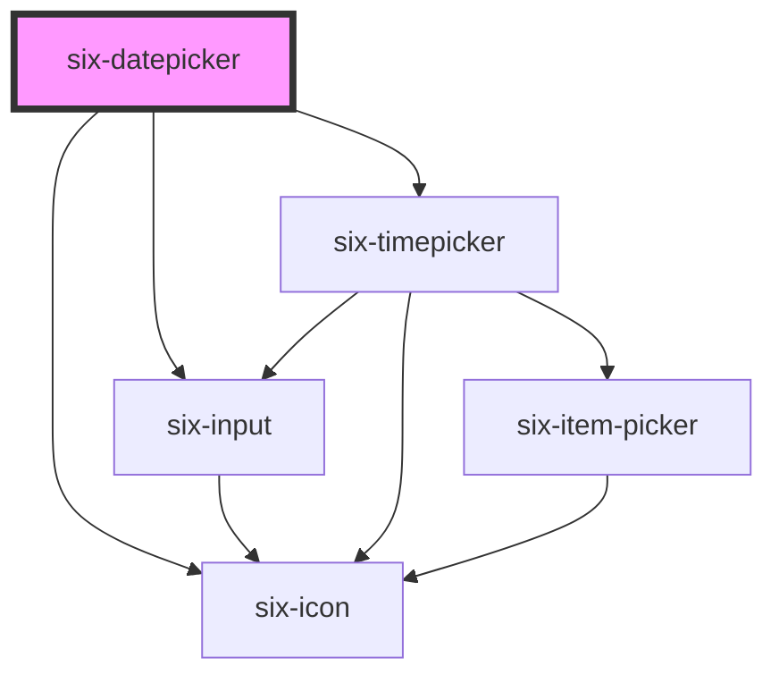

# six-datepicker


Datepickers allow the user to manually enter a date or open a popup calendar to select a date.

<docs-demo-six-datepicker-38></docs-demo-six-datepicker-38>

```html
<six-datepicker></six-datepicker>
```


## Examples

### Reading selected date

Either manually enter a date in the input field or select a date from the popup. You can read the selected date by listening to the `six-datepicker-select` event on the datepicker The selected date will be shown below the datepicker.

<docs-demo-six-datepicker-39></docs-demo-six-datepicker-39>

```html
<six-datepicker id="read-select-date-picker"></six-datepicker>
<div id="read-select-date-label">No Date selected yet!</div>

<script type="module">
  const datepicker = document.getElementById('read-select-date-picker');
  const selectedDate = document.getElementById('read-select-date-label');

  datepicker.addEventListener('six-datepicker-select', (event) => {
    selectedDate.innerHTML = `selected: ${event.detail.toLocaleDateString()}`;
  });
</script>
<style>
  six-datepicker {
    max-width: 25rem;
  }
</style>
```


### Date and Time

If you need to select a time as well, just set the `type` and `date-format` and the datepicker will include a timepicker too.

<docs-demo-six-datepicker-40></docs-demo-six-datepicker-40>

```html
<six-datepicker           date-format="dd.mm.yyyy hh:MM:ss"
  type="date-time"
  id="read-select-datetime-picker"
></six-datepicker>
<div id="read-select-datetime-label">No Date selected yet!</div>

<script type="module">
  const datepicker = document.getElementById('read-select-datetime-picker');
  const selectedDate = document.getElementById('read-select-datetime-label');

  datepicker.addEventListener('six-datepicker-select', (event) => {
    selectedDate.innerHTML = `selected: ${event.detail.toLocaleString()}`;
  });
</script>
<style>
  six-datepicker {
    max-width: 25rem;
  }
</style>
```


### Disabled State

<docs-demo-six-datepicker-41></docs-demo-six-datepicker-41>

```html
<six-datepicker disabled></six-datepicker>
<style>
  six-datepicker {
    max-width: 25rem;
  }
</style>
```


### Inline State

If you wish you can have the datepicker as an inline component i.e. the popup will always be open

<docs-demo-six-datepicker-42></docs-demo-six-datepicker-42>

```html
<six-datepicker inline="true"></six-datepicker>
<style>
  six-datepicker {
    max-width: 25rem;
  }
</style>
```


### Readonly State

If you want to force the user to use the popup instead of manually enter a date, you can simply add the `readonly` property

<docs-demo-six-datepicker-43></docs-demo-six-datepicker-43>

```html
<six-datepicker readonly></six-datepicker>
<style>
  six-datepicker {
    max-width: 25rem;
  }
</style>
```


### Placement

By default the datepicker will render either below or above the input field depending on the available space.

If you want to enforce a certain placement you can use the `placement` attribute

<docs-demo-six-datepicker-44></docs-demo-six-datepicker-44>

```html
<six-datepicker placement="bottom"></six-datepicker>
<style>
  six-datepicker {
    max-width: 25rem;
  }
</style>
```


### Placeholder

You can define the datepickers placeholder via `placeholder`

<docs-demo-six-datepicker-45></docs-demo-six-datepicker-45>

```html
<six-datepicker placeholder="DD.MM.YYYY"></six-datepicker>
<style>
  six-datepicker {
    max-width: 25rem;
  }
</style>
```


### Locale

You can change the language in which the datepicker is shown by using the `locale` attribute

<docs-demo-six-datepicker-46></docs-demo-six-datepicker-46>

```html
<six-datepicker locale="fr"></six-datepicker>
<style>
  six-datepicker {
    max-width: 25rem;
  }
</style>
```


### Footer

You can add content to the footer by simply using the datepicker's slot

<docs-demo-six-datepicker-47></docs-demo-six-datepicker-47>

```html
<six-datepicker>
  <p style="text-align: center">Choose your birthdate!</p>
</six-datepicker>
<style>
  six-datepicker {
    max-width: 25rem;
  }
</style>
```


Of course you can also enhance the datepicker footer with special functions

<docs-demo-six-datepicker-48></docs-demo-six-datepicker-48>

```html
<six-datepicker id="datepicker-adv-footer">
  <div             style="
      display: flex;
      justify-content: space-between;
      padding: 1rem 0.5rem 0 0.5rem;
      border-top: solid 1px #c3c3c3;
    "
  >
    <six-button id="datepicker-adv-footer-btn1">Today</six-button>
    <six-button id="datepicker-adv-footer-btn2">Clear</six-button>
  </div>
</six-datepicker>
<script type="module">
  const datepicker = document.getElementById('datepicker-adv-footer');
  datepicker.addEventListener('six-datepicker-select', (event) => {
    console.log(`[ six-datepicker-select ]`, { date: event.detail });
  });

  const btn1 = document.getElementById('datepicker-adv-footer-btn1');
  btn1.addEventListener('click', () => (datepicker.value = new Date()));

  const btn2 = document.getElementById('datepicker-adv-footer-btn2');
  btn2.addEventListener('click', () => (datepicker.value = null));
</script>
<style>
  six-datepicker {
    max-width: 25rem;
  }
</style>
```


### Date Format

The SIX datepicker supports the following different formats:

<docs-demo-six-datepicker-49></docs-demo-six-datepicker-49>

```html
<div id="datepicker-formats-container" style="display: flex; flex-wrap: wrap">
  <six-datepicker placeholder="dd.mm.yyyy" date-format="dd.mm.yyyy"></six-datepicker>
  <six-datepicker placeholder="yyyy-mm-dd" date-format="yyyy-mm-dd"></six-datepicker>
  <six-datepicker placeholder="dd-mm-yyyy" date-format="dd-mm-yyyy"></six-datepicker>
  <six-datepicker placeholder="dd/mm/yyyy" date-format="dd/mm/yyyy"></six-datepicker>
  <six-datepicker placeholder="yyyy/mm/dd" date-format="yyyy/mm/dd"></six-datepicker>
  <six-datepicker placeholder="dd.mm.yy" date-format="dd.mm.yy"></six-datepicker>
  <six-datepicker placeholder="yy-mm-dd" date-format="yy-mm-dd"></six-datepicker>
  <six-datepicker placeholder="dd-mm-yy" date-format="dd-mm-yy"></six-datepicker>
  <six-datepicker placeholder="dd/mm/yy" date-format="dd/mm/yy"></six-datepicker>
  <six-datepicker placeholder="yy/mm/dd" date-format="yy/mm/dd"></six-datepicker>
</div>

<six-button id="datepicker-formats-btn">Apply dates</six-button>

<script type="module">
  const datepickerContainer = document.getElementById('datepicker-formats-container');
  const datepickers = datepickerContainer.querySelectorAll('six-datepicker');
  datepickers.forEach((dtpicker) => {
    dtpicker.style.marginBottom = '1rem';
    dtpicker.style.marginRight = '1rem';
  });

  const btn = document.getElementById('datepicker-formats-btn');
  btn.addEventListener('click', () => {
    datepickers.forEach((dtpicker) => {
      dtpicker.value = new Date();
    });
  });
</script>
<style>
  #datepicker-formats-container six-datepicker {
    max-width: 25rem;
    min-width: 10rem;
  }
</style>
```


### Define Min & Max

You can set the min and max dates. Please be aware that only date objects are accepted and n:

<docs-demo-six-datepicker-50></docs-demo-six-datepicker-50>

```html
<div class="min-max-demo">
  <six-datepicker id="min-max-date-picker"></six-datepicker>
  <six-datepicker id="only-min-date-picker"></six-datepicker>
  <six-datepicker id="only-max-date-picker"></six-datepicker>
</div>

<div style="margin-top: 1rem">
  <span style="font-weight: bold">Selected: </span><span id="min-max-date-selected">No Date selected yet!</span>
  six-datepicker { max-width: 25rem; }
</div>

<style>
  .min-max-demo {
    display: flex;
    flex-wrap: wrap;
  }

  .min-max-demo six-datepicker {
    min-width: 15rem;
    margin-right: 1rem;
    margin-bottom: 1rem;
  }
</style>

<script type="module">
  const minMaxDatepicker = document.getElementById('min-max-date-picker');
  const minDatepicker = document.getElementById('only-min-date-picker');
  const maxDatepicker = document.getElementById('only-max-date-picker');
  const selectedDate = document.getElementById('min-max-date-selected');

  const getDateFromNow = (days) => new Date(new Date().setDate(new Date().getDate() + days));

  minMaxDatepicker.value = new Date();
  minMaxDatepicker.min = getDateFromNow(-3);
  minMaxDatepicker.max = getDateFromNow(2);

  minDatepicker.min = getDateFromNow(-3);
  maxDatepicker.max = getDateFromNow(2);

  minMaxDatepicker.addEventListener('six-datepicker-select', (event) => {
    selectedDate.innerHTML = `${event.detail.toLocaleDateString()}`;
  });
</script>
```


### Allowed Dates

If the set of allowed dates is more complex than just passing a min and max date you can define a allow dates callback function

<docs-demo-six-datepicker-51></docs-demo-six-datepicker-51>

```html
<six-datepicker id="allowed-date-picker"></six-datepicker>

<script type="module">
  const datepicker = document.getElementById('allowed-date-picker');
  datepicker.allowedDates = (date) => date.getDate() % 2 === 0;
</script>
<style>
  six-datepicker {
    max-width: 25rem;
  }
</style>
```


### Custom Start Date

You can define a custom default date which will be shown on first appearance of the popup

<docs-demo-six-datepicker-52></docs-demo-six-datepicker-52>

```html
<six-datepicker default-date="2021-02-20" date-format="yyyy-mm-dd"></six-datepicker>
<style>
  six-datepicker {
    max-width: 25rem;
  }
</style>
```


### Clearable

Add the `clearable` property to add a clear button when the input has content.

<docs-demo-six-datepicker-53></docs-demo-six-datepicker-53>

```html
<six-datepicker clearable></six-datepicker>
<style>
  six-datepicker {
    max-width: 25rem;
  }
</style>
```


### Icon position

Could be adjusted providing `icon-position` property.

<docs-demo-six-datepicker-54></docs-demo-six-datepicker-54>

```html
<six-datepicker icon-position="right"></six-datepicker>
<br>
<six-datepicker icon-position="right" clearable></six-datepicker>
<br>
<six-datepicker icon-position="right" custom-icon clearable>
  
</six-datepicker>
<style>
  six-datepicker {
    max-width: 25rem;
  }
</style>
```


### Custom icon

The slot `custom-icon` is used to provide a custom datepicker icon.

<docs-demo-six-datepicker-55></docs-demo-six-datepicker-55>

```html
<six-datepicker custom-icon>
  
</six-datepicker>
<style>
  six-datepicker {
    max-width: 25rem;
  }
</style>
```


### Sizes

Use the `size` attribute to change a datepicker size.

<docs-demo-six-datepicker-56></docs-demo-six-datepicker-56>

```html
<six-datepicker size="small" clearable></six-datepicker>
<br>
<six-datepicker size="medium" clearable></six-datepicker>
<br>
<six-datepicker size="large" clearable></six-datepicker>
<style>
  six-datepicker {
    max-width: 25rem;
  }
</style>
```


### Hoisting

Dropdown panels will be clipped if they're inside a container that has overflow: auto|hidden. The hoist attribute forces the panel to use a fixed positioning strategy, allowing it to break out of the container. In this case, the panel will be positioned relative to its containing block, which is usually the viewport unless an ancestor uses a transform, perspective, or filter.

<docs-demo-six-datepicker-57></docs-demo-six-datepicker-57>

```html
<div style="overflow: hidden; border: solid 1px grey; padding: 0.5em; display: flex">
  <six-datepicker placement="bottom" placeholder="no hoisting"></six-datepicker>
  <six-datepicker hoist placement="bottom" placeholder="with hoisting"></six-datepicker>
</div>
<style>
  six-datepicker {
    max-width: 25rem;
    min-width: 10rem;
  }
</style>
```


### Dynamic changes

The datepicker value can be changed dynamically by setting the `value` attribute.

<docs-demo-six-datepicker-58></docs-demo-six-datepicker-58>

```html
<six-datepicker id="dynamic-datepicker"></six-datepicker>
<div style="margin-top: 1rem">
  <span style="font-weight: bold">Selected: </span><span id="dynamic-datepicker-selected">No Date selected yet!</span>
</div>
<div style="margin-top: 1rem">
  <six-button id="dynamic-datepicker-btn1">01.01.2020</six-button>
  <six-button id="dynamic-datepicker-btn2">15.06.3020</six-button>
  <six-button id="dynamic-datepicker-btn3">31.12.1420</six-button>
</div>
<script type="module">
  const datepicker = document.getElementById('dynamic-datepicker');
  const selectedDate = document.getElementById('dynamic-datepicker-selected');

  const btn1 = document.getElementById('dynamic-datepicker-btn1');
  btn1.addEventListener('click', () => (datepicker.value = new Date('2020-01-01')));

  const btn2 = document.getElementById('dynamic-datepicker-btn2');
  btn2.addEventListener('click', () => (datepicker.value = new Date('3020-06-15')));

  const btn3 = document.getElementById('dynamic-datepicker-btn3');
  btn3.addEventListener('click', () => (datepicker.value = new Date('1420-12-31')));

  datepicker.addEventListener('six-datepicker-select', (event) => {
    console.log(`[ six-datepicker-select ]`, { date: event.detail });
    selectedDate.innerHTML = `${event.detail.toLocaleDateString()}`;
  });
</script>
<style>
  six-datepicker {
    max-width: 25rem;
  }
</style>
```


### Open State

If you wish you can have the datepicker open on startup. It will close as usual (clicking outside etc.)

<docs-demo-six-datepicker-59></docs-demo-six-datepicker-59>

```html
<six-datepicker open="true" placement="bottom"></six-datepicker>
<style>
  six-datepicker {
    max-width: 25rem;
  }
</style>
```


## Datepicker in a Modal

<docs-demo-six-datepicker-60></docs-demo-six-datepicker-60>

```html
<six-button id="modal-ex-dt">Toggle Modal</six-button>

<div id="dt-modal" class="dt-modal">
  <six-datepicker placement="top"></six-datepicker>
  <six-datepicker placement="bottom"></six-datepicker>
</div>

<script>
  let modalIsShown = false;

  const btn = document.getElementById('modal-ex-dt');
  const dtModal = document.getElementById('dt-modal');
  btn.addEventListener('click', () => {
    if (modalIsShown) {
      dtModal.style.display = 'none';
    } else {
      dtModal.style.display = 'flex';
    }

    modalIsShown = !modalIsShown;
  });
</script>

<style>
  .dt-modal {
    display: none;
    flex-wrap: wrap;
    width: 50vw;
    height: 100vh;
    background: white;
    position: fixed;
    z-index: 1;
    left: 25vw;
    top: 0;
    border: solid 1px lightgray;
  }

  .dt-modal six-datepicker {
    width: 100%;
    height: calc(100vh - 2.5rem);
    max-width: unset;
  }
</style>
```


<!-- Auto Generated Below -->


## Properties

| Property            | Attribute         | Description                                                                                                                                                                                                                                                                                                                      | Type                                                                                                                                                                                                                                                                                                                                                                                                                                                                                                                                                                                                                                                                                           | Default                      |
| ------------------- | ----------------- | -------------------------------------------------------------------------------------------------------------------------------------------------------------------------------------------------------------------------------------------------------------------------------------------------------------------------------- | ---------------------------------------------------------------------------------------------------------------------------------------------------------------------------------------------------------------------------------------------------------------------------------------------------------------------------------------------------------------------------------------------------------------------------------------------------------------------------------------------------------------------------------------------------------------------------------------------------------------------------------------------------------------------------------------------- | ---------------------------- |
| `allowedDates`      | --                | Callback to determine which date in the datepicker should be selectable. the callback function will get a datestring as an argument, e.g. '2021-07-04'  Usage e.g.: const datepicker = document.getElementById('allowed-date-picker'); datepicker.allowedDates = datestring => parseInt(datestring.split('-')[2], 10) % 2 === 0; | `(date: Date) => boolean`                                                                                                                                                                                                                                                                                                                                                                                                                                                                                                                                                                                                                                                                      | `() => true`                 |
| `clearable`         | `clearable`       | Set to true to add a clear button when the input is populated.                                                                                                                                                                                                                                                                   | `boolean`                                                                                                                                                                                                                                                                                                                                                                                                                                                                                                                                                                                                                                                                                      | `false`                      |
| `closeOnSelect`     | `close-on-select` | Closes the datepicker dropdown after selection                                                                                                                                                                                                                                                                                   | `boolean`                                                                                                                                                                                                                                                                                                                                                                                                                                                                                                                                                                                                                                                                                      | `this.type === 'date'`       |
| `containingElement` | --                | The dropdown will close when the user interacts outside of this element (e.g. clicking).                                                                                                                                                                                                                                         | `HTMLElement \| undefined`                                                                                                                                                                                                                                                                                                                                                                                                                                                                                                                                                                                                                                                                     | `undefined`                  |
| `dateFormat`        | `date-format`     | Define the dateFormat. Valid formats are: 'dd.mm.yyyy' 'yyyy-mm-dd' 'dd-mm-yyyy' 'dd/mm/yyyy' 'yyyy/mm/dd' 'dd.mm.yy' 'yy-mm-dd' 'dd-mm-yy' 'dd/mm/yy' 'yy/mm/dd'                                                                                                                                                                | `SixDateFormats.DDMMYYYY_DASH \| SixDateFormats.DDMMYYYY_DASH_TIME \| SixDateFormats.DDMMYYYY_SLASH \| SixDateFormats.DDMMYYYY_SLASH_TIME \| SixDateFormats.DDMMYYY_DOT \| SixDateFormats.DDMMYYY_DOT_TIME \| SixDateFormats.DDMMYY_DASH \| SixDateFormats.DDMMYY_DASH_TIME \| SixDateFormats.DDMMYY_DOT \| SixDateFormats.DDMMYY_DOT_TIME \| SixDateFormats.DDMMYY_SLASH \| SixDateFormats.DDMMYY_SLASH_TIME \| SixDateFormats.YYMMDD_DASH \| SixDateFormats.YYMMDD_DASH_TIME \| SixDateFormats.YYMMDD_SLASH \| SixDateFormats.YYMMDD_SLASH_TIME \| SixDateFormats.YYYYMMDD_DASH \| SixDateFormats.YYYYMMDD_DASH_TIME \| SixDateFormats.YYYYMMDD_SLASH \| SixDateFormats.YYYYMMDD_SLASH_TIME` | `SixDateFormats.DDMMYYY_DOT` |
| `debounce`          | `debounce`        | Set the amount of time, in milliseconds, to wait to trigger the `dateChange` event after each keystroke.                                                                                                                                                                                                                         | `number`                                                                                                                                                                                                                                                                                                                                                                                                                                                                                                                                                                                                                                                                                       | `DEFAULT_DEBOUNCE_FAST`      |
| `defaultDate`       | `default-date`    | The date to defines where the datepicker popup starts. The prop accepts ISO 8601 date strings (YYYY-MM-DD).                                                                                                                                                                                                                      | `string \| undefined`                                                                                                                                                                                                                                                                                                                                                                                                                                                                                                                                                                                                                                                                          | `undefined`                  |
| `disabled`          | `disabled`        | If `true` the component is disabled.                                                                                                                                                                                                                                                                                             | `boolean`                                                                                                                                                                                                                                                                                                                                                                                                                                                                                                                                                                                                                                                                                      | `false`                      |
| `errorText`         | `error-text`      | The error message shown, if `invalid` is set to true.                                                                                                                                                                                                                                                                            | `string`                                                                                                                                                                                                                                                                                                                                                                                                                                                                                                                                                                                                                                                                                       | `''`                         |
| `hoist`             | `hoist`           | Enable this option to prevent the panel from being clipped when the component is placed inside a container with `overflow: auto\|scroll`.                                                                                                                                                                                        | `boolean`                                                                                                                                                                                                                                                                                                                                                                                                                                                                                                                                                                                                                                                                                      | `false`                      |
| `iconPosition`      | `icon-position`   | Set the position of the icon                                                                                                                                                                                                                                                                                                     | `"left" \| "right"`                                                                                                                                                                                                                                                                                                                                                                                                                                                                                                                                                                                                                                                                            | `'left'`                     |
| `inline`            | `inline`          | Indicates whether or not the calendar should be shown as an inline (always open) component                                                                                                                                                                                                                                       | `boolean`                                                                                                                                                                                                                                                                                                                                                                                                                                                                                                                                                                                                                                                                                      | `false`                      |
| `invalid`           | `invalid`         | If this property is set to true and an error message is provided by `errorText`, the error message is displayed.                                                                                                                                                                                                                 | `boolean`                                                                                                                                                                                                                                                                                                                                                                                                                                                                                                                                                                                                                                                                                      | `false`                      |
| `label`             | `label`           | The label text.                                                                                                                                                                                                                                                                                                                  | `string`                                                                                                                                                                                                                                                                                                                                                                                                                                                                                                                                                                                                                                                                                       | `''`                         |
| `locale`            | `locale`          | The language used to render the weekdays and months.                                                                                                                                                                                                                                                                             | `"de" \| "en" \| "fr" \| "it"`                                                                                                                                                                                                                                                                                                                                                                                                                                                                                                                                                                                                                                                                 | `'en'`                       |
| `max`               | --                | The maximum datetime allowed. Value must be a date object                                                                                                                                                                                                                                                                        | `Date \| undefined`                                                                                                                                                                                                                                                                                                                                                                                                                                                                                                                                                                                                                                                                            | `undefined`                  |
| `min`               | --                | The minimum datetime allowed. Value must be a date object                                                                                                                                                                                                                                                                        | `Date \| undefined`                                                                                                                                                                                                                                                                                                                                                                                                                                                                                                                                                                                                                                                                            | `undefined`                  |
| `name`              | `name`            | The input's name attribute.                                                                                                                                                                                                                                                                                                      | `string`                                                                                                                                                                                                                                                                                                                                                                                                                                                                                                                                                                                                                                                                                       | `''`                         |
| `open`              | `open`            | Indicates whether or not the calendar dropdown is open on startup. You can use this in lieu of the show/hide methods.                                                                                                                                                                                                            | `boolean`                                                                                                                                                                                                                                                                                                                                                                                                                                                                                                                                                                                                                                                                                      | `false`                      |
| `placeholder`       | `placeholder`     | The placeholder defines what text to be shown on the input element                                                                                                                                                                                                                                                               | `string \| undefined`                                                                                                                                                                                                                                                                                                                                                                                                                                                                                                                                                                                                                                                                          | `undefined`                  |
| `placement`         | `placement`       | The enforced placement of the dropdown panel.                                                                                                                                                                                                                                                                                    | `"bottom" \| "top" \| undefined`                                                                                                                                                                                                                                                                                                                                                                                                                                                                                                                                                                                                                                                               | `undefined`                  |
| `readonly`          | `readonly`        | If `true` the user can only select a date via the component in the popup, but not directly edit the input field.                                                                                                                                                                                                                 | `boolean`                                                                                                                                                                                                                                                                                                                                                                                                                                                                                                                                                                                                                                                                                      | `false`                      |
| `required`          | `required`        | Set to true to show an asterisk beneath the label.                                                                                                                                                                                                                                                                               | `boolean`                                                                                                                                                                                                                                                                                                                                                                                                                                                                                                                                                                                                                                                                                      | `false`                      |
| `size`              | `size`            | Datepicker size.                                                                                                                                                                                                                                                                                                                 | `"large" \| "medium" \| "small"`                                                                                                                                                                                                                                                                                                                                                                                                                                                                                                                                                                                                                                                               | `'medium'`                   |
| `type`              | `type`            | Set the type.                                                                                                                                                                                                                                                                                                                    | `"date" \| "date-time"`                                                                                                                                                                                                                                                                                                                                                                                                                                                                                                                                                                                                                                                                        | `'date'`                     |
| `value`             | --                | The value of the form field, which accepts a date object.                                                                                                                                                                                                                                                                        | `Date \| undefined`                                                                                                                                                                                                                                                                                                                                                                                                                                                                                                                                                                                                                                                                            | `undefined`                  |


## Events

| Event                   | Description                                 | Type                                     |
| ----------------------- | ------------------------------------------- | ---------------------------------------- |
| `six-datepicker-blur`   | Emitted when a option got selected.         | `CustomEvent<Date \| null \| undefined>` |
| `six-datepicker-clear`  | Emitted when the clear button is activated. | `CustomEvent<undefined>`                 |
| `six-datepicker-select` | Emitted when a option got selected.         | `CustomEvent<Date \| null \| undefined>` |


## Methods

### `select(datestring?: string) => Promise<void>`

Selects an option

#### Returns

Type: `Promise<void>`


### `setFocus(options?: FocusOptions) => Promise<void>`

Sets focus on the datepickers input.

#### Returns

Type: `Promise<void>`


## Slots

| Slot | Description                                  |
| ---- | -------------------------------------------- |
|      | Used to define a footer for the date picker. |


## Shadow Parts

| Part       | Description |
| ---------- | ----------- |
| `"base"`   |             |
| `"header"` |             |
| `"icon"`   |             |
| `"popup"`  |             |


## Dependencies

### Depends on

- [six-icon](six-icon.html)
- [six-input](six-input.html)
- [six-timepicker](six-timepicker.html)

### Graph


----------------------------------------------

Copyright © 2021-present SIX-Group
