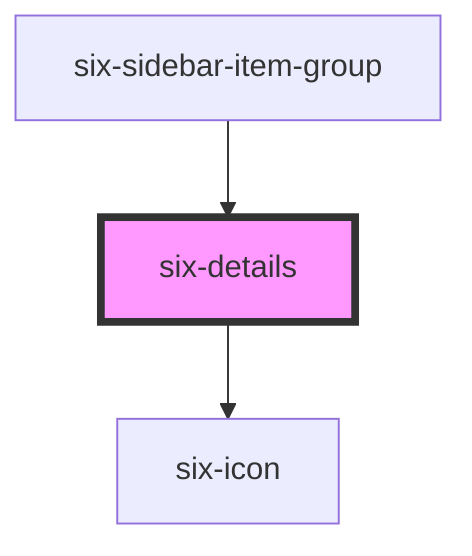

# six-details


Details show a brief summary and expand to show additional content.

<docs-demo-six-details-61></docs-demo-six-details-61>

```html
<six-details summary="Toggle Me">
  Lorem ipsum dolor sit amet, consectetur adipiscing elit, sed do eiusmod tempor incididunt ut labore et dolore
  magna aliqua. Ut enim ad minim veniam, quis nostrud exercitation ullamco laboris nisi ut aliquip ex ea commodo
  consequat.
</six-details>
```


## Examples

### Custom summary icon

Use `summary-icon` slot to provide custom summary icon content.

<docs-demo-six-details-62></docs-demo-six-details-62>

```html
<six-details summary="Toggle Me">
  Lorem ipsum dolor sit amet, consectetur adipiscing elit, sed do eiusmod tempor incididunt ut labore et dolore
  magna aliqua. Ut enim ad minim veniam, quis nostrud exercitation ullamco laboris nisi ut aliquip ex ea commodo
  consequat.
  <span slot="summary-icon"><b>99%</b></span>
</six-details>
```


Use `summary-icon` property to set the desired summary icon.

<docs-demo-six-details-63></docs-demo-six-details-63>

```html
<six-details summary="Toggle Me" summary-icon="settings">
  Lorem ipsum dolor sit amet, consectetur adipiscing elit, sed do eiusmod tempor incididunt ut labore et dolore
  magna aliqua. Ut enim ad minim veniam, quis nostrud exercitation ullamco laboris nisi ut aliquip ex ea commodo
  consequat.
</six-details>
```


Use `summary-icon-size` slot to customize the icon size. With "inherit" the icon size depends on the font-size.

<docs-demo-six-details-64></docs-demo-six-details-64>

```html
<div class="details-icon-size-example-1">
  <six-details summary="Toggle Me" summary-icon-size="inherit">
    Lorem ipsum dolor sit amet, consectetur adipiscing elit, sed do eiusmod tempor incididunt ut labore et
    dolore magna aliqua. Ut enim ad minim veniam, quis nostrud exercitation ullamco laboris nisi ut aliquip ex
    ea commodo consequat.
  </six-details>
</div>

<style>
  .details-icon-size-example-1 six-details::part(header) {
    font-size: var(--six-font-size-medium);
  }
</style>
```


<docs-demo-six-details-65></docs-demo-six-details-65>

```html
<div class="details-icon-size-example-2">
  <six-details summary="Toggle Me" summary-icon-size="inherit">
    Lorem ipsum dolor sit amet, consectetur adipiscing elit, sed do eiusmod tempor incididunt ut labore et
    dolore magna aliqua. Ut enim ad minim veniam, quis nostrud exercitation ullamco laboris nisi ut aliquip ex
    ea commodo consequat.
  </six-details>
</div>

<style>
  .details-icon-size-example-2 six-details::part(header) {
    font-size: var(--six-font-size-xx-large);
  }
</style>
```


### Disabled

Use the `disable` attribute to prevent the details from expanding.

<docs-demo-six-details-66></docs-demo-six-details-66>

```html
<six-details summary="Disabled" disabled>
  Lorem ipsum dolor sit amet, consectetur adipiscing elit, sed do eiusmod tempor incididunt ut labore et dolore
  magna aliqua. Ut enim ad minim veniam, quis nostrud exercitation ullamco laboris nisi ut aliquip ex ea commodo
  consequat.
</six-details>
```


### Grouping Details

Details are designed to function independently, but you can simulate a group or "accordion" where only one is shown at a time by listening for the `six-show` event.

<docs-demo-six-details-67></docs-demo-six-details-67>

```html
<div class="details-group-example">
  <six-details summary="First" open>
    Lorem ipsum dolor sit amet, consectetur adipiscing elit, sed do eiusmod tempor incididunt ut labore et
    dolore magna aliqua. Ut enim ad minim veniam, quis nostrud exercitation ullamco laboris nisi ut aliquip ex
    ea commodo consequat.
  </six-details>

  <six-details summary="Second">
    Lorem ipsum dolor sit amet, consectetur adipiscing elit, sed do eiusmod tempor incididunt ut labore et
    dolore magna aliqua. Ut enim ad minim veniam, quis nostrud exercitation ullamco laboris nisi ut aliquip ex
    ea commodo consequat.
  </six-details>

  <six-details summary="Third">
    Lorem ipsum dolor sit amet, consectetur adipiscing elit, sed do eiusmod tempor incididunt ut labore et
    dolore magna aliqua. Ut enim ad minim veniam, quis nostrud exercitation ullamco laboris nisi ut aliquip ex
    ea commodo consequat.
  </six-details>
</div>

<script type="module">
  const container = document.querySelector('.details-group-example');

  // Close all other details when one is shown
  container.addEventListener('six-details-show', (event) => {
    [...container.querySelectorAll('six-details')].map((details) => (details.open = event.target === details));
  });
</script>

<style>
  .details-group-example six-details:not(:last-of-type) {
    margin-bottom: var(--six-spacing-xx-small);
  }
</style>
```


### Programmatically control six-details

You can easily control a six-detail by simply setting the corresponding open attribute. Try it by clicking on one of the buttons.

<docs-demo-six-details-68></docs-demo-six-details-68>

```html
<div           id="buttonbar-programmatic-example"
  style="
    display: flex;
    justify-content: space-evenly;
    margin-top: 1em;
    margin-bottom: 1em;
    padding: 0 25vw 0 25vw;
  "
>
  <six-button>First</six-button>
  <six-button>Second</six-button>
  <six-button>Third</six-button>
</div>

<div class="details-programmatic-example">
  <six-details summary="First" open>
    Lorem ipsum dolor sit amet, consectetur adipiscing elit, sed do eiusmod tempor incididunt ut labore et
    dolore magna aliqua. Ut enim ad minim veniam, quis nostrud exercitation ullamco laboris nisi ut aliquip ex
    ea commodo consequat.
  </six-details>

  <six-details summary="Second">
    Lorem ipsum dolor sit amet, consectetur adipiscing elit, sed do eiusmod tempor incididunt ut labore et
    dolore magna aliqua. Ut enim ad minim veniam, quis nostrud exercitation ullamco laboris nisi ut aliquip ex
    ea commodo consequat.
  </six-details>

  <six-details summary="Third">
    Lorem ipsum dolor sit amet, consectetur adipiscing elit, sed do eiusmod tempor incididunt ut labore et
    dolore magna aliqua. Ut enim ad minim veniam, quis nostrud exercitation ullamco laboris nisi ut aliquip ex
    ea commodo consequat.
  </six-details>
</div>

<script type="module">
  const container = document.querySelector('.details-programmatic-example');

  const sixDetails = container.querySelectorAll('six-details');

  // Close all other details when one is shown
  container.addEventListener('six-details-show', (event) => {
    [...sixDetails].map((details) => (details.open = event.target === details));
  });

  const sixButtons = document.getElementById('buttonbar-programmatic-example').querySelectorAll('six-button');

  for (let i = 0; i < sixDetails.length; i++) {
    sixButtons[i].onclick = () => {
      sixDetails[i].open = true;
    };
  }
</script>

<style>
  .details-group-example six-details:not(:last-of-type) {
    margin-bottom: var(--six-spacing-xx-small);
  }
</style>
```


### Disable open/close

You can disable the open/close mechanism and hide the summary icon by setting `has-items` to `false`. Usually not needed, but used internally by `six-sidebar-item-group`.

<docs-demo-six-details-69></docs-demo-six-details-69>

```html
<six-details has-content="false" summary="Toggle Me">
  Lorem ipsum dolor sit amet, consectetur adipiscing elit, sed do eiusmod tempor incididunt ut labore et dolore
  magna aliqua. Ut enim ad minim veniam, quis nostrud exercitation ullamco laboris nisi ut aliquip ex ea commodo
  consequat.
</six-details>
```


<!-- Auto Generated Below -->


## Properties

| Property          | Attribute           | Description                                                                                                                                                   | Type                                                                                             | Default     |
| ----------------- | ------------------- | ------------------------------------------------------------------------------------------------------------------------------------------------------------- | ------------------------------------------------------------------------------------------------ | ----------- |
| `disabled`        | `disabled`          | Set to true to prevent the user from toggling the details.                                                                                                    | `boolean`                                                                                        | `false`     |
| `hasContent`      | `has-content`       | Set to false when you want to hide the summary icon and disable the open/close mechanism. Usually not needed, but used internally by 'six-sidebar-item-group' | `boolean`                                                                                        | `true`      |
| `inline`          | `inline`            | Set to true when you want to use six-details inline e.g. in a sidebar                                                                                         | `boolean`                                                                                        | `false`     |
| `open`            | `open`              | Indicates whether the details is open. You can use this in lieu of the show/hide methods.                                                                     | `boolean`                                                                                        | `false`     |
| `selectableEmpty` | `selectable-empty`  | Set to true when you want details without content to be selectable. This is important if you e.g. have a toggled sidebar where some menus have no children    | `boolean`                                                                                        | `false`     |
| `summary`         | `summary`           | The summary to show in the details header. If you need to display HTML, use the `summary` slot instead.                                                       | `string`                                                                                         | `''`        |
| `summaryIcon`     | `summary-icon`      | The summary icon to show in the details header. If you need to display HTML, use the `summary-icon` slot instead.                                             | `string \| undefined`                                                                            | `undefined` |
| `summaryIconSize` | `summary-icon-size` | The icon's size.                                                                                                                                              | `"inherit" \| "large" \| "medium" \| "small" \| "xLarge" \| "xSmall" \| "xxLarge" \| "xxxLarge"` | `'inherit'` |


## Events

| Event                    | Description                                                                                          | Type                     |
| ------------------------ | ---------------------------------------------------------------------------------------------------- | ------------------------ |
| `six-details-after-hide` | Emitted after the details closes and all transitions are complete.                                   | `CustomEvent<undefined>` |
| `six-details-after-show` | Emitted after the details opens and all transitions are complete.                                    | `CustomEvent<undefined>` |
| `six-details-hide`       | Emitted when the details closes. Calling `event.preventDefault()` will prevent it from being closed. | `CustomEvent<undefined>` |
| `six-details-show`       | Emitted when the details opens. Calling `event.preventDefault()` will prevent it from being opened.  | `CustomEvent<undefined>` |


## Methods

### `hide() => Promise<void>`

Hides the detail body

#### Returns

Type: `Promise<void>`


### `show() => Promise<void>`

Shows the detail body

#### Returns

Type: `Promise<void>`


## Slots

| Slot        | Description                                                        |
| ----------- | ------------------------------------------------------------------ |
|             | The details' content.                                              |
| `"summary"` | The details' summary. Alternatively, you can use the summary prop. |


## Shadow Parts

| Part             | Description                       |
| ---------------- | --------------------------------- |
| `"base"`         | The component's base wrapper.     |
| `"content"`      | The details content.              |
| `"header"`       | The summary header.               |
| `"summary"`      | The details summary.              |
| `"summary-icon"` | The expand/collapse summary icon. |


## CSS Custom Properties

| Name                     | Description                                                  |
| ------------------------ | ------------------------------------------------------------ |
| `--hide-duration`        | The length of the hide transition.                           |
| `--hide-timing-function` | The timing function (easing) to use for the hide transition. |
| `--show-duration`        | The length of the show transition.                           |
| `--show-timing-function` | The timing function (easing) to use for the show transition. |


## Dependencies

### Used by

 - [six-sidebar-item-group](six-sidebar-item-group.html)

### Depends on

- [six-icon](six-icon.html)

### Graph


----------------------------------------------

Copyright © 2021-present SIX-Group
