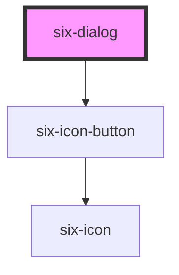

# Dialog


Dialogs, sometimes called "modals", appear above the page and require the user's immediate attention.

<docs-demo-six-dialog-0></docs-demo-six-dialog-0>

```html
<six-dialog label="Dialog" class="dialog-overview">
  Lorem ipsum dolor sit amet, consectetur adipiscing elit. aölkjölkjaölsdfas öl
  <six-button slot="footer" type="primary">Close</six-button>
</six-dialog>

<six-button>Open Dialog</six-button>

<script type="module">
  const dialogOverview = document.querySelector('.dialog-overview');
  const openButton = dialogOverview.nextElementSibling;
  const closeButton = dialogOverview.querySelector('six-button[slot="footer"]');

  openButton.addEventListener('click', () => dialogOverview.show());
  closeButton.addEventListener('click', () => dialogOverview.hide());
</script>
```


## UX Tips

*   Use a dialog when you immediately require the user's attention, e.g. confirming a destructive action.
*   Always provide an obvious way for the user to dismiss the dialog.
*   Don't nest dialogs. It almost always leads to a poor experience for the user.

## Examples

### Custom Width

Use the `--width` custom property to set the dialog's width.

<docs-demo-six-dialog-1></docs-demo-six-dialog-1>

```html
<six-dialog label="Dialog" class="dialog-width" style="--width: 50vw">
  Lorem ipsum dolor sit amet, consectetur adipiscing elit.
  <six-button slot="footer" type="primary">Close</six-button>
</six-dialog>

<six-button>Open Dialog</six-button>

<script type="module">
  const dialogWidth = document.querySelector('.dialog-width');
  const openButtonWidth = dialogWidth.nextElementSibling;
  const closeButtonWidth = dialogWidth.querySelector('six-button[slot="footer"]');

  openButtonWidth.addEventListener('click', () => dialogWidth.show());
  closeButtonWidth.addEventListener('click', () => dialogWidth.hide());
</script>
```


### Scrolling

By design, a dialog's height will never exceed that of the viewport. As such, dialogs will not scroll with the page ensuring the header and footer are always accessible to the user.

<docs-demo-six-dialog-2></docs-demo-six-dialog-2>

```html
<six-dialog label="Dialog" class="dialog-scrolling">
  <div style="height: 150vh; border: dashed 2px var(--six-color-web-rock-200); padding: 0 1rem">
    <p>Scroll down and give it a try! 👇</p>
  </div>
  <six-button slot="footer" type="primary">Close</six-button>
</six-dialog>

<six-button>Open Dialog</six-button>

<script type="module">
  const dialogScrolling = document.querySelector('.dialog-scrolling');
  const openButtonScrolling = dialogScrolling.nextElementSibling;
  const closeButtonScrolling = dialogScrolling.querySelector('six-button[slot="footer"]');

  openButtonScrolling.addEventListener('click', () => dialogScrolling.show());
  closeButtonScrolling.addEventListener('click', () => dialogScrolling.hide());
</script>
```


### Ignoring Clicks on the Overlay

By default, dialogs are closed when the user clicks or taps on the overlay. To prevent this behavior, cancel the `six-overlay-dismiss` event.

<docs-demo-six-dialog-3></docs-demo-six-dialog-3>

```html
<six-dialog label="Dialog" class="dialog-no-overlay-dismiss">
  This dialog will not be closed when you click outside of it.
  <six-button slot="footer" type="primary">Close</six-button>
</six-dialog>

<six-button>Open Dialog</six-button>

<script type="module">
  const dialogNoOverlay = document.querySelector('.dialog-no-overlay-dismiss');
  const openButtonNoOverlay = dialogNoOverlay.nextElementSibling;
  const closeButtonNoOverlay = dialogNoOverlay.querySelector('six-button[slot="footer"]');

  openButtonNoOverlay.addEventListener('click', () => dialogNoOverlay.show());
  closeButtonNoOverlay.addEventListener('click', () => dialogNoOverlay.hide());

  dialogNoOverlay.addEventListener('six-dialog-overlay-dismiss', (event) => event.preventDefault());
</script>
```


### Customizing Initial Focus

By default, the dialog's panel will gain focus when opened. To set focus on a different element, listen for the `six-initial-focus` event.

<docs-demo-six-dialog-4></docs-demo-six-dialog-4>

```html
<six-dialog label="Dialog" class="dialog-focus">
  <six-input placeholder="I will have focus when the dialog is opened"></six-input>
  <six-button slot="footer" type="primary">Close</six-button>
</six-dialog>

<six-button>Open Dialog</six-button>

<script type="module">
  const dialogFocus = document.querySelector('.dialog-focus');
  const inputFocus = dialogFocus.querySelector('six-input');
  const openButtonFocus = dialogFocus.nextElementSibling;
  const closeButtonFocus = dialogFocus.querySelector('six-button[slot="footer"]');

  openButtonFocus.addEventListener('click', () => dialogFocus.show());
  closeButtonFocus.addEventListener('click', () => dialogFocus.hide());

  dialogFocus.addEventListener('six-dialog-initial-focus', (event) => {
    event.preventDefault();
    inputFocus.setFocus({ preventScroll: true });
  });
</script>
```


<!-- Auto Generated Below -->


## Properties

| Property   | Attribute   | Description                                                                                                                                                              | Type      | Default |
| ---------- | ----------- | ------------------------------------------------------------------------------------------------------------------------------------------------------------------------ | --------- | ------- |
| `label`    | `label`     | The dialog's label as displayed in the header. You should always include a relevant label even when using `no-header`, as it is required for proper accessibility.       | `string`  | `''`    |
| `noHeader` | `no-header` | Set to true to disable the header. This will also remove the default close button, so please ensure you provide an easy, accessible way for users to dismiss the dialog. | `boolean` | `false` |
| `open`     | `open`      | Indicates whether the dialog is open. You can use this in lieu of the show/hide methods.                                                                                 | `boolean` | `false` |


## Events

| Event                        | Description                                                                                                                                                                                            | Type                     |
| ---------------------------- | ------------------------------------------------------------------------------------------------------------------------------------------------------------------------------------------------------ | ------------------------ |
| `six-dialog-after-hide`      | Emitted after the dialog closes and all transitions are complete.                                                                                                                                      | `CustomEvent<undefined>` |
| `six-dialog-after-show`      | Emitted after the dialog opens and all transitions are complete.                                                                                                                                       | `CustomEvent<undefined>` |
| `six-dialog-hide`            | Emitted when the dialog closes. Calling `event.preventDefault()` will prevent it from being closed.                                                                                                    | `CustomEvent<undefined>` |
| `six-dialog-initial-focus`   | Emitted when the dialog opens and the panel gains focus. Calling `event.preventDefault()` will prevent focus and allow you to set it on a different element in the dialog, such as an input or button. | `CustomEvent<undefined>` |
| `six-dialog-overlay-dismiss` | Emitted when the overlay is clicked. Calling `event.preventDefault()` will prevent the dialog from closing.                                                                                            | `CustomEvent<undefined>` |
| `six-dialog-show`            | Emitted when the dialog opens. Calling `event.preventDefault()` will prevent it from being opened.                                                                                                     | `CustomEvent<undefined>` |


## Methods

### `hide() => Promise<void>`

Hides the dialog

#### Returns

Type: `Promise<void>`


### `show() => Promise<void>`

Shows the dialog

#### Returns

Type: `Promise<void>`


## Slots

| Slot       | Description                                                                    |
| ---------- | ------------------------------------------------------------------------------ |
|            | The dialog's content.                                                          |
| `"footer"` | The dialog's footer, usually one or more buttons representing various options. |
| `"label"`  | The dialog's label. Alternatively, you can use the label prop.                 |


## Shadow Parts

| Part             | Description                                                      |
| ---------------- | ---------------------------------------------------------------- |
| `"base"`         | The component's base wrapper.                                    |
| `"body"`         | The dialog body.                                                 |
| `"close-button"` | The close button.                                                |
| `"footer"`       | The dialog footer.                                               |
| `"header"`       | The dialog header.                                               |
| `"overlay"`      | The overlay.                                                     |
| `"panel"`        | The dialog panel (where the dialog and its content is rendered). |
| `"title"`        | The dialog title.                                                |


## CSS Custom Properties

| Name      | Description                                                                                         |
| --------- | --------------------------------------------------------------------------------------------------- |
| `--width` | The preferred width of the dialog. Note that the dialog will shrink to accommodate smaller screens. |


## Dependencies

### Depends on

- [six-icon-button](six-icon-button.html)

### Graph


----------------------------------------------

Copyright © 2021-present SIX-Group
