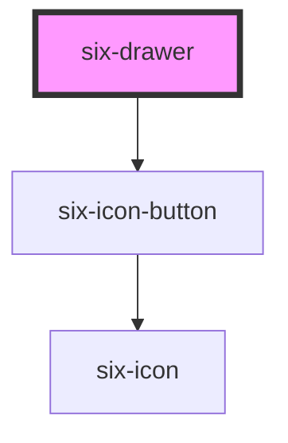

# Drawer

Drawers slide in from a container to expose additional options and information. Drawers are used when the user
has to do a context switch and do an intermediary task (Drawers are full height or width and will overlay the rest of the application).
For a passive side container use six-sidebar instead (could be always open).


## Basic Drawer


<docs-demo-six-drawer-0></docs-demo-six-drawer-0>

```html
<six-drawer label="Drawer" class="drawer-overview">
  Lorem ipsum dolor sit amet, consectetur adipiscing elit.
  <six-button slot="footer">Close</six-button>
</six-drawer>

<six-button>Open Drawer</six-button>

<script type="module">
  (() => {
    let drawer = document.querySelector('.drawer-overview');
    let openButton = drawer.nextElementSibling;
    let closeButton = drawer.querySelector('six-button');

    openButton.addEventListener('click', () => drawer.show());
    closeButton.addEventListener('click', () => drawer.hide());
  })();
</script>
```


## Slide in From Left

To make the drawer slide in from the left, set the `placement` attribute to `left`.

<docs-demo-six-drawer-1></docs-demo-six-drawer-1>

```html
<six-drawer label="Drawer" placement="left" class="drawer-placement-left">
  This drawer slides in from the left.
  <six-button slot="footer">Close</six-button>
</six-drawer>

<six-button>Open Drawer</six-button>

<script type="module">
  (() => {
    let drawer = document.querySelector('.drawer-placement-left');
    let openButton = drawer.nextElementSibling;
    let closeButton = drawer.querySelector('six-button');

    openButton.addEventListener('click', () => drawer.show());
    closeButton.addEventListener('click', () => drawer.hide());
  })();
</script>
```


## Slide in From Top

To make the drawer slide in from the top, set the `placement` attribute to `top` .

<docs-demo-six-drawer-2></docs-demo-six-drawer-2>

```html
<six-drawer label="Drawer" placement="top" class="drawer-placement-top">
  This drawer slides in from the top.
  <six-button slot="footer">Close</six-button>
</six-drawer>

<six-button>Open Drawer</six-button>

<script type="module">
  (() => {
    let drawer = document.querySelector('.drawer-placement-top');
    let openButton = drawer.nextElementSibling;
    let closeButton = drawer.querySelector('six-button');

    openButton.addEventListener('click', () => drawer.show());
    closeButton.addEventListener('click', () => drawer.hide());
  })();
</script>
```


## Slide in From Bottom

To make the drawer slide in from the bottom, set the `placement` attribute to `bottom` .

<docs-demo-six-drawer-3></docs-demo-six-drawer-3>

```html
<six-drawer label="Drawer" placement="bottom" class="drawer-placement-bottom">
  This drawer slides in from the bottom.
  <six-button slot="footer">Close</six-button>
</six-drawer>

<six-button>Open Drawer</six-button>

<script type="module">
  (() => {
    let drawer = document.querySelector('.drawer-placement-bottom');
    let openButton = drawer.nextElementSibling;
    let closeButton = drawer.querySelector('six-button');

    openButton.addEventListener('click', () => drawer.show());
    closeButton.addEventListener('click', () => drawer.hide());
  })();
</script>
```


## Contained to an Element

By default, the drawer slides out of its [containing block](https://developer.mozilla.org/en-US/docs/Web/CSS/Containing_block#Identifying_the_containing_block), which is usually the viewport. To make the drawer slide out of its parent element, add the `contained` prop and `position: relative` to the parent.

<docs-demo-six-drawer-4></docs-demo-six-drawer-4>

```html
<div           style="
    position: relative;
    border: solid 2px var(--six-panel-border-color);
    height: 300px;
    padding: 1rem;
    margin-bottom: 1rem;
  "
>
  The drawer will be contained to this box. This content won't shift or be affected in any way when the drawer
  opens.

  <six-drawer label="Drawer" contained class="drawer-contained" style="--size: 50%">
    Lorem ipsum dolor sit amet, consectetur adipiscing elit.
    <six-button slot="footer">Close</six-button>
  </six-drawer>
</div>

<six-button>Open Drawer</six-button>

<script type="module">
  (() => {
    let drawer = document.querySelector('.drawer-contained');
    let openButton = drawer.parentElement.nextElementSibling;
    let closeButton = drawer.querySelector('six-button');

    openButton.addEventListener('click', () => drawer.show());
    closeButton.addEventListener('click', () => drawer.hide());
  })();
</script>
```


## Custom Size

Use the `--size` custom property to set the drawer's size. This will be applied to the drawer's width or height depending on its `placement`

<docs-demo-six-drawer-5></docs-demo-six-drawer-5>

```html
<six-drawer label="Drawer" class="drawer-custom-size" style="--size: 50vw">
  This drawer is always 50% of the viewport.
  <six-button slot="footer">Close</six-button>
</six-drawer>

<six-button>Open Drawer</six-button>

<script type="module">
  (() => {
    let drawer = document.querySelector('.drawer-custom-size');
    let openButton = drawer.nextElementSibling;
    let closeButton = drawer.querySelector('six-button');

    openButton.addEventListener('click', () => drawer.show());
    closeButton.addEventListener('click', () => drawer.hide());
  })();
</script>
```


## Scrolling

By design, a drawer's height will never exceed 100% of its container. As such, drawers will not scroll with the page to ensure the header and footer are always accessible to the user.

<docs-demo-six-drawer-6></docs-demo-six-drawer-6>

```html
<six-drawer label="Drawer" class="drawer-scrolling">
  <div style="height: 150vh; border: dashed 2px var(--six-color-web-rock-200); padding: 0 1rem">
    <p>Scroll down and give it a try! 👇</p>
  </div>
  <six-button slot="footer">Close</six-button>
</six-drawer>

<six-button>Open Drawer</six-button>

<script type="module">
  (() => {
    let drawer = document.querySelector('.drawer-scrolling');
    let openButton = drawer.nextElementSibling;
    let closeButton = drawer.querySelector('six-button');

    openButton.addEventListener('click', () => drawer.show());
    closeButton.addEventListener('click', () => drawer.hide());
  })();
</script>
```


## Ignoring Clicks on the Overlay

By default, drawers are closed when the user clicks or taps on the overlay. To prevent this behavior, cancel the `six-overlay-dismiss` event.

<docs-demo-six-drawer-7></docs-demo-six-drawer-7>

```html
<six-drawer label="Drawer" class="drawer-no-overlay-dismiss">
  This drawer will not be closed when you click outside of it.
  <six-button slot="footer">Close</six-button>
</six-drawer>

<six-button>Open Drawer</six-button>

<script type="module">
  (() => {
    let drawer = document.querySelector('.drawer-no-overlay-dismiss');
    let openButton = drawer.nextElementSibling;
    let closeButton = drawer.querySelector('six-button');

    openButton.addEventListener('click', () => drawer.show());
    closeButton.addEventListener('click', () => drawer.hide());

    drawer.addEventListener('six-drawer-overlay-dismiss', (event) => event.preventDefault());
  })();
</script>
```


## Customizing Initial Focus

By default, the drawer's panel will gain focus when opened. To set focus on a different element, listen for the `six-initial-focus` event.

<docs-demo-six-drawer-8></docs-demo-six-drawer-8>

```html
<six-drawer label="Drawer" class="drawer-focus">
  <six-input placeholder="I will have focus when the drawer is opened"></six-input>
  <six-button slot="footer">Close</six-button>
</six-drawer>

<six-button>Open Drawer</six-button>

<script type="module">
  (() => {
    let drawer = document.querySelector('.drawer-focus');
    let input = drawer.querySelector('six-input');
    let openButton = drawer.nextElementSibling;
    let closeButton = drawer.querySelector('six-button');

    openButton.addEventListener('click', () => drawer.show());
    closeButton.addEventListener('click', () => drawer.hide());

    drawer.addEventListener('six-drawer-initial-focus', (event) => {
      event.preventDefault();
      input.setFocus({ preventScroll: true });
    });
  })();
</script>
```


<!-- Auto Generated Below -->


## Properties

| Property    | Attribute   | Description                                                                                                                                                                                     | Type                                     | Default   |
| ----------- | ----------- | ----------------------------------------------------------------------------------------------------------------------------------------------------------------------------------------------- | ---------------------------------------- | --------- |
| `contained` | `contained` | By default, the drawer slides out of its containing block (usually the viewport). To make the drawer slide out of its parent element, set this prop and add `position: relative` to the parent. | `boolean`                                | `false`   |
| `label`     | `label`     | The drawer's label as displayed in the header. You should always include a relevant label even when using `no-header`, as it is required for proper accessibility.                              | `string`                                 | `''`      |
| `noHeader`  | `no-header` | Removes the header. This will also remove the default close button, so please ensure you provide an easy, accessible way for users to dismiss the drawer.                                       | `boolean`                                | `false`   |
| `open`      | `open`      | Indicates whether the drawer is open. You can use this in lieu of the show/hide methods.                                                                                                        | `boolean`                                | `false`   |
| `placement` | `placement` | The direction from which the drawer will open.                                                                                                                                                  | `"bottom" \| "left" \| "right" \| "top"` | `'right'` |


## Events

| Event                        | Description                                                                                                                                                                                            | Type                     |
| ---------------------------- | ------------------------------------------------------------------------------------------------------------------------------------------------------------------------------------------------------ | ------------------------ |
| `six-drawer-after-hide`      | Emitted after the drawer closes and all transitions are complete.                                                                                                                                      | `CustomEvent<undefined>` |
| `six-drawer-after-show`      | Emitted after the drawer opens and all transitions are complete.                                                                                                                                       | `CustomEvent<undefined>` |
| `six-drawer-hide`            | Emitted when the drawer closes. Calling `event.preventDefault()` will prevent it from being closed.                                                                                                    | `CustomEvent<undefined>` |
| `six-drawer-initial-focus`   | Emitted when the drawer opens and the panel gains focus. Calling `event.preventDefault()` will prevent focus and allow you to set it on a different element in the drawer, such as an input or button. | `CustomEvent<undefined>` |
| `six-drawer-overlay-dismiss` | Emitted when the overlay is clicked. Calling `event.preventDefault()` will prevent the drawer from closing.                                                                                            | `CustomEvent<undefined>` |
| `six-drawer-show`            | Emitted when the drawer opens. Calling `event.preventDefault()` will prevent it from being opened.                                                                                                     | `CustomEvent<undefined>` |


## Methods

### `hide() => Promise<void>`

Hides the drawer

#### Returns

Type: `Promise<void>`


### `show() => Promise<void>`

Shows the drawer

#### Returns

Type: `Promise<void>`


## Slots

| Slot       | Description                                                                    |
| ---------- | ------------------------------------------------------------------------------ |
|            | The drawer's content.                                                          |
| `"footer"` | The drawer's footer, usually one or more buttons representing various options. |
| `"label"`  | The drawer's label. Alternatively, you can use the label prop.                 |


## Shadow Parts

| Part             | Description                                                      |
| ---------------- | ---------------------------------------------------------------- |
| `"base"`         | The component's base wrapper.                                    |
| `"body"`         | The drawer body.                                                 |
| `"close-button"` | The close button.                                                |
| `"footer"`       | The drawer footer.                                               |
| `"header"`       | The drawer header.                                               |
| `"overlay"`      | The overlay.                                                     |
| `"panel"`        | The drawer panel (where the drawer and its content is rendered). |
| `"title"`        | The drawer title.                                                |


## CSS Custom Properties

| Name     | Description                                                                                                                                                                           |
| -------- | ------------------------------------------------------------------------------------------------------------------------------------------------------------------------------------- |
| `--size` | The preferred size of the drawer. This will be applied to the drawer's width or height depending on its `placement`. Note that the drawer will shrink to accommodate smaller screens. |


## Dependencies

### Depends on

- [six-icon-button](six-icon-button.html)

### Graph


----------------------------------------------

Copyright © 2021-present SIX-Group
