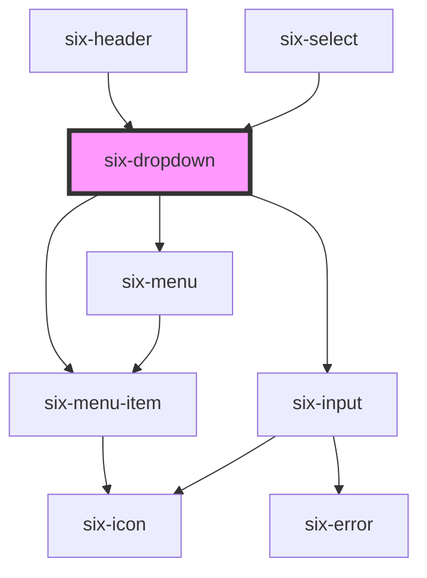

# Dropdown


## Dropdown

Dropdowns expose additional content that "drops down" in a panel.

Dropdowns consist of a trigger and a panel. By default, activating the trigger will expose the panel and interacting outside of the panel will close it. The API gives you complete control over showing, hiding, and positioning the panel.

Dropdowns are designed to work well with [menus](six-menu.html) to provide a list of actions the user can trigger. If you're looking for a component to provide some options inside a form, you should have a look at [six-select](six-select.html).

<docs-demo-six-dropdown-0></docs-demo-six-dropdown-0>

```html
<six-dropdown>
  <six-avatar             image="https://images.unsplash.com/photo-1559715541-5daf8a0296d0?ixid=MnwxMjA3fDB8MHxwaG90by1wYWdlfHx8fGVufDB8fHx8&ixlib=rb-1.2.1&auto=format&fit=crop&w=1792&q=80"
    slot="trigger"
  ></six-avatar>
  <six-menu>
    <six-menu-item>Dropdown Item 1</six-menu-item>
    <six-menu-item>Dropdown Item 2</six-menu-item>
    <six-menu-item>Dropdown Item 3</six-menu-item>
    <six-menu-divider></six-menu-divider>
    <six-menu-item checked>Checked</six-menu-item>
    <six-menu-item disabled>Disabled</six-menu-item>
    <six-menu-divider></six-menu-divider>
    <six-menu-item>
      Prefix
      <six-icon slot="prefix">favorite</six-icon>
    </six-menu-item>
    <six-menu-item>
      Suffix Icon
      <six-icon slot="suffix">face</six-icon>
    </six-menu-item>
  </six-menu>
</six-dropdown>
```


## Demos

### Text Only Button

Of course the trigger button can be just a link button as well

<docs-demo-six-dropdown-1></docs-demo-six-dropdown-1>

```html
<six-dropdown placement="top-start">
  <six-button type="link" caret slot="trigger">Edit</six-button>
  <six-menu>
    <six-menu-item>Cut</six-menu-item>
    <six-menu-item>Copy</six-menu-item>
    <six-menu-item>Paste</six-menu-item>
    <six-menu-divider></six-menu-divider>
    <six-menu-item>Find</six-menu-item>
    <six-menu-item>Replace</six-menu-item>
  </six-menu>
</six-dropdown>
```


### Placement

The preferred placement of the dropdown can be set with the `placement` attribute. Note that the actual position may vary to ensure the panel remains in the viewport.

<docs-demo-six-dropdown-2></docs-demo-six-dropdown-2>

```html
<six-dropdown placement="top-start">
  <six-button slot="trigger" caret>Edit</six-button>
  <six-menu>
    <six-menu-item>Cut</six-menu-item>
    <six-menu-item>Copy</six-menu-item>
    <six-menu-item>Paste</six-menu-item>
    <six-menu-divider></six-menu-divider>
    <six-menu-item>Find</six-menu-item>
    <six-menu-item>Replace</six-menu-item>
  </six-menu>
</six-dropdown>
```


### Distance

The distance from the panel to the trigger can be customized using the `distance` attribute. This value is specified in pixels.

<docs-demo-six-dropdown-3></docs-demo-six-dropdown-3>

```html
<six-dropdown distance="30">
  <six-button slot="trigger" caret>Edit</six-button>
  <six-menu>
    <six-menu-item>Cut</six-menu-item>
    <six-menu-item>Copy</six-menu-item>
    <six-menu-item>Paste</six-menu-item>
    <six-menu-divider></six-menu-divider>
    <six-menu-item>Find</six-menu-item>
    <six-menu-item>Replace</six-menu-item>
  </six-menu>
</six-dropdown>
```


### Skidding

The offset of the panel along the trigger can be customized using the `skidding` attribute. This value is specified in pixels.

<docs-demo-six-dropdown-4></docs-demo-six-dropdown-4>

```html
<six-dropdown skidding="30">
  <six-button slot="trigger" caret>Edit</six-button>
  <six-menu>
    <six-menu-item>Cut</six-menu-item>
    <six-menu-item>Copy</six-menu-item>
    <six-menu-item>Paste</six-menu-item>
    <six-menu-divider></six-menu-divider>
    <six-menu-item>Find</six-menu-item>
    <six-menu-item>Replace</six-menu-item>
  </six-menu>
</six-dropdown>
```


### Hoisting

Dropdown panels will be clipped if they're inside a container that has `overflow: auto|hidden`. The `hoist` attribute forces the panel to use a fixed positioning strategy, allowing it to break out of the container. In this case, the panel will be positioned relative to its containing block, which is usually the viewport unless an ancestor uses a `transform`, `perspective`, or `filter`.

<docs-demo-six-dropdown-5></docs-demo-six-dropdown-5>

```html
<div class="dropdown-hoist">
  <six-dropdown>
    <six-button slot="trigger" caret>No Hoist</six-button>
    <six-menu>
      <six-menu-item>Item 1</six-menu-item>
      <six-menu-item>Item 2</six-menu-item>
      <six-menu-item>Item 3</six-menu-item>
    </six-menu>
  </six-dropdown>

  <six-dropdown hoist>
    <six-button slot="trigger" caret>Hoist</six-button>
    <six-menu>
      <six-menu-item>Item 1</six-menu-item>
      <six-menu-item>Item 2</six-menu-item>
      <six-menu-item>Item 3</six-menu-item>
    </six-menu>
  </six-dropdown>
</div>

<style>
  .dropdown-hoist {
    border: solid 2px var(--six-panel-border-color);
    padding: var(--six-spacing-medium);
    overflow: hidden;
  }
</style>
```


### Getting the Selected Item

When dropdowns are used with [menus](six-menu.html), you can listen for the `six-select` event to determine which menu item was selected. The menu item element will be exposed in `event.detail.item`. You can set `value` props to make it easier to identify commands.

<docs-demo-six-dropdown-6></docs-demo-six-dropdown-6>

```html
<div class="dropdown-selection">
  <six-dropdown>
    <six-button slot="trigger" caret>Edit</six-button>
    <six-menu>
      <six-menu-item value="cut">Cut</six-menu-item>
      <six-menu-item value="copy">Copy</six-menu-item>
      <six-menu-item value="paste">Paste</six-menu-item>
    </six-menu>
  </six-dropdown>
</div>

<script type="module">
  const container0 = document.querySelector('.dropdown-selection');
  const dropdown = container0.querySelector('six-dropdown');

  dropdown.addEventListener('six-menu-item-selected', (event) => {
    let selectedItem = event.detail.item;
    console.log(selectedItem.value);
  });
</script>
```


Alternatively, you can listen for the `click` event on individual menu items. Note that, using this approach, disabled menu items will still emit a `click` event.

<docs-demo-six-dropdown-7></docs-demo-six-dropdown-7>

```html
<div class="dropdown-selection-alt">
  <six-dropdown>
    <six-button slot="trigger" caret>Edit</six-button>
    <six-menu>
      <six-menu-item id="cut" value="cut">Cut</six-menu-item>
      <six-menu-item id="copy" value="copy">Copy</six-menu-item>
      <six-menu-item id="paste" value="paste">Paste</six-menu-item>
    </six-menu>
  </six-dropdown>
</div>

<script type="module">
  const container1 = document.querySelector('.dropdown-selection-alt');
  const cut = container1.querySelector('#cut');
  const copy = container1.querySelector('#copy');
  const paste = container1.querySelector('#paste');

  cut.addEventListener('click', () => console.log('cut'));
  copy.addEventListener('click', () => console.log('copy'));
  paste.addEventListener('click', () => console.log('paste'));
</script>
```


### Using an avatar as a trigger

You can use any arbitrary content as trigger element, however it needs to be tabbable (tabIndex > -1)

<docs-demo-six-dropdown-8></docs-demo-six-dropdown-8>

```html
<div class="dropdown-selection">
  <six-dropdown>
    <six-avatar               image="https://images.unsplash.com/photo-1529778873920-4da4926a72c2?ixlib=rb-1.2.1&auto=format&fit=crop&w=300&q=80"
      slot="trigger"
    ></six-avatar>
    <six-menu>
      <six-menu-item value="cut">Cut</six-menu-item>
      <six-menu-item value="copy">Copy</six-menu-item>
      <six-menu-item value="paste">Paste</six-menu-item>
    </six-menu>
  </six-dropdown>
</div>
```


### Enable Filtering Items

You can filter the the items shown by simply adding `filter` to six-dropdown

You can also pass a custom placeholder with `filter-placeholder` to be shown in the filter input field (will be 'Filter...' by default)

If you want to change the default debounce timeout use e.g. `filter-debounce="500"`

<docs-demo-six-dropdown-9></docs-demo-six-dropdown-9>

```html
<six-dropdown filter filter-placeholder="Search">
  <six-button slot="trigger" caret>Dropdown</six-button>
  <six-menu>
    <six-menu-item value="AUSTRALIA">Australia</six-menu-item>
    <six-menu-item value="BRAZIL">Brazil</six-menu-item>
    <six-menu-item value="CHINA">China</six-menu-item>
    <six-menu-item value="EGYPT">Egypt</six-menu-item>
    <six-menu-item value="FRANCE">France</six-menu-item>
    <six-menu-item value="GERMANY">Germany</six-menu-item>
    <six-menu-item value="INDIA">India</six-menu-item>
    <six-menu-item value="JAPAN">Japan</six-menu-item>
    <six-menu-item value="SPAIN">Spain</six-menu-item>
    <six-menu-item value="UNITED_STATES">United States</six-menu-item>
  </six-menu>
</six-dropdown>
```


### Async Filtering

You might have a usecase where the full list of of items in the dropdown would be too large and you need to call a backend when filtering the dropdown

In such a scenario simply add the `async-filter` attribute to your dropdown component

If you want to change the default debounce timeout use e.g. `filter-debounce="500"`

<docs-demo-six-dropdown-10></docs-demo-six-dropdown-10>

```html
<six-dropdown id="async-dropdown" async-filter filter-placeholder="Search">
  <six-button slot="trigger" caret>Dropdown</six-button>
  <six-menu id="async-menu">
    <six-menu-item value="search_list_prompt">Use search to show entries</six-menu-item>
  </six-menu>
</six-dropdown>
<script type="module">
  const asyncDropdown = document.querySelector('#async-dropdown');
  const asyncMenu = document.querySelector('#async-menu');

  for (let i = 0; i < 500; i++) {
    const child = document.createElement('six-menu-item');
    child.innerText = `Value ${i}`;
    child.value = `value-${i}`;
    asyncMenu.appendChild(child);
  }

  const removeAllChildNodes = (parent) => {
    while (parent.firstChild) {
      parent.removeChild(parent.firstChild);
    }
  };

  asyncDropdown.addEventListener('six-async-filter-fired', ($event) => {
    const filterValue = $event.detail.filterValue;

    removeAllChildNodes(asyncMenu);

    const numberOfHits = Math.floor(Math.random() * 25) + 3;
    for (let i = 0; i < numberOfHits; i++) {
      const child = document.createElement('six-menu-item');
      child.innerText = `Value ${filterValue} ${i}`;
      child.value = `value-${filterValue}-${i}`;
      asyncMenu.appendChild(child);
    }
  });
</script>
```


### Infinite Scrolling

If you have huge amounts of data you want to present in the dropdown you can't render all at once or it will crash your browser. For these usescases listen to the scroll event to decide which data to present

<docs-demo-six-dropdown-11></docs-demo-six-dropdown-11>

```html
<six-dropdown id="infinite-scoll-dropdown">
  <six-button slot="trigger" caret>Dropdown</six-button>
  <six-menu id="infinite-scroll-menu"> </six-menu>
</six-dropdown>
<script type="module">
  const asyncDropdown = document.querySelector('#infinite-scoll-dropdown');
  const asyncMenu = document.querySelector('#infinite-scroll-menu');

  let id = 0;

  for (let i = 0; i < 20; i++) {
    const child = document.createElement('six-menu-item');
    child.innerText = `Value ${id}`;
    child.value = `value-${id}`;
    asyncMenu.appendChild(child);
    id++;
  }

  asyncDropdown.addEventListener('six-dropdown-scroll', ($event) => {
    const { scrollRatio } = $event.detail;

    // add new elements once we reach almost bottom
    if (scrollRatio > 0.8) {
      for (let i = 0; i < 20; i++) {
        const child = document.createElement('six-menu-item');
        child.innerText = `Value ${id}`;
        child.value = `value-${id}`;
        asyncMenu.appendChild(child);
        id++;
      }
    }
  });
</script>
```


## Passing items via options attribute

If you don't want to create a `six-menu-item` but simply want to pass an array with all options, you can do so via the `options` attribute.

<docs-demo-six-dropdown-12></docs-demo-six-dropdown-12>

```html
<six-dropdown id="six-dropdown-dynamic-options">
  <six-button slot="trigger" caret>Dropdown</six-button>
</six-dropdown>
<script type="module">
  const sixDropdownDynamicOptions = document.getElementById('six-dropdown-dynamic-options');
  sixDropdownDynamicOptions.options = Array.from(Array(100).keys()).map((idx) => ({
    label: `label ${idx}`,
    value: `value ${idx}`,
  }));
</script>
```


## Virtual scrolling

If you have a lot of items in the menu (40'000 in the following example), rendering all of them might lead to some performance issues. To avoid such issues use `virtual-scroll`

<docs-demo-six-dropdown-13></docs-demo-six-dropdown-13>

```html
<six-dropdown id="six-dropdown-virtual-scrolling" virtual-scroll>
  <six-button slot="trigger" caret>Dropdown</six-button>
</six-dropdown>
<script type="module">
  const sixDropdownVirtualScrolling = document.getElementById('six-dropdown-virtual-scrolling');
  sixDropdownVirtualScrolling.options = Array.from(Array(40000).keys()).map((idx) => ({
    label: `label ${idx}`,
    value: `value ${idx}`,
  }));
</script>
<style>
  six-dropdown::part(menu) {
    min-width: 160px;
  }
</style>
```


### Virtual scrolling with filter

To make your virtually scrolled list filterable simply add the `filter` attribute

<docs-demo-six-dropdown-14></docs-demo-six-dropdown-14>

```html
<six-dropdown id="six-dropdown-virtual-scrolling-filtered" virtual-scroll filter>
  <six-button slot="trigger" caret>Dropdown</six-button>
</six-dropdown>
<script type="module">
  const sixDropdownVirtualScrolling = document.getElementById('six-dropdown-virtual-scrolling-filtered');
  sixDropdownVirtualScrolling.options = Array.from(Array(40000).keys()).map((idx) => ({
    label: `label ${idx}`,
    value: `value ${idx}`,
  }));

  sixDropdownVirtualScrolling.addEventListener('six-menu-item-selected', (e) =>
    alert(`selected ${e.detail.name}`)
  );
</script>
<style>
  six-dropdown::part(menu) {
    min-width: 160px;
  }
</style>
```


<!-- Auto Generated Below -->


## Properties

| Property                     | Attribute                         | Description                                                                                                                                                                                                                                                           | Type                                                                                                                                                                 | Default                 |
| ---------------------------- | --------------------------------- | --------------------------------------------------------------------------------------------------------------------------------------------------------------------------------------------------------------------------------------------------------------------- | -------------------------------------------------------------------------------------------------------------------------------------------------------------------- | ----------------------- |
| `asyncFilter`                | `async-filter`                    | Set to true to allow async filtering. When you enter something in the search field the component will only emit an event but not filter any elements itself. You can then simply listen to the 'six-async-filter-fired' event to manage the shown menu-items yourself | `boolean`                                                                                                                                                            | `false`                 |
| `autofocusFilter`            | `autofocus-filter`                | By default the search field will be focused when opening a dropdown with filtering enabled.                                                                                                                                                                           | `boolean`                                                                                                                                                            | `true`                  |
| `closeOnSelect`              | `close-on-select`                 | Determines whether the dropdown should hide when a menu item is selected.                                                                                                                                                                                             | `boolean`                                                                                                                                                            | `true`                  |
| `containingElement`          | --                                | The dropdown will close when the user interacts outside of this element (e.g. clicking).                                                                                                                                                                              | `HTMLElement \| undefined`                                                                                                                                           | `undefined`             |
| `disableHideOnEnterAndSpace` | `disable-hide-on-enter-and-space` | The panel can be opend/closed by pressing the spacebar or the enter key. In some cases you might want to avoid this                                                                                                                                                   | `boolean`                                                                                                                                                            | `false`                 |
| `distance`                   | `distance`                        | The distance in pixels from which to offset the panel away from its trigger.                                                                                                                                                                                          | `number`                                                                                                                                                             | `0`                     |
| `filter`                     | `filter`                          | Set to true to allow auto filtering for entries in the dropdown. With this flag the dropdown will automatically filter itsel. If you need to coordinate the shown elements yourself, e.g. because you need to call an endpoint use asyncFilter instead                | `boolean`                                                                                                                                                            | `false`                 |
| `filterDebounce`             | `filter-debounce`                 | The debounce for the filter callbacks.                                                                                                                                                                                                                                | `number`                                                                                                                                                             | `DEFAULT_DEBOUNCE_FAST` |
| `filterPlaceholder`          | `filter-placeholder`              | The filter's placeholder text.                                                                                                                                                                                                                                        | `string`                                                                                                                                                             | `'Filter...'`           |
| `hoist`                      | `hoist`                           | Enable this option to prevent the panel from being clipped when the component is placed inside a container with `overflow: auto\|scroll`.                                                                                                                             | `boolean`                                                                                                                                                            | `false`                 |
| `open`                       | `open`                            | Indicates whether the dropdown is open. You can use this in lieu of the show/hide methods.                                                                                                                                                                            | `boolean`                                                                                                                                                            | `false`                 |
| `options`                    | --                                | Set the options to be shown in the dropdown (alternative to setting the elements via html)                                                                                                                                                                            | `SixMenuItemData[]`                                                                                                                                                  | `[]`                    |
| `placement`                  | `placement`                       | The preferred placement of the dropdown panel. Note that the actual placement may vary as needed to keep the panel inside the viewport.                                                                                                                               | `"bottom" \| "bottom-end" \| "bottom-start" \| "left" \| "left-end" \| "left-start" \| "right" \| "right-end" \| "right-start" \| "top" \| "top-end" \| "top-start"` | `'bottom-start'`        |
| `skidding`                   | `skidding`                        | The distance in pixels from which to offset the panel along its trigger.                                                                                                                                                                                              | `number`                                                                                                                                                             | `0`                     |
| `virtualScroll`              | `virtual-scroll`                  | Defines whether the menu list will be rendered virtually i.e. only the elements actually shown (and a couple around) are actually rendered in the DOM. If you use virtual scrolling pass the elements via prop instead of via slot.                                   | `boolean`                                                                                                                                                            | `false`                 |


## Events

| Event                            | Description                                                                                           | Type                                         |
| -------------------------------- | ----------------------------------------------------------------------------------------------------- | -------------------------------------------- |
| `six-async-filter-fired`         | Emitted when the async filter is triggered                                                            | `CustomEvent<SixDropdownAsyncFilterPayload>` |
| `six-dropdown-after-hide`        | Emitted after the dropdown closes and all transitions are complete.                                   | `CustomEvent<undefined>`                     |
| `six-dropdown-after-show`        | Emitted after the dropdown opens and all transitions are complete.                                    | `CustomEvent<undefined>`                     |
| `six-dropdown-auto-filter-fired` | Emitted when the auto filter is triggered                                                             | `CustomEvent<SixDropdownAutoFilterPayload>`  |
| `six-dropdown-hide`              | Emitted when the dropdown closes. Calling `event.preventDefault()` will prevent it from being closed. | `CustomEvent<undefined>`                     |
| `six-dropdown-scroll`            | Emitted when the user scrolls inside dropdown panel.                                                  | `CustomEvent<SixDropdownScrollPayload>`      |
| `six-dropdown-show`              | Emitted when the dropdown opens. Calling `event.preventDefault()` will prevent it from being opened.  | `CustomEvent<undefined>`                     |


## Methods

### `hide() => Promise<void>`

Hides the dropdown panel

#### Returns

Type: `Promise<void>`


### `reposition() => Promise<void>`

Instructs the dropdown menu to reposition. Useful when the position or size of the trigger changes when the menu
is activated.

#### Returns

Type: `Promise<void>`


### `show() => Promise<void>`

Shows the dropdown panel

#### Returns

Type: `Promise<void>`


## Slots

| Slot        | Description                                               |
| ----------- | --------------------------------------------------------- |
|             | The dropdown's content.                                   |
| `"trigger"` | The dropdown's trigger, usually a `<six-button>` element. |


## Shadow Parts

| Part        | Description                                          |
| ----------- | ---------------------------------------------------- |
| `"base"`    | The component's base wrapper.                        |
| `"menu"`    |                                                      |
| `"panel"`   | The panel that gets shown when the dropdown is open. |
| `"trigger"` | The container that wraps the trigger.                |


## Dependencies

### Used by

 - [six-header](six-header.html)
 - [six-select](six-select.html)

### Depends on

- [six-menu-item](six-menu-item.html)
- [six-input](six-input.html)
- [six-menu](six-menu.html)

### Graph


----------------------------------------------

Copyright © 2021-present SIX-Group
