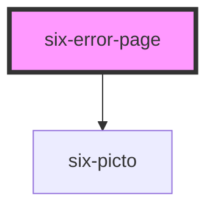

# Error Pages


The `six-error-page` can be used to show the different errors.

## Error Pages

Set attribute `error-code` to show proper error page.

### Default Errors

## Forbidden Access

<docs-demo-six-error-page-0></docs-demo-six-error-page-0>

```html
<six-error-page error-code="403" language="en"></six-error-page>
<six-error-page error-code="403" language="de"></six-error-page>
```


## Not Found

<docs-demo-six-error-page-1></docs-demo-six-error-page-1>

```html
<six-error-page error-code="404" language="en"></six-error-page>
<six-error-page error-code="404" language="de"></six-error-page>
```


## Internal Server Error

<docs-demo-six-error-page-2></docs-demo-six-error-page-2>

```html
<six-error-page error-code="500" language="en"></six-error-page>
<six-error-page error-code="500" language="de"></six-error-page>
```


### Custom Error Message

<docs-demo-six-error-page-3></docs-demo-six-error-page-3>

```html
<six-error-page custom-title="my title" id="custom-error-message" custom-icon="home"></six-error-page>
<script type="module">
  const sixErrorPage = document.getElementById('custom-error-message');
  sixErrorPage.customDescription = ['My', 'Description'];
</script>
```


<!-- Auto Generated Below -->


## Properties

| Property            | Attribute            | Description                                                                        | Type                             | Default     |
| ------------------- | -------------------- | ---------------------------------------------------------------------------------- | -------------------------------- | ----------- |
| `customDescription` | `custom-description` | Defines a custom description.                                                      | `string[] \| undefined`          | `undefined` |
| `customIcon`        | `custom-icon`        | Defines a custom icon.                                                             | `string \| undefined`            | `undefined` |
| `customTitle`       | `custom-title`       | Defines a custom title.                                                            | `string \| undefined`            | `undefined` |
| `errorCode`         | `error-code`         | Defines error Code and thus displays the proper error page.                        | `403 \| 404 \| 500 \| undefined` | `undefined` |
| `language`          | `language`           | Defines language and thus displays the proper error page in the selected language. | `"de" \| "en"`                   | `'en'`      |


## Shadow Parts

| Part               | Description |
| ------------------ | ----------- |
| `"container"`      |             |
| `"description"`    |             |
| `"icon"`           |             |
| `"icon-container"` |             |
| `"title"`          |             |


## Dependencies

### Depends on

- [six-picto](six-picto.html)

### Graph


----------------------------------------------

Copyright © 2021-present SIX-Group
