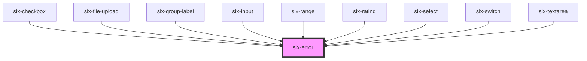

# Error


## Error

Simple error container for forms. Used in the `error-text` slot for multiple input-based components. Its a convenience component which should't be needed outside of the slot usage

<docs-demo-six-error-0></docs-demo-six-error-0>

```html
<six-error>This is an error</six-error>
```


<!-- Auto Generated Below -->


## Slots

| Slot        | Description                 |
| ----------- | --------------------------- |
| `"default"` | The error's message content |


## Dependencies

### Used by

 - [six-checkbox](six-checkbox.html)
 - [six-file-upload](six-file-upload.html)
 - [six-group-label](six-group-label.html)
 - [six-input](six-input.html)
 - [six-range](six-range.html)
 - [six-rating](six-rating.html)
 - [six-select](six-select.html)
 - [six-switch](six-switch.html)
 - [six-textarea](six-textarea.html)

### Graph


----------------------------------------------

Copyright © 2021-present SIX-Group
