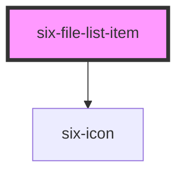

# six-file-list-item


## File List Item

A `six-file-list-item` can be used within a `six-file-list` and in compination with `six-file-upload`

### Showing the file name

Use the `identifier` attribute to set an id (will be returned when trying to download or delete a file) and the `name` attribute to set the name (will be shown in the UI)

<docs-demo-six-file-list-item-104></docs-demo-six-file-list-item-104>

```html
<six-file-list-item identifier="id1" name="file_1.pdf"></six-file-list-item>
```


### Showing the upload date

You can use `date` attribute to show when the file has been uploaded

<docs-demo-six-file-list-item-105></docs-demo-six-file-list-item-105>

```html
<six-file-list-item identifier="id_2" name="file_2.pdf" date="23.09.2021, 09:12"></six-file-list-item>
```


### Showing File Size

You can show the file size in KB. Use the `size` attribute. The number you provide will be divided by 1024 and rounded

<docs-demo-six-file-list-item-106></docs-demo-six-file-list-item-106>

```html
<six-file-list-item           identifier="id_3"
  name="file_3.pdf"
  date="03.12.2021, 10:22"
  size="75680"
></six-file-list-item>
```


### Disabling download

If you don't want the file to be downloadable simply set the `nodownload` attribute

<docs-demo-six-file-list-item-107></docs-demo-six-file-list-item-107>

```html
<six-file-list-item           identifier="id_4"
  name="file_4.pdf"
  date="02.10.2021, 12:25"
  size="77590"
  nodownload
></six-file-list-item>
```


### Disabling Deletion

If you don't want the file to be deletable, simply set the `nodelete` attribute

<docs-demo-six-file-list-item-108></docs-demo-six-file-list-item-108>

```html
<six-file-list-item           identifier="id_5"
  name="file_5.pdf"
  date="11.07.2021, 10:32"
  size="72040"
  nodelete
></six-file-list-item>
```


<!-- Auto Generated Below -->


## Properties

| Property     | Attribute    | Description                                                                   | Type                  | Default     |
| ------------ | ------------ | ----------------------------------------------------------------------------- | --------------------- | ----------- |
| `date`       | `date`       | The date when the file was uploaded                                           | `string`              | `''`        |
| `identifier` | `identifier` | An id to clearly identify the file                                            | `string`              | `''`        |
| `name`       | `name`       | The filename                                                                  | `string`              | `''`        |
| `nodelete`   | `nodelete`   | Set to true if you don't want to allow to delete this file                    | `boolean`             | `false`     |
| `nodownload` | `nodownload` | Set to true if you don't want to allow to download this file                  | `boolean`             | `false`     |
| `size`       | `size`       | The file size. This number will be divided by 1024 to show the filesize in KB | `number \| undefined` | `undefined` |


## Events

| Event                         | Description                 | Type                                      |
| ----------------------------- | --------------------------- | ----------------------------------------- |
| `six-file-list-item-download` | Triggered on file download. | `CustomEvent<SixFileListDownloadPayload>` |
| `six-file-list-item-remove`   | Triggered on file remove.   | `CustomEvent<SixFileListRemovePayload>`   |


## Dependencies

### Depends on

- [six-icon](six-icon.html)

### Graph


----------------------------------------------

Copyright © 2021-present SIX-Group
