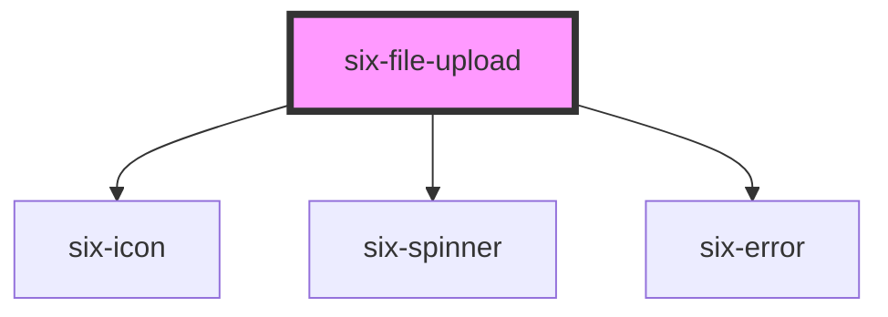

# File Upload


## Simple File Upload

<docs-demo-six-file-upload-0></docs-demo-six-file-upload-0>

```html
<six-file-upload id="six-file-upload-success-id"></six-file-upload>
<six-file-list id="six-file-list"> </six-file-list>

<script type="module">
  const fileUpload = document.getElementById('six-file-upload-success-id');
  const fileList = document.getElementById('six-file-list');
  let counter = 0;

  fileUpload.addEventListener('six-file-upload-success', ({ detail }) => {
    const file = detail.file;

    const item = Object.assign(document.createElement('six-file-list-item'), {
      id: String(counter++),
      name: file.name,
      size: file.size,
      date: new Date().toLocaleDateString(),
    });

    item.addEventListener('six-file-list-item-remove', ({ detail }) => {
      const childToRemove = fileList.querySelector(`[name="${detail.name}"]`);
      fileList.removeChild(childToRemove);
    });

    item.addEventListener('six-file-list-item-download', ({ detail }) => {
      alert(`download file ${detail.name}`);
    });

    fileList.append(item);
  });

  const showEvent = ({ type, detail }) => alert(`[ ${type} ] ${detail.reason}`);
  fileUpload.addEventListener('six-file-upload-failure', showEvent);
</script>
```


### Multiple File Upload

You can upload multiple files via the `multiple` attribute.

<docs-demo-six-file-upload-1></docs-demo-six-file-upload-1>

```html
<six-file-upload id="six-file-upload-success-id-2" multiple></six-file-upload>
<six-file-list id="six-file-list-2"> </six-file-list>

<script type="module">
  const fileUpload = document.getElementById('six-file-upload-success-id-2');
  const fileList = document.getElementById('six-file-list-2');
  let counter = 0;

  fileUpload.addEventListener('six-file-upload-success', ({ detail }) => {
    const files = detail.files;

    for (const file of files) {
      const item = Object.assign(document.createElement('six-file-list-item'), {
        id: String(counter++),
        name: file.name,
        size: file.size,
        date: new Date().toLocaleDateString(),
      });

      item.addEventListener('six-file-list-item-remove', ({ detail }) => {
        const childToRemove = fileList.querySelector(`[name="${detail.name}"]`);
        fileList.removeChild(childToRemove);
      });

      item.addEventListener('six-file-list-item-download', ({ detail }) => {
        alert(`download file ${detail.name}`);
      });

      fileList.append(item);
    }
  });

  const showEvent = ({ type, detail }) => alert(`[ ${type} ] ${detail.reason}`);
  fileUpload.addEventListener('six-file-upload-failure', showEvent);
</script>
```


### Label

You can define a custom label via the `label` attribute

<docs-demo-six-file-upload-2></docs-demo-six-file-upload-2>

```html
<six-file-upload label="some custom label"></six-file-upload>
```


### Disabled File Upload

<docs-demo-six-file-upload-3></docs-demo-six-file-upload-3>

```html
<six-file-upload disabled></six-file-upload>
```


### Compact File Upload

<docs-demo-six-file-upload-4></docs-demo-six-file-upload-4>

```html
<six-file-upload compact></six-file-upload>
```


### Uploading

<docs-demo-six-file-upload-5></docs-demo-six-file-upload-5>

```html
<six-file-upload uploading></six-file-upload>
```


### Invalid with error text

The `error-text` prop accepts either a simple string message, or a list of messages. If `invalid`, all of them will be displayed.

<docs-demo-six-file-upload-6></docs-demo-six-file-upload-6>

```html
<six-file-upload           id="invalid-with-errors"
  invalid
  error-text="This is a simple string message"
></six-file-upload>
<script type="module">
  const sixInput = document.getElementById('invalid-with-errors');
  sixInput.errorText = ['File is too large', 'Message 2'];
  sixInput.errorTextCount = 3;
</script>
```


### Invalid with error slot

When using the `error-text` slot, it is recommended to use the `six-error` component to wrap the error message(s). This will provide the correct styling out of the box.

<docs-demo-six-file-upload-7></docs-demo-six-file-upload-7>

```html
<six-file-upload invalid="false">
  <div slot="error-text">
    <six-error               >An error message
      <a href="https://github.com/six-group/six-webcomponents" target="_blank">with a link</a></six-error>
  </div>
</six-file-upload>
```


<!-- Auto Generated Below -->


## Properties

| Property      | Attribute       | Description                                                                                                      | Type                  | Default     |
| ------------- | --------------- | ---------------------------------------------------------------------------------------------------------------- | --------------------- | ----------- |
| `accept`      | `accept`        | Accepted MIME-Types.                                                                                             | `string \| undefined` | `undefined` |
| `compact`     | `compact`       | Set to true if file control should be small.                                                                     | `boolean`             | `false`     |
| `disabled`    | `disabled`      | Set when button is disabled.                                                                                     | `boolean`             | `false`     |
| `errorText`   | `error-text`    | The error message shown, if `invalid` is set to true.                                                            | `string \| string[]`  | `''`        |
| `invalid`     | `invalid`       | If this property is set to true and an error message is provided by `errorText`, the error message is displayed. | `boolean`             | `false`     |
| `label`       | `label`         | Label of the drop area.                                                                                          | `string \| undefined` | `undefined` |
| `maxFileSize` | `max-file-size` | Allowed max file size in bytes.                                                                                  | `number \| undefined` | `undefined` |
| `multiple`    | `multiple`      | More than one file allowed.                                                                                      | `boolean`             | `false`     |
| `uploading`   | `uploading`     | Set to true to draw the control in a loading state.                                                              | `boolean`             | `false`     |


## Events

| Event                     | Description                                                              | Type                                         |
| ------------------------- | ------------------------------------------------------------------------ | -------------------------------------------- |
| `six-file-upload-failure` | Triggers when an uploaded file doesn't match MIME type or max file size. | `CustomEvent<SixFileUploadFailurePayload>`   |
| `six-file-upload-success` | Triggers when a file is added.                                           | `CustomEvent<IMultipleFiles \| ISingleFile>` |


## Slots

| Slot           | Description                                                                                                 |
| -------------- | ----------------------------------------------------------------------------------------------------------- |
| `"error-text"` | Error text that is shown when the status is set to invalid. Alternatively, you can use the error-text prop. |


## Dependencies

### Depends on

- [six-icon](six-icon.html)
- [six-spinner](six-spinner.html)
- [six-error](six-error.html)

### Graph


----------------------------------------------

Copyright © 2021-present SIX-Group
