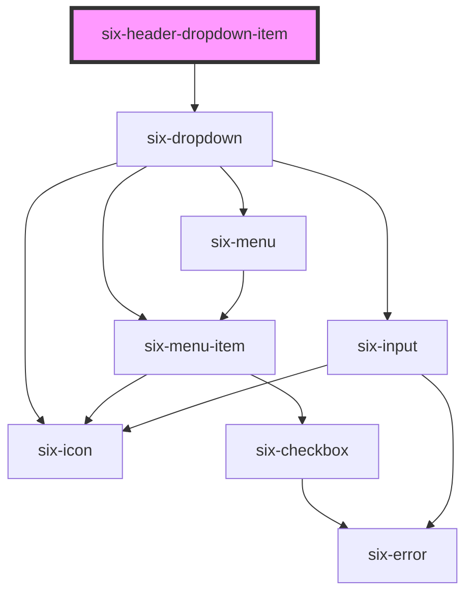

# six-header


## Header Dropdown Item

Header dropdown items provide dropdown elements in the header. Sets the active flag (bottom border) when the dropdown is open.

<docs-demo-six-header-dropdown-item-0></docs-demo-six-header-dropdown-item-0>

```html
<six-header custom>
  <six-header-item>
    <six-logo></six-logo>
  </six-header-item>

  <six-header-dropdown-item>
    <six-icon-button slot="trigger" name="settings"></six-icon-button>
    <six-menu>
      <six-menu-item>Option A</six-menu-item>
      <six-menu-item>Option B</six-menu-item>
      <six-menu-item>Option C</six-menu-item>
    </six-menu>
  </six-header-dropdown-item>
</six-header>
```


<!-- Auto Generated Below -->


## Dependencies

### Depends on

- [six-dropdown](six-dropdown.html)

### Graph


----------------------------------------------

Copyright © 2021-present SIX-Group
