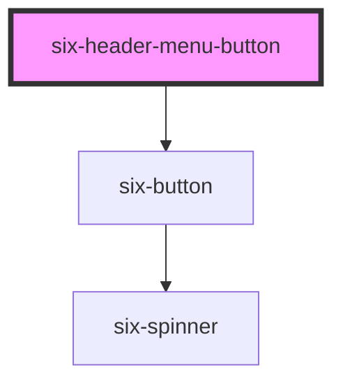

# six-header


## Header Menu Button

Header Menu button with a text and an icon. Usually used for dropdowns.

<docs-demo-six-header-menu-button-0></docs-demo-six-header-menu-button-0>

```html
<six-header>
  <six-header-dropdown-item>
    <six-header-menu-button slot="trigger"
      >App 1 <six-icon slot="suffix">apps</six-icon></six-header-menu-button>
    <six-menu>
      <six-menu-item checked>App 1</six-menu-item>
      <six-menu-item>App 2</six-menu-item>
      <six-menu-item>App 3</six-menu-item>
    </six-menu>
  </six-header-dropdown-item>
</six-header>
<script type="module">
  const menuItems = document.querySelectorAll('six-menu-item');
  const headerButton = document.querySelector('six-header-menu-button');

  menuItems.forEach((item) => {
    item.addEventListener('click', () => {
      headerButton.innerText = this.innerText;
      menuItems.forEach((item) => (item.checked = false));
      item.checked = true;
    });
  });
</script>
```


<!-- Auto Generated Below -->


## Properties

| Property   | Attribute  | Description                                                                            | Type      | Default |
| ---------- | ---------- | -------------------------------------------------------------------------------------- | --------- | ------- |
| `caret`    | `caret`    | Set to true to draw the button with a caret for use with dropdowns, popovers, etc.     | `boolean` | `false` |
| `disabled` | `disabled` | Set to true to disable the button.                                                     | `boolean` | `false` |
| `loading`  | `loading`  | Set to true to draw the button in a loading state.                                     | `boolean` | `false` |
| `reset`    | `reset`    | Indicates if activating the button should reset the form.                              | `boolean` | `false` |
| `submit`   | `submit`   | Indicates if activating the button should submit the form. Ignored when `href` is set. | `boolean` | `false` |


## Dependencies

### Depends on

- [six-button](six-button.html)

### Graph


----------------------------------------------

Copyright © 2021-present SIX-Group
