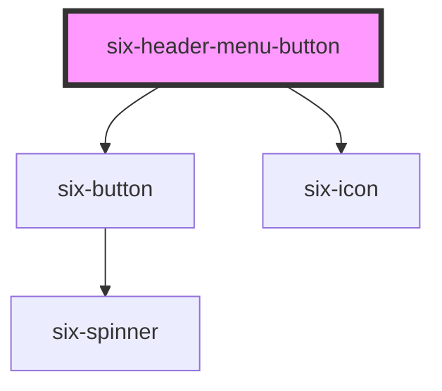

# six-header


## Header Menu Button

Header Menu button with a text and an icon. Usually used for dropdowns.

<docs-demo-six-header-menu-button-0></docs-demo-six-header-menu-button-0>

```html
<six-header custom>
  <six-header-dropdown-item>
    <six-header-menu-button slot="trigger" icon="apps">App 1</six-header-menu-button>
    <six-menu>
      <six-menu-item checked>App 1</six-menu-item>
      <six-menu-item>App 2</six-menu-item>
      <six-menu-item>App 3</six-menu-item>
    </six-menu>
  </six-header-dropdown-item>
</six-header>
<script type="module">
  const menuItems = document.querySelectorAll('six-menu-item');
  const headerButton = document.querySelector('six-header-menu-button');

  menuItems.forEach((item) => {
    item.addEventListener('click', () => {
      headerButton.innerText = this.innerText;
      menuItems.forEach((item) => (item.checked = false));
      item.checked = true;
    });
  });
</script>
```


<!-- Auto Generated Below -->


## Properties

| Property | Attribute | Description                  | Type     | Default |
| -------- | --------- | ---------------------------- | -------- | ------- |
| `icon`   | `icon`    | The icon of the menu button. | `string` | `''`    |


## Dependencies

### Depends on

- [six-button](six-button.html)
- [six-icon](six-icon.html)

### Graph


----------------------------------------------

Copyright © 2021-present SIX-Group
