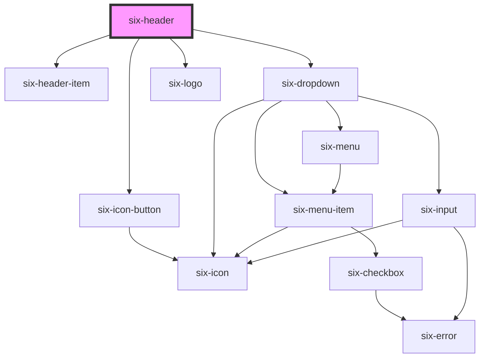

# Header


The `six-header` component is designed to be used within the `header` slot of the `six-root` component.

Compose your header using `six-header-item` and `six-header-dropdown-item` elements.

Note: Ensure that the `custom` property is set, until deprecated properties are phased out.

While the SIX logo must always appear, all other elements are optional. If additional elements are added, follow this order:

1.  Hamburger Menu
2.  SIX Logo
3.  Custom Items
4.  (--- Right-aligned elements start here ---)
5.  Search Icon
6.  Notifications
7.  App Switcher
8.  Profile

### Simple Example

Use `six-header-item` to add items. To align elements to the right, simply apply the style `margin-left: auto`. For dropdown menus, use `six-header-dropdown-item`. The dropdown item will be marked as active (with a black bottom border) when open.

<docs-demo-six-header-0></docs-demo-six-header-0>

```html
<six-header slot="header" custom>
  
  <six-header-item>
    <six-icon-button href="https://six-group.github.io/six-webcomponents/">
      <six-logo></six-logo>
    </six-icon-button>
  </six-header-item>

  
  <six-header-dropdown-item style="margin-left: auto">
    <six-icon-button slot="trigger">
      <six-avatar                 image="https://images.unsplash.com/photo-1529778873920-4da4926a72c2?ixlib=rb-1.2.1&auto=format&fit=crop&w=300&q=80"
      >
      </six-avatar>
    </six-icon-button>
    <six-menu>
      <six-menu-item>Logout</six-menu-item>
    </six-menu>
  </six-header-dropdown-item>
</six-header>
```


### Full Example

Items in `six-header` reside within a flex container. Use flex properties to adjust the width of custom elements. For instance, applying `flex: 1 0 0` will allow an element to fill the remaining space.

<docs-demo-six-header-1></docs-demo-six-header-1>

```html
<six-header slot="header" custom>
  
  <six-header-item>
    <six-icon-button name="menu"></six-icon-button>
  </six-header-item>

  
  <six-header-item>
    <six-icon-button href="https://six-group.github.io/six-webcomponents/">
      <six-logo></six-logo>
    </six-icon-button>
  </six-header-item>

  
  <six-header-item style="flex: 1 0 0">
    <six-select value="option-1" style="width: 100%">
      <six-menu-item value="option-1">Option 1</six-menu-item>
      <six-menu-item value="option-2">Option 2</six-menu-item>
      <six-menu-item value="option-3">Option 3</six-menu-item>
    </six-select>
  </six-header-item>

  
  <six-header-item id="search-header-item">
    <six-icon-button name="search"></six-icon-button>
  </six-header-item>

  
  <six-header-item>
    <six-icon-button name="notifications_none">
      <six-badge type="danger" pill>2</six-badge>
    </six-icon-button>
  </six-header-item>

  
  <six-header-dropdown-item>
    <six-header-menu-button slot="trigger" icon="apps">Custody</six-header-menu-button>
    <six-menu>
      <six-menu-item checked>Custody</six-menu-item>
      <six-menu-item>Swiss Interbank Clearing</six-menu-item>
      <six-menu-item>Tri-Party Agent</six-menu-item>
      <six-menu-item>Financial Information</six-menu-item>
    </six-menu>
  </six-header-dropdown-item>

  
  <six-header-dropdown-item>
    <six-icon-button slot="trigger">
      <six-avatar                 image="https://images.unsplash.com/photo-1529778873920-4da4926a72c2?ixlib=rb-1.2.1&auto=format&fit=crop&w=300&q=80"
      >
      </six-avatar>
    </six-icon-button>
    <six-menu>
      <six-menu-item><b>Cat Kittens</b><br>cat.kitty.kittens@themCatsBeCool.com</six-menu-item>
      <six-menu-item><b>Language</b><br><six-language-switcher></six-language-switcher></six-menu-item>
      <six-menu-item>Change password</six-menu-item>
      <six-menu-item>Logout</six-menu-item>
    </six-menu>
  </six-header-dropdown-item>

  
  <six-search-field slot="search-field" placeholder="Search for some 'a' ..." clearable>
    <div id="search-results">Some results</div>
  </six-search-field>
</six-header>

<script type="module">
  const header = document.querySelector('six-header');
  const searchHeaderItem = document.querySelector('#search-header-item');
  const searchIcon = searchHeaderItem.querySelector('six-icon-button');
  searchIcon.addEventListener('click', () => {
    header.openSearch = !header.openSearch;
    searchHeaderItem.active = header.openSearch;
  });
  header.addEventListener('click', (event) => {
    if (!searchHeaderItem.contains(event.target)) {
      header.openSearch = false;
      searchHeaderItem.active = false;
    }
  });
</script>
```


### Example using slots (Deprecated)

<docs-demo-six-header-2></docs-demo-six-header-2>

```html
<six-header show-search slot="header" shift-content>
  
  <six-search-field slot="search-field" placeholder="Search for some 'a' ..." clearable>
    <div id="search-results"></div>
  </six-search-field>

  
  <six-icon-button slot="notifications" name="notifications_none">
    <six-badge type="danger" pill>99</six-badge>
  </six-icon-button>

  
  <six-menu slot="app-switcher-menu">
    <six-menu-item checked>Custody</six-menu-item>
    <six-menu-item>Swiss Interbank Clearing</six-menu-item>
    <six-menu-item>Tri-Party Agent</six-menu-item>
    <six-menu-item>Financial Information</six-menu-item>
  </six-menu>

  
  <six-menu slot="profile-menu">
    <six-menu-item><b>Cat Kittens</b><br>cat.kitty.kittens@themCatsBeCool.com</six-menu-item>
    <six-menu-item><b>Language</b><br><six-language-switcher></six-language-switcher></six-menu-item>
    <six-menu-item>Change password</six-menu-item>
    <six-menu-item id="logout">Logout</six-menu-item>
  </six-menu>

  
  <six-avatar             image="https://images.unsplash.com/photo-1529778873920-4da4926a72c2?ixlib=rb-1.2.1&auto=format&fit=crop&w=300&q=80"
    slot="profile-avatar"
  >
  </six-avatar>

  
  <six-icon-button name="shopping_cart" ></six-icon-button>
</six-header>

<six-dialog label="Dialog" class="dialog-overview">
  <pre></pre>
  <six-button slot="footer" type="primary">Close</six-button>
</six-dialog>

<style>
  section[slot='main'] six-card {
    width: 100%;
  }

  six-search-field div article {
    background-color: var(--six-color-white);
    padding: 0.6rem;
  }
</style>

<script type="module">
  const el = Object.entries({
    header: 'six-header',
    dialog: 'six-dialog',
    dialogClose: 'six-dialog six-button',
    search: 'six-search-field',
    searchResults: 'six-search-field div',
    notifications: '[slot="notifications"]',
    notificationsBadge: 'six-badge',
    logout: '#logout',
  }).reduce((acc, [k, v]) => ({ ...acc, [k]: document.querySelector(v) }), {});

  // logging
  const log = (event) => {
    if (event.detail?.selectedLabel?.trim() === 'Language') {
      return;
    }
    el.dialog.label = event.type;
    el.dialog.querySelector('pre').innerHTML = JSON.stringify(event.detail, null, 2);
    el.dialog.show();
  };

  el.header.addEventListener('six-header-hamburger-menu-clicked', log);
  el.header.addEventListener('six-header-app-name-clicked', log);
  el.header.addEventListener('six-header-app-switcher-select', log);
  el.header.addEventListener('six-header-profile-select', log);
  el.notifications.addEventListener('click', log);

  // close dialog
  el.dialogClose.addEventListener('click', () => el.dialog.hide());

  // search
  el.search.addEventListener('six-search-field-change', ({ detail }) => {
    const term = detail.value;
    getResults(term).then((results) => {
      el.searchResults.innerHTML = results
        .map((result) => {
          const highlighted = result.replaceAll(term, `<b>${term}</b>`);
          return `<article>${highlighted} <six-button type="link">...</six-button></article>`;
        })
        .join('');
    });
  });

  const text =
    'Lorem ipsum dolor sit amet, consectetur adipisicing elit. Eligendi eveniet labore nemo nihil quae soluta sunt temporibus vitae voluptas voluptatem? Amet eius eveniet libero, minus odio officia pariatur provident tenetur.';

  const getResults = (value) => {
    const MAX_ITEMS = 3;
    const TIMEOUT = 1000;
    return new Promise((resolve) => {
      const results = value
        ? text
            .split([', '])
            .filter((item) => item.includes(value.trim()))
            .slice(0, MAX_ITEMS)
        : [];
      setTimeout(() => resolve(results), TIMEOUT);
    });
  };

  // logout
  el.logout.addEventListener('click', (event) => {
    event.stopPropagation();
    el.header.remove();
  });

  // notifications
  let count = 99;

  const updateNotifications = () =>
    setTimeout(() => {
      const delta = getRandomInt(-9, 9);
      count += count + delta >= 0 && count + delta <= 99 ? delta : 0;
      el.notificationsBadge.innerText = count;
      updateNotifications();
    }, getRandomInt(300, 3000));

  // MDN
  const getRandomInt = (min, max) => {
    min = Math.ceil(min);
    max = Math.floor(max);
    return Math.floor(Math.random() * (max - min + 1)) + min;
  };

  updateNotifications();
</script>
```


### Choose Logo (Deprecated)

You can choose between the SIX or the BME logo with `logo="six"` or `logo="bme"`.

<docs-demo-six-header-3></docs-demo-six-header-3>

```html
<six-root>
  <six-header logo="bme" show-search slot="header" shift-content></six-header>
  <section slot="main"></section>
</six-root>
```


### Custom Logo (Deprecated)

In case you don't want to use the predefined logos, you have the functionality to replace the Logo with `slot="logo"`.

<docs-demo-six-header-4></docs-demo-six-header-4>

```html
<six-root>
  <six-header show-search slot="header" shift-content>
    
  </six-header>
  <section slot="main"></section>
</six-root>
<style>
  .custom-logo {
    overflow: visible;
    height: 20px;
  }
</style>
```


### Set Search Open status (Deprecated)

You can enforce the search bar to be open or closed by setting the `open-search` property

<docs-demo-six-header-5></docs-demo-six-header-5>

```html
<six-button id="search-toggle-attribute-btn">Toggle Search via Attribute</six-button>
<six-button id="search-toggle-method-btn">Toggle Search via Method</six-button>

<six-root>
  <six-header show-search slot="header" shift-content open-search="true" id="search-toggle-header">
    <six-search-field slot="search-field" placeholder="Search for something" clearable>
      <div></div>
    </six-search-field>
  </six-header>
</six-root>

<script type="module">
  const header = document.getElementById('search-toggle-header');

  const toggleAttributeBtn = document.getElementById('search-toggle-attribute-btn');
  toggleAttributeBtn.addEventListener('click', () => {
    const currentValue = header.attributes['open-search'].value === 'true';
    header.setAttribute('open-search', String(!currentValue));
  });

  const toggleMethodBtn = document.getElementById('search-toggle-method-btn');
  toggleMethodBtn.addEventListener('click', async () => {
    const openState = await header.getIsSearchOpen();
    await header.setSearchOpenState(!openState);
  });
</script>
```


### Execute callback on logo clicked (Deprecated)

In case you want to e.g. navigate to the dashboard when the header logo is clicked simply listen to the `six-header-logo-clicked` event and set the `clickable-logo` attribute

<docs-demo-six-header-6></docs-demo-six-header-6>

```html
<six-root>
  <six-header show-search slot="header" shift-content id="clickableLogoHeader" clickable-logo> </six-header>
  <section slot="main"></section>
</six-root>
<script type="module">
  const header = document.getElementById('clickableLogoHeader');
  header.addEventListener('six-header-logo-clicked', () => {
    alert('logo clicked');
  });
</script>
```


<!-- Auto Generated Below -->


## Properties

| Property            | Attribute             | Description                                                                                                                                                                                                                              | Type             | Default |
| ------------------- | --------------------- | ---------------------------------------------------------------------------------------------------------------------------------------------------------------------------------------------------------------------------------------- | ---------------- | ------- |
| `clickableLogo`     | `clickable-logo`      | <span style="color:red">**[DEPRECATED]**</span> Use six-header `custom` property with `six-logo` instead<br/><br/>Set whether the logo should be clickable                                                                               | `boolean`        | `false` |
| `custom`            | `custom`              | Set `custom` to `true` for complete control over the header content. When enabled, all other properties and slots are ignored.  Use `six-header-item`, `six-header-dropdown-item` and `six-header-menu-button` to structure the content. | `boolean`        | `false` |
| `hideHamburgerMenu` | `hide-hamburger-menu` | <span style="color:red">**[DEPRECATED]**</span> Use six-header `custom` property instead<br/><br/>Set whether the hamburger menu should be visible or not                                                                                | `boolean`        | `false` |
| `logo`              | `logo`                | <span style="color:red">**[DEPRECATED]**</span> Use six-header `custom` property with `six-logo` instead<br/><br/>The displayed logo. Either six or bme. Defaults to six.                                                                | `"bme" \| "six"` | `'six'` |
| `openHamburgerMenu` | `open-hamburger-menu` | <span style="color:red">**[DEPRECATED]**</span> Use six-header `custom` property instead<br/><br/>Set the hamburger menu icon to open or closed state                                                                                    | `boolean`        | `false` |
| `openSearch`        | `open-search`         | Set the header search to be in an open or closed state.  If `custom` is `true`, focuses the first `six-input` found in the search slot.                                                                                                  | `boolean`        | `false` |
| `shiftContent`      | `shift-content`       | Indicates if content should be shifted down when search field is visible.                                                                                                                                                                | `boolean`        | `false` |


## Events

| Event                               | Description                                                                                                                                                                                                                      | Type                                             |
| ----------------------------------- | -------------------------------------------------------------------------------------------------------------------------------------------------------------------------------------------------------------------------------- | ------------------------------------------------ |
| `six-header-app-name-clicked`       | <span style="color:red">**[DEPRECATED]**</span> Use six-header `custom` property with `six-header-dropdown-item` and `six-header-menu-button` instead<br/><br/>Emitted when the name of the selected app is clicked.             | `CustomEvent<undefined>`                         |
| `six-header-app-switcher-select`    | <span style="color:red">**[DEPRECATED]**</span> Use six-header `custom` property with `six-header-dropdown-item` and `six-header-menu-button` instead<br/><br/>Emitted when a menu item is in the app switcher menu is selected. | `CustomEvent<SixHeaderAppSwitcherSelectPayload>` |
| `six-header-hamburger-menu-clicked` | <span style="color:red">**[DEPRECATED]**</span> Use six-header `custom` property instead<br/><br/>Emitted when the hamburger menu is clicked.                                                                                    | `CustomEvent<undefined>`                         |
| `six-header-logo-clicked`           | <span style="color:red">**[DEPRECATED]**</span> Use six-header `custom` property instead<br/><br/>Emitted when the header logo is clicked.                                                                                       | `CustomEvent<undefined>`                         |
| `six-header-profile-select`         | <span style="color:red">**[DEPRECATED]**</span> Use six-header `custom` property with `six-header-dropdown-item` and `six-avatar` instead<br/><br/>Emitted when a menu item is in the profile menu is selected.                  | `CustomEvent<SixHeaderProfileSelectPayload>`     |
| `six-header-search-field-toggle`    | <span style="color:red">**[DEPRECATED]**</span> Use six-header `custom` property instead<br/><br/>Emitted when search field is toggled.                                                                                          | `CustomEvent<SixHeaderSearchFieldToggle>`        |


## Methods

### `getIsSearchOpen() => Promise<boolean>`

<span style="color:red">**[DEPRECATED]**</span> Use six-header `custom` property instead<br/><br/>Get open state for search

#### Returns

Type: `Promise<boolean>`


### `setSearchOpenState(openState: boolean) => Promise<void>`

<span style="color:red">**[DEPRECATED]**</span> Use six-header `custom` property instead<br/><br/>Sets open state for search

#### Parameters

| Name        | Type      | Description |
| ----------- | --------- | ----------- |
| `openState` | `boolean` |             |

#### Returns

Type: `Promise<void>`


## Slots

| Slot                  | Description                                                                                                                                        |
| --------------------- | -------------------------------------------------------------------------------------------------------------------------------------------------- |
|                       | Used to define a custom component that is included in the header.                                                                                  |
| `"app-switcher-menu"` | <span style="color:red">[Deprecated]</span>, use six-header `custom` property instead. Used to define the application switcher menu in the header. |
| `"notifications"`     | <span style="color:red">[Deprecated]</span>, use six-header `custom` property instead. Used to define the notification component in the header.    |
| `"profile-avatar"`    | <span style="color:red">[Deprecated]</span>, use six-header `custom` property instead. Used to define the avator in the header.                    |
| `"profile-menu"`      | <span style="color:red">[Deprecated]</span>, use six-header `custom` property instead. Used to define the profile menu in the header.              |
| `"search-field"`      | Used to define the search field component in the header.                                                                                           |


## Shadow Parts

| Part       | Description |
| ---------- | ----------- |
| `"header"` |             |


## Dependencies

### Depends on

- [six-header-item](six-header-item.html)
- [six-icon-button](six-icon-button.html)
- [six-dropdown](six-dropdown.html)
- [six-logo](six-logo.html)

### Graph


----------------------------------------------

Copyright © 2021-present SIX-Group
