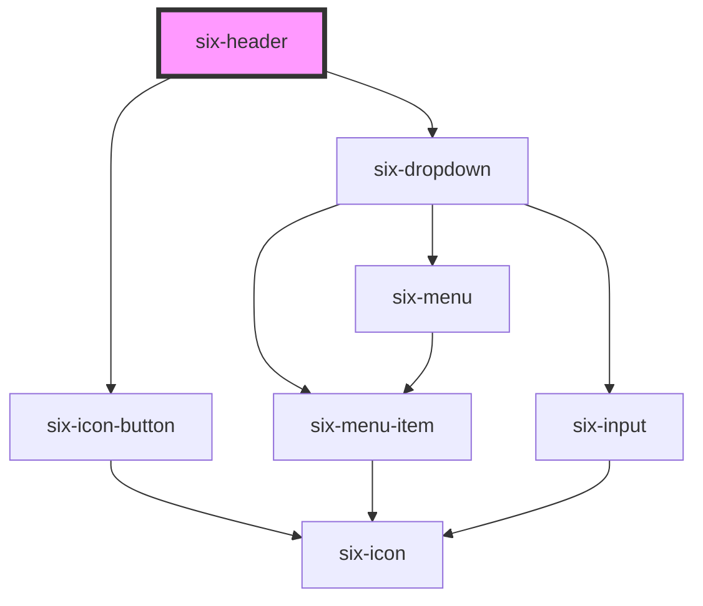

# Header


## Header Features

To define the elements which will be shown in the profile dropdown use the `profile-menu` slot

To define a profile picture simply set the settings for `six-avatar`

To define the content of the drawer menu (opens when clicking on the hamburger menu) use the `menu-content` slot.

SIX header provides multiple events that can be listened from the outside. Select for example an entry from the app-switcher dropdown and you should see it in the output text below the header.

To listen to the selected app-switcher element simply register a listener on `six-header-app-switcher-select`. You can also listen on the `six-header-app-name-clicked` event to detect a click on the currently selected application's name.

<docs-demo-six-header-0></docs-demo-six-header-0>

```html
<six-root>
  <six-header show-search slot="header" shift-content>
    
    <six-search-field slot="search-field" placeholder="Search for some 'a' ..." clearable>
      <div id="search-results"></div>
    </six-search-field>
    
    <six-icon-button slot="notifications" name="notifications_none">
      <six-badge type="danger" pill>99</six-badge>
    </six-icon-button>
    
    <six-menu slot="app-switcher-menu">
      <six-menu-item checked>Custody</six-menu-item>
      <six-menu-item>Swiss Interbank Clearing</six-menu-item>
      <six-menu-item>Tri-Party Agent</six-menu-item>
      <six-menu-item>Financial Information</six-menu-item>
    </six-menu>
    
    <six-menu slot="profile-menu">
      <six-menu-item><b>Cat Kittens</b><br>cat.kitty.kittens@themCatsBeCool.com</six-menu-item>
      <six-menu-item><b>Language</b><br><six-language-switcher></six-language-switcher></six-menu-item>
      <six-menu-item>Change password</six-menu-item>
      <six-menu-item id="logout">Logout</six-menu-item>
    </six-menu>
    
    <six-avatar               image="https://images.unsplash.com/photo-1529778873920-4da4926a72c2?ixlib=rb-1.2.1&auto=format&fit=crop&w=300&q=80"
      slot="profile-avatar"
    >
    </six-avatar>
    

    <six-icon-button name="shopping_cart" ></six-icon-button>
  </six-header>
  <section slot="main">
    <six-card>
      <h1>Main content</h1>
      <p>
        Lorem ipsum dolor sit amet, consectetur adipisicing elit. Amet atque blanditiis culpa cum earum error,
        fuga laboriosam nam nisi pariatur rem tempora unde voluptatem? Consequuntur dicta fugit numquam
        obcaecati perferendis?
      </p>
    </six-card>
  </section>
</six-root>

<six-dialog label="Dialog" class="dialog-overview">
  <pre></pre>
  <six-button slot="footer" type="primary">Close</six-button>
</six-dialog>

<style>
  section[slot='main'] six-card {
    width: 100%;
  }

  six-search-field div article {
    background-color: var(--six-color-white);
    padding: 0.6rem;
  }
</style>

<script type="module">
  const el = Object.entries({
    header: 'six-header',
    dialog: 'six-dialog',
    dialogClose: 'six-dialog six-button',
    search: 'six-search-field',
    searchResults: 'six-search-field div',
    notifications: '[slot="notifications"]',
    notificationsBadge: 'six-badge',
    logout: '#logout',
  }).reduce((acc, [k, v]) => ({ ...acc, [k]: document.querySelector(v) }), {});

  // logging
  const log = (event) => {
    if (event.detail?.selectedLabel?.trim() === 'Language') {
      return;
    }
    el.dialog.label = event.type;
    el.dialog.querySelector('pre').innerHTML = JSON.stringify(event.detail, null, 2);
    el.dialog.show();
  };

  el.header.addEventListener('six-header-hamburger-menu-clicked', log);
  el.header.addEventListener('six-header-app-name-clicked', log);
  el.header.addEventListener('six-header-app-switcher-select', log);
  el.header.addEventListener('six-header-profile-select', log);
  el.notifications.addEventListener('click', log);

  // close dialog
  el.dialogClose.addEventListener('click', () => el.dialog.hide());

  // search
  el.search.addEventListener('six-search-field-change', ({ detail }) => {
    const term = detail.value;
    getResults(term).then((results) => {
      el.searchResults.innerHTML = results
        .map((result) => {
          const highlighted = result.replaceAll(term, `<b>${term}</b>`);
          return `<article>${highlighted} <six-button type="link">...</six-button></article>`;
        })
        .join('');
    });
  });

  const text =
    'Lorem ipsum dolor sit amet, consectetur adipisicing elit. Eligendi eveniet labore nemo nihil quae soluta sunt temporibus vitae voluptas voluptatem? Amet eius eveniet libero, minus odio officia pariatur provident tenetur.';

  const getResults = (value) => {
    const MAX_ITEMS = 3;
    const TIMEOUT = 1000;
    return new Promise((resolve) => {
      const results = value
        ? text
            .split([', '])
            .filter((item) => item.includes(value.trim()))
            .slice(0, MAX_ITEMS)
        : [];
      setTimeout(() => resolve(results), TIMEOUT);
    });
  };

  // logout
  el.logout.addEventListener('click', (event) => {
    event.stopPropagation();
    el.header.remove();
  });

  // notifications
  let count = 99;

  const updateNotifications = () =>
    setTimeout(() => {
      const delta = getRandomInt(-9, 9);
      count += count + delta >= 0 && count + delta <= 99 ? delta : 0;
      el.notificationsBadge.innerText = count;
      updateNotifications();
    }, getRandomInt(300, 3000));

  // MDN
  const getRandomInt = (min, max) => {
    min = Math.ceil(min);
    max = Math.floor(max);
    return Math.floor(Math.random() * (max - min + 1)) + min;
  };

  updateNotifications();
</script>
```


### Replace Logo

In case you don't want the Six Logo, you have the functionality to replace the Logo with `slot="logo"`.

<docs-demo-six-header-1></docs-demo-six-header-1>

```html
<six-root>
  <six-header show-search slot="header" shift-content>
    
    
  </six-header>
  <section slot="main"></section>
</six-root>
```


### Set Search Open status

You can enforce the search bar to be open or closed by setting the `open-search` property

<docs-demo-six-header-2></docs-demo-six-header-2>

```html
<six-button id="search-toggle-attribute-btn">Toggle Search via Attribute</six-button>
<six-button id="search-toggle-method-btn">Toggle Search via Method</six-button>

<six-root>
  <six-header show-search slot="header" shift-content open-search="true" id="search-toggle-header">
    <six-search-field slot="search-field" placeholder="Search for something" clearable>
      <div></div>
    </six-search-field>
  </six-header>
</six-root>

<script type="module">
  const header = document.getElementById('search-toggle-header');

  const toggleAttributeBtn = document.getElementById('search-toggle-attribute-btn');
  toggleAttributeBtn.addEventListener('click', () => {
    const currentValue = header.attributes['open-search'].value === 'true';
    header.setAttribute('open-search', String(!currentValue));
  });

  const toggleMethodBtn = document.getElementById('search-toggle-method-btn');
  toggleMethodBtn.addEventListener('click', async () => {
    const openState = await header.getIsSearchOpen();
    await header.setSearchOpenState(!openState);
  });
</script>
```


### Execute callback on logo clicked

In case you want to e.g. navigate to the dashboard when the header logo is clicked simply listen to the `six-header-logo-clicked` event and set the `clickable-logo` attribute

<docs-demo-six-header-3></docs-demo-six-header-3>

```html
<six-root>
  <six-header show-search slot="header" shift-content id="clickableLogoHeader" clickable-logo> </six-header>
  <section slot="main"></section>
</six-root>
<script type="module">
  const header = document.getElementById('clickableLogoHeader');
  header.addEventListener('six-header-logo-clicked', () => {
    alert('logo clicked');
  });
</script>
```


<!-- Auto Generated Below -->


## Properties

| Property            | Attribute             | Description                                                               | Type      | Default |
| ------------------- | --------------------- | ------------------------------------------------------------------------- | --------- | ------- |
| `clickableLogo`     | `clickable-logo`      | Set whether the logo should be clickable                                  | `boolean` | `false` |
| `openHamburgerMenu` | `open-hamburger-menu` | Set the hamburger menu icon to open or closed state                       | `boolean` | `false` |
| `openSearch`        | `open-search`         | Set the header search to be in an open or closed state                    | `boolean` | `false` |
| `shiftContent`      | `shift-content`       | Indicates if content should be shifted down when search field is visible. | `boolean` | `false` |


## Events

| Event                               | Description                                                       | Type                                             |
| ----------------------------------- | ----------------------------------------------------------------- | ------------------------------------------------ |
| `six-header-app-name-clicked`       | Emitted when the name of the selected app is clicked.             | `CustomEvent<undefined>`                         |
| `six-header-app-switcher-select`    | Emitted when a menu item is in the app switcher menu is selected. | `CustomEvent<SixHeaderAppSwitcherSelectPayload>` |
| `six-header-hamburger-menu-clicked` | Emitted when the hamburger menu is clicked.                       | `CustomEvent<undefined>`                         |
| `six-header-logo-clicked`           | Emitted when the header logo is clicked.                          | `CustomEvent<undefined>`                         |
| `six-header-profile-select`         | Emitted when a menu item is in the profile menu is selected.      | `CustomEvent<SixHeaderProfileSelectPayload>`     |
| `six-header-search-field-toggle`    | Emitted when search field is toggled.                             | `CustomEvent<SixHeaderSearchFieldToggle>`        |


## Methods

### `getIsSearchOpen() => Promise<boolean>`

Get open state for search

#### Returns

Type: `Promise<boolean>`


### `setSearchOpenState(openState: boolean) => Promise<void>`

Sets open state for search

#### Returns

Type: `Promise<void>`


## Slots

| Slot                  | Description                                                       |
| --------------------- | ----------------------------------------------------------------- |
|                       | Used to define a custom component that is included in the header. |
| `"app-switcher-menu"` | Used to define the application switcher menu in the header.       |
| `"notifications"`     | Used to define the notification component in the header.          |
| `"profile-avatar"`    | Used to define the avator in the header.                          |
| `"profile-menu"`      | Used to define the profile menu in the header.                    |
| `"search-field"`      | Used to define the search field component in the header.          |


## Dependencies

### Depends on

- [six-icon-button](six-icon-button.html)
- [six-dropdown](six-dropdown.html)

### Graph


----------------------------------------------

Copyright © 2021-present SIX-Group
