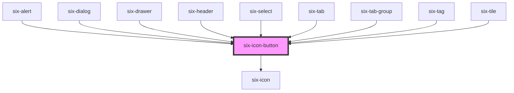

# six-icon-button

Icons buttons are simple, icon-only buttons that can be used for actions and in toolbars.


<docs-demo-six-icon-button-133></docs-demo-six-icon-button-133>

```html
<six-icon-button name="settings" label="Settings"></six-icon-button>
<six-icon-button name="tune" label="Options"></six-icon-button>
<six-icon-button name="cancel" label="Close"></six-icon-button>
```


## Sizes

Icon buttons inherit their parent element's `font-size`.

<docs-demo-six-icon-button-134></docs-demo-six-icon-button-134>

```html
<six-icon-button name="edit" label="Edit" size="xSmall"></six-icon-button>
<six-icon-button name="edit" label="Edit" size="small"></six-icon-button>
<six-icon-button name="edit" label="Edit" size="medium"></six-icon-button>
<six-icon-button name="edit" label="Edit" size="large"></six-icon-button>
<six-icon-button name="edit" label="Edit" size="xLarge"></six-icon-button>
```


## Colors

Icon buttons are designed to have a uniform appearance, so their color is not inherited. However, you can still customize them by styling the `base` part.

<docs-demo-six-icon-button-135></docs-demo-six-icon-button-135>

```html
<div class="icon-button-color">
  <six-icon-button name="format_bold" label="Bold"></six-icon-button>
  <six-icon-button name="format_italic" label="Italic"></six-icon-button>
  <six-icon-button name="format_underline" label="Underline"></six-icon-button>
</div>

<style>
  .icon-button-color six-icon-button::part(base) {
    color: #b00091;
  }

  .icon-button-color six-icon-button::part(base):hover,
  .icon-button-color six-icon-button::part(base):focus {
    color: #c913aa;
  }

  .icon-button-color six-icon-button::part(base):active {
    color: #960077;
  }
</style>
```


## Icon Button with Tooltip

Wrap a tooltip around an icon button to provide contextual information to the user.

<docs-demo-six-icon-button-136></docs-demo-six-icon-button-136>

```html
<six-tooltip content="Settings">
  <six-icon-button name="settings" label="Settings" onClick="alert('clicked')"></six-icon-button>
</six-tooltip>
```


## Disabled

<docs-demo-six-icon-button-137></docs-demo-six-icon-button-137>

```html
<six-tooltip content="Settings">
  <six-icon-button name="settings" label="Settings" onClick="alert('clicked')" disabled></six-icon-button>
</six-tooltip>
```


## Icon Button with Badge

Often icon buttons are combined with badges to signal new entries. For this simply add a `six-badge` to the slot

<docs-demo-six-icon-button-138></docs-demo-six-icon-button-138>

```html
<div>
  <six-icon-button name="email" label="Email" size="xSmall"
    ><six-badge type="primary" pill>6</six-badge></six-icon-button>
  <six-icon-button name="email" label="Email" size="small"
    ><six-badge type="primary" pill>6</six-badge></six-icon-button>
  <six-icon-button name="email" label="Email" size="medium"
    ><six-badge type="primary" pill>6</six-badge></six-icon-button>
  <six-icon-button name="email" label="Email" size="large"
    ><six-badge type="primary" pill>6</six-badge></six-icon-button>
  <six-icon-button name="email" label="Email" size="xLarge"
    ><six-badge type="primary" pill>6</six-badge></six-icon-button>
</div>

<div>
  <six-icon-button name="chat" label="Chat" size="xSmall"
    ><six-badge type="success" pill>6</six-badge></six-icon-button>
  <six-icon-button name="chat" label="Chat" size="small"
    ><six-badge type="success" pill>6</six-badge></six-icon-button>
  <six-icon-button name="chat" label="Chat" size="medium"
    ><six-badge type="success" pill>6</six-badge></six-icon-button>
  <six-icon-button name="chat" label="Chat" size="large"
    ><six-badge type="success" pill>6</six-badge></six-icon-button>
  <six-icon-button name="chat" label="Chat" size="xLarge"
    ><six-badge type="success" pill>6</six-badge></six-icon-button>
</div>

<div>
  <six-icon-button name="event" label="Event" size="xSmall"
    ><six-badge type="action" pill>6</six-badge></six-icon-button>
  <six-icon-button name="event" label="Event" size="small"
    ><six-badge type="action" pill>6</six-badge></six-icon-button>
  <six-icon-button name="event" label="Event" size="medium"
    ><six-badge type="action" pill>6</six-badge></six-icon-button>
  <six-icon-button name="event" label="Event" size="large"
    ><six-badge type="action" pill>6</six-badge></six-icon-button>
  <six-icon-button name="event" label="Event" size="xLarge"
    ><six-badge type="action" pill>6</six-badge></six-icon-button>
</div>

<div>
  <six-icon-button name="person_outline" label="Person" size="xSmall"
    ><six-badge type="warning" pill>6</six-badge></six-icon-button>
  <six-icon-button name="person_outline" label="Person" size="small"
    ><six-badge type="warning" pill>6</six-badge></six-icon-button>
  <six-icon-button name="person_outline" label="Person" size="medium"
    ><six-badge type="warning" pill>6</six-badge></six-icon-button>
  <six-icon-button name="person_outline" label="Person" size="large"
    ><six-badge type="warning" pill>6</six-badge></six-icon-button>
  <six-icon-button name="person_outline" label="Person" size="xLarge"
    ><six-badge type="warning" pill>6</six-badge></six-icon-button>
</div>

<div>
  <six-icon-button name="notifications_none" label="Notifications" size="xSmall"
    ><six-badge type="danger" pill>6</six-badge></six-icon-button>
  <six-icon-button name="notifications_none" label="Notifications" size="small"
    ><six-badge type="danger" pill>6</six-badge></six-icon-button>
  <six-icon-button name="notifications_none" label="Notifications" size="medium"
    ><six-badge type="danger" pill>6</six-badge></six-icon-button>
  <six-icon-button name="notifications_none" label="Notifications" size="large"
    ><six-badge type="danger" pill>6</six-badge></six-icon-button>
  <six-icon-button name="notifications_none" label="Notifications" size="xLarge"
    ><six-badge type="danger" pill>6</six-badge></six-icon-button>
</div>
```


<!-- Auto Generated Below -->


## Properties

| Property   | Attribute  | Description                                                                                                                                                                        | Type                                                                                | Default     |
| ---------- | ---------- | ---------------------------------------------------------------------------------------------------------------------------------------------------------------------------------- | ----------------------------------------------------------------------------------- | ----------- |
| `disabled` | `disabled` | Set to true to disable the button.                                                                                                                                                 | `boolean`                                                                           | `false`     |
| `html`     | `html`     | HTML symbol code or entity.                                                                                                                                                        | `string \| undefined`                                                               | `undefined` |
| `label`    | `label`    | A description that gets read by screen readers and other assistive devices. For optimal accessibility, you should always include a label that describes what the icon button does. | `string \| undefined`                                                               | `undefined` |
| `name`     | `name`     | The name of the icon to draw.                                                                                                                                                      | `string \| undefined`                                                               | `undefined` |
| `size`     | `size`     | The icon's size.                                                                                                                                                                   | `"large" \| "medium" \| "small" \| "xLarge" \| "xSmall" \| "xxLarge" \| "xxxLarge"` | `'medium'`  |


## Shadow Parts

| Part     | Description                   |
| -------- | ----------------------------- |
| `"base"` | The component's base wrapper. |


## Dependencies

### Used by

 - [six-alert](six-alert.html)
 - [six-dialog](six-dialog.html)
 - [six-drawer](six-drawer.html)
 - [six-header](six-header.html)
 - [six-select](six-select.html)
 - [six-tab](six-tab.html)
 - [six-tab-group](six-tab-group.html)
 - [six-tag](six-tag.html)
 - [six-tile](six-tile.html)

### Depends on

- [six-icon](six-icon.html)

### Graph


----------------------------------------------

Copyright © 2021-present SIX-Group
