# Icon


## Icons

SIX UI Library supports Material **Icons** and **Symbols**. Browse: [Material Icons](https://fonts.google.com/icons?icon.set=Material+Icons) · [Material Symbols](https://fonts.google.com/icons?icon.set=Material+Symbols).


### Material Icons (legacy)

#### Outlined

<docs-demo-six-icon-0></docs-demo-six-icon-0>

```html
<div style="display: flex; gap: 1em; min-height: 5rem; align-items: center">
  <six-icon>pie_chart</six-icon>
  <six-icon>settings</six-icon>
  <six-icon>sick</six-icon>
  <six-icon>fort</six-icon>
  <six-icon>castle</six-icon>
</div>
```


#### Filled

<docs-demo-six-icon-1></docs-demo-six-icon-1>

```html
<div style="display: flex; gap: 1em; min-height: 5rem; align-items: center">
  <six-icon filled>pie_chart</six-icon>
  <six-icon filled>settings</six-icon>
  <six-icon filled>sick</six-icon>
  <six-icon filled>fort</six-icon>
  <six-icon filled>castle</six-icon>
</div>
```


### Material Symbols (new)

#### Outlined

<docs-demo-six-icon-2></docs-demo-six-icon-2>

```html
<div style="display: flex; gap: 1em; min-height: 5rem; align-items: center">
  <six-icon library="material-symbols">home</six-icon>
  <six-icon library="material-symbols">settings</six-icon>
  <six-icon library="material-symbols">database</six-icon>
  <six-icon library="material-symbols">language</six-icon>
  <six-icon library="material-symbols">person</six-icon>
</div>
```


#### Filled

<docs-demo-six-icon-3></docs-demo-six-icon-3>

```html
<div style="display: flex; gap: 1em; min-height: 5rem; align-items: center">
  <six-icon library="material-symbols" filled>home</six-icon>
  <six-icon library="material-symbols" filled>settings</six-icon>
  <six-icon library="material-symbols" filled>database</six-icon>
  <six-icon library="material-symbols" filled>language</six-icon>
  <six-icon library="material-symbols" filled>person</six-icon>
</div>
```


### Sizing

The icons are available in different sizes. Default size is medium (24px).

#### Extra-small

<docs-demo-six-icon-4></docs-demo-six-icon-4>

```html
<div style="display: flex; gap: 1em; min-height: 5rem; align-items: center">
  <six-icon size="xSmall">search</six-icon>
  <six-icon size="xSmall">done</six-icon>
  <six-icon size="xSmall">settings</six-icon>
  <six-icon size="xSmall">home</six-icon>
  <six-icon size="xSmall">info</six-icon>
</div>
```


#### Small

<docs-demo-six-icon-5></docs-demo-six-icon-5>

```html
<div style="display: flex; gap: 1em; min-height: 5rem; align-items: center">
  <six-icon size="small">search</six-icon>
  <six-icon size="small">done</six-icon>
  <six-icon size="small">settings</six-icon>
  <six-icon size="small">home</six-icon>
  <six-icon size="small">info</six-icon>
</div>
```


#### Medium (default)

<docs-demo-six-icon-6></docs-demo-six-icon-6>

```html
<div style="display: flex; gap: 1em; min-height: 5rem; align-items: center">
  <six-icon size="medium">search</six-icon>
  <six-icon size="medium">done</six-icon>
  <six-icon size="medium">settings</six-icon>
  <six-icon size="medium">home</six-icon>
  <six-icon size="medium">info</six-icon>
</div>
```


#### Large

<docs-demo-six-icon-7></docs-demo-six-icon-7>

```html
<div style="display: flex; gap: 1em; min-height: 5rem; align-items: center">
  <six-icon size="large">search</six-icon>
  <six-icon size="large">done</six-icon>
  <six-icon size="large">settings</six-icon>
  <six-icon size="large">home</six-icon>
  <six-icon size="large">info</six-icon>
</div>
```


#### Extra-large

<docs-demo-six-icon-8></docs-demo-six-icon-8>

```html
<div style="display: flex; gap: 1em; min-height: 5rem; align-items: center">
  <six-icon size="xLarge">search</six-icon>
  <six-icon size="xLarge">done</six-icon>
  <six-icon size="xLarge">settings</six-icon>
  <six-icon size="xLarge">home</six-icon>
  <six-icon size="xLarge">info</six-icon>
</div>
```


#### 2× Extra-large

<docs-demo-six-icon-9></docs-demo-six-icon-9>

```html
<div style="display: flex; gap: 1em; min-height: 5rem; align-items: center">
  <six-icon size="xxLarge">search</six-icon>
  <six-icon size="xxLarge">done</six-icon>
  <six-icon size="xxLarge">settings</six-icon>
  <six-icon size="xxLarge">home</six-icon>
  <six-icon size="xxLarge">info</six-icon>
</div>
```


#### 3× Extra-large

<docs-demo-six-icon-10></docs-demo-six-icon-10>

```html
<div style="display: flex; gap: 1em; min-height: 6rem; align-items: center">
  <six-icon size="xxxLarge">search</six-icon>
  <six-icon size="xxxLarge">done</six-icon>
  <six-icon size="xxxLarge">settings</six-icon>
  <six-icon size="xxxLarge">home</six-icon>
  <six-icon size="xxxLarge">info</six-icon>
</div>
```


#### Icons inherit font-size

<docs-demo-six-icon-11></docs-demo-six-icon-11>

```html
<div style="display: flex; gap: 1em; min-height: 5rem; align-items: center">
  <span style="font-size: 1rem"
    >
    <six-icon size="inherit">search</six-icon>
  </span>
  <span style="font-size: 2rem">
    <six-icon size="inherit" symbols>search</six-icon>
  </span>
  <span style="font-size: 3rem">
    <six-icon size="inherit" symbols filled>search</six-icon>
  </span>
</div>
```


<!-- Auto Generated Below -->


## Properties

| Property  | Attribute | Description                                                                                                                                                                                                                                                                                                                                                                                                                                                                                                                                                     | Type                                                                                             | Default     |
| --------- | --------- | --------------------------------------------------------------------------------------------------------------------------------------------------------------------------------------------------------------------------------------------------------------------------------------------------------------------------------------------------------------------------------------------------------------------------------------------------------------------------------------------------------------------------------------------------------------- | ------------------------------------------------------------------------------------------------ | ----------- |
| `filled`  | `filled`  | If set to true the default material outlined icons are not used.                                                                                                                                                                                                                                                                                                                                                                                                                                                                                                | `boolean`                                                                                        | `false`     |
| `library` | `library` | Icon library to use when no `library` prop is provided. By default, all `<six-icon>` instances fall back to the globally configured default library (via `setDefaultIconLibrary()` / `getDefaultIconLibrary()`), which is `"material-icons"` unless changed at runtime.  This allows teams to switch the default across an entire project without having to set the `library` prop on every `<six-icon>` instance.  Icon library for this instance. Overrides the global default. - "material-icons"  → Material Icons - "material-symbols"  → Material Symbols | `"material-icons" \| "material-symbols" \| undefined`                                            | `undefined` |
| `size`    | `size`    | The icon's size.                                                                                                                                                                                                                                                                                                                                                                                                                                                                                                                                                | `"inherit" \| "large" \| "medium" \| "small" \| "xLarge" \| "xSmall" \| "xxLarge" \| "xxxLarge"` | `'inherit'` |


## Slots

| Slot | Description                            |
| ---- | -------------------------------------- |
|      | Used to define the material icon name. |


## Dependencies

### Used by

 - [six-avatar](six-avatar.html)
 - [six-breadcrumbs](six-breadcrumbs.html)
 - [six-date](six-date.html)
 - [six-datepicker](six-datepicker.html)
 - [six-details](six-details.html)
 - [six-dropdown](six-dropdown.html)
 - [six-file-list-item](six-file-list-item.html)
 - [six-file-upload](six-file-upload.html)
 - [six-icon-button](six-icon-button.html)
 - [six-input](six-input.html)
 - [six-item-picker](six-item-picker.html)
 - [six-menu-item](six-menu-item.html)
 - [six-rating](six-rating.html)
 - [six-search-field](six-search-field.html)
 - [six-select](six-select.html)
 - [six-sidebar-item](six-sidebar-item.html)
 - [six-sidebar-item-group](six-sidebar-item-group.html)
 - [six-stage-indicator](six-stage-indicator.html)
 - [six-tile](six-tile.html)
 - [six-timepicker](six-timepicker.html)

### Graph

```mermaid
graph TD;
  six-avatar --> six-icon
  six-breadcrumbs --> six-icon
  six-date --> six-icon
  six-datepicker --> six-icon
  six-details --> six-icon
  six-dropdown --> six-icon
  six-file-list-item --> six-icon
  six-file-upload --> six-icon
  six-icon-button --> six-icon
  six-input --> six-icon
  six-item-picker --> six-icon
  six-menu-item --> six-icon
  six-rating --> six-icon
  six-search-field --> six-icon
  six-select --> six-icon
  six-sidebar-item --> six-icon
  six-sidebar-item-group --> six-icon
  six-stage-indicator --> six-icon
  six-tile --> six-icon
  six-timepicker --> six-icon
  style six-icon fill:#f9f,stroke:#333,stroke-width:4px
```


----------------------------------------------

Copyright © 2021-present SIX-Group
