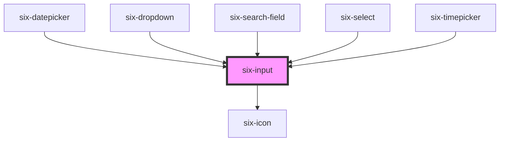

# Input

Inputs collect data from the user.


## Input

basic input field

<docs-demo-six-input-0></docs-demo-six-input-0>

```html
<six-input></six-input>
```


## Placeholders

Use the `placeholder` attribute to add a placeholder.

<docs-demo-six-input-1></docs-demo-six-input-1>

```html
<six-input placeholder="Type something"></six-input>
```


## Clearable

Add the `clearable` prop to add a clear button when the input has content.

<docs-demo-six-input-2></docs-demo-six-input-2>

```html
<six-input placeholder="Clearable" size="small" clearable></six-input>
<br>
<six-input placeholder="Clearable" size="medium" clearable></six-input>
<br>
<six-input placeholder="Clearable" size="large" clearable></six-input>
```


## Toggle Password

Add the `toggle-password` prop to add a toggle button that will show the password when activated.

<docs-demo-six-input-3></docs-demo-six-input-3>

```html
<six-input type="password" placeholder="Password Toggle" size="small" toggle-password></six-input>
<br>
<six-input type="password" placeholder="Password Toggle" size="medium" toggle-password></six-input>
<br>
<six-input type="password" placeholder="Password Toggle" size="large" toggle-password></six-input>
```


## Numbers

By default when using type number it allows you to only use integers

<docs-demo-six-input-4></docs-demo-six-input-4>

```html
<six-input type="number" placeholder="Integers..."></six-input>
```


However, you might want to be able to use decimal numbers, in this case simply define a `pattern` and a `step`:

<docs-demo-six-input-5></docs-demo-six-input-5>

```html
<six-input type="number" placeholder="Decimal Numbers..." pattern="[0-9]+([\.,][0-9]+)?" step="0.1"></six-input>
```


## Line

Use the `line` prop to render inputs line style.

<docs-demo-six-input-6></docs-demo-six-input-6>

```html
<six-input line></six-input>
```


## Pill

Use the `pill` prop to give inputs rounded edges.

<docs-demo-six-input-7></docs-demo-six-input-7>

```html
<six-input placeholder="Small" size="small" pill></six-input>
<br>
<six-input placeholder="Medium" size="medium" pill></six-input>
<br>
<six-input placeholder="Large" size="large" pill></six-input>
```


## Disabled

Use the `disabled` attribute to disable an input.

<docs-demo-six-input-8></docs-demo-six-input-8>

```html
<six-input placeholder="Write here your first name" size="small" label="Name" help-text="Help text" disabled>
</six-input>
<br>
<six-input placeholder="Write here your first name" size="medium" label="Name" help-text="Help text" disabled>
</six-input>
<br>
<six-input placeholder="Write here your first name" size="large" label="Name" help-text="Help text" disabled>
</six-input>
```


## Sizes

Use the `size` attribute to change an input's size.

<docs-demo-six-input-9></docs-demo-six-input-9>

```html
<six-input placeholder="Small" size="small"></six-input>
<br>
<six-input placeholder="Medium" size="medium"></six-input>
<br>
<six-input placeholder="Large" size="large"></six-input>
```


## Prefix & Suffix Icons

Use the `prefix` and `suffix` slots to add icons.

<docs-demo-six-input-10></docs-demo-six-input-10>

```html
<six-input placeholder="Small" size="small">
  <six-icon slot="prefix" size="xSmall">local_offer</six-icon>
  <six-icon slot="suffix" size="xSmall">settings</six-icon>
</six-input>
<br>
<six-input placeholder="Medium" size="medium">
  <six-icon slot="prefix" size="small">local_offer</six-icon>
  <six-icon slot="suffix" size="small">settings</six-icon>
</six-input>
<br>
<six-input placeholder="Large" size="large">
  <six-icon slot="prefix" size="medium">local_offer</six-icon>
  <six-icon slot="suffix" size="medium">settings</six-icon>
</six-input>
```


## Labels

Use the `label` attribute to give the input an accessible label. For labels that contain HTML, use the `label` slot instead.

<docs-demo-six-input-11></docs-demo-six-input-11>

```html
<six-input label="What is your name?"></six-input>
<six-input           ><div slot="label">What is <span style="color: red">your</span> name?</div></six-input>
```


## Help Text

Add descriptive help text to an input with the `help-text` attribute. For help texts that contain HTML, use the `help-text` slot instead.

<docs-demo-six-input-12></docs-demo-six-input-12>

```html
<six-input label="Name" help-text="Help text"> </six-input>
```


## Events Discalimer

The events of our webcommponents should follow native web elements as much as possible.

This means input, change and blur should be fired the same as when using native elements: Input is fired on input, and change and blur are fired when leaving the input

`six-input-input` is emitted when the user enters data (not emitted on dynamic value changes)

`six-input-change` is emitted when the user presses enter or leaves the form after filling in data

`six-input-blur` is emitted when the user leaves the form

`six-input-value-change` is emitted whenever the value changes. This could be because the user enters data or because the value was dynamically changed

You can play with the following native and six-input elements to see that the event firing is the same

<docs-demo-six-input-13></docs-demo-six-input-13>

```html
<div style="font-size: 1rem; font-weight: bold; padding-bottom: 1rem">Native Input Element</div>
<input type="text" id="native-input" name="type" >
<div style="padding-bottom: 0.5rem">
  <div style="padding-top: 1rem">Event Firing History:</div>
  <ul id="native-events-list"></ul>
</div>

<div style="font-size: 1rem; font-weight: bold; padding-bottom: 1rem">SIX Input Element</div>
<six-input label="Events" help-text="Check what event is fired when..." id="events-input" clearable></six-input>
<six-button style="padding-top: 0.5rem" id="event-setting-btn">Set Value</six-button>
<div style="padding-bottom: 0.5rem">
  <div style="padding-top: 1rem">Event Firing History:</div>
  <ul id="events-list"></ul>
</div>
<div style="padding-bottom: 0.5rem">
  <div style="padding-top: 1rem">Event Firing History for six-input-value-change:</div>
  <ul id="events-list-value-change"></ul>
</div>

<script type="module">
  const nativeInput = document.getElementById('native-input');
  const inputEl = document.getElementById('events-input');
  const eventList = document.getElementById('events-list');
  const eventListValueChange = document.getElementById('events-list-value-change');
  const nativeEventList = document.getElementById('native-events-list');
  const eventSettingBtn = document.getElementById('event-setting-btn');

  const logEvent = (eventName, el, color) => (event) => {
    const value = event.target.value;
    el.innerHTML = `${el.innerHTML}<li><span style="font-weight: bold; color: ${color};">${eventName}:</span> ${value}</li>`;
  };
  inputEl.addEventListener('six-input-input', logEvent('input', eventList, 'blue'));
  inputEl.addEventListener('six-input-change', logEvent('change', eventList, 'red'));
  inputEl.addEventListener('six-input-blur', logEvent('blur', eventList, 'green'));
  inputEl.addEventListener('six-input-value-change', logEvent('value-change', eventListValueChange));

  nativeInput.addEventListener('input', logEvent('input', nativeEventList, 'blue'));
  nativeInput.addEventListener('change', logEvent('change', nativeEventList, 'red'));
  nativeInput.addEventListener('blur', logEvent('blur', nativeEventList, 'green'));

  eventSettingBtn.addEventListener('click', () => {
    const someString = 'dynamically set value';
    inputEl.value = someString;
    nativeInput.value = someString;
  });
</script>
```


<!-- Auto Generated Below -->


## Properties

| Property         | Attribute         | Description                                                                                                      | Type                                                                                               | Default     |
| ---------------- | ----------------- | ---------------------------------------------------------------------------------------------------------------- | -------------------------------------------------------------------------------------------------- | ----------- |
| `autocapitalize` | `autocapitalize`  | The input's autocaptialize attribute.                                                                            | `string`                                                                                           | `'off'`     |
| `autocomplete`   | `autocomplete`    | The input's autocomplete attribute.                                                                              | `string`                                                                                           | `'off'`     |
| `autocorrect`    | `autocorrect`     | The input's autocorrect attribute.                                                                               | `"off" \| "on"`                                                                                    | `'off'`     |
| `autofocus`      | `autofocus`       | The input's autofocus attribute.                                                                                 | `boolean`                                                                                          | `false`     |
| `clearable`      | `clearable`       | Set to true to add a clear button when the input is populated.                                                   | `boolean`                                                                                          | `false`     |
| `disabled`       | `disabled`        | Set to true to disable the input.                                                                                | `boolean`                                                                                          | `false`     |
| `errorText`      | `error-text`      | The error message shown, if `invalid` is set to true.                                                            | `string`                                                                                           | `''`        |
| `helpText`       | `help-text`       | The input's help text. Alternatively, you can use the help-text slot.                                            | `string`                                                                                           | `''`        |
| `inputmode`      | `inputmode`       | The input's inputmode attribute.                                                                                 | `"decimal" \| "email" \| "none" \| "numeric" \| "search" \| "tel" \| "text" \| "url" \| undefined` | `undefined` |
| `invalid`        | `invalid`         | If this property is set to true and an error message is provided by `errorText`, the error message is displayed. | `boolean`                                                                                          | `false`     |
| `label`          | `label`           | The label text.                                                                                                  | `string`                                                                                           | `''`        |
| `line`           | `line`            | Set to render as line                                                                                            | `boolean`                                                                                          | `false`     |
| `max`            | `max`             | The input's maximum value.                                                                                       | `number \| undefined`                                                                              | `undefined` |
| `maxlength`      | `maxlength`       | The maximum length of input that will be considered valid.                                                       | `number \| undefined`                                                                              | `undefined` |
| `min`            | `min`             | The input's minimum value.                                                                                       | `number \| undefined`                                                                              | `undefined` |
| `minlength`      | `minlength`       | The minimum length of input that will be considered valid.                                                       | `number \| undefined`                                                                              | `undefined` |
| `name`           | `name`            | The input's name attribute.                                                                                      | `string`                                                                                           | `''`        |
| `pattern`        | `pattern`         | A pattern to validate input against.                                                                             | `string \| undefined`                                                                              | `undefined` |
| `pill`           | `pill`            | Set to true to draw a pill-style input with rounded edges.                                                       | `boolean`                                                                                          | `false`     |
| `placeholder`    | `placeholder`     | The input's placeholder text.                                                                                    | `string \| undefined`                                                                              | `undefined` |
| `readonly`       | `readonly`        | Set to true to make the input readonly.                                                                          | `boolean`                                                                                          | `false`     |
| `required`       | `required`        | Set to true to show an asterisk beneath the label.                                                               | `boolean`                                                                                          | `false`     |
| `size`           | `size`            | The input's size.                                                                                                | `"large" \| "medium" \| "small"`                                                                   | `'medium'`  |
| `spellcheck`     | `spellcheck`      | Enables spell checking on the input.                                                                             | `boolean`                                                                                          | `false`     |
| `step`           | `step`            | The input's step attribute.                                                                                      | `number \| undefined`                                                                              | `undefined` |
| `togglePassword` | `toggle-password` | Set to true to add a password toggle button for password inputs.                                                 | `boolean`                                                                                          | `false`     |
| `type`           | `type`            | The input's type.                                                                                                | `"email" \| "number" \| "password" \| "search" \| "tel" \| "text" \| "url"`                        | `'text'`    |
| `value`          | `value`           | The input's value attribute.                                                                                     | `string`                                                                                           | `''`        |


## Events

| Event              | Description                                                                            | Type                     |
| ------------------ | -------------------------------------------------------------------------------------- | ------------------------ |
| `six-input-blur`   | Emitted when the control loses focus. Access the new value via event.target.value.     | `CustomEvent<undefined>` |
| `six-input-change` | Emitted when the control's value changes. Access the new value via event.target.value. | `CustomEvent<undefined>` |
| `six-input-clear`  | Emitted when the clear button is activated.                                            | `CustomEvent<undefined>` |
| `six-input-focus`  | Emitted when the control gains focus.                                                  | `CustomEvent<undefined>` |
| `six-input-input`  | Emitted when the control receives input. Access the new value via event.target.value.  | `CustomEvent<undefined>` |


## Methods

### `removeFocus() => Promise<void>`

Removes focus from the input.

#### Returns

Type: `Promise<void>`


### `select() => Promise<void | undefined>`

Selects all the text in the input.

#### Returns

Type: `Promise<void | undefined>`


### `setFocus(options?: FocusOptions) => Promise<void>`

Sets focus on the input.

#### Returns

Type: `Promise<void>`


### `setRangeText(replacement: string, start: number, end: number, selectMode?: 'select' | 'start' | 'end' | 'preserve') => Promise<void>`

Replaces a range of text with a new string.

#### Returns

Type: `Promise<void>`


### `setSelectionRange(selectionStart: number, selectionEnd: number, selectionDirection?: 'forward' | 'backward' | 'none') => Promise<void | undefined>`

Sets the start and end positions of the text selection (0-based).

#### Returns

Type: `Promise<void | undefined>`


## Slots

| Slot                   | Description                                                                                   |
| ---------------------- | --------------------------------------------------------------------------------------------- |
| `"clear-icon"`         | An icon to use in lieu of the default clear icon.                                             |
| `"help-text"`          | Help text that describes how to use the input. Alternatively, you can use the help-text prop. |
| `"hide-password-icon"` | An icon to use in lieu of the default hide password icon.                                     |
| `"label"`              | The input's label. Alternatively, you can use the label prop.                                 |
| `"prefix"`             | Used to prepend an icon or similar element to the input.                                      |
| `"show-password-icon"` | An icon to use in lieu of the default show password icon.                                     |
| `"suffix"`             | Used to append an icon or similar element to the input.                                       |


## Shadow Parts

| Part                       | Description                                                  |
| -------------------------- | ------------------------------------------------------------ |
| `"base"`                   | The component's base wrapper.                                |
| `"clear-button"`           | The clear button.                                            |
| `"form-control"`           | The form control that wraps the label, input, and help-text. |
| `"help-text"`              | The input help text.                                         |
| `"input"`                  | The input control.                                           |
| `"label"`                  | The input label.                                             |
| `"password-toggle-button"` | The password toggle button.                                  |
| `"prefix"`                 | The input prefix container.                                  |
| `"suffix"`                 | The input suffix container.                                  |


## Dependencies

### Used by

 - [six-datepicker](six-datepicker.html)
 - [six-dropdown](six-dropdown.html)
 - [six-search-field](six-search-field.html)
 - [six-select](six-select.html)
 - [six-timepicker](six-timepicker.html)

### Depends on

- [six-icon](six-icon.html)

### Graph


----------------------------------------------

Copyright © 2021-present SIX-Group
