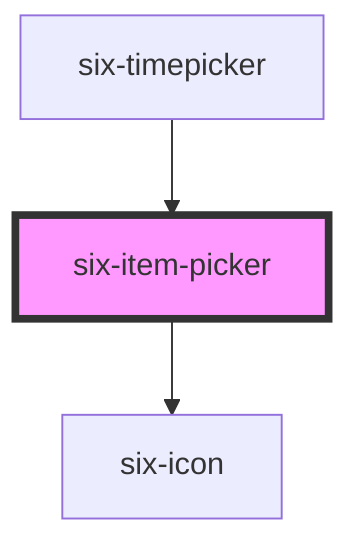

# six-item-picker


# SIX Item Picker

The `six-item-picker` can be used to select an item from a given set. The set can either consist of numbers or letters or some custom options.

To faster switch items you can keep the mouse button pressed

<docs-demo-six-item-picker-153></docs-demo-six-item-picker-153>

```html
<six-item-picker id="itemPicker"></six-item-picker>
<div>Selected item: <span id="selectedItem"></span></div>
<script type="module">
  const itemPicker = document.getElementById('itemPicker');
  const selectedItem = document.getElementById('selectedItem');

  itemPicker.addEventListener('six-item-picker-change', (event) => {
    selectedItem.innerText = event.detail;
  });
</script>
```


## Defining min and max

You can define a min and max value

By default the picker will do a roundtrip i.e. when the min is reached it will continue at the max and vice versa

You can however disable the roundtrip if you want with `roundtrip="false"`

For roundtrip to work you need to define a minimum and a maximum

### Roundtrip enabled:

<docs-demo-six-item-picker-154></docs-demo-six-item-picker-154>

```html
<div style="display: flex">
  <six-item-picker value="12" min="0" max="13"></six-item-picker>
  <six-item-picker value="12" min="-5" max="0"></six-item-picker>
  <six-item-picker value="12" min="10" max="13"></six-item-picker>
  <six-item-picker type="letter" value="k" min="i" max="m"></six-item-picker>
</div>
```


### Roundtrip disabled:

<docs-demo-six-item-picker-155></docs-demo-six-item-picker-155>

```html
<div style="display: flex">
  <six-item-picker value="12" min="10" max="13" roundtrip="false"></six-item-picker>
  <six-item-picker value="12" min="10" roundtrip="false"></six-item-picker>
  <six-item-picker value="12" max="13" roundtrip="false"></six-item-picker>
  <six-item-picker type="letter" value="k" min="i" max="m" roundtrip="false"></six-item-picker>
</div>

<div style="display: flex"></div>
```


## Defining a step size

There might be some circumstances where you want a different step size than 1.

E.g. if you only want to show odd or even numbers:

<docs-demo-six-item-picker-156></docs-demo-six-item-picker-156>

```html
<div>Step Size 2:</div>
<div style="display: flex">
  <six-item-picker step="2"></six-item-picker>
  <six-item-picker step="2" type="letter"></six-item-picker>
</div>

<div>Step Size 7:</div>

<div style="display: flex">
  <six-item-picker step="7"></six-item-picker>
  <six-item-picker step="7" type="letter"></six-item-picker>
</div>
```


The step size as well as the min/max value will be considered when deciding whether the navigation should be disabled:

<docs-demo-six-item-picker-157></docs-demo-six-item-picker-157>

```html
<div style="display: flex">
  <six-item-picker step="7" value="7" min="1" roundtrip="false"></six-item-picker>
  <six-item-picker step="3" type="letter" value="B" roundtrip="false"></six-item-picker>
</div>
```


If you want to have more complex than a constant step size e.g. if you want to only allow fibonacci numbers, then use a custom set instead:

<docs-demo-six-item-picker-158></docs-demo-six-item-picker-158>

```html
<six-item-picker type="custom" id="fibonacci-picker" value="3" min="2"></six-item-picker>
<script>
  const fibonacciNumbers = Array.from(new Array(30).keys());
  fibonacciNumbers.forEach((c, i, arr) => {
    if (i < 2) {
      return c;
    }
    arr[i] = arr[i - 2] + arr[i - 1];
  });

  const fiboPicker = document.getElementById('fibonacci-picker');
  fiboPicker.items = fibonacciNumbers;
</script>
```


## Different types

By default `six-item-picker` has type `number`, however you can also define other types. In the following you will see some examples of different types.

### Type "number"

Type "number" is set by default. If you don't set a value it will take the default value zero:

<docs-demo-six-item-picker-159></docs-demo-six-item-picker-159>

```html
<div style="display: flex">
  <six-item-picker></six-item-picker>
  <six-item-picker value="1" step="2"></six-item-picker>
  <six-item-picker roundtrip="false"></six-item-picker>
  <six-item-picker value="5" step="5" min="3" max="13"></six-item-picker>
  <six-item-picker value="5" step="5" min="3" max="13" roundtrip="false"></six-item-picker>
</div>
```


### Type "letter"

<docs-demo-six-item-picker-160></docs-demo-six-item-picker-160>

```html
<div style="display: flex">
  <six-item-picker type="letter"></six-item-picker>
  <six-item-picker type="letter" value="b" step="5"></six-item-picker>
  <six-item-picker type="letter" roundtrip="false"></six-item-picker>
  <six-item-picker type="letter" roundtrip="false" min="c" max="k" value="d"></six-item-picker>
</div>
```


### Type "capital-letter"

<docs-demo-six-item-picker-161></docs-demo-six-item-picker-161>

```html
<div style="display: flex">
  <six-item-picker type="capital-letter"></six-item-picker>
  <six-item-picker type="capital-letter" value="B" step="5"></six-item-picker>
  <six-item-picker type="capital-letter" roundtrip="false"></six-item-picker>
  <six-item-picker type="capital-letter" roundtrip="false" min="C" max="K" value="D"></six-item-picker>
</div>
```


### Type "lower-letter"

<docs-demo-six-item-picker-162></docs-demo-six-item-picker-162>

```html
<div style="display: flex">
  <six-item-picker type="lower-letter"></six-item-picker>
  <six-item-picker type="lower-letter" value="b" step="5"></six-item-picker>
  <six-item-picker type="lower-letter" roundtrip="false"></six-item-picker>
  <six-item-picker type="lower-letter" roundtrip="false" min="c" max="k" value="d"></six-item-picker>
</div>
```


### Type "custom"

You can also define a custom set

<docs-demo-six-item-picker-163></docs-demo-six-item-picker-163>

```html
<six-item-picker type="custom" id="custom-item-picker"></six-item-picker>
<script type="module">
  const itemPicker = document.getElementById('custom-item-picker');
  // create an array of emojis
  itemPicker.items = Array.from(new Array(50).keys()).map((i) =>
    String.fromCodePoint(`0x1f6${String(i).padStart(2, '0')}`)
  );
</script>
```


## Asynchronous Behaviour

Of course the properties of `six-item-picker` could also be asynchroniously changed.

<docs-demo-six-item-picker-164></docs-demo-six-item-picker-164>

```html
<div style="display: flex">
  <six-item-picker id="async-number-item-picker" max="1" roundtrip="false"></six-item-picker>
  <six-item-picker type="letter" id="async-letter-item-picker" max="d"></six-item-picker>
  <six-item-picker type="custom" id="async-custom-item-picker"></six-item-picker>
</div>

<script type="module">
  const numberItemPicker = document.getElementById('async-number-item-picker');
  const letterItemPicker = document.getElementById('async-letter-item-picker');
  const customItemPicker = document.getElementById('async-custom-item-picker');

  setTimeout(() => {
    numberItemPicker.value = 1;
    letterItemPicker.value = 'd';
    customItemPicker.items = ['AM', 'PM'];
  }, 1000);

  setTimeout(() => {
    numberItemPicker.min = -5;
    numberItemPicker.roundtrip = true;

    letterItemPicker.min = 'b';
    letterItemPicker.roundtrip = false;

    customItemPicker.value = 'AM';
  }, 2000);

  setTimeout(() => {
    customItemPicker.items = ['AM', 'BM', 'CM'];
  }, 3000);
</script>
```


## Timeout & Interval

If you keep a navigation button pressed, the items will switch faster. By default the timeout is set to `300ms` and the interval is set to `35ms`.

Feel free to adjust these numbers to your need:

<docs-demo-six-item-picker-165></docs-demo-six-item-picker-165>

```html
<div style="display: flex">
  <six-item-picker></six-item-picker>
  <six-item-picker timeout="500" interval="150"></six-item-picker>
  <six-item-picker timeout="0" interval="1"></six-item-picker>
</div>
```


## Debounced Change

If you keep the navigation button pressed, there will be a lot of change events fired. If you don't want to listen to all of these events but want to "wait" until the user landed on their desired item, then use `six-item-picker-change-debounced` instead.

<docs-demo-six-item-picker-166></docs-demo-six-item-picker-166>

```html
<six-item-picker id="it-pick-debounced"></six-item-picker>
<div>Picked Item: <span id="picked-item">0</span></div>
<div>Picked Item Debounced: <span id="picked-item-debounced">0</span></div>
<script type="module">
  const pickedItem = document.getElementById('picked-item');
  const pickedItemDebounced = document.getElementById('picked-item-debounced');
  const itemPicker = document.getElementById('it-pick-debounced');

  itemPicker.addEventListener('six-item-picker-change', (event) => {
    pickedItem.innerText = event.detail;
  });

  itemPicker.addEventListener('six-item-picker-change-debounced', (event) => {
    console.log(`[ six-item-picker-change-debounced ]`, { event });
    pickedItemDebounced.innerText = event.detail;
  });
</script>
```


By default the timeout and the debounce have the same value. This means if the user keeps the button pressed the debounced change event will trigger twice:  
Once for when the timeout is triggered and once for when the user releases the button. If you want to make sure that in such a scenario you get only one event, make sure that debounce > timeout

<docs-demo-six-item-picker-167></docs-demo-six-item-picker-167>

```html
<six-item-picker id="picked-debounced-2" debounce="500"></six-item-picker>
<div>Picked Item: <span id="picked-item-2">0</span></div>
<div>Picked Item Debounced: <span id="picked-item-debounced-2">0</span></div>
<script type="module">
  const pickedItem = document.getElementById('picked-item-2');
  const pickedItemDebounced = document.getElementById('picked-item-debounced-2');
  const itemPicker = document.getElementById('picked-debounced-2');

  itemPicker.addEventListener('six-item-picker-change', (event) => {
    pickedItem.innerText = event.detail;
  });

  itemPicker.addEventListener('six-item-picker-change-debounced', (event) => {
    console.log(`[ six-item-picker-change-debounced ]`, { event });
    pickedItemDebounced.innerText = event.detail;
  });
</script>
```


## Padded items

You can have your items padded if you like to by using the `padded` attribute.  
If you enable padding, then by default it will pad it at the start with zeros so that the length is always at least two.  
However you can configure the padding according to your wishes by using `padding-length`, `padding-char`, `padding-direction`

<docs-demo-six-item-picker-168></docs-demo-six-item-picker-168>

```html
<div style="display: flex">
  <six-item-picker padded></six-item-picker>
  <six-item-picker padded padding-length="3"></six-item-picker>
  <six-item-picker padded padding-char="_"></six-item-picker>
  <six-item-picker padded padding-char="_" padding-direction="after"></six-item-picker>
  <div style="width: 2rem"></div>
  <six-item-picker             type="letter"
    padded
    padding-length="6"
    padding-char="_form"
    padding-direction="after"
  ></six-item-picker>
</div>
```


<!-- Auto Generated Below -->


## Properties

| Property           | Attribute           | Description                                                                                                                                                                                                                                                                                                                                                                            | Type                                                                                                                                      | Default                             |
| ------------------ | ------------------- | -------------------------------------------------------------------------------------------------------------------------------------------------------------------------------------------------------------------------------------------------------------------------------------------------------------------------------------------------------------------------------------- | ----------------------------------------------------------------------------------------------------------------------------------------- | ----------------------------------- |
| `debounce`         | `debounce`          | Set the amount of time, in milliseconds, to wait to trigger the `six-item-picker-change-debounced` event. If you want your change debounce event to not trigger when keeping the nav button pressed before, make sure debounce is a bit bigger than timeout, otherwise keeping the button pressed will trigger the event twice: once you click (and keep pressed) and once you release | `number`                                                                                                                                  | `DEFAULT_DEBOUNCE_FAST`             |
| `interval`         | `interval`          | Set the amount of time, in milliseconds, to wait between switching to next item when mouse button is held pressed.                                                                                                                                                                                                                                                                     | `number`                                                                                                                                  | `DEFAULT_DEBOUNCE_INSANELY_FAST`    |
| `items`            | --                  | Defines a custom list of items you can iterate through                                                                                                                                                                                                                                                                                                                                 | `string[] \| undefined`                                                                                                                   | `undefined`                         |
| `max`              | `max`               | The maximum value allowed to pick.                                                                                                                                                                                                                                                                                                                                                     | `number \| string \| undefined`                                                                                                           | `undefined`                         |
| `min`              | `min`               | The minimum value allowed to pick.                                                                                                                                                                                                                                                                                                                                                     | `number \| string \| undefined`                                                                                                           | `undefined`                         |
| `padded`           | `padded`            | Defines whether the items should be padded                                                                                                                                                                                                                                                                                                                                             | `boolean`                                                                                                                                 | `false`                             |
| `paddingChar`      | `padding-char`      | Defines the character used for padding                                                                                                                                                                                                                                                                                                                                                 | `string`                                                                                                                                  | `'0'`                               |
| `paddingDirection` | `padding-direction` | Defines whether the padding should be before or after the value. You can either use 'before' or 'after'. By default, before is selected                                                                                                                                                                                                                                                | `ItemPickerPaddingDirection.AFTER \| ItemPickerPaddingDirection.BEFORE`                                                                   | `ItemPickerPaddingDirection.BEFORE` |
| `paddingLength`    | `padding-length`    | Defines the length of the padded area                                                                                                                                                                                                                                                                                                                                                  | `number`                                                                                                                                  | `2`                                 |
| `roundtrip`        | `roundtrip`         | Define whether the picker should to a roundtrip i.e. start at max when reaching min and vice versa.                                                                                                                                                                                                                                                                                    | `boolean`                                                                                                                                 | `true`                              |
| `step`             | `step`              | Defines how many steps should be taken when navigating                                                                                                                                                                                                                                                                                                                                 | `number`                                                                                                                                  | `1`                                 |
| `timeout`          | `timeout`           | Set the amount of time, in milliseconds, to wait to trigger faster switching between items.                                                                                                                                                                                                                                                                                            | `number`                                                                                                                                  | `DEFAULT_DEBOUNCE_FAST`             |
| `type`             | `type`              | The type of items you want to rotate through.                                                                                                                                                                                                                                                                                                                                          | `ItemPickerType.CAPITAL_LETTER \| ItemPickerType.CUSTOM \| ItemPickerType.LETTER \| ItemPickerType.LOWER_LETTER \| ItemPickerType.NUMBER` | `ItemPickerType.NUMBER`             |
| `value`            | `value`             | The item picker's value attribute.                                                                                                                                                                                                                                                                                                                                                     | `number \| string`                                                                                                                        | `''`                                |


## Events

| Event                              | Description                                                 | Type                                       |
| ---------------------------------- | ----------------------------------------------------------- | ------------------------------------------ |
| `six-item-picker-change`           | Emitted when the item picker's value changes                | `CustomEvent<boolean \| number \| string>` |
| `six-item-picker-change-debounced` | Emitted when the item picker's value changes, but debounced | `CustomEvent<boolean \| number \| string>` |


## Shadow Parts

| Part          | Description                   |
| ------------- | ----------------------------- |
| `"container"` | The whole component container |
| `"content"`   | The content area              |
| `"down"`      | The down button               |
| `"up"`        | The up button                 |


## Dependencies

### Used by

 - [six-timepicker](six-timepicker.html)

### Depends on

- [six-icon](six-icon.html)

### Graph


----------------------------------------------

Copyright © 2021-present SIX-Group
