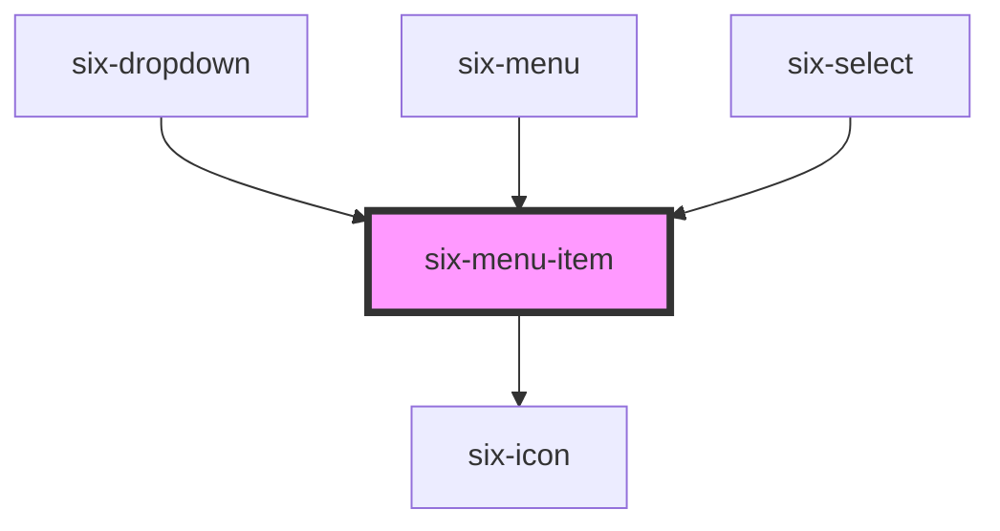

# six-menu-item


## Menu Item

Menu items provide options for the user to pick from in a menu.

<docs-demo-six-menu-item-186></docs-demo-six-menu-item-186>

```html
<six-menu           style="
    max-width: 200px;
    border: solid 1px var(--six-panel-border-color);
    border-radius: var(--six-border-radius-medium);
  "
>
  <six-menu-item>Option 1</six-menu-item>
  <six-menu-item>Option 2</six-menu-item>
  <six-menu-item>Option 3</six-menu-item>
  <six-menu-divider></six-menu-divider>
  <six-menu-item checked>Checked</six-menu-item>
  <six-menu-item disabled>Disabled</six-menu-item>
  <six-menu-divider></six-menu-divider>
  <six-menu-item>
    Prefix Icon
    <six-icon size="small" slot="prefix">favorite</six-icon>
  </six-menu-item>
  <six-menu-item>
    Suffix Icon
    <six-icon size="small" slot="suffix">face</six-icon>
  </six-menu-item>
</six-menu>
```


<!-- Auto Generated Below -->


## Properties

| Property   | Attribute  | Description                                                                                               | Type      | Default |
| ---------- | ---------- | --------------------------------------------------------------------------------------------------------- | --------- | ------- |
| `checked`  | `checked`  | Set to true to draw the item in a checked state.                                                          | `boolean` | `false` |
| `disabled` | `disabled` | Set to true to draw the menu item in a disabled state.                                                    | `boolean` | `false` |
| `value`    | `value`    | A unique value to store in the menu item. This can be used as a way to identify menu items when selected. | `string`  | `''`    |


## Methods

### `getTextLabel() => Promise<string>`

Returns a text label based on the contents of the menu item's default slot.

#### Returns

Type: `Promise<string>`


### `removeFocus() => Promise<void>`

Removes focus from the button.

#### Returns

Type: `Promise<void>`


### `setFocus(options?: FocusOptions) => Promise<void>`

Sets focus on the button.

#### Returns

Type: `Promise<void>`


## Slots

| Slot       | Description                                                  |
| ---------- | ------------------------------------------------------------ |
|            | The menu item's label.                                       |
| `"prefix"` | Used to prepend an icon or similar element to the menu item. |
| `"suffix"` | Used to append an icon or similar element to the menu item.  |


## Shadow Parts

| Part             | Description                                |
| ---------------- | ------------------------------------------ |
| `"base"`         | The component's base wrapper.              |
| `"checked-icon"` | The container that wraps the checked icon. |
| `"label"`        | The menu item label.                       |
| `"prefix"`       | The prefix container.                      |
| `"suffix"`       | The suffix container.                      |


## Dependencies

### Used by

 - [six-dropdown](six-dropdown.html)
 - [six-menu](six-menu.html)
 - [six-select](six-select.html)

### Depends on

- [six-icon](six-icon.html)

### Graph


----------------------------------------------

Copyright © 2021-present SIX-Group
