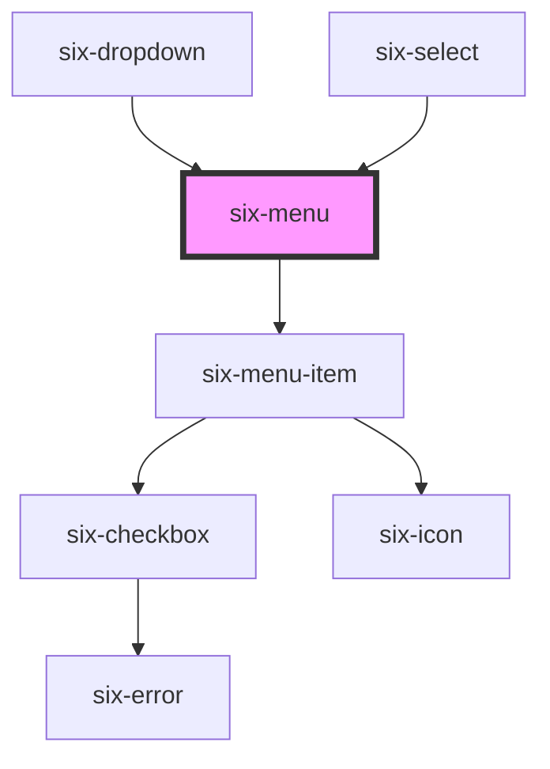

# Menu


## Menu

Menus provide a list of options for the user to choose from.

Use [menu items](six-menu-item.html), [menu dividers](six-menu-divider), and [menu labels](six-menu-label.html) to compose a menu.

<docs-demo-six-menu-0></docs-demo-six-menu-0>

```html
<six-menu style="max-width: 200px">
  <six-menu-item value="undo">Undo</six-menu-item>
  <six-menu-item value="redo">Redo</six-menu-item>
  <six-menu-divider></six-menu-divider>
  <six-menu-item value="cut">Cut</six-menu-item>
  <six-menu-item value="copy">Copy</six-menu-item>
  <six-menu-item value="paste">Paste</six-menu-item>
  <six-menu-item value="delete">Delete</six-menu-item>
</six-menu>
<script type="module">
  let menuElement = document.querySelector('six-menu');
  menuElement.addEventListener('six-menu-item-selected', (event) => {
    alert(event.detail.name);
  });
</script>
```


### Remove Box Shadow

There might be certain scenarios like e.g. when using the six-menu within a restricted outer container where you want to remove the box-shadow, or else it will give a weird artefact. In such a scenario simply put the `remove-box-shadow` attribute on the six-menu

Compare the following examples by scrolling to the right.

<docs-demo-six-menu-1></docs-demo-six-menu-1>

```html
<div style="max-width: 10rem; margin-bottom: 2.5rem">
  <div style="font-weight: bold">With box-shadow (showing ugly artefact)</div>
  <div style="overflow: auto">
    <six-menu>
      <six-menu-item value="val1">some quite long or even very long label</six-menu-item>
    </six-menu>
  </div>
</div>
<div style="max-width: 10rem">
  <div style="font-weight: bold">Without box-shadow (no artefact)</div>
  <div style="overflow: auto">
    <six-menu remove-box-shadow>
      <six-menu-item value="val1">some quite long or even very long label</six-menu-item>
    </six-menu>
  </div>
</div>
```


## Passing items via attribute

If you don't want to create a `six-menu-item` but simply want to pass an array with all options, you can do so via the `items` attribute.

<docs-demo-six-menu-2></docs-demo-six-menu-2>

```html
<six-menu id="six-menu-dynamic-options"> </six-menu>
<script type="module">
  const sixMenuDynamicOptions = document.getElementById('six-menu-dynamic-options');
  sixMenuDynamicOptions.items = Array.from(Array(10).keys()).map((idx) => ({
    label: `label ${idx}`,
    value: `value ${idx}`,
  }));
</script>
```


## Define the number of items shown

There might be scenarios where you want to define the number of items shown.

<docs-demo-six-menu-3></docs-demo-six-menu-3>

```html
<six-menu id="six-menu-scrollable" items-shown="2"> </six-menu>
<script type="module">
  const sixMenuDynamicOptions = document.getElementById('six-menu-scrollable');
  sixMenuDynamicOptions.items = Array.from(Array(10).keys()).map((idx) => ({
    label: `label ${idx}`,
    value: `value ${idx}`,
  }));
</script>
```


## Virtual scrolling

If you have a lot of items in the menu (40'000 in the following example), rendering all of them might lead to some performance issues. To avoid such issues use `virtual-scroll`

By default virtual scrolling will show 5 items, however you can adjust the number of items shown with `items-shown`

<docs-demo-six-menu-4></docs-demo-six-menu-4>

```html
<six-menu id="six-menu-virtualscroll" virtual-scroll> </six-menu>
<script type="module">
  const sixMenuDynamicOptions = document.getElementById('six-menu-virtualscroll');
  sixMenuDynamicOptions.items = Array.from(Array(40000).keys()).map((idx) => ({
    label: `label ${idx}`,
    value: `value ${idx}`,
  }));
</script>
```


<!-- Auto Generated Below -->


## Properties

| Property                  | Attribute                   | Description                                                                                                                                                                                                                         | Type                        | Default     |
| ------------------------- | --------------------------- | ----------------------------------------------------------------------------------------------------------------------------------------------------------------------------------------------------------------------------------- | --------------------------- | ----------- |
| `disableKeyboardHandling` | `disable-keyboard-handling` | Internal: Disables handling of key presses.                                                                                                                                                                                         | `boolean`                   | `false`     |
| `itemSize`                | `item-size`                 | Used for virtual scrolling Define how many items should be rendered in the DOM when using virtual scrolling                                                                                                                         | `number`                    | `10`        |
| `items`                   | --                          | Set the options to be shown in the dropdown                                                                                                                                                                                         | `SixMenuItemData[] \| null` | `null`      |
| `itemsShown`              | `items-shown`               | Defines how many items should be shown. If the number of items is larger than this property a scrollbar will be shown                                                                                                               | `number \| undefined`       | `undefined` |
| `removeBoxShadow`         | `remove-box-shadow`         | Set to true to remove the box-shadow                                                                                                                                                                                                | `boolean`                   | `false`     |
| `scrollingDebounce`       | `scrolling-debounce`        | Used for virtual scrolling Define the debounce for listening on scrolling changes in milliseconds. The lower the number the more sensitive the component reacts to scrolling changes.                                               | `number`                    | `15`        |
| `virtualScroll`           | `virtual-scroll`            | Defines whether the menu list will be rendered virtually i.e. only the elements actually shown (and a couple around) are actually rendered in the DOM. If you use virtual scrolling pass the elements via prop instead of via slot. | `boolean`                   | `false`     |


## Events

| Event                    | Description                           | Type                                      |
| ------------------------ | ------------------------------------- | ----------------------------------------- |
| `six-menu-item-selected` | Emitted when a menu item is selected. | `CustomEvent<SixMenuItemSelectedPayload>` |


## Methods

### `typeToSelect(key: string) => Promise<void>`

Initiates type-to-select logic, which automatically selects an option based on what the user is currently typing.
The key passed will be appended to the internal query and the selection will be updated. After a brief period, the
internal query is cleared automatically. This method is intended to be used with the keydown event. Useful for
enabling type-to-select when the menu doesn't have focus.

#### Parameters

| Name  | Type     | Description |
| ----- | -------- | ----------- |
| `key` | `string` |             |

#### Returns

Type: `Promise<void>`


## Slots

| Slot | Description                                                               |
| ---- | ------------------------------------------------------------------------- |
|      | The menu's content, including menu items, menu dividers, and menu labels. |


## Shadow Parts

| Part        | Description                   |
| ----------- | ----------------------------- |
| `"base"`    | The component's base wrapper. |
| `"wrapper"` |                               |


## Dependencies

### Used by

 - [six-dropdown](six-dropdown.html)
 - [six-select](six-select.html)

### Depends on

- [six-menu-item](six-menu-item.html)

### Graph


----------------------------------------------

Copyright © 2021-present SIX-Group
