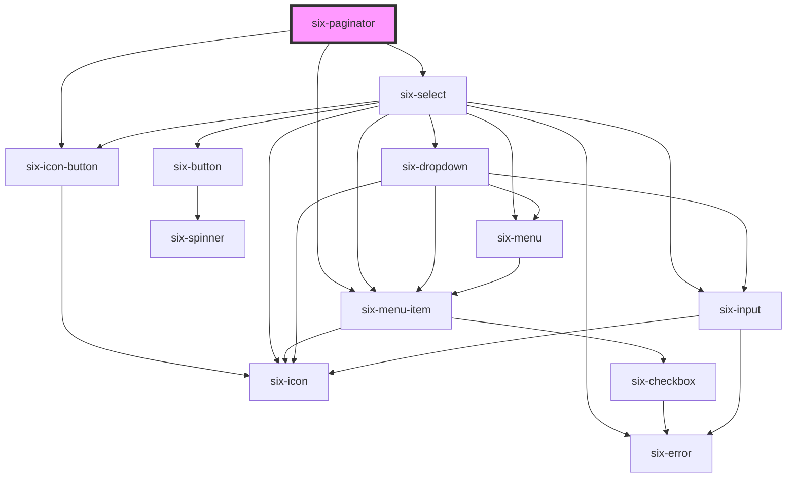

# Paginator


## Paginator

The `six-paginator` component allows navigation through paginated content.


## Basic example

The simplest version of the paginator requires `total-pages` and `total-results` as parameters

<docs-demo-six-paginator-0></docs-demo-six-paginator-0>

```html
<six-paginator total-pages="10" total-results="500"></six-paginator>
```


## Setting the current page

Use the `current-page` attribute (0-based index) to control the active page.

<docs-demo-six-paginator-1></docs-demo-six-paginator-1>

```html
<six-paginator total-pages="10" total-results="500" current-page="3"></six-paginator>
```


## Controlling the amount of pages shown and clamping

Use the `length` prop to define how many page numbers are displayed. By default, if the number of total pages is greater than the `length` parameter, the list will be clamped.

<docs-demo-six-paginator-2></docs-demo-six-paginator-2>

```html
<six-paginator total-pages="20" total-results="500" length="5"></six-paginator>
```


To override this behaviour, you can set the `clamp` parameter to `false`. This will show all available pages.

<docs-demo-six-paginator-3></docs-demo-six-paginator-3>

```html
<six-paginator total-pages="20" total-results="500"></six-paginator>
```


## Results Per Page Options

By default, three values are shown to the user so that they can choose how many items to show at once. Pass a list to `results-per-page-options` and set a default using `results-per-page`. If no default is provided, the first value of the choices will be used.

<docs-demo-six-paginator-4></docs-demo-six-paginator-4>

```html
<six-paginator id="paginator-options" total-pages="15" total-results="500" results-per-page="50">
</six-paginator>
<script>
  const paginatorOptions = document.getElementById('paginator-options');
  paginatorOptions.resultsPerPageOptions = ['10', '20', '50', '100'];
</script>
```


## Disabled State

Use the `disabled` prop to disable all controls.

<docs-demo-six-paginator-5></docs-demo-six-paginator-5>

```html
<six-paginator total-pages="10" total-results="500" disabled></six-paginator>
```


## Slot Customization

Use the `left` and `right` slots to override the default content.

<docs-demo-six-paginator-6></docs-demo-six-paginator-6>

```html
<six-paginator total-pages="12" total-results="640">
  <div slot="left">
    <strong>Some custom content to the left</strong>
  </div>

  <div slot="right">It can be anything you want! A nice icon for example? <six-icon>house</six-icon></div>
</six-paginator>
```


## Events

The paginator emits the following events:

*   `six-paginator-page-changed` – Fired when the page changes. This can be either when the user click on a number directly, or by using one of the available arrows.
*   `six-paginator-results-per-page-changed` – Fired when the user changes their selection for the number of items to show at once. Open up the console and see the messages.

<docs-demo-six-paginator-7></docs-demo-six-paginator-7>

```html
<six-paginator           total-pages="8"
  total-results="200"
  onchange="console.log(event)"
  id="events-example"
></six-paginator>
<script>
  const paginator = document.getElementById('events-example');
  paginator.addEventListener('six-paginator-page-changed', (event) => {
    console.log('Page changed event fired', event.detail);
  });
  paginator.addEventListener('six-paginator-results-per-page-changed', (event) => {
    console.log('Results per page changed event fired', event.detail);
  });
</script>
```


<!-- Auto Generated Below -->


## Properties

| Property                    | Attribute          | Description                                                                                                                            | Type                  | Default        |
| --------------------------- | ------------------ | -------------------------------------------------------------------------------------------------------------------------------------- | --------------------- | -------------- |
| `clamp`                     | `clamp`            | Clamp the page numbers when they exceed the specified length.                                                                          | `boolean`             | `true`         |
| `currentPage`               | `current-page`     | The current page being displayed. This must be 0 based                                                                                 | `number \| undefined` | `undefined`    |
| `disabled`                  | `disabled`         | Disable all controls.                                                                                                                  | `boolean`             | `false`        |
| `length`                    | `length`           | The amount of clickable page numbers to show.                                                                                          | `number`              | `9`            |
| `resultsPerPage`            | `results-per-page` | The results per page. Value must be one provided in the resultsPerPageOption. Otherwise the first value from the options will be used. | `number \| undefined` | `undefined`    |
| `resultsPerPageOptions`     | --                 | The possible results per page. Must be a list of integers. At least one value is required.                                             | `number[]`            | `[12, 24, 48]` |
| `totalPages` _(required)_   | `total-pages`      | The total amount of pages.                                                                                                             | `number`              | `undefined`    |
| `totalResults` _(required)_ | `total-results`    | The total amount of results.                                                                                                           | `number`              | `undefined`    |


## Events

| Event                                    | Description                                                                                                                         | Type                                                    |
| ---------------------------------------- | ----------------------------------------------------------------------------------------------------------------------------------- | ------------------------------------------------------- |
| `six-paginator-page-changed`             | Emitted whenever the page changes. This can be either due to one of the arrows bein pressed, or an explicit click on a page number. | `CustomEvent<SixPaginatorPageChangedPayload>`           |
| `six-paginator-results-per-page-changed` | Emitted after the user selects a value from the results per page select.                                                            | `CustomEvent<SixPaginatorResultsPerPageChangedPayload>` |


## Dependencies

### Depends on

- [six-icon-button](six-icon-button.html)
- [six-select](six-select.html)
- [six-menu-item](six-menu-item.html)

### Graph


----------------------------------------------

Copyright © 2021-present SIX-Group
