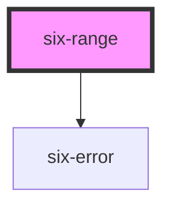

# Range


## Range

Ranges allow the user to select a single value within a given range using a slider.

<docs-demo-six-range-0></docs-demo-six-range-0>

```html
<six-range min="0" max="100" step="1"></six-range>
```


## Examples

### Disabled

Use the `disabled` prop to disable a slider.

<docs-demo-six-range-1></docs-demo-six-range-1>

```html
<six-range min="0" max="100" step="1" disabled></six-range>
```


### Tooltip Placement

By default, the tooltip is shown on top. Set `tooltip` to `bottom` to show it below the slider.

<docs-demo-six-range-2></docs-demo-six-range-2>

```html
<six-range min="0" max="100" step="1" tooltip="bottom"></six-range>
```


### Disable the Tooltip

To disable the tooltip, set `tooltip` to `none`.

<docs-demo-six-range-3></docs-demo-six-range-3>

```html
<six-range min="0" max="100" step="1" tooltip="none"></six-range>
```


### Custom Tooltip Formatter

You can change the tooltip's content by setting the `tooltipFormatter` prop to a function that accepts the range's value as an argument.

<docs-demo-six-range-4></docs-demo-six-range-4>

```html
<six-range min="0" max="100" step="1" class="range-with-custom-formatter"></six-range>

<script>
  const range = document.querySelector('.range-with-custom-formatter');
  range.tooltipFormatter = (value) => `Total - ${value}%`;
</script>
```


### Labels

Use the `label` attribute to give the range an accessible label. For labels that contain HTML, use the label `slot` instead.

<docs-demo-six-range-5></docs-demo-six-range-5>

```html
<six-range label="Volume" min="0" max="100"></six-range>
```


### Help Text

Add descriptive help text to a range with the `help-text` attribute. For help texts that contain HTML, use the `help-text` slot instead.

<docs-demo-six-range-6></docs-demo-six-range-6>

```html
<six-range label="Volume" help-text="Controls the volume of the current song." min="0" max="100"></six-range>
```


### Custom Styling

Add styling attributes e.g. `--track-height, --track-color, --thumb-size, --thumb-color` attribute to customize the appearance of the range.

<docs-demo-six-range-7></docs-demo-six-range-7>

```html
<six-range           min="0"
  max="100"
  step="1"
  style="
    --thumb-size: 20px;
    --track-height: 6px;
    --track-color: var(--six-color-danger-800);
    --thumb-color: var(--six-color-danger-800);
  "
></six-range>
```


## Error Text

Add a descriptive error message using either the `error-text` prop, or the equally named slot.

warning There are two caveats when using the `error-text` prop/slot:

1.  Remember to set the `invalid` prop as well! If you only provide some content to the `error-text` prop/slot, it won't be shown unless the `invalid` prop is set to true
2.  When using the prop, and you need to show more than one message, remember to also set the `error-text-count` prop to a value that is the same or bigger than the length of the list of messages you are using. Otherwise only one message will be shown at a time

The `error-text` prop accepts either a simple string message, or a list of messages.

<docs-demo-six-range-8></docs-demo-six-range-8>

```html
<six-range label="Simple string message" error-text="This is a simple string message" invalid> </six-range>
```


<docs-demo-six-range-9></docs-demo-six-range-9>

```html
<six-range id="multiple-error-text" label="List of string message" invalid></six-range>
<script type="module">
  const sixRange = document.getElementById('multiple-error-text');
  sixRange.errorText = ['Message 1', 'Message 2'];
  sixRange.errorTextCount = 3;
</script>
```


When using the `error-text` slot, it is recommended to use the `six-error` component to wrap the error message(s). This will provide the correct styling out of the box

<docs-demo-six-range-10></docs-demo-six-range-10>

```html
<six-range invalid>
  <div slot="error-text">
    <six-error               >An error message
      <a href="https://github.com/six-group/six-webcomponents" target="_blank">with a link</a></six-error>
  </div>
</six-range>
```


<!-- Auto Generated Below -->


## Properties

| Property           | Attribute          | Description                                                                                                      | Type                          | Default                               |
| ------------------ | ------------------ | ---------------------------------------------------------------------------------------------------------------- | ----------------------------- | ------------------------------------- |
| `disabled`         | `disabled`         | Set to true to disable the input.                                                                                | `boolean`                     | `false`                               |
| `errorText`        | `error-text`       | The error message shown, if `invalid` is set to true.                                                            | `string \| string[]`          | `''`                                  |
| `errorTextCount`   | `error-text-count` | The number of error texts to be shown (if the error-text slot isn't used). Defaults to 1                         | `number \| undefined`         | `undefined`                           |
| `helpText`         | `help-text`        | The range's help text. Alternatively, you can use the help-text slot.                                            | `string`                      | `''`                                  |
| `invalid`          | `invalid`          | If this property is set to true and an error message is provided by `errorText`, the error message is displayed. | `boolean`                     | `false`                               |
| `label`            | `label`            | The label text.                                                                                                  | `string`                      | `''`                                  |
| `max`              | `max`              | The input's max attribute.                                                                                       | `number`                      | `100`                                 |
| `min`              | `min`              | The input's min attribute.                                                                                       | `number`                      | `0`                                   |
| `name`             | `name`             | The input's name attribute.                                                                                      | `string`                      | `''`                                  |
| `required`         | `required`         | Set to true to show an asterisk beneath the label.                                                               | `boolean`                     | `false`                               |
| `step`             | `step`             | The input's step attribute.                                                                                      | `number`                      | `1`                                   |
| `tooltip`          | `tooltip`          | The preferred placedment of the tooltip.                                                                         | `"bottom" \| "none" \| "top"` | `'top'`                               |
| `tooltipFormatter` | --                 | A function used to format the tooltip's value.                                                                   | `(value: number) => string`   | `(value: number) => value.toString()` |
| `value`            | `value`            | The input's value attribute.                                                                                     | `number`                      | `0`                                   |


## Events

| Event              | Description                               | Type                     |
| ------------------ | ----------------------------------------- | ------------------------ |
| `six-range-blur`   | Emitted when the control loses focus.     | `CustomEvent<undefined>` |
| `six-range-change` | Emitted when the control's value changes. | `CustomEvent<undefined>` |
| `six-range-focus`  | Emitted when the control gains focus.     | `CustomEvent<undefined>` |


## Methods

### `removeFocus() => Promise<void>`

Removes focus from the input.

#### Returns

Type: `Promise<void>`


### `setFocus(options?: FocusOptions) => Promise<void>`

Sets focus on the input.

#### Parameters

| Name      | Type                        | Description |
| --------- | --------------------------- | ----------- |
| `options` | `FocusOptions \| undefined` |             |

#### Returns

Type: `Promise<void>`


## Slots

| Slot           | Description                                                                                     |
| -------------- | ----------------------------------------------------------------------------------------------- |
| `"error-text"` | Error text that is shown for validation errors. Alternatively, you can use the error-text prop. |
| `"help-text"`  | Help text that describes how to use the input. Alternatively, you can use the help-text prop.   |
| `"label"`      | The input's label. Alternatively, you can use the label prop.                                   |


## Shadow Parts

| Part        | Description                   |
| ----------- | ----------------------------- |
| `"base"`    | The component's base wrapper. |
| `"input"`   | The native range input.       |
| `"tooltip"` | The range tooltip.            |


## Dependencies

### Depends on

- [six-error](six-error.html)

### Graph


----------------------------------------------

Copyright © 2021-present SIX-Group
