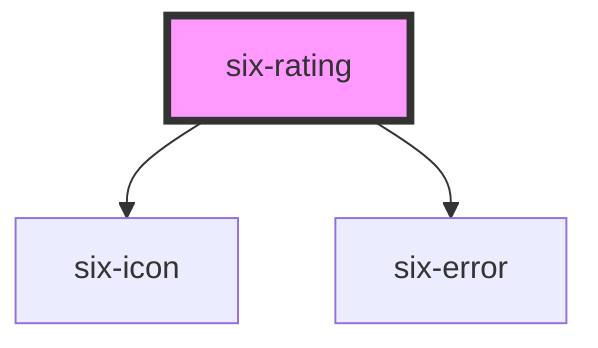

# Rating


## Rating

Rating allow the user to rate something.

<docs-demo-six-rating-0></docs-demo-six-rating-0>

```html
<six-rating></six-rating>
```


## Examples

### Disabled

Use the `disabled` prop to disable it.

<docs-demo-six-rating-1></docs-demo-six-rating-1>

```html
<six-rating value="3" disabled></six-rating>
```


### Readonly

Use the `readonly` prop to make it readonly.

<docs-demo-six-rating-2></docs-demo-six-rating-2>

```html
<six-rating value="3" readonly></six-rating>
```


### Labels

Use the `label` attribute to give the rating an accessible label. For labels that contain HTML, use the label `slot` instead.

<docs-demo-six-rating-3></docs-demo-six-rating-3>

```html
<six-rating label="Rating" max="5"></six-rating>
```


### Help Text

Add descriptive help text to a rating with the `help-text` attribute. For help texts that contain HTML, use the `help-text` slot instead.

<docs-demo-six-rating-4></docs-demo-six-rating-4>

```html
<six-rating label="Rating" help-text="Controls the volume of the current song."></six-rating>
```


### Max

Use the `max` attribute to change the number of stars. The default is 5.  
e.g. max = 10

<docs-demo-six-rating-5></docs-demo-six-rating-5>

```html
<six-rating max="10" value="6"></six-rating>
```


## Sizes

Use the `size` attribute to change an rating's size.

<docs-demo-six-rating-6></docs-demo-six-rating-6>

```html
<six-rating size="xSmall" value="5"></six-rating>
<br>
<six-rating size="small" value="5"></six-rating>
<br>
<six-rating size="medium" value="5"></six-rating>
<br>
<six-rating size="large" value="5"></six-rating>
<br>
<six-rating size="xLarge" value="5"></six-rating>
```


## Error Text

Add a descriptive error message using either the `error-text` prop, or the equally named slot.

warning There are two caveats when using the `error-text` prop/slot:

1.  Remember to set the `invalid` prop as well! If you only provide some content to the `error-text` prop/slot, it won't be shown unless the `invalid` prop is set to true
2.  When using the prop, and you need to show more than one message, remember to also set the `error-text-count` prop to a value that is the same or bigger than the length of the list of messages you are using. Otherwise only one message will be shown at a time

The `error-text` prop accepts either a simple string message, or a list of messages.

<docs-demo-six-rating-7></docs-demo-six-rating-7>

```html
<six-rating label="Simple string message" error-text="This is a simple string message" invalid></six-rating>
```


<docs-demo-six-rating-8></docs-demo-six-rating-8>

```html
<six-rating id="multiple-error-text" label="List of string message" invalid></six-rating>
<script type="module">
  const sixRating = document.getElementById('multiple-error-text');
  sixRating.errorText = ['Message 1', 'Message 2'];
  sixRating.errorTextCount = 3;
</script>
```


When using the `error-text` slot, it is recommended to use the `six-error` component to wrap the error message(s). This will provide the correct styling out of the box

<docs-demo-six-rating-9></docs-demo-six-rating-9>

```html
<six-rating invalid>
  <div slot="error-text">
    <six-error         >An error message
      <a href="https://github.com/six-group/six-webcomponents" target="_blank">with a link</a></six-error>
  </div>
</six-rating>
```


<!-- Auto Generated Below -->


## Properties

| Property         | Attribute          | Description                                                                                                      | Type                                                                                | Default     |
| ---------------- | ------------------ | ---------------------------------------------------------------------------------------------------------------- | ----------------------------------------------------------------------------------- | ----------- |
| `disabled`       | `disabled`         | Set to true to disable the rating.                                                                               | `boolean`                                                                           | `false`     |
| `errorText`      | `error-text`       | The error message shown, if `invalid` is set to true.                                                            | `string \| string[]`                                                                | `''`        |
| `errorTextCount` | `error-text-count` | The number of error texts to be shown (if the error-text slot isn't used). Defaults to 1                         | `number \| undefined`                                                               | `undefined` |
| `helpText`       | `help-text`        | The rating's help text. Alternatively, you can use the help-text slot.                                           | `string`                                                                            | `''`        |
| `invalid`        | `invalid`          | If this property is set to true and an error message is provided by `errorText`, the error message is displayed. | `boolean`                                                                           | `false`     |
| `label`          | `label`            | The label text.                                                                                                  | `string`                                                                            | `''`        |
| `max`            | `max`              | Maximum number of stars. Default is 5                                                                            | `number`                                                                            | `5`         |
| `name`           | `name`             | The rating's name attribute.                                                                                     | `string`                                                                            | `''`        |
| `readonly`       | `readonly`         | If its readonly                                                                                                  | `boolean`                                                                           | `false`     |
| `required`       | `required`         | Set to true to show an asterisk beneath the label.                                                               | `boolean`                                                                           | `false`     |
| `size`           | `size`             | Size of the stars                                                                                                | `"large" \| "medium" \| "small" \| "xLarge" \| "xSmall" \| "xxLarge" \| "xxxLarge"` | `'medium'`  |
| `value`          | `value`            | The rating's value attribute.                                                                                    | `number`                                                                            | `0`         |


## Events

| Event               | Description                                       | Type                     |
| ------------------- | ------------------------------------------------- | ------------------------ |
| `six-rating-blur`   | Emitted when the control loses focus.             | `CustomEvent<number>`    |
| `six-rating-change` | Emitted when the control's checked state changes. | `CustomEvent<number>`    |
| `six-rating-focus`  | Emitted when the control gains focus.             | `CustomEvent<undefined>` |


## Shadow Parts

| Part      | Description |
| --------- | ----------- |
| `"base"`  |             |
| `"input"` |             |


## Dependencies

### Depends on

- [six-icon](six-icon.html)
- [six-error](six-error.html)

### Graph


----------------------------------------------

Copyright © 2021-present SIX-Group
