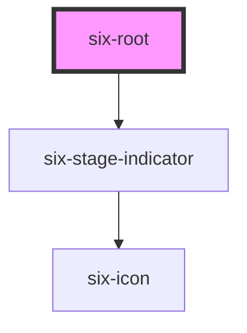

# Root

Six root gives you a [basic layout](<https://en.wikipedia.org/wiki/Holy_grail_(web_design)>) skeleton.


## Basic Layout with all elements

`six-root` provides a basic application layout.

You can remove the content padding by adding `padded="false"` to `six-root`.

You can provide a stage indicator by adding `stage="DEV"` to `six-root` as well as provide version information by adding `version="DEV-1.1.2"`to `six-root`. Providing nothing or `PROD` will disable stage indication

<docs-demo-six-root-0></docs-demo-six-root-0>

```html
<div class="six-root-wrapper">
  <six-root stage="PROD" style="height: 100%" version="PROD-1.2.3">
    <six-header slot="header">
      
      <six-header-item>
        <six-icon-button id="menu-button" name="menu"></six-icon-button>
      </six-header-item>

      
      <six-header-item>
        <six-icon-button href="https://six-group.github.io/six-webcomponents/">
          <six-logo></six-logo>
        </six-icon-button>
      </six-header-item>

      
      <six-header-item id="search-header-item" style="margin-left: auto">
        <six-icon-button name="search"></six-icon-button>
      </six-header-item>

      
      <six-header-dropdown-item>
        <six-icon-button slot="trigger">
          <six-avatar                     image="https://images.unsplash.com/photo-1529778873920-4da4926a72c2?ixlib=rb-1.2.1&auto=format&fit=crop&w=300&q=80"
          >
          </six-avatar>
        </six-icon-button>
        <six-menu>
          <six-menu-item><b>Cat Kittens</b><br>cat.kitty.kittens@themCatsBeCool.com</six-menu-item>
          <six-menu-item><b>Language</b><br><six-language-switcher></six-language-switcher></six-menu-item>
          <six-menu-item>Change password</six-menu-item>
          <six-menu-item>Logout</six-menu-item>
        </six-menu>
      </six-header-dropdown-item>

      
      <six-search-field slot="search-field" placeholder="Search for some 'a' ..." clearable>
        <div id="search-results">Some results</div>
      </six-search-field>
    </six-header>

    <six-sidebar open position="left" slot="left-sidebar">
      <six-sidebar-item-group icon="description" name="Upload">
        <six-sidebar-item>Data</six-sidebar-item>
        <six-sidebar-item>History</six-sidebar-item>
        <six-sidebar-item-group icon="settings" name="Settings">
          <six-sidebar-item>Data</six-sidebar-item>
          <six-sidebar-item>History</six-sidebar-item>
        </six-sidebar-item-group>
      </six-sidebar-item-group>
      <six-sidebar-item-group icon="task" name="Tasks">
        <six-sidebar-item>Open</six-sidebar-item>
        <six-sidebar-item>Closed</six-sidebar-item>
      </six-sidebar-item-group>
      <six-sidebar-item-group icon="ac_unit" name="Transactions"></six-sidebar-item-group>
      <six-sidebar-item-group icon="settings" name="Reclaims"></six-sidebar-item-group>
      <six-sidebar-item-group icon="description" name="Upload">
        <six-sidebar-item>Data</six-sidebar-item>
        <six-sidebar-item>History</six-sidebar-item>
        <six-sidebar-item-group icon="settings" name="Settings">
          <six-sidebar-item>Data</six-sidebar-item>
          <six-sidebar-item>History</six-sidebar-item>
        </six-sidebar-item-group>
      </six-sidebar-item-group>
      <six-sidebar-item-group icon="description" name="Upload">
        <six-sidebar-item>Data</six-sidebar-item>
        <six-sidebar-item>History</six-sidebar-item>
        <six-sidebar-item-group icon="settings" name="Settings">
          <six-sidebar-item>Data</six-sidebar-item>
          <six-sidebar-item>History</six-sidebar-item>
        </six-sidebar-item-group>
      </six-sidebar-item-group>
      <six-sidebar-item-group icon="task" name="Tasks">
        <six-sidebar-item>Open</six-sidebar-item>
        <six-sidebar-item>Closed</six-sidebar-item>
      </six-sidebar-item-group>
      <six-sidebar-item-group icon="ac_unit" name="Transactions"></six-sidebar-item-group>
      <six-sidebar-item-group icon="settings" name="Reclaims"></six-sidebar-item-group>
      <six-sidebar-item-group icon="description" name="Upload">
        <six-sidebar-item>Data</six-sidebar-item>
        <six-sidebar-item>History</six-sidebar-item>
        <six-sidebar-item-group icon="settings" name="Settings">
          <six-sidebar-item>Data</six-sidebar-item>
          <six-sidebar-item>History</six-sidebar-item>
        </six-sidebar-item-group>
      </six-sidebar-item-group>
    </six-sidebar>

    <div slot="main">
      <p>Content</p>
      <div>
        <six-button id="show-tasks">Show some tasks...</six-button>
        <six-button id="toggle-text">Toggle some text...</six-button>
      </div>
      <section id="text-section">
        <h1>Lorem ipsum</h1>
        Lorem ipsum dolor sit amet, consectetur adipisicing elit. Animi facere facilis incidunt quia veniam?
        Accusamus aperiam assumenda, at aut blanditiis culpa cupiditate debitis, deleniti dolores earum
        exercitationem facere facilis iste labore laborum nemo obcaecati quae qui recusandae reprehenderit
        repudiandae sapiente sunt ullam velit vero vitae voluptas! Aperiam asperiores aspernatur dolore eveniet,
        exercitationem fugiat illum in iusto mollitia numquam obcaecati provident quas quasi tempore voluptas!
        Esse et ex libero. Cum deserunt dicta dolor exercitationem quod quos.
      </section>
    </div>

    <six-sidebar position="right" slot="right-sidebar">
      <six-card>
        <h3>Task</h3>
        <p>
          Lorem ipsum dolor sit amet, consectetur adipisicing elit. Alias aliquid aperiam, beatae debitis
          delectus deleniti eius enim est ex facilis id incidunt modi nostrum odio, repudiandae sed velit vitae,
          voluptas.
        </p>
      </six-card>
      <six-card>
        <h3>Task</h3>
        <p>
          Lorem ipsum dolor sit amet, consectetur adipisicing elit. Alias aliquid aperiam, beatae debitis
          delectus deleniti eius enim est ex facilis id incidunt modi nostrum odio, repudiandae sed velit vitae,
          voluptas.
        </p>
      </six-card>
      <six-card>
        <h3>Task</h3>
        <p>
          Lorem ipsum dolor sit amet, consectetur adipisicing elit. Alias aliquid aperiam, beatae debitis
          delectus deleniti eius enim est ex facilis id incidunt modi nostrum odio, repudiandae sed velit vitae,
          voluptas.
        </p>
      </six-card>
      <six-card>
        <h3>Task</h3>
        <p>
          Lorem ipsum dolor sit amet, consectetur adipisicing elit. Alias aliquid aperiam, beatae debitis
          delectus deleniti eius enim est ex facilis id incidunt modi nostrum odio, repudiandae sed velit vitae,
          voluptas.
        </p>
      </six-card>
      <six-card>
        <h3>Task</h3>
        <p>
          Lorem ipsum dolor sit amet, consectetur adipisicing elit. Alias aliquid aperiam, beatae debitis
          delectus deleniti eius enim est ex facilis id incidunt modi nostrum odio, repudiandae sed velit vitae,
          voluptas.
        </p>
      </six-card>
      <six-card>
        <h3>Task</h3>
        <p>
          Lorem ipsum dolor sit amet, consectetur adipisicing elit. Alias aliquid aperiam, beatae debitis
          delectus deleniti eius enim est ex facilis id incidunt modi nostrum odio, repudiandae sed velit vitae,
          voluptas.
        </p>
      </six-card>
      <six-card>
        <h3>Task</h3>
        <p>
          Lorem ipsum dolor sit amet, consectetur adipisicing elit. Alias aliquid aperiam, beatae debitis
          delectus deleniti eius enim est ex facilis id incidunt modi nostrum odio, repudiandae sed velit vitae,
          voluptas.
        </p>
      </six-card>
      <six-card>
        <h3>Task</h3>
        <p>
          Lorem ipsum dolor sit amet, consectetur adipisicing elit. Alias aliquid aperiam, beatae debitis
          delectus deleniti eius enim est ex facilis id incidunt modi nostrum odio, repudiandae sed velit vitae,
          voluptas.
        </p>
      </six-card>
      <six-card>
        <h3>Task</h3>
        <p>
          Lorem ipsum dolor sit amet, consectetur adipisicing elit. Alias aliquid aperiam, beatae debitis
          delectus deleniti eius enim est ex facilis id incidunt modi nostrum odio, repudiandae sed velit vitae,
          voluptas.
        </p>
      </six-card>
      <six-card>
        <h3>Task</h3>
        <p>
          Lorem ipsum dolor sit amet, consectetur adipisicing elit. Alias aliquid aperiam, beatae debitis
          delectus deleniti eius enim est ex facilis id incidunt modi nostrum odio, repudiandae sed velit vitae,
          voluptas.
        </p>
      </six-card>
    </six-sidebar>

    <six-footer slot="footer">Copyright © 2021-present SIX Group</six-footer>
  </six-root>
</div>

<six-drawer class="drawer-overview" label="Drawer">
  Lorem ipsum dolor sit amet, consectetur adipiscing elit.
  <six-button slot="footer">Close</six-button>
</six-drawer>

<script type="module">
  (() => {
    const getElements = (e) =>
      Object.entries(e).reduce(
        (e, [r, t]) => ({
          ...e,
          [r]: Array.isArray(t)
            ? t.flatMap((s) => Array.from(document.querySelectorAll(s)))
            : document.querySelector(t),
        }),
        {}
      );

    const Select = getElements({
      header: 'six-header',
      leftSidebar: 'six-sidebar[slot="left-sidebar"]',
      tasksButton: '#show-tasks',
      textButton: '#toggle-text',
      textSection: '#text-section',
      rightSidebar: 'six-sidebar[slot="right-sidebar"]',
      drawer: 'six-drawer',
      cards: ['six-sidebar[slot="right-sidebar"] six-card'],
      hamburger: '#menu-button',
      searchItem: '#search-header-item',
    });

    Select.hamburger.addEventListener('click', () => Select.leftSidebar.toggleAttribute('open'));

    Select.leftSidebar.addEventListener('six-sidebar-hide', () => (Select.header.openHamburgerMenu = false));

    Select.leftSidebar.addEventListener('six-sidebar-show', () => (Select.header.openHamburgerMenu = true));

    Select.tasksButton.addEventListener('click', () => Select.rightSidebar.toggleAttribute('open'));

    Select.cards.forEach((card) => {
      card.addEventListener('click', () => Select.drawer.toggleAttribute('open'));
    });

    Select.searchItem.addEventListener('click', () => {
      Select.header.openSearch = !Select.header.openSearch;
      Select.searchItem.active = Select.header.openSearch;
    });

    Select.textButton.addEventListener('click', () => {
      Select.textSection.style.display = Select.textSection.style.display === 'none' ? 'block' : 'none';
    });
  })();
</script>
<style>
  .six-root-wrapper {
    height: 78vh;
    width: 100%;
    border: solid 1rem rgba(0, 0, 0, 0.2);
  }

  .six-root-wrapper::after {
    content: '';
    height: 5rem;
  }
</style>
```


<!-- Auto Generated Below -->


## Properties

| Property  | Attribute | Description                                          | Type                                                                   | Default |
| --------- | --------- | ---------------------------------------------------- | ---------------------------------------------------------------------- | ------- |
| `padded`  | `padded`  | Defines whether the content section should be padded | `boolean`                                                              | `true`  |
| `stage`   | `stage`   | Defines the stage of the application                 | `"ACCEPTANCE" \| "DEV" \| "ETU" \| "ITU" \| "LOCAL" \| "PROD" \| null` | `null`  |
| `version` | `version` | Defines the version of the application               | `string`                                                               | `''`    |


## Slots

| Slot              | Description                                     |
| ----------------- | ----------------------------------------------- |
| `"footer"`        | Used to define the footer component.            |
| `"header"`        | Used to define the header component.            |
| `"left-sidebar"`  | Used to define the sidebar on the left side.    |
| `"main"`          | Used to define the components in the main area. |
| `"right-sidebar"` | Used to define the sidebar on the right side.   |


## Shadow Parts

| Part              | Description |
| ----------------- | ----------- |
| `"container"`     |             |
| `"header"`        |             |
| `"left-sidebar"`  |             |
| `"main"`          |             |
| `"right-sidebar"` |             |


## Dependencies

### Depends on

- [six-stage-indicator](six-stage-indicator.html)

### Graph


----------------------------------------------

Copyright © 2021-present SIX-Group
