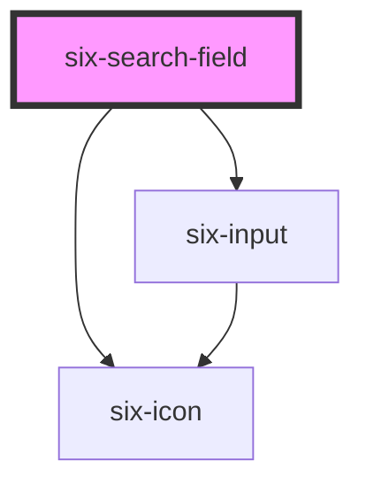

# six-search-field


# Basic Search Field

Showing a basic search field returning results on pressing on a default debounce

<docs-demo-six-search-field-222></docs-demo-six-search-field-222>

```html
<six-search-field placeholder="Search" id="basic-search-field">
  <div id="search-results"></div>
</six-search-field>
<script type="module">
  const basicSearchField = document.getElementById('basic-search-field');
  const searchResultsBox = document.getElementById('search-results');

  basicSearchField.addEventListener('six-search-field-change', (event) => {
    searchResultsBox.innerHTML = event.detail.value;
    searchResultsBox.style.padding = '1em';
  });
</script>
```


<!-- Auto Generated Below -->


## Properties

| Property      | Attribute     | Description                                                    | Type                  | Default                 |
| ------------- | ------------- | -------------------------------------------------------------- | --------------------- | ----------------------- |
| `clearable`   | `clearable`   | Set to true to add a clear button when the input is populated. | `boolean`             | `false`                 |
| `debounce`    | `debounce`    | Debounce time in milliseconds, default is 300 ms               | `number`              | `DEFAULT_DEBOUNCE_FAST` |
| `disabled`    | `disabled`    | Set to true to disable the input.                              | `boolean`             | `false`                 |
| `placeholder` | `placeholder` | The input's placeholder text.                                  | `string \| undefined` | `undefined`             |
| `value`       | `value`       | The input's value attribute.                                   | `string`              | `''`                    |


## Events

| Event                     | Description                        | Type                                       |
| ------------------------- | ---------------------------------- | ------------------------------------------ |
| `six-search-field-change` | Emitted when a search is triggered | `CustomEvent<SixSearchFieldChangePayload>` |


## Slots

| Slot | Description                                            |
| ---- | ------------------------------------------------------ |
|      | Used to define the results below the search component. |


## Dependencies

### Depends on

- [six-input](six-input.html)
- [six-icon](six-icon.html)

### Graph


----------------------------------------------

Copyright © 2021-present SIX-Group
