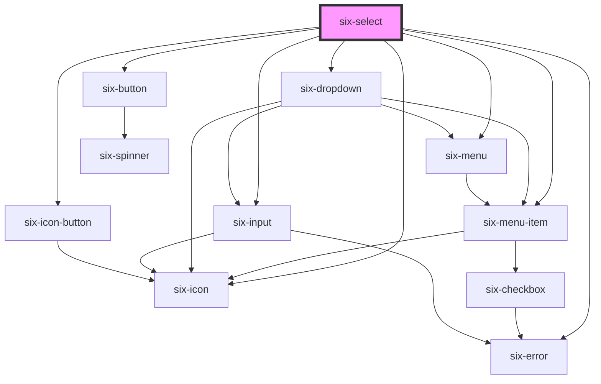

# Select


## Select

Selects allow you to choose one or more items from a dropdown menu, usually you wrap this component with a html form. If you're looking for a dropdown menu to trigger actions, you should try [six-dropdown](six-dropdown.html).

<docs-demo-six-select-0></docs-demo-six-select-0>

```html
<six-select>
  <six-menu-item value="option-1">Option 1</six-menu-item>
  <six-menu-item value="option-2">Option 2</six-menu-item>
  <six-menu-item value="option-3">Option 3</six-menu-item>
  <six-menu-item value="option-4">Option 4</six-menu-item>
  <six-menu-item value="option-5">Option 5</six-menu-item>
  <six-menu-item value="option-6">Option 6</six-menu-item>
  <six-menu-item value="option-7">Option 7</six-menu-item>
  <six-menu-item value="option-8">Option 8</six-menu-item>
  <six-menu-item value="option-9">Option 9</six-menu-item>
</six-select>
```


## Examples

### Placeholders

Use the `placeholder` attribute to add a placeholder.

<docs-demo-six-select-1></docs-demo-six-select-1>

```html
<six-select placeholder="Select one">
  <six-menu-item value="option-1">Option 1</six-menu-item>
  <six-menu-item value="option-2">Option 2</six-menu-item>
  <six-menu-item value="option-3">Option 3</six-menu-item>
</six-select>
```


### Clearable

Use the `clearable` attribute to make the control clearable.

<docs-demo-six-select-2></docs-demo-six-select-2>

```html
<six-select placeholder="Clearable" clearable>
  <six-menu-item value="option-1">Option 1</six-menu-item>
  <six-menu-item value="option-2">Option 2</six-menu-item>
  <six-menu-item value="option-3">Option 3</six-menu-item>
</six-select>
```


### Preselecting a Value

Use the `value` attribute to preselect a default value

<docs-demo-six-select-3></docs-demo-six-select-3>

```html
<six-select value="option-2" clearable>
  <six-menu-item value="option-1">Option 1</six-menu-item>
  <six-menu-item value="option-2">Option 2</six-menu-item>
  <six-menu-item value="option-3">Option 3</six-menu-item>
</six-select>
```


### Default Value

If you want the select to be reset to a default value use the attribute `default-value`

<docs-demo-six-select-4></docs-demo-six-select-4>

```html
<six-select value="option-2" default-value="option-3" clearable>
  <six-menu-item value="option-1">Option 1</six-menu-item>
  <six-menu-item value="option-2">Option 2</six-menu-item>
  <six-menu-item value="option-3">Option 3</six-menu-item>
</six-select>
```


### Pill

Use the `pill` prop to give selects rounded edges.

<docs-demo-six-select-5></docs-demo-six-select-5>

```html
<six-select pill>
  <six-menu-item value="option-1">Option 1</six-menu-item>
  <six-menu-item value="option-2">Option 2</six-menu-item>
  <six-menu-item value="option-3">Option 3</six-menu-item>
</six-select>
```


### Line

Use the `line` prop to give show selection in line style.

<docs-demo-six-select-6></docs-demo-six-select-6>

```html
<six-select line>
  <six-menu-item value="option-1">Option 1</six-menu-item>
  <six-menu-item value="option-2">Option 2</six-menu-item>
  <six-menu-item value="option-3">Option 3</six-menu-item>
</six-select>
```


### Disabled

Use the `disabled` prop to disable a select.

<docs-demo-six-select-7></docs-demo-six-select-7>

```html
<six-select placeholder="Disabled" disabled>
  <six-menu-item value="option-1">Option 1</six-menu-item>
  <six-menu-item value="option-2">Option 2</six-menu-item>
  <six-menu-item value="option-3">Option 3</six-menu-item>
</six-select>
```


### Multiple

To allow multiple options to be selected, use the `multiple` attribute. It's a good practice to use clearable when this option is enabled. When using this option, value will be an array instead of a string.

<docs-demo-six-select-8></docs-demo-six-select-8>

```html
<six-select filter placeholder="Select a few" multiple clearable>
  <six-menu-item value="option-1">Option 1</six-menu-item>
  <six-menu-item value="option-2">Option 2</six-menu-item>
  <six-menu-item value="option-3">Option 3</six-menu-item>
  <six-menu-item value="option-4">Option 4</six-menu-item>
  <six-menu-item value="option-5">Option 5</six-menu-item>
  <six-menu-item value="option-6">Option 6 (with tooltip due to long text)</six-menu-item>
</six-select>
```


### Grouping Options

Options can be grouped visually using menu labels and menu dividers.

<docs-demo-six-select-9></docs-demo-six-select-9>

```html
<six-select placeholder="Select one">
  <six-menu-label>Group 1</six-menu-label>
  <six-menu-item value="option-1">Option 1</six-menu-item>
  <six-menu-item value="option-2">Option 2</six-menu-item>
  <six-menu-item value="option-3">Option 3</six-menu-item>
  <six-menu-divider></six-menu-divider>
  <six-menu-label>Group 2</six-menu-label>
  <six-menu-item value="option-4">Option 4</six-menu-item>
  <six-menu-item value="option-5">Option 5</six-menu-item>
  <six-menu-item value="option-6">Option 6</six-menu-item>
</six-select>
```


### Sizes

Use the `size` attribute to change a select's size.

<docs-demo-six-select-10></docs-demo-six-select-10>

```html
<six-select placeholder="Small" size="small" multiple>
  <six-menu-item value="option-1">Option 1</six-menu-item>
  <six-menu-item value="option-2">Option 2</six-menu-item>
  <six-menu-item value="option-3">Option 3</six-menu-item>
</six-select>

<br>

<six-select placeholder="Medium" size="medium" multiple>
  <six-menu-item value="option-1">Option 1</six-menu-item>
  <six-menu-item value="option-2">Option 2</six-menu-item>
  <six-menu-item value="option-3">Option 3</six-menu-item>
</six-select>

<br>

<six-select placeholder="Large" size="large" multiple>
  <six-menu-item value="option-1">Option 1</six-menu-item>
  <six-menu-item value="option-2">Option 2</six-menu-item>
  <six-menu-item value="option-3">Option 3</six-menu-item>
</six-select>
```


### Selecting Options Programmatically

The `value` prop is bound to the current selection. As the selection changes, so will the value. To programmatically manage the selection, update the value property.

<docs-demo-six-select-11></docs-demo-six-select-11>

```html
<div class="selecting-example">
  <six-select placeholder="">
    <six-menu-item value="option-1">Option 1</six-menu-item>
    <six-menu-item value="option-2">Option 2</six-menu-item>
    <six-menu-item value="option-3">Option 3</six-menu-item>
  </six-select>

  <br>

  <six-button data-option="option-1">Set 1</six-button>
  <six-button data-option="option-2">Set 2</six-button>
  <six-button data-option="option-3">Set 3</six-button>
</div>

<script type="module">
  (() => {
    const container = document.querySelector('.selecting-example');
    const select = container.querySelector('six-select');

    [...container.querySelectorAll('six-button')].map((button) => {
      button.addEventListener('click', () => {
        select.value = button.dataset.option;
      });
    });
  })();
</script>
```


### Labels

Use the `label` attribute to give the select an accessible label. For labels that contain HTML, use the `label` slot instead.

<docs-demo-six-select-12></docs-demo-six-select-12>

```html
<six-select label="Select one">
  <six-menu-item value="option-1">Option 1</six-menu-item>
  <six-menu-item value="option-2">Option 2</six-menu-item>
  <six-menu-item value="option-3">Option 3</six-menu-item>
</six-select>
```


### Help Text

Add descriptive help text to a select with the `help-text` attribute. For help texts that contain HTML, use the help-text slot instead.

<docs-demo-six-select-13></docs-demo-six-select-13>

```html
<six-select label="Experience" help-text="Please tell us your skill level.">
  <six-menu-item value="option-1">Novice</six-menu-item>
  <six-menu-item value="option-2">Intermediate</six-menu-item>
  <six-menu-item value="option-3">Advanced</six-menu-item>
</six-select>
```


### Hoisting

Dropdown panels will be clipped if they're inside a container that has overflow: auto|hidden. The hoist attribute forces the panel to use a fixed positioning strategy, allowing it to break out of the container. In this case, the panel will be positioned relative to its containing block, which is usually the viewport unless an ancestor uses a transform, perspective, or filter.

<docs-demo-six-select-14></docs-demo-six-select-14>

```html
<div style="overflow: hidden; border: solid 1px grey; padding: 0.5em; display: flex">
  <six-select placeholder="No Hoisting" style="width: 10em">
    <six-menu-item value="option-1">Novice</six-menu-item>
    <six-menu-item value="option-2">Intermediate</six-menu-item>
    <six-menu-item value="option-3">Advanced</six-menu-item>
  </six-select>

  <six-select placeholder="Hoisting" filter="true" hoist style="width: 10em">
    <six-menu-item value="option-1">Novice</six-menu-item>
    <six-menu-item value="option-2">Intermediate</six-menu-item>
    <six-menu-item value="option-3">Advanced</six-menu-item>
  </six-select>
</div>
```


#### Hoisting inside Drawer

There was a bug where hoisting inside drawers caused a problem

<docs-demo-six-select-15></docs-demo-six-select-15>

```html
<six-button id="hoistingDrawerBtn">Open Drawer</six-button>
<six-drawer id="hoistingDrawer" label="Drawer" class="drawer-overview">
  Lorem ipsum dolor sit amet, consectetur adipiscing elit.
  <six-button slot="footer">Close</six-button>
  <div class="demo" style="width: 300px">
    <six-tooltip content="something">
      <div>some tooltip</div>
    </six-tooltip>
    <div style="overflow: hidden; border: solid 1px grey; padding: 0.5em; display: flex">
      <six-select placeholder="No Hoisting" style="width: 10em">
        <six-tooltip content="something">
          <six-menu-item value="option-1">Novice</six-menu-item>
        </six-tooltip>
        <six-menu-item value="option-2">Intermediate</six-menu-item>
        <six-menu-item value="option-3">Advanced</six-menu-item>
      </six-select>

      <six-select placeholder="Hoisting" hoist style="width: 10em">
        <six-menu-item value="option-1">Novice</six-menu-item>
        <six-menu-item value="option-2">Intermediate</six-menu-item>
        <six-menu-item value="option-3">Advanced</six-menu-item>
      </six-select>
    </div>

    <div style="overflow: hidden; border: solid 1px grey; padding: 0.5em; display: flex">
      <six-dropdown>
        <six-button slot="trigger" caret>No Hoist</six-button>
        <six-menu>
          <six-menu-item>Item 1</six-menu-item>
          <six-menu-item>Item 2</six-menu-item>
          <six-menu-item>Item 3</six-menu-item>
        </six-menu>
      </six-dropdown>

      <six-dropdown hoist>
        <six-button slot="trigger" caret>Hoist</six-button>
        <six-menu>
          <six-menu-item>Item 1</six-menu-item>
          <six-menu-item>Item 2</six-menu-item>
          <six-menu-item>Item 3</six-menu-item>
        </six-menu>
      </six-dropdown>
    </div>
  </div>
</six-drawer>

<script type="module">
  const sixDrawerBtn = document.querySelector('#hoistingDrawerBtn');
  const sixDrawer = document.querySelector('#hoistingDrawer');
  sixDrawerBtn.addEventListener('click', () => (sixDrawer.open = true));
</script>
```


### Enable Filtering Items

You can filter the items shown by simply adding `filter="true"` to six-select

You can also pass a custom placeholder with `filter-placeholder` to be shown in the filter input field (will be 'Filter...' by default)

<docs-demo-six-select-16></docs-demo-six-select-16>

```html
<six-select label="Experience" filter multiple select-all-button clearable>
  <six-menu-item value="AUSTRALIA">Australia</six-menu-item>
  <six-menu-item value="BRAZIL">Brazil</six-menu-item>
  <six-menu-item value="CHINA">China</six-menu-item>
  <six-menu-item value="EGYPT">Egypt</six-menu-item>
  <six-menu-item value="FRANCE">France</six-menu-item>
  <six-menu-item value="GERMANY">Germany</six-menu-item>
  <six-menu-item value="INDIA">India</six-menu-item>
  <six-menu-item value="JAPAN">Japan</six-menu-item>
  <six-menu-item value="SPAIN">Spain</six-menu-item>
  <six-menu-item value="UNITED_STATES">United States</six-menu-item>
</six-select>
```


### Async Filtering

You might have a usecase where the full list of items in the dropdown would be too large and you need to call a backend when filtering the dropdown

In such a scenario simply add the `async-filter` attribute to your dropdown component

If you want to change the default debounce timeout use e.g. `filter-debounce="500"`

<docs-demo-six-select-17></docs-demo-six-select-17>

```html
<six-select id="async-select" async-filter filter-placeholder="Enter a number">
  <six-menu-item id="async-menu-item" value="search_list_prompt">Use search to show entries</six-menu-item>
</six-select>
<script type="module">
  const asyncSelect = document.querySelector('#async-select');
  const asyncMenu = document.querySelector('#async-menu-item').parentElement;

  for (let i = 0; i < 500; i++) {
    const child = document.createElement('six-menu-item');
    child.innerText = `Value ${i}`;
    child.value = `value-${i}`;
    asyncMenu.appendChild(child);
  }

  const removeAllChildNodes = (parent) => {
    while (parent.firstChild) {
      parent.removeChild(parent.firstChild);
    }
  };

  asyncSelect.addEventListener('six-async-filter-fired', ($event) => {
    const filterValue = $event.detail.filterValue;
    removeAllChildNodes(asyncMenu);
    for (let i = 0; i < 500; i++) {
      const child = document.createElement('six-menu-item');
      child.innerText = `Value ${i}`;
      child.value = `value-${i}`;
      if (
        filterValue.includes(`${i}`) ||
        filterValue.toLocaleLowerCase().includes(`value`) ||
        filterValue.toLocaleLowerCase().includes(`value ${i}`) ||
        filterValue === ''
      ) {
        asyncMenu.appendChild(child);
      }
    }
  });
</script>
```


### Infinite Scrolling

If you have huge amounts of data you want to present in the dropdown you can't render all at once or it will crash your browser. For these usescases listen to the scroll event to decide which data to present.

<docs-demo-six-select-18></docs-demo-six-select-18>

```html
<six-select id="infinite-scoll-dropdown">
  <six-menu-item id="infinite-scroll-menu" value="search_list_prompt">Value 0</six-menu-item>
</six-select>
<script type="module">
  const asyncSelect = document.querySelector('#infinite-scoll-dropdown');
  const asyncMenu = document.querySelector('#infinite-scroll-menu').parentElement;

  let id = 1;

  for (let i = 0; i < 20; i++) {
    const child = document.createElement('six-menu-item');
    child.innerText = `Value ${id}`;
    child.value = `value-${id}`;
    asyncMenu.appendChild(child);
    id++;
  }

  asyncSelect.addEventListener('six-dropdown-scroll', ($event) => {
    const { scrollRatio } = $event.detail;

    // add new elements once we reach almost bottom
    if (scrollRatio > 0.8) {
      for (let i = 0; i < 20; i++) {
        const child = document.createElement('six-menu-item');
        child.innerText = `Value ${id}`;
        child.value = `value-${id}`;
        asyncMenu.appendChild(child);
        id++;
      }
    }
  });
</script>
```


### Autocomplete

AutoComplete is an input element providing a panel with real-time suggestions on typing.

Autocomplete does currently not support multiselect!

You can adjust the debounce timeout via the `input-debounce` attribute

<docs-demo-six-select-19></docs-demo-six-select-19>

```html
<six-select id="autocomplete-example" autocomplete clearable></six-select>
<script type="module">
  (() => {
    const clearAllChildren = (node) => {
      let child = node.lastElementChild;
      while (child) {
        node.removeChild(child);
        child = node.lastElementChild;
      }
    };

    const createMenuItem = (value, label) => {
      const menuItem = document.createElement('six-menu-item');
      menuItem.innerText = label;
      menuItem.setAttribute('value', value);
      return menuItem;
    };

    const select = document.getElementById('autocomplete-example');

    select.addEventListener('six-select-change', (event) => {
      if (event.detail.isSelected) {
        // don't fetch new values on selection
        return;
      }
      clearAllChildren(select);

      const enteredText = event.detail.value || 'All Values';
      new Array(5).fill('').forEach((item, idx) => {
        select.append(createMenuItem(`option ${enteredText} ${idx}`, `Option ${enteredText} ${idx}`));
      });
    });
  })();
</script>
```


## Passing items via options attribute

If you don't want to create a `six-menu-item` but simply want to pass an array with all options, you can do so via the `options` attribute.

<docs-demo-six-select-20></docs-demo-six-select-20>

```html
<six-select filter multiple id="six-select-dynamic-options"></six-select>
<script type="module">
  const sixSelectDynamicOptions = document.getElementById('six-select-dynamic-options');
  sixSelectDynamicOptions.options = Array.from(Array(100).keys()).map((idx) => ({
    label: `label ${idx}`,
    value: `value ${idx}`,
  }));
</script>
```


## Virtual Scrolling

If you have a lot of items in the menu (100'000 in the following example), rendering all of them might lead to some performance issues. To avoid such issues use `virtual-scroll`

<docs-demo-six-select-21></docs-demo-six-select-21>

```html
<six-select id="six-select-virtual-scroll" virtual-scroll></six-select>
<script type="module">
  const sixSelectDynamicOptions = document.getElementById('six-select-virtual-scroll');
  sixSelectDynamicOptions.options = Array.from(Array(100000).keys()).map((idx) => ({
    label: `label ${idx}`,
    value: `value ${idx}`,
  }));
</script>
```


### Virtually scrolled Autocomplete

In the following example you see the combination of `autocomplete` with `virtual-scroll`. The list contains 10'000 entries. Enter a number in the input field and you can virtually scroll through all elements which contain this number.

<docs-demo-six-select-22></docs-demo-six-select-22>

```html
<six-select id="virtual-autocomplete-example" autocomplete clearable virtual-scroll></six-select>
<script type="module">
  const virtualAutocomplete = document.getElementById('virtual-autocomplete-example');

  // generate some options
  const allOptions = Array.from(Array(10000).keys()).map((idx) => ({
    label: `label ${idx}`,
    value: `value ${idx}`,
  }));

  // assign the options to the six-select
  virtualAutocomplete.options = allOptions;

  // set up an eventlistener on change
  virtualAutocomplete.addEventListener('six-select-change', (event) => {
    if (event.detail.isSelected) {
      // don't fetch new values on selection
      return;
    }

    const enteredText = event.detail.value;
    if (!enteredText) {
      // if no text has been entered all options should be available
      virtualAutocomplete.options = allOptions;
    }

    // otherwise if a text has been entered filter for all options which contain the entered text
    virtualAutocomplete.options = allOptions.filter(
      (option) => option.label.includes(enteredText) || option.value.includes(enteredText)
    );
  });
</script>
```


## Error Text

Add a descriptive error message using either the `error-text` prop, or the equally named slot.

warning There are two caveats when using the `error-text` prop/slot:

1.  Remember to set the `invalid` prop as well! If you only provide some content to the `error-text` prop/slot, it won't be shown unless the `invalid` prop is set to true
2.  When using the prop, and you need to show more than one message, remember to also set the `error-text-count` prop to a value that is the same or bigger than the length of the list of messages you are using. Otherwise only one message will be shown at a time

The `error-text` prop accepts either a simple string message, or a list of messages.

<docs-demo-six-select-23></docs-demo-six-select-23>

```html
<six-select label="Simple string message" error-text="This is a simple string message" invalid> </six-select>
```


<docs-demo-six-select-24></docs-demo-six-select-24>

```html
<six-select id="multiple-error-text" label="List of string message" invalid></six-select>
<script type="module">
  const sixSelect = document.getElementById('multiple-error-text');
  sixSelect.errorText = ['Message 1', 'Message 2'];
  sixSelect.errorTextCount = 3;
</script>
```


When using the `error-text` slot, it is recommended to use the `six-error` component to wrap the error message(s). This will provide the correct styling out of the box

<docs-demo-six-select-25></docs-demo-six-select-25>

```html
<six-select invalid>
  <div slot="error-text">
    <six-error               >An error message
      <a href="https://github.com/six-group/six-webcomponents" target="_blank">with a link</a></six-error>
  </div>
</six-select>
```


<!-- Auto Generated Below -->


## Properties

| Property            | Attribute            | Description                                                                                                                                                                                                                                                                                                                                                                 | Type                             | Default                 |
| ------------------- | -------------------- | --------------------------------------------------------------------------------------------------------------------------------------------------------------------------------------------------------------------------------------------------------------------------------------------------------------------------------------------------------------------------- | -------------------------------- | ----------------------- |
| `asyncFilter`       | `async-filter`       | Set to true to allow async filtering. When you enter something in the search field the component will only emit an event but not filter any elements itself. You can then simply listen to the 'six-async-filter-fired' event to manage the shown menu-items yourself                                                                                                       | `boolean`                        | `false`                 |
| `autocomplete`      | `autocomplete`       | Set to true to turn the six-select into an autocomplete.                                                                                                                                                                                                                                                                                                                    | `boolean`                        | `false`                 |
| `clearable`         | `clearable`          | Set to true to add a clear button when the select is populated.                                                                                                                                                                                                                                                                                                             | `boolean`                        | `false`                 |
| `disabled`          | `disabled`           | Set to true to disable the select control.                                                                                                                                                                                                                                                                                                                                  | `boolean`                        | `false`                 |
| `errorText`         | `error-text`         | The error message shown, if `invalid` is set to true.                                                                                                                                                                                                                                                                                                                       | `string \| string[]`             | `''`                    |
| `errorTextCount`    | `error-text-count`   | The number of error texts to be shown (if the error-text slot isn't used). Defaults to 1                                                                                                                                                                                                                                                                                    | `number \| undefined`            | `undefined`             |
| `filter`            | `filter`             | Set to true to allow filtering for entries in the dropdown                                                                                                                                                                                                                                                                                                                  | `boolean`                        | `false`                 |
| `filterDebounce`    | `filter-debounce`    | The debounce for the filter callbacks.                                                                                                                                                                                                                                                                                                                                      | `number \| undefined`            | `undefined`             |
| `filterPlaceholder` | `filter-placeholder` | The filter's placeholder text.                                                                                                                                                                                                                                                                                                                                              | `string \| undefined`            | `undefined`             |
| `helpText`          | `help-text`          | The select's help text. Alternatively, you can use the help-text slot.                                                                                                                                                                                                                                                                                                      | `string`                         | `''`                    |
| `hoist`             | `hoist`              | Enable this option to prevent the panel from being clipped when the component is placed inside a container with `overflow: auto\|scroll`.                                                                                                                                                                                                                                   | `boolean`                        | `false`                 |
| `inputDebounce`     | `input-debounce`     | The debounce for when the input changes for autocompletes should be emitted                                                                                                                                                                                                                                                                                                 | `number`                         | `DEFAULT_DEBOUNCE_FAST` |
| `invalid`           | `invalid`            | If this property is set to true and an error message is provided by `errorText`, the error message is displayed.                                                                                                                                                                                                                                                            | `boolean`                        | `false`                 |
| `label`             | `label`              | The label text.                                                                                                                                                                                                                                                                                                                                                             | `string`                         | `''`                    |
| `line`              | `line`               | Set to render as line                                                                                                                                                                                                                                                                                                                                                       | `boolean`                        | `false`                 |
| `maxTagsVisible`    | `max-tags-visible`   | <span style="color:red">**[DEPRECATED]**</span> : This property is ignored. The component now displays as many items as possible and computes the "+n" dynamically.<br/><br/>The maximum number of tags to show when `multiple` is true. After the maximum, "+n" will be shown to indicate the number of additional items that are selected. Set to -1 to remove the limit. | `number`                         | `3`                     |
| `multiple`          | `multiple`           | Set to true to enable multiselect.                                                                                                                                                                                                                                                                                                                                          | `boolean`                        | `false`                 |
| `name`              | `name`               | The select's name.                                                                                                                                                                                                                                                                                                                                                          | `string`                         | `''`                    |
| `options`           | --                   | Set the options to be shown in the dropdown (alternative to setting the elements via html)                                                                                                                                                                                                                                                                                  | `SixMenuItemData[] \| null`      | `null`                  |
| `pill`              | `pill`               | Set to true to draw a pill-style select with rounded edges.                                                                                                                                                                                                                                                                                                                 | `boolean`                        | `false`                 |
| `placeholder`       | `placeholder`        | The select's placeholder text.                                                                                                                                                                                                                                                                                                                                              | `string`                         | `''`                    |
| `required`          | `required`           | Set to true to show an asterisk beneath the label.                                                                                                                                                                                                                                                                                                                          | `boolean`                        | `false`                 |
| `selectAllButton`   | `select-all-button`  | Enables the select all button.                                                                                                                                                                                                                                                                                                                                              | `boolean`                        | `false`                 |
| `selectAllText`     | `select-all-text`    | Custom text for the "select all" button. Defaults to "Select all" and equivalents in supported languages.                                                                                                                                                                                                                                                                   | `string \| undefined`            | `undefined`             |
| `size`              | `size`               | The select's size.                                                                                                                                                                                                                                                                                                                                                          | `"large" \| "medium" \| "small"` | `'medium'`              |
| `value`             | `value`              | The value of the control. This will be a string or an array depending on `multiple`.                                                                                                                                                                                                                                                                                        | `string \| string[]`             | `''`                    |
| `virtualScroll`     | `virtual-scroll`     | Defines whether the menu list will be rendered virtually i.e. only the elements actually shown (and a couple around) are actually rendered in the DOM. If you use virtual scrolling pass the elements via prop instead of via slot.                                                                                                                                         | `boolean`                        | `false`                 |


## Events

| Event               | Description                               | Type                                  |
| ------------------- | ----------------------------------------- | ------------------------------------- |
| `six-select-blur`   | Emitted when the control loses focus.     | `CustomEvent<undefined>`              |
| `six-select-change` | Emitted when the control's value changes. | `CustomEvent<SixSelectChangePayload>` |
| `six-select-focus`  | Emitted when the control gains focus.     | `CustomEvent<undefined>`              |


## Methods

### `setFocus(options?: FocusOptions) => Promise<void>`

Sets focus on the select.

#### Parameters

| Name      | Type                        | Description |
| --------- | --------------------------- | ----------- |
| `options` | `FocusOptions \| undefined` |             |

#### Returns

Type: `Promise<void>`


## Slots

| Slot           | Description                                                                                     |
| -------------- | ----------------------------------------------------------------------------------------------- |
|                | The select's options in the form of menu items.                                                 |
| `"error-text"` | Error text that is shown for validation errors. Alternatively, you can use the error-text prop. |
| `"help-text"`  | Help text that describes how to use the select.                                                 |
| `"label"`      | The select's label. Alternatively, you can use the label prop.                                  |


## Shadow Parts

| Part             | Description                                                  |
| ---------------- | ------------------------------------------------------------ |
| `"base"`         | The component's base wrapper.                                |
| `"clear-button"` | The input's clear button, exported from six-input.           |
| `"form-control"` | The form control that wraps the label, input, and help text. |
| `"help-text"`    | The select's help text.                                      |
| `"icon"`         | The select's icon.                                           |
| `"label"`        | The select's label.                                          |
| `"menu"`         | The select menu, a six-menu element.                         |
| `"tag"`          | The multiselect option, a six-tag element.                   |
| `"tags"`         | The container in which multiselect options are rendered.     |


## Dependencies

### Depends on

- [six-menu-item](six-menu-item.html)
- [six-dropdown](six-dropdown.html)
- [six-icon-button](six-icon-button.html)
- [six-icon](six-icon.html)
- [six-input](six-input.html)
- [six-menu](six-menu.html)
- [six-button](six-button.html)
- [six-error](six-error.html)

### Graph


----------------------------------------------

Copyright © 2021-present SIX-Group
