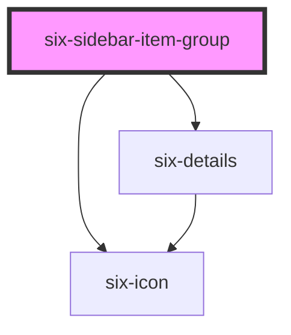

# Sidebar Item Group


## six sidebar group

<docs-demo-six-sidebar-item-group-0></docs-demo-six-sidebar-item-group-0>

```html
<div style="max-width: 20rem; padding: 1rem">
  <six-sidebar-item-group icon="description" name="Upload" value="upload">
    <six-sidebar-item value="data">Data</six-sidebar-item>
    <six-sidebar-item value="history">History</six-sidebar-item>
    <six-sidebar-item-group icon="settings" name="Settings">
      <six-sidebar-item value="data">Data</six-sidebar-item>
      <six-sidebar-item value="history">History</six-sidebar-item>
    </six-sidebar-item-group>
  </six-sidebar-item-group>
  <six-sidebar-item-group icon="task" name="Tasks" value="tasks">
    <six-sidebar-item value="open">Open</six-sidebar-item>
    <six-sidebar-item value="closed">Closed</six-sidebar-item>
    <six-sidebar-item value="link" href="http://www.google.ch">Link</six-sidebar-item>
  </six-sidebar-item-group>
  <six-sidebar-item-group icon="ac_unit" name="Transactions" value="transactions"></six-sidebar-item-group>
  <six-sidebar-item-group name="Reclaims" value="reclaims"></six-sidebar-item-group>
  <six-sidebar-item-group icon="search" name="Search" href="http://www.google.ch"></six-sidebar-item-group>
</div>
```


### Custom summary icon

Use `summary-icon` property to set custom summary icon name.

<docs-demo-six-sidebar-item-group-1></docs-demo-six-sidebar-item-group-1>

```html
<div style="max-width: 20rem; padding: 1rem">
  <six-sidebar-item-group icon="description" name="Upload" value="upload" summary-icon="settings">
    <six-sidebar-item value="data">Data</six-sidebar-item>
    <six-sidebar-item value="history">History</six-sidebar-item>
    <six-sidebar-item-group icon="settings" name="Settings">
      <six-sidebar-item value="data">Data</six-sidebar-item>
      <six-sidebar-item value="history">History</six-sidebar-item>
    </six-sidebar-item-group>
  </six-sidebar-item-group>
  <six-sidebar-item-group icon="task" name="Tasks" value="tasks">
    <six-sidebar-item value="open">Open</six-sidebar-item>
    <six-sidebar-item value="closed">Closed</six-sidebar-item>
  </six-sidebar-item-group>
  <six-sidebar-item-group icon="ac_unit" name="Transactions" value="transactions"></six-sidebar-item-group>
  <six-sidebar-item-group name="Reclaims" value="reclaims" summary-icon="settings"></six-sidebar-item-group>
</div>
```


Use `summary-icon` property to set custom summary icon name.

<docs-demo-six-sidebar-item-group-2></docs-demo-six-sidebar-item-group-2>

```html
<div style="max-width: 20rem; padding: 1rem">
  <six-sidebar-item-group icon="description" name="Upload" value="upload">
    <b slot="summary-icon">99%</b>
    <six-sidebar-item value="data">Data</six-sidebar-item>
    <six-sidebar-item value="history">History</six-sidebar-item>
    <six-sidebar-item-group icon="settings" name="Settings">
      <six-sidebar-item value="data">Data</six-sidebar-item>
      <six-sidebar-item value="history">History</six-sidebar-item>
    </six-sidebar-item-group>
  </six-sidebar-item-group>
  <six-sidebar-item-group icon="task" name="Tasks" value="tasks">
    <six-sidebar-item value="open">Open</six-sidebar-item>
    <six-sidebar-item value="closed">Closed</six-sidebar-item>
  </six-sidebar-item-group>
  <six-sidebar-item-group icon="ac_unit" name="Transactions" value="transactions"></six-sidebar-item-group>
  <six-sidebar-item-group name="Reclaims" value="reclaims">
    <b slot="summary-icon">99%</b>
  </six-sidebar-item-group>
</div>
```


<!-- Auto Generated Below -->


## Properties

| Property      | Attribute      | Description                                                                                                                        | Type                  | Default     |
| ------------- | -------------- | ---------------------------------------------------------------------------------------------------------------------------------- | --------------------- | ----------- |
| `href`        | `href`         | Provide if the item should be rendered as anchor tag. Note, that the href is added automatically when using routerLink in Angular. | `string \| undefined` | `undefined` |
| `icon`        | `icon`         | Icon of the group                                                                                                                  | `string`              | `''`        |
| `name`        | `name`         | Title of item group                                                                                                                | `string`              | `''`        |
| `open`        | `open`         | Indicates whether the sidebar is shown                                                                                             | `boolean`             | `false`     |
| `summaryIcon` | `summary-icon` | Custom summary icon name.                                                                                                          | `string \| undefined` | `undefined` |
| `value`       | `value`        | A unique value to store in the sidebar item of the group label. This can be used as a way to identify sidebar items when selected. | `string`              | `''`        |


## Slots

| Slot | Description                                      |
| ---- | ------------------------------------------------ |
|      | Used to define the nested sidebar [group] items. |


## Dependencies

### Depends on

- [six-details](six-details.html)
- [six-icon](six-icon.html)

### Graph


----------------------------------------------

Copyright © 2021-present SIX-Group
