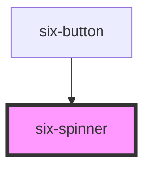

# six-spinner


# Spinner

Spinners are used to show the progress of an indeterminate operation.

<docs-demo-six-spinner-256></docs-demo-six-spinner-256>

```html
<six-spinner></six-spinner>
```


## Examples

### Size

Spinners are sized relative to the current font size. To change their size, set the `font-size` property on the spinner itself or on a parent element as shown below.

<docs-demo-six-spinner-257></docs-demo-six-spinner-257>

```html
<six-spinner></six-spinner>
<six-spinner style="font-size: 2rem"></six-spinner>
<six-spinner style="font-size: 3rem"></six-spinner>
```


### Stroke Width

The width of the spinner can be changed by setting the `--stroke-width` custom property.

<docs-demo-six-spinner-258></docs-demo-six-spinner-258>

```html
<six-spinner style="font-size: 2rem; --stroke-width: 6px"></six-spinner>
```


### Color

The spinner's colors can be changed by setting the `--indicator-color` and `--track-color` custom properties.

<docs-demo-six-spinner-259></docs-demo-six-spinner-259>

```html
<six-spinner style="font-size: 2rem; --indicator-color: green"></six-spinner>
```


### SIX Logo

Spinner can be configured as animated SIX logo.

<docs-demo-six-spinner-260></docs-demo-six-spinner-260>

```html
<six-spinner six="true"></six-spinner>
```


<!-- Auto Generated Below -->


## Properties

| Property | Attribute | Description                                                               | Type      | Default |
| -------- | --------- | ------------------------------------------------------------------------- | --------- | ------- |
| `six`    | `six`     | Indicates if the spinner is shown as animated SIX logo or simple spinner. | `boolean` | `false` |


## Shadow Parts

| Part     | Description                   |
| -------- | ----------------------------- |
| `"base"` | The component's base wrapper. |


## CSS Custom Properties

| Name                | Description                           |
| ------------------- | ------------------------------------- |
| `--indicator-color` | The color of the spinner's indicator. |
| `--stroke-width`    | The width of the indicator.           |
| `--track-color`     | The color of the spinner's track.     |


## Dependencies

### Used by

 - [six-button](six-button.html)

### Graph


----------------------------------------------

Copyright © 2021-present SIX-Group
