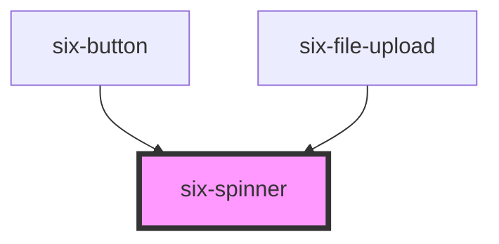

# Spinner

Spinners are used to show the progress of an indeterminate operation.

<docs-demo-six-spinner-0></docs-demo-six-spinner-0>

```html
<six-spinner></six-spinner>
```

## Examples

### Size

Spinners are sized relative to the current font size. To change their size, set the `font-size`
property on the spinner itself or on a parent element as shown below.

<docs-demo-six-spinner-1></docs-demo-six-spinner-1>

```html
<style>
  .spinner-demo {
    margin-bottom: 2.5rem;
  }

  six-spinner#medium::part(svg) {
    margin-left: 0.5rem;
    width: 3.5rem;
    height: 3.5rem;
  }

  six-spinner#large::part(svg) {
    margin-left: 2.5rem;
    width: 5rem;
    height: 5rem;
  }
</style>

<div class="spinner-demo">
  <six-spinner></six-spinner>
  <six-spinner style="font-size: 2rem"></six-spinner>
  <six-spinner style="font-size: 5rem"></six-spinner>
</div>

<div class="spinner-demo">
  <six-spinner logo="six"></six-spinner>
  <six-spinner id="medium" logo="six"></six-spinner>
  <six-spinner id="large" logo="six"></six-spinner>
</div>
```

### Stroke Width

The width of the spinner can be changed by setting the `--stroke-width` custom property.

<docs-demo-six-spinner-2></docs-demo-six-spinner-2>

```html
<six-spinner style="font-size: 2rem; --stroke-width: 6px"></six-spinner>
```

### Color

The spinner's colors can be changed by setting the `--indicator-color` and `--track-color` custom
properties.

<docs-demo-six-spinner-3></docs-demo-six-spinner-3>

```html
<six-spinner style="font-size: 2rem; --indicator-color: green"></six-spinner>
```

### SIX Logo

Spinner can be configured as animated SIX logo.

<docs-demo-six-spinner-4></docs-demo-six-spinner-4>

```html
<six-spinner logo="six"></six-spinner>
```

### BME Logo

Spinner can be configured as animated BME logo.

<docs-demo-six-spinner-5></docs-demo-six-spinner-5>

```html
<six-spinner logo="bme"></six-spinner>
```

<!-- Auto Generated Below -->

## Properties

| Property | Attribute | Description                                                                                  | Type                          | Default     |
| -------- | --------- | -------------------------------------------------------------------------------------------- | ----------------------------- | ----------- |
| `logo`   | `logo`    | Indicates if the spinner is shown as animated SIX or BME logo or a simple spinner.           | `"bme" \| "six" \| undefined` | `undefined` |
| `six`    | `six`     | **@deprecated** Use `logo="six"` instead. If set to true, the spinner displays the SIX logo. | `boolean \| undefined`        | `undefined` |

## Shadow Parts

| Part     | Description                   |
| -------- | ----------------------------- |
| `"base"` | The component's base wrapper. |
| `"svg"`  | The spinner icon.             |

## CSS Custom Properties

| Name                | Description                           |
| ------------------- | ------------------------------------- |
| `--indicator-color` | The color of the spinner's indicator. |
| `--stroke-width`    | The width of the indicator.           |
| `--track-color`     | The color of the spinner's track.     |

## Dependencies

### Used by

- [six-button](six-button.html)
- [six-file-upload](six-file-upload.html)

### Graph



---

Copyright © 2021-present SIX-Group
