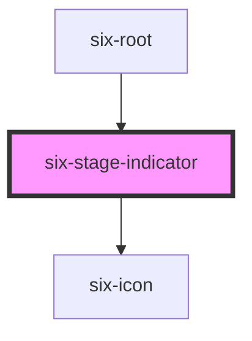

# six-stage-indicator


Stage Indicators allow user to know which stage he is currently on

<docs-demo-six-stage-indicator-259></docs-demo-six-stage-indicator-259>

```html
<six-stage-indicator stage="DEV"> DEV-webcomponents-123.3.2 </six-stage-indicator>
```


## Examples

### Stage

Use the `stage` attribute to display a certain stage

<docs-demo-six-stage-indicator-260></docs-demo-six-stage-indicator-260>

```html
<six-stage-indicator stage="DEV"> DEV-webcomponents-123.3.2 </six-stage-indicator>
<six-stage-indicator stage="ITU"> ITU-webcomponents-123.3.2 </six-stage-indicator>
<six-stage-indicator stage="ETU"> ETU-webcomponents-123.3.2 </six-stage-indicator>
<six-stage-indicator stage="ACCEPTANCE"> ACCEPTANCE-webcomponents-123.3.2 </six-stage-indicator>
<six-stage-indicator stage="PROD"> PROD-webcomponents-123.3.2 </six-stage-indicator>
```


<!-- Auto Generated Below -->


## Properties

| Property | Attribute | Description                    | Type                                                        | Default |
| -------- | --------- | ------------------------------ | ----------------------------------------------------------- | ------- |
| `stage`  | `stage`   | The indicators value attribute | `"ACCEPTANCE" \| "DEV" \| "ETU" \| "ITU" \| "PROD" \| null` | `null`  |


## Dependencies

### Used by

 - [six-root](six-root.html)

### Depends on

- [six-icon](six-icon.html)

### Graph


----------------------------------------------

Copyright © 2021-present SIX-Group
