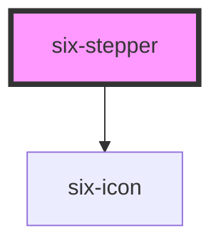

# Stepper


## Stepper

A stepper is a navigation component that guides users through the steps of a task. When a given task is complicated or has a certain sequence in the series of subtasks, we can decompose it into several steps to make things easier.

<docs-demo-six-stepper-0></docs-demo-six-stepper-0>

```html
<six-stepper id="basic-stepper"></six-stepper>
<script type="module">
  const basicStepper = document.getElementById('basic-stepper');
  basicStepper.steps = [
    { title: 'Personal & Financial' },
    { title: 'To Decommission' },
    { title: 'Confirmation' },
  ];
  basicStepper.current = 0;
</script>
```


## Examples

### With Descriptions

Use the `description` property in step items to add additional context.

<docs-demo-six-stepper-1></docs-demo-six-stepper-1>

```html
<six-stepper id="description-stepper"></six-stepper>
<script type="module">
  const descriptionStepper = document.getElementById('description-stepper');
  descriptionStepper.steps = [
    { title: 'Create Account', description: 'Enter your basic information' },
    { title: 'Verify Email', description: 'Check your inbox for verification' },
    { title: 'Complete Setup', description: 'Finalize your account setup' },
  ];
  descriptionStepper.current = 0;
</script>
```


### With Subtitles

Use the `subTitle` property to add subtitles to steps.

<docs-demo-six-stepper-2></docs-demo-six-stepper-2>

```html
<six-stepper id="subtitle-stepper"></six-stepper>
<script type="module">
  const subtitleStepper = document.getElementById('subtitle-stepper');
  subtitleStepper.steps = [
    { title: 'Step 1', subTitle: '00:00:05', description: 'First step completed' },
    { title: 'Step 2', subTitle: '00:01:02', description: 'Currently in progress' },
    { title: 'Step 3', subTitle: 'waiting', description: 'Waiting to start' },
  ];
  subtitleStepper.current = 1;
</script>
```


### Custom Icons

Use the `icon` property in step items to add Material Icons. The component uses `six-icon` internally.

<docs-demo-six-stepper-3></docs-demo-six-stepper-3>

```html
<six-stepper id="icon-stepper"></six-stepper>
<script type="module">
  const iconStepper = document.getElementById('icon-stepper');
  iconStepper.steps = [
    { title: 'Login', icon: 'person', description: 'User authentication' },
    { title: 'Verify', icon: 'email', description: 'Email verification' },
    { title: 'Complete', icon: 'check_circle', description: 'Setup complete' },
  ];
  iconStepper.current = 1;
</script>
```


### Material Symbols

You can also use Material Symbols for icons.

<docs-demo-six-stepper-4></docs-demo-six-stepper-4>

```html
<six-stepper id="symbols-stepper"></six-stepper>
<script type="module">
  const symbolsStepper = document.getElementById('symbols-stepper');
  symbolsStepper.steps = [
    { title: 'Upload', icon: 'upload_file' },
    { title: 'Process', icon: 'sync' },
    { title: 'Download', icon: 'download' },
  ];
  symbolsStepper.current = 1;
</script>
```


### Setting Current Step

Use the `current` attribute to set the current active step (0-based index).

<docs-demo-six-stepper-5></docs-demo-six-stepper-5>

```html
<six-stepper id="current-stepper"></six-stepper>
<div style="margin-top: 1rem">
  <six-button id="step-btn-0">Step 1</six-button>
  <six-button id="step-btn-1">Step 2</six-button>
  <six-button id="step-btn-2">Step 3</six-button>
</div>
<script type="module">
  const currentStepper = document.getElementById('current-stepper');
  currentStepper.steps = [{ title: 'Waiting' }, { title: 'In Progress' }, { title: 'Complete' }];
  currentStepper.current = 1;

  document.getElementById('step-btn-0').addEventListener('click', () => {
    currentStepper.current = 0;
  });
  document.getElementById('step-btn-1').addEventListener('click', () => {
    currentStepper.current = 1;
  });
  document.getElementById('step-btn-2').addEventListener('click', () => {
    currentStepper.current = 2;
  });
</script>
```


### Initial Step

Use the `initial` attribute to set the initial step when the component loads. This is useful for resuming progress.

<docs-demo-six-stepper-6></docs-demo-six-stepper-6>

```html
<six-stepper id="initial-stepper" clickable></six-stepper>
<div style="margin-top: 1rem">
  <six-button id="reset-initial-btn">Reset to Initial Step</six-button>
</div>
<script type="module">
  const initialStepper = document.getElementById('initial-stepper');
  initialStepper.steps = [
    { title: 'Welcome' },
    { title: 'Configure' },
    { title: 'Review' },
    { title: 'Launch' },
  ];
  initialStepper.initial = 2; // Start at step 3

  document.getElementById('reset-initial-btn').addEventListener('click', () => {
    initialStepper.current = initialStepper.initial;
  });
  initialStepper.addEventListener('six-stepper-change', (event) => {
    initialStepper.current = event.detail;
  });
</script>
```


### Clickable Steps

Use the `clickable` attribute to make steps clickable. Users can navigate by clicking on any step.

<docs-demo-six-stepper-7></docs-demo-six-stepper-7>

```html
<six-stepper id="clickable-stepper"></six-stepper>
<div id="step-content" style="margin-top: 1rem; padding: 1rem; background: #f5f5f5; border-radius: 4px">
  <strong>Step 1:</strong> Personal Information
</div>
<script type="module">
  const clickableStepper = document.getElementById('clickable-stepper');
  const stepContent = document.getElementById('step-content');

  clickableStepper.steps = [
    { title: 'Personal Info', description: 'Basic details' },
    { title: 'Address', description: 'Location details' },
    { title: 'Review', description: 'Final check' },
  ];
  clickableStepper.current = 0;
  clickableStepper.clickable = true;

  const contents = [
    '<strong>Step 1:</strong> Personal Information',
    '<strong>Step 2:</strong> Address Details',
    '<strong>Step 3:</strong> Review & Submit',
  ];

  clickableStepper.addEventListener('six-stepper-change', (event) => {
    // Update current prop to reflect the change (controlled component)
    clickableStepper.current = event.detail;
    stepContent.innerHTML = contents[event.detail];
  });
</script>
```


### Colors

Use the `color` attribute to change the stepper's color theme.

<docs-demo-six-stepper-8></docs-demo-six-stepper-8>

```html
<six-stepper id="blue-stepper"></six-stepper>
<br>
<six-stepper id="green-stepper"></six-stepper>
<br>
<six-stepper id="web-rock-stepper"></six-stepper>
<script type="module">
  const blueStepper = document.getElementById('blue-stepper');
  blueStepper.steps = [{ title: 'Start' }, { title: 'In Progress' }, { title: 'Complete' }];
  blueStepper.current = 1;
  blueStepper.color = 'blue';

  const greenStepper = document.getElementById('green-stepper');
  greenStepper.steps = [{ title: 'Start' }, { title: 'In Progress' }, { title: 'Complete' }];
  greenStepper.current = 1;
  greenStepper.color = 'green';

  const webRockStepper = document.getElementById('web-rock-stepper');
  webRockStepper.steps = [{ title: 'Start' }, { title: 'In Progress' }, { title: 'Complete' }];
  webRockStepper.current = 1;
  webRockStepper.color = 'web-rock';
</script>
```


### Status

Use the `status` attribute to specify the status of the current step. Available values: `wait`, `process`, `finish`, `error`.

<docs-demo-six-stepper-9></docs-demo-six-stepper-9>

```html
<six-stepper id="status-stepper"></six-stepper>
<div style="margin-top: 1rem">
  <six-button id="status-wait">Wait</six-button>
  <six-button id="status-process">Process</six-button>
  <six-button id="status-finish">Finish</six-button>
  <six-button id="status-error">Error</six-button>
</div>
<script type="module">
  const statusStepper = document.getElementById('status-stepper');
  statusStepper.steps = [{ title: 'Step 1' }, { title: 'Step 2' }, { title: 'Step 3' }];
  statusStepper.current = 1;

  document.getElementById('status-wait').addEventListener('click', () => {
    statusStepper.status = 'wait';
  });
  document.getElementById('status-process').addEventListener('click', () => {
    statusStepper.status = 'process';
  });
  document.getElementById('status-finish').addEventListener('click', () => {
    statusStepper.status = 'finish';
  });
  document.getElementById('status-error').addEventListener('click', () => {
    statusStepper.status = 'error';
  });
</script>
```


### Error State

Individual steps can have an error status, or use the overall status to show errors.

<docs-demo-six-stepper-10></docs-demo-six-stepper-10>

```html
<six-stepper id="error-stepper"></six-stepper>
<script type="module">
  const errorStepper = document.getElementById('error-stepper');
  errorStepper.steps = [
    { title: 'Step 1', status: 'finish' },
    { title: 'Step 2', status: 'error' },
    { title: 'Step 3', status: 'wait' },
  ];
  errorStepper.current = 1;
  errorStepper.status = 'error';
</script>
```


### Progress Percentage

Use the `percent` attribute to show progress within the current step. Value should be between 0-100.

<docs-demo-six-stepper-11></docs-demo-six-stepper-11>

```html
<six-stepper id="progress-stepper"></six-stepper>
<div style="margin-top: 1rem">
  <six-button id="progress-minus">-10%</six-button>
  <six-button id="progress-plus">+10%</six-button>
  <six-button id="progress-complete">Complete Step</six-button>
  <span id="progress-display" style="margin-left: 1rem; font-weight: bold">Progress: 0%</span>
</div>
<script type="module">
  const progressStepper = document.getElementById('progress-stepper');
  const progressDisplay = document.getElementById('progress-display');

  progressStepper.steps = [
    { title: 'Upload Files', icon: 'upload' },
    { title: 'Processing', icon: 'hourglass_empty' },
    { title: 'Complete', icon: 'done_all' },
  ];
  progressStepper.current = 1;
  progressStepper.percent = 0;

  const updateProgress = (change) => {
    let currentPercent = progressStepper.percent || 0;
    currentPercent = Math.max(0, Math.min(100, currentPercent + change));
    progressStepper.percent = currentPercent;
    progressDisplay.textContent = `Progress: ${currentPercent}%`;

    if (currentPercent === 100) {
      setTimeout(() => {
        if (progressStepper.current < progressStepper.steps.length - 1) {
          progressStepper.current++;
          progressStepper.percent = 0;
          progressDisplay.textContent = 'Progress: 0%';
        }
      }, 500);
    }
  };

  document.getElementById('progress-minus').addEventListener('click', () => updateProgress(-10));
  document.getElementById('progress-plus').addEventListener('click', () => updateProgress(10));
  document.getElementById('progress-complete').addEventListener('click', () => updateProgress(100));
</script>
```


### Disabled Steps

Individual steps can be disabled by setting `disabled: true` in the step configuration.

<docs-demo-six-stepper-12></docs-demo-six-stepper-12>

```html
<six-stepper id="disabled-stepper" clickable initial="1"></six-stepper>
<script type="module">
  const disabledStepper = document.getElementById('disabled-stepper');
  disabledStepper.steps = [
    { title: 'Step 1', description: 'Available', icon: 'check_circle' },
    { title: 'Step 2', description: 'Available', icon: 'radio_button_checked' },
    { title: 'Step 3', description: 'Locked', icon: 'lock', disabled: true },
  ];

  disabledStepper.addEventListener('six-stepper-change', (event) => {
    // Update current prop (controlled component)
    disabledStepper.current = event.detail;
  });
</script>
```


## Programmatic Navigation

You can programmatically navigate between steps by setting the `current` property.

<docs-demo-six-stepper-13></docs-demo-six-stepper-13>

```html
<six-stepper id="programmatic-stepper"></six-stepper>
<div style="margin-top: 1rem">
  <six-button id="prev-btn">Previous</six-button>
  <six-button id="next-btn">Next</six-button>
</div>
<script type="module">
  const programmaticStepper = document.getElementById('programmatic-stepper');
  programmaticStepper.steps = [
    { title: 'Step 1', description: 'First step', icon: 'looks_one' },
    { title: 'Step 2', description: 'Second step', icon: 'looks_two' },
    { title: 'Step 3', description: 'Third step', icon: 'looks_3' },
    { title: 'Step 4', description: 'Fourth step', icon: 'looks_4' },
  ];
  programmaticStepper.current = 0;

  document.getElementById('prev-btn').addEventListener('click', () => {
    if (programmaticStepper.current > 0) {
      programmaticStepper.current--;
    }
  });

  document.getElementById('next-btn').addEventListener('click', () => {
    if (programmaticStepper.current < programmaticStepper.steps.length - 1) {
      programmaticStepper.current++;
    }
  });
</script>
```


## Listening to Changes

The stepper emits a `six-stepper-change` event when the current step changes. The event detail contains the new step index.

<docs-demo-six-stepper-14></docs-demo-six-stepper-14>

```html
<six-stepper id="event-stepper"></six-stepper>
<div id="event-log" style="margin-top: 1rem; padding: 1rem; background: #f5f5f5; border-radius: 4px">
  No events yet
</div>
<script type="module">
  const eventStepper = document.getElementById('event-stepper');
  const eventLog = document.getElementById('event-log');

  eventStepper.steps = [{ title: 'Step 1' }, { title: 'Step 2' }, { title: 'Step 3' }];
  eventStepper.current = 0;
  eventStepper.clickable = true;

  const events = [];
  eventStepper.addEventListener('six-stepper-change', (event) => {
    // Update current prop (controlled component)
    eventStepper.current = event.detail;
    const timestamp = new Date().toLocaleTimeString();
    events.unshift(`[${timestamp}] Step changed to: ${event.detail + 1}`);
    eventLog.innerHTML = events.slice(0, 5).join('<br>');
  });
</script>
```


## Complete Wizard Example

A complete example showing a multi-step wizard with navigation controls and icons.

<docs-demo-six-stepper-15></docs-demo-six-stepper-15>

```html
<six-stepper id="wizard-stepper"></six-stepper>
<div           id="wizard-content"
  style="margin: 1rem 0; padding: 2rem; background: #f9f9f9; border-radius: 4px; min-height: 150px"
>
  <h3>Step 1: Personal Information</h3>
  <p>Please enter your name, email, and phone number.</p>
</div>
<div style="display: flex; justify-content: space-between">
  <six-button id="wizard-prev" disabled>Previous</six-button>
  <six-button id="wizard-next">Next</six-button>
</div>
<script type="module">
  const wizardStepper = document.getElementById('wizard-stepper');
  const wizardContent = document.getElementById('wizard-content');
  const prevBtn = document.getElementById('wizard-prev');
  const nextBtn = document.getElementById('wizard-next');

  wizardStepper.steps = [
    { title: 'Personal Info', description: 'Basic details', icon: 'person' },
    { title: 'Address', description: 'Location', icon: 'home' },
    { title: 'Payment', description: 'Billing info', icon: 'payment' },
    { title: 'Review', description: 'Confirm details', icon: 'fact_check' },
  ];
  wizardStepper.current = 0;

  const stepContents = [
    '<h3>Step 1: Personal Information</h3><p>Please enter your name, email, and phone number.</p>',
    '<h3>Step 2: Address</h3><p>Enter your street address, city, and postal code.</p>',
    '<h3>Step 3: Payment</h3><p>Provide your payment and billing information.</p>',
    '<h3>Step 4: Review</h3><p>Review all your information and submit.</p>',
  ];

  const updateWizard = () => {
    const current = wizardStepper.current;
    wizardContent.innerHTML = stepContents[current];
    prevBtn.disabled = current === 0;
    nextBtn.textContent = current === wizardStepper.steps.length - 1 ? 'Submit' : 'Next';
  };

  prevBtn.addEventListener('click', () => {
    if (wizardStepper.current > 0) {
      wizardStepper.current--;
      updateWizard();
    }
  });

  nextBtn.addEventListener('click', () => {
    if (wizardStepper.current < wizardStepper.steps.length - 1) {
      wizardStepper.current++;
      updateWizard();
    } else {
      wizardStepper.status = 'finish';
      alert('Wizard completed!');
    }
  });

  updateWizard();
</script>
```


<!-- Auto Generated Below -->


## Properties

| Property    | Attribute   | Description                                  | Type                                         | Default     |
| ----------- | ----------- | -------------------------------------------- | -------------------------------------------- | ----------- |
| `clickable` | `clickable` | Enable clickable steps                       | `boolean`                                    | `false`     |
| `color`     | `color`     | Color theme                                  | `"blue" \| "green" \| "web-rock"`            | `'blue'`    |
| `completed` | `completed` | Mark all steps as completed                  | `boolean`                                    | `false`     |
| `current`   | `current`   | Current active step index (0-based)          | `number`                                     | `0`         |
| `initial`   | `initial`   | Initial step index (0-based)                 | `number`                                     | `0`         |
| `percent`   | `percent`   | Progress percentage for current step (0-100) | `number \| undefined`                        | `undefined` |
| `status`    | `status`    | Status of the current step                   | `"error" \| "finish" \| "process" \| "wait"` | `'process'` |
| `steps`     | `steps`     | Array of steps to display                    | `StepItem[]`                                 | `[]`        |


## Events

| Event                | Description                  | Type                  |
| -------------------- | ---------------------------- | --------------------- |
| `six-stepper-change` | Emitted when step is changed | `CustomEvent<number>` |


## Slots

| Slot | Description                                          |
| ---- | ---------------------------------------------------- |
|      | Not used. Steps are configured via the `steps` prop. |


## Shadow Parts

| Part             | Description                                     |
| ---------------- | ----------------------------------------------- |
| `"step"`         | Individual step container                       |
| `"step-circle"`  | The circle/icon container                       |
| `"step-content"` | The content area (title, subtitle, description) |
| `"stepper"`      | The stepper container                           |


## Dependencies

### Depends on

- [six-icon](six-icon.html)

### Graph


----------------------------------------------

Copyright © 2021-present SIX-Group
