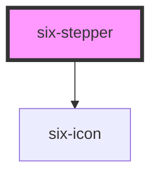

# Stepper

<!-- Auto Generated Below -->

## Properties

| Property    | Attribute   | Description                                  | Type                                         | Default     |
| ----------- | ----------- | -------------------------------------------- | -------------------------------------------- | ----------- |
| `clickable` | `clickable` | Enable clickable steps                       | `boolean`                                    | `false`     |
| `color`     | `color`     | Color theme                                  | `"blue" \| "green" \| "web-rock"`            | `'blue'`    |
| `current`   | `current`   | Current active step index (0-based)          | `number`                                     | `0`         |
| `initial`   | `initial`   | Initial step index (0-based)                 | `number`                                     | `0`         |
| `percent`   | `percent`   | Progress percentage for current step (0-100) | `number \| undefined`                        | `undefined` |
| `status`    | `status`    | Status of the current step                   | `"error" \| "finish" \| "process" \| "wait"` | `'process'` |
| `steps`     | `steps`     | Array of steps to display                    | `StepItem[]`                                 | `[]`        |

## Events

| Event                | Description                  | Type                  |
| -------------------- | ---------------------------- | --------------------- |
| `six-stepper-change` | Emitted when step is changed | `CustomEvent<number>` |

## Slots

| Slot | Description                                          |
| ---- | ---------------------------------------------------- |
|      | Not used. Steps are configured via the `steps` prop. |

## Shadow Parts

| Part             | Description                                     |
| ---------------- | ----------------------------------------------- |
| `"step"`         | Individual step container                       |
| `"step-circle"`  | The circle/icon container                       |
| `"step-content"` | The content area (title, subtitle, description) |
| `"stepper"`      | The stepper container                           |

## Dependencies

### Depends on

- [six-icon](six-icon.html)

### Graph

----------------------------------------------

Copyright © 2021-present SIX-Group
