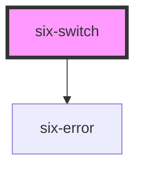

# Switch


Switches allow the user to toggle an option on or off.

<docs-demo-six-switch-0></docs-demo-six-switch-0>

```html
<six-switch>Switch</six-switch>
```


## Examples

### Checked

Use the `checked` attribute to activate the switch.

<docs-demo-six-switch-1></docs-demo-six-switch-1>

```html
<six-switch checked>Checked</six-switch>
```


### Disabled

Use the `disabled` attribute to disable the switch.

<docs-demo-six-switch-2></docs-demo-six-switch-2>

```html
<six-switch checked disabled>Disabled</six-switch>
<six-switch disabled>Disabled</six-switch>
```


### Custom Size

Use the available custom properties to make the switch a different size.

<docs-demo-six-switch-3></docs-demo-six-switch-3>

```html
<six-switch style="--width: 80px; --height: 32px; --thumb-size: 26px"></six-switch>
```


## Error Text

Add a descriptive error message using either the `error-text` prop, or the equally named slot.

warning There are two caveats when using the `error-text` prop/slot:

1.  Remember to set the `invalid` prop as well! If you only provide some content to the `error-text` prop/slot, it won't be shown unless the `invalid` prop is set to true
2.  When using the prop, and you need to show more than one message, remember to also set the `error-text-count` prop to a value that is the same or bigger than the length of the list of messages you are using. Otherwise only one message will be shown at a time

The `error-text` prop accepts either a simple string message, or a list of messages.

<docs-demo-six-switch-4></docs-demo-six-switch-4>

```html
<six-switch label="Simple string message" error-text="This is a simple string message" invalid> </six-switch>
```


<docs-demo-six-switch-5></docs-demo-six-switch-5>

```html
<six-switch id="multiple-error-text" label="List of string message" invalid></six-switch>
<script type="module">
  const sixSwitch = document.getElementById('multiple-error-text');
  sixSwitch.errorText = ['Message 1', 'Message 2'];
  sixSwitch.errorTextCount = 3;
</script>
```


When using the `error-text` slot, it is recommended to use the `six-error` component to wrap the error message(s). This will provide the correct styling out of the box

<docs-demo-six-switch-6></docs-demo-six-switch-6>

```html
<six-switch invalid>
  <div slot="error-text">
    <six-error               >An error message
      <a href="https://github.com/six-group/six-webcomponents" target="_blank">with a link</a></six-error>
  </div>
</six-switch>
```


<!-- Auto Generated Below -->


## Properties

| Property         | Attribute          | Description                                                                                                      | Type                  | Default     |
| ---------------- | ------------------ | ---------------------------------------------------------------------------------------------------------------- | --------------------- | ----------- |
| `checked`        | `checked`          | Set to true to draw the switch in a checked state.                                                               | `boolean`             | `false`     |
| `disabled`       | `disabled`         | Set to true to disable the switch.                                                                               | `boolean`             | `false`     |
| `errorText`      | `error-text`       | The error message shown, if `invalid` is set to true.                                                            | `string \| string[]`  | `''`        |
| `errorTextCount` | `error-text-count` | The number of error texts to be shown (if the error-text slot isn't used). Defaults to 1                         | `number \| undefined` | `undefined` |
| `invalid`        | `invalid`          | If this property is set to true and an error message is provided by `errorText`, the error message is displayed. | `boolean`             | `false`     |
| `label`          | `label`            | The label text.                                                                                                  | `string`              | `''`        |
| `name`           | `name`             | The switch's name attribute.                                                                                     | `string`              | `''`        |
| `required`       | `required`         | Set to true to show an asterisk beneath the label.                                                               | `boolean`             | `false`     |
| `value`          | `value`            | The switch's value attribute.                                                                                    | `string`              | `'on'`      |


## Events

| Event               | Description                                       | Type                     |
| ------------------- | ------------------------------------------------- | ------------------------ |
| `six-switch-blur`   | Emitted when the control loses focus.             | `CustomEvent<boolean>`   |
| `six-switch-change` | Emitted when the control's checked state changes. | `CustomEvent<boolean>`   |
| `six-switch-focus`  | Emitted when the control gains focus.             | `CustomEvent<undefined>` |


## Methods

### `removeFocus() => Promise<void>`

Removes focus from the switch.

#### Returns

Type: `Promise<void>`


### `setFocus(options?: FocusOptions) => Promise<void>`

Sets focus on the switch.

#### Parameters

| Name      | Type                        | Description |
| --------- | --------------------------- | ----------- |
| `options` | `FocusOptions \| undefined` |             |

#### Returns

Type: `Promise<void>`


## Slots

| Slot           | Description                                                                                     |
| -------------- | ----------------------------------------------------------------------------------------------- |
|                | The switch's label.                                                                             |
| `"error-text"` | Error text that is shown for validation errors. Alternatively, you can use the error-text prop. |


## Shadow Parts

| Part        | Description                    |
| ----------- | ------------------------------ |
| `"base"`    | The component's base wrapper.  |
| `"control"` | The switch control.            |
| `"label"`   | The switch label.              |
| `"thumb"`   | The switch position indicator. |


## CSS Custom Properties

| Name           | Description               |
| -------------- | ------------------------- |
| `--height`     | The height of the switch. |
| `--thumb-size` | The size of the thumb.    |
| `--width`      | The width of the switch.  |


## Dependencies

### Depends on

- [six-error](six-error.html)

### Graph


----------------------------------------------

Copyright © 2021-present SIX-Group
