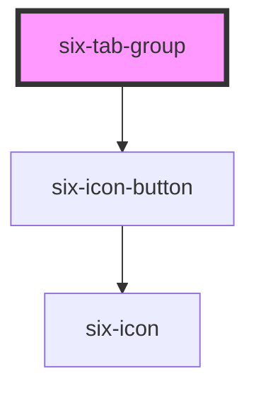

# Tab Group


### Tab groups organize content into a container that shows one section at a time.

Tab groups make use of tabs and tab panels. Each tab must be slotted into the `nav` slot and its panel must refer to a tab `panel` of the same name.

<docs-demo-six-tab-group-0></docs-demo-six-tab-group-0>

```html
<six-tab-group>
  <six-tab slot="nav" panel="general">General</six-tab>
  <six-tab slot="nav" panel="custom">Custom</six-tab>
  <six-tab slot="nav" panel="advanced">Advanced</six-tab>
  <six-tab slot="nav" panel="disabled" disabled>Disabled</six-tab>

  <six-tab-panel style="background-color: var(--six-color-web-rock-100)" name="general">
    This is the general tab panel.
  </six-tab-panel>
  <six-tab-panel style="background-color: var(--six-color-web-rock-100)" name="custom">
    This is the custom tab panel.
  </six-tab-panel>
  <six-tab-panel style="background-color: var(--six-color-web-rock-100)" name="advanced">
    This is the advanced tab panel.
  </six-tab-panel>
  <six-tab-panel style="background-color: var(--six-color-web-rock-100)" name="disabled">
    This is a disabled tab panel.
  </six-tab-panel>
</six-tab-group>
```


## Examples

### Separator line

If the background color of your panels is white, you maybe want a thin line between the tabs and panels. For this, just set a border on the shadow part `tabs`.

<docs-demo-six-tab-group-1></docs-demo-six-tab-group-1>

```html
<six-tab-group class="tab-group-with-line">
  <six-tab slot="nav" panel="general">General</six-tab>
  <six-tab slot="nav" panel="custom">Custom</six-tab>
  <six-tab slot="nav" panel="advanced">Advanced</six-tab>
  <six-tab slot="nav" panel="disabled" disabled>Disabled</six-tab>

  <six-tab-panel name="general">This is the general tab panel.</six-tab-panel>
  <six-tab-panel name="custom">This is the custom tab panel.</six-tab-panel>
  <six-tab-panel name="advanced">This is the advanced tab panel.</six-tab-panel>
  <six-tab-panel name="disabled">This is a disabled tab panel.</six-tab-panel>
</six-tab-group>

<style>
  .tab-group-with-line::part(tabs) {
    border-bottom: solid 2px var(--six-color-web-rock-100);
  }
</style>
```


### Tabs on Bottom

Tabs can be shown on the bottom by setting `placement` to `bottom`.

<docs-demo-six-tab-group-2></docs-demo-six-tab-group-2>

```html
<six-tab-group placement="bottom">
  <six-tab slot="nav" panel="general">General</six-tab>
  <six-tab slot="nav" panel="custom">Custom</six-tab>
  <six-tab slot="nav" panel="advanced">Advanced</six-tab>
  <six-tab slot="nav" panel="disabled" disabled>Disabled</six-tab>

  <six-tab-panel style="background-color: var(--six-color-web-rock-100)" name="general">
    This is the general tab panel.
  </six-tab-panel>
  <six-tab-panel style="background-color: var(--six-color-web-rock-100)" name="custom">
    This is the custom tab panel.
  </six-tab-panel>
  <six-tab-panel style="background-color: var(--six-color-web-rock-100)" name="advanced">
    This is the advanced tab panel.
  </six-tab-panel>
  <six-tab-panel style="background-color: var(--six-color-web-rock-100)" name="disabled">
    This is a disabled tab panel.
  </six-tab-panel>
</six-tab-group>
```


### Tabs on Left

Tabs can be shown on the left by setting `placement` to `left`.

<docs-demo-six-tab-group-3></docs-demo-six-tab-group-3>

```html
<six-tab-group placement="left">
  <six-tab slot="nav" panel="general">General</six-tab>
  <six-tab slot="nav" panel="custom">Custom</six-tab>
  <six-tab slot="nav" panel="advanced">Advanced</six-tab>
  <six-tab slot="nav" panel="disabled" disabled>Disabled</six-tab>

  <six-tab-panel name="general"> This is the general tab panel. </six-tab-panel>
  <six-tab-panel name="custom"> This is the custom tab panel. </six-tab-panel>
  <six-tab-panel name="advanced"> This is the advanced tab panel. </six-tab-panel>
  <six-tab-panel name="disabled"> This is a disabled tab panel. </six-tab-panel>
</six-tab-group>
```


### Tabs on Right

Tabs can be shown on the right by setting `placement` to `right`.

<docs-demo-six-tab-group-4></docs-demo-six-tab-group-4>

```html
<six-tab-group placement="right">
  <six-tab slot="nav" panel="general">General</six-tab>
  <six-tab slot="nav" panel="custom">Custom</six-tab>
  <six-tab slot="nav" panel="advanced">Advanced</six-tab>
  <six-tab slot="nav" panel="disabled" disabled>Disabled</six-tab>

  <six-tab-panel style="background-color: var(--six-color-web-rock-100)" name="general">
    This is the general tab panel.
  </six-tab-panel>
  <six-tab-panel style="background-color: var(--six-color-web-rock-100)" name="custom">
    This is the custom tab panel.
  </six-tab-panel>
  <six-tab-panel style="background-color: var(--six-color-web-rock-100)" name="advanced">
    This is the advanced tab panel.
  </six-tab-panel>
  <six-tab-panel style="background-color: var(--six-color-web-rock-100)" name="disabled">
    This is a disabled tab panel.
  </six-tab-panel>
</six-tab-group>
```


### Closable Tabs

Add the `closable` prop to a tab to show a close button. This example shows how you can dynamically remove tabs from the DOM when the close button is activated.

<docs-demo-six-tab-group-5></docs-demo-six-tab-group-5>

```html
<six-tab-group class="tabs-closable">
  <six-tab slot="nav" panel="general">General</six-tab>
  <six-tab slot="nav" panel="closable-1" closable>Closable 1</six-tab>
  <six-tab slot="nav" panel="closable-2" closable>Closable 2</six-tab>
  <six-tab slot="nav" panel="closable-3" closable>Closable 3</six-tab>

  <six-tab-panel name="general">This is the general tab panel.</six-tab-panel>
  <six-tab-panel name="closable-1">This is the first closable tab panel.</six-tab-panel>
  <six-tab-panel name="closable-2">This is the second closable tab panel.</six-tab-panel>
  <six-tab-panel name="closable-3">This is the third closable tab panel.</six-tab-panel>
</six-tab-group>

<script type="module">
  const tabGroup = document.querySelector('.tabs-closable');

  tabGroup.addEventListener('six-close', async (event) => {
    const tab = event.target;
    const panel = tabGroup.querySelector(`six-tab-panel[name="${tab.panel}"]`);

    // Show the previous tab if the tab is currently active
    if (tab.active) {
      tabGroup.show(tab.previousElementSibling.panel);
    }

    // Remove the tab + panel
    tab.remove();
    panel.remove();
  });
</script>
```


### Scrolling Tabs

When there are more tabs than horizontal space allows, the nav will be scrollable..

<docs-demo-six-tab-group-6></docs-demo-six-tab-group-6>

```html
<six-tab-group>
  <six-tab slot="nav" panel="tab-1">Tab 1</six-tab>
  <six-tab slot="nav" panel="tab-2">Tab 2</six-tab>
  <six-tab slot="nav" panel="tab-3">Tab 3</six-tab>
  <six-tab slot="nav" panel="tab-4">Tab 4</six-tab>
  <six-tab slot="nav" panel="tab-5">Tab 5</six-tab>
  <six-tab slot="nav" panel="tab-6">Tab 6</six-tab>
  <six-tab slot="nav" panel="tab-7">Tab 7</six-tab>
  <six-tab slot="nav" panel="tab-8">Tab 8</six-tab>
  <six-tab slot="nav" panel="tab-9">Tab 9</six-tab>
  <six-tab slot="nav" panel="tab-10">Tab 10</six-tab>
  <six-tab slot="nav" panel="tab-11">Tab 11</six-tab>
  <six-tab slot="nav" panel="tab-12">Tab 12</six-tab>
  <six-tab slot="nav" panel="tab-13">Tab 13</six-tab>
  <six-tab slot="nav" panel="tab-14">Tab 14</six-tab>
  <six-tab slot="nav" panel="tab-15">Tab 15</six-tab>
  <six-tab slot="nav" panel="tab-16">Tab 16</six-tab>
  <six-tab slot="nav" panel="tab-17">Tab 17</six-tab>
  <six-tab slot="nav" panel="tab-18">Tab 18</six-tab>
  <six-tab slot="nav" panel="tab-19">Tab 19</six-tab>
  <six-tab slot="nav" panel="tab-20">Tab 20</six-tab>

  <six-tab-panel name="tab-1">Tab panel 1</six-tab-panel>
  <six-tab-panel name="tab-2">Tab panel 2</six-tab-panel>
  <six-tab-panel name="tab-3">Tab panel 3</six-tab-panel>
  <six-tab-panel name="tab-4">Tab panel 4</six-tab-panel>
  <six-tab-panel name="tab-5">Tab panel 5</six-tab-panel>
  <six-tab-panel name="tab-6">Tab panel 6</six-tab-panel>
  <six-tab-panel name="tab-7">Tab panel 7</six-tab-panel>
  <six-tab-panel name="tab-8">Tab panel 8</six-tab-panel>
  <six-tab-panel name="tab-9">Tab panel 9</six-tab-panel>
  <six-tab-panel name="tab-10">Tab panel 10</six-tab-panel>
  <six-tab-panel name="tab-11">Tab panel 11</six-tab-panel>
  <six-tab-panel name="tab-12">Tab panel 12</six-tab-panel>
  <six-tab-panel name="tab-13">Tab panel 13</six-tab-panel>
  <six-tab-panel name="tab-14">Tab panel 14</six-tab-panel>
  <six-tab-panel name="tab-15">Tab panel 15</six-tab-panel>
  <six-tab-panel name="tab-16">Tab panel 16</six-tab-panel>
  <six-tab-panel name="tab-17">Tab panel 17</six-tab-panel>
  <six-tab-panel name="tab-18">Tab panel 18</six-tab-panel>
  <six-tab-panel name="tab-19">Tab panel 19</six-tab-panel>
  <six-tab-panel name="tab-20">Tab panel 20</six-tab-panel>
</six-tab-group>
```


<!-- Auto Generated Below -->


## Properties

| Property           | Attribute            | Description                                                | Type                                     | Default |
| ------------------ | -------------------- | ---------------------------------------------------------- | ---------------------------------------- | ------- |
| `noScrollControls` | `no-scroll-controls` | Disables the scroll arrows that appear when tabs overflow. | `boolean`                                | `false` |
| `placement`        | `placement`          | The placement of the tabs.                                 | `"bottom" \| "left" \| "right" \| "top"` | `'top'` |


## Events

| Event          | Description                   | Type                             |
| -------------- | ----------------------------- | -------------------------------- |
| `six-tab-hide` | Emitted when a tab is hidden. | `CustomEvent<SixTabHidePayload>` |
| `six-tab-show` | Emitted when a tab is shown.  | `CustomEvent<SixTabShowPayload>` |


## Methods

### `show(panel: string) => Promise<void>`

Shows the specified tab panel.

#### Returns

Type: `Promise<void>`


## Slots

| Slot    | Description                                    |
| ------- | ---------------------------------------------- |
|         | Used for grouping tab panels in the tab group. |
| `"nav"` | Used for grouping tabs in the tab group.       |


## Shadow Parts

| Part                     | Description                                                                                  |
| ------------------------ | -------------------------------------------------------------------------------------------- |
| `"active-tab-indicator"` | An element that displays the currently selected tab. This is a child of the tab's container. |
| `"base"`                 | The component's base wrapper.                                                                |
| `"body"`                 | The tab group body where tab panels are slotted in.                                          |
| `"nav"`                  | The tab group navigation container.                                                          |
| `"scroll-button"`        | The previous and next scroll buttons that appear when tabs are scrollable.                   |
| `"tabs"`                 | The container that wraps the slotted tabs.                                                   |


## Dependencies

### Depends on

- [six-icon-button](six-icon-button.html)

### Graph


----------------------------------------------

Copyright © 2021-present SIX-Group
