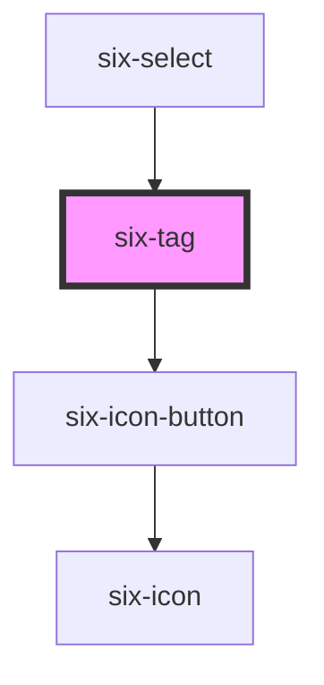

# six-tag


## Tag

Tags are used as labels to organize things or to indicate a selection.

<docs-demo-six-tag-275></docs-demo-six-tag-275>

```html
<six-tag type="primary">Primary</six-tag>
<six-tag type="info">Info</six-tag>
<six-tag type="success">Success</six-tag>
<six-tag type="warning">Warning</six-tag>
<six-tag type="danger">Danger</six-tag>
<six-tag type="action">Action</six-tag>
```


## Examples

### Sizes

Use the `size` prop to change a tab's size.

<docs-demo-six-tag-276></docs-demo-six-tag-276>

```html
<six-tag size="small">Small</six-tag>
<six-tag size="medium">Medium</six-tag>
<six-tag size="large">Large</six-tag>
```


### Pill

Use the `pill` to give tabs rounded edges.

<docs-demo-six-tag-277></docs-demo-six-tag-277>

```html
<six-tag size="small" pill>Small</six-tag>
<six-tag size="medium" pill>Medium</six-tag>
<six-tag size="large" pill>Large</six-tag>
```


### Clearable

Use the `clearable` attribute to add a clear button to the tag.

<docs-demo-six-tag-278></docs-demo-six-tag-278>

```html
<div class="tags-clearable">
  <six-tag size="small" clearable>Small</six-tag>
  <six-tag size="medium" clearable>Medium</six-tag>
  <six-tag size="large" clearable>Large</six-tag>
</div>

<script type="module">
  const div = document.querySelector('.tags-clearable');

  div.addEventListener('six-clear', (event) => {
    const tag = event.target;
    tag.style.opacity = '0';
    setTimeout(() => (tag.style.opacity = '1'), 2000);
  });
</script>

<style>
  .tags-clearable six-tag {
    transition: var(--six-transition-medium) opacity;
  }
</style>
```


<!-- Auto Generated Below -->


## Properties

| Property    | Attribute   | Description                                              | Type                                                                              | Default     |
| ----------- | ----------- | -------------------------------------------------------- | --------------------------------------------------------------------------------- | ----------- |
| `clearable` | `clearable` | Set to true to make the tag clearable.                   | `boolean`                                                                         | `false`     |
| `pill`      | `pill`      | Set to true to draw a pill-style tag with rounded edges. | `boolean`                                                                         | `false`     |
| `size`      | `size`      | The tag's size.                                          | `"large" \| "medium" \| "small"`                                                  | `'medium'`  |
| `type`      | `type`      | The tag's type.                                          | `"action" \| "danger" \| "info" \| "primary" \| "success" \| "text" \| "warning"` | `'primary'` |


## Events

| Event           | Description                                 | Type                     |
| --------------- | ------------------------------------------- | ------------------------ |
| `six-tag-clear` | Emitted when the clear button is activated. | `CustomEvent<undefined>` |


## Slots

| Slot | Description        |
| ---- | ------------------ |
|      | The tag's content. |


## Shadow Parts

| Part             | Description                   |
| ---------------- | ----------------------------- |
| `"base"`         | The component's base wrapper. |
| `"clear-button"` | The clear button.             |
| `"content"`      | The tag content.              |


## Dependencies

### Used by

 - [six-select](six-select.html)

### Depends on

- [six-icon-button](six-icon-button.html)

### Graph


----------------------------------------------

Copyright © 2021-present SIX-Group
