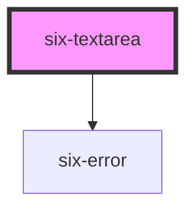

# Textarea


## Textarea

Textareas collect data from the user and allow multiple lines of text.

<docs-demo-six-textarea-0></docs-demo-six-textarea-0>

```html
<six-textarea></six-textarea>
```


## Examples

### Rows

Use the `rows` attribute to change the number of text rows that get shown.

<docs-demo-six-textarea-1></docs-demo-six-textarea-1>

```html
<six-textarea rows="2"></six-textarea>
```


### Placeholders

Use the `placeholder` attribute to add a placeholder.

<docs-demo-six-textarea-2></docs-demo-six-textarea-2>

```html
<six-textarea placeholder="Type something"></six-textarea>
```


### Disabled

Use the `disabled` prop to disable an input.

<docs-demo-six-textarea-3></docs-demo-six-textarea-3>

```html
<six-textarea placeholder="Textarea" disabled></six-textarea>
```


### Sizes

Use the `size` attribute to change a textarea's size.

<docs-demo-six-textarea-4></docs-demo-six-textarea-4>

```html
<six-textarea placeholder="Small" size="small"></six-textarea>
<br>
<six-textarea placeholder="Medium" size="medium"></six-textarea>
<br>
<six-textarea placeholder="Large" size="large"></six-textarea>
```


### Labels

Use the `label` attribute to give the textarea an accessible label. For labels that contain HTML, use the label `slot` instead.

<docs-demo-six-textarea-5></docs-demo-six-textarea-5>

```html
<six-textarea label="Comments"></six-textarea>
```


### Help Text

Add descriptive help text to a select with the `help-text` attribute. For help texts that contain HTML, use the help-text slot instead.

<docs-demo-six-textarea-6></docs-demo-six-textarea-6>

```html
<six-textarea label="Feedback" help-text="Please tell us what you think."> </six-textarea>
```


### Prevent Resizing

By default, textareas can be resized vertically by the user. To prevent resizing, set the `resize` attribute to `none`.

<docs-demo-six-textarea-7></docs-demo-six-textarea-7>

```html
<six-textarea resize="none"></six-textarea>
```


### Expand with Content

Textareas will automatically resize to expand to fit their content when `resize` is set to `auto`.

<docs-demo-six-textarea-8></docs-demo-six-textarea-8>

```html
<six-textarea resize="auto"></six-textarea>
```


## Events Discalimer

The events of our webcommponents should follow native web elements as much as possible.

This means input, change and blur should be fired the same as when using native elements: Input is fired on input, and change and blur are fired when leaving the input

`six-input-input` is emitted when the user enters data (not emitted on dynamic value changes)

`six-input-change` is emitted when the user presses enter or leaves the form after filling in data

`six-input-blur` is emitted when the user leaves the form

`six-input-value-change` is emitted whenever the value changes. This could be because the user enters data or because the value was dynamically changed

You can play with the following native and six-input elements to see that the event firing is the same

<docs-demo-six-textarea-9></docs-demo-six-textarea-9>

```html
<div style="font-size: 1rem; font-weight: bold; padding-bottom: 1rem">Native Input Element</div>
<textarea type="text" id="native-textarea" name="type"></textarea>
<div style="padding-bottom: 0.5rem">
  <div style="padding-top: 1rem">Event Firing History:</div>
  <ul id="native-events-list"></ul>
</div>

<div style="font-size: 1rem; font-weight: bold; padding-bottom: 1rem">SIX Input Element</div>
<six-textarea           label="Events"
  help-text="Check what event is fired when..."
  id="custom-six-textarea"
></six-textarea>
<six-button style="padding-top: 0.5rem" id="event-setting-btn">Set Value</six-button>
<div style="padding-bottom: 0.5rem">
  <div style="padding-top: 1rem">Event Firing History:</div>
  <ul id="events-list"></ul>
</div>
<div style="padding-bottom: 0.5rem">
  <div style="padding-top: 1rem">Event Firing History for six-textarea-value-change:</div>
  <ul id="events-list-value-change"></ul>
</div>

<script type="module">
  const nativeTextarea = document.getElementById('native-textarea');
  const inputEl = document.getElementById('custom-six-textarea');
  const eventList = document.getElementById('events-list');
  const eventListValueChange = document.getElementById('events-list-value-change');
  const nativeEventList = document.getElementById('native-events-list');
  const eventSettingBtn = document.getElementById('event-setting-btn');

  const logEvent = (eventName, el, color) => (event) => {
    const value = event.target.value;
    el.innerHTML = `${el.innerHTML}<li><span style="font-weight: bold; color: ${color};">${eventName}:</span> ${value}</li>`;
  };
  inputEl.addEventListener('six-textarea-input', logEvent('input', eventList, 'blue'));
  inputEl.addEventListener('six-textarea-change', logEvent('change', eventList, 'red'));
  inputEl.addEventListener('six-textarea-blur', logEvent('blur', eventList, 'green'));
  inputEl.addEventListener('six-textarea-value-change', logEvent('value-change', eventListValueChange));

  nativeTextarea.addEventListener('input', logEvent('input', nativeEventList, 'blue'));
  nativeTextarea.addEventListener('change', logEvent('change', nativeEventList, 'red'));
  nativeTextarea.addEventListener('blur', logEvent('blur', nativeEventList, 'green'));

  eventSettingBtn.addEventListener('click', () => {
    const someString = 'dynamically set value';
    inputEl.value = someString;
    nativeTextarea.value = someString;
  });
</script>
```


## Error Text

Add a descriptive error message using either the `error-text` prop, or the equally named slot.

warning There are two caveats when using the `error-text` prop/slot:

1.  Remember to set the `invalid` prop as well! If you only provide some content to the `error-text` prop/slot, it won't be shown unless the `invalid` prop is set to true
2.  When using the prop, and you need to show more than one message, remember to also set the `error-text-count` prop to a value that is the same or bigger than the length of the list of messages you are using. Otherwise only one message will be shown at a time

The `error-text` prop accepts either a simple string message, or a list of messages.

<docs-demo-six-textarea-10></docs-demo-six-textarea-10>

```html
<six-textarea label="Simple string message" error-text="This is a simple string message" invalid>
</six-textarea>
```


<docs-demo-six-textarea-11></docs-demo-six-textarea-11>

```html
<six-textarea id="multiple-error-text" label="List of string message" invalid></six-textarea>
<script type="module">
  const sixTextarea = document.getElementById('multiple-error-text');
  sixTextarea.errorText = ['Message 1', 'Message 2'];
  sixTextarea.errorTextCount = 3;
</script>
```


When using the `error-text` slot, it is recommended to use the `six-error` component to wrap the error message(s). This will provide the correct styling out of the box

<docs-demo-six-textarea-12></docs-demo-six-textarea-12>

```html
<six-textarea invalid>
  <div slot="error-text">
    <six-error               >An error message
      <a href="https://github.com/six-group/six-webcomponents" target="_blank">with a link</a></six-error>
  </div>
</six-textarea>
```


<!-- Auto Generated Below -->


## Properties

| Property         | Attribute          | Description                                                                                                      | Type                                                                                               | Default      |
| ---------------- | ------------------ | ---------------------------------------------------------------------------------------------------------------- | -------------------------------------------------------------------------------------------------- | ------------ |
| `autocapitalize` | `autocapitalize`   | The textarea's autocaptialize attribute.                                                                         | `string`                                                                                           | `'off'`      |
| `autocomplete`   | `autocomplete`     | The textarea's autocomplete attribute.                                                                           | `string`                                                                                           | `'off'`      |
| `autocorrect`    | `autocorrect`      | The textarea's autocorrect attribute.                                                                            | `"off" \| "on"`                                                                                    | `'off'`      |
| `autofocus`      | `autofocus`        | The textarea's autofocus attribute.                                                                              | `boolean`                                                                                          | `false`      |
| `disabled`       | `disabled`         | Set to true to disable the textarea.                                                                             | `boolean`                                                                                          | `false`      |
| `errorText`      | `error-text`       | The error message shown, if `invalid` is set to true.                                                            | `string \| string[]`                                                                               | `''`         |
| `errorTextCount` | `error-text-count` | The number of error texts to be shown (if the error-text slot isn't used). Defaults to 1                         | `number \| undefined`                                                                              | `undefined`  |
| `helpText`       | `help-text`        | The textarea's help text. Alternatively, you can use the help-text slot.                                         | `string`                                                                                           | `''`         |
| `inputmode`      | `inputmode`        | The textarea's inputmode attribute.                                                                              | `"decimal" \| "email" \| "none" \| "numeric" \| "search" \| "tel" \| "text" \| "url" \| undefined` | `undefined`  |
| `invalid`        | `invalid`          | If this property is set to true and an error message is provided by `errorText`, the error message is displayed. | `boolean`                                                                                          | `false`      |
| `label`          | `label`            | The label text.                                                                                                  | `string`                                                                                           | `''`         |
| `maxlength`      | `maxlength`        | The maximum length of input that will be considered valid.                                                       | `number \| undefined`                                                                              | `undefined`  |
| `minlength`      | `minlength`        | The minimum length of input that will be considered valid.                                                       | `number \| undefined`                                                                              | `undefined`  |
| `name`           | `name`             | The textarea's name attribute.                                                                                   | `string`                                                                                           | `''`         |
| `placeholder`    | `placeholder`      | The textarea's placeholder text.                                                                                 | `string \| undefined`                                                                              | `undefined`  |
| `readonly`       | `readonly`         | Set to true for a readonly textarea.                                                                             | `boolean`                                                                                          | `false`      |
| `required`       | `required`         | Set to true to show an asterisk beneath the label.                                                               | `boolean`                                                                                          | `false`      |
| `resize`         | `resize`           | Controls how the textarea can be resized.                                                                        | `"auto" \| "none" \| "vertical"`                                                                   | `'vertical'` |
| `rows`           | `rows`             | The number of rows to display by default.                                                                        | `number`                                                                                           | `4`          |
| `size`           | `size`             | The textarea's size.                                                                                             | `"large" \| "medium" \| "small"`                                                                   | `'medium'`   |
| `spellcheck`     | `spellcheck`       | The textarea's spellcheck attribute.                                                                             | `boolean`                                                                                          | `false`      |
| `value`          | `value`            | The textarea's value attribute.                                                                                  | `string`                                                                                           | `''`         |


## Events

| Event                 | Description                                                                            | Type                     |
| --------------------- | -------------------------------------------------------------------------------------- | ------------------------ |
| `six-textarea-blur`   | Emitted when the control loses focus. Access the new value via event.target.value.     | `CustomEvent<undefined>` |
| `six-textarea-change` | Emitted when the control's value changes. Access the new value via event.target.value. | `CustomEvent<undefined>` |
| `six-textarea-focus`  | Emitted when the control gains focus.                                                  | `CustomEvent<undefined>` |
| `six-textarea-input`  | Emitted when the control receives input. Access the new value via event.target.value.  | `CustomEvent<undefined>` |


## Methods

### `removeFocus() => Promise<void>`

Removes focus fromt the textarea.

#### Returns

Type: `Promise<void>`


### `select() => Promise<void | undefined>`

Selects all the text in the input.

#### Returns

Type: `Promise<void | undefined>`


### `setFocus(options?: FocusOptions) => Promise<void>`

Sets focus on the textarea.

#### Parameters

| Name      | Type                        | Description |
| --------- | --------------------------- | ----------- |
| `options` | `FocusOptions \| undefined` |             |

#### Returns

Type: `Promise<void>`


### `setRangeText(replacement: string, start: number, end: number, selectMode?: 'select' | 'start' | 'end' | 'preserve') => Promise<void>`

Replaces a range of text with a new string.

#### Parameters

| Name          | Type                                         | Description |
| ------------- | -------------------------------------------- | ----------- |
| `replacement` | `string`                                     |             |
| `start`       | `number`                                     |             |
| `end`         | `number`                                     |             |
| `selectMode`  | `"select" \| "start" \| "end" \| "preserve"` |             |

#### Returns

Type: `Promise<void>`


### `setSelectionRange(selectionStart: number, selectionEnd: number, selectionDirection?: 'forward' | 'backward' | 'none') => Promise<void | undefined>`

Sets the start and end positions of the text selection (0-based).

#### Parameters

| Name                 | Type                                | Description |
| -------------------- | ----------------------------------- | ----------- |
| `selectionStart`     | `number`                            |             |
| `selectionEnd`       | `number`                            |             |
| `selectionDirection` | `"none" \| "forward" \| "backward"` |             |

#### Returns

Type: `Promise<void | undefined>`


## Slots

| Slot           | Description                                                                                     |
| -------------- | ----------------------------------------------------------------------------------------------- |
| `"error-text"` | Error text that is shown for validation errors. Alternatively, you can use the error-text prop. |
| `"help-text"`  | Help text that describes how to use the input.                                                  |
| `"label"`      | The textarea's label. Alternatively, you can use the label prop.                                |


## Shadow Parts

| Part             | Description                                                     |
| ---------------- | --------------------------------------------------------------- |
| `"base"`         | The component's base wrapper.                                   |
| `"form-control"` | The form control that wraps the label, textarea, and help text. |
| `"help-text"`    | The textarea help text.                                         |
| `"label"`        | The textarea label.                                             |
| `"textarea"`     | The textarea control.                                           |


## Dependencies

### Depends on

- [six-error](six-error.html)

### Graph


----------------------------------------------

Copyright © 2021-present SIX-Group
