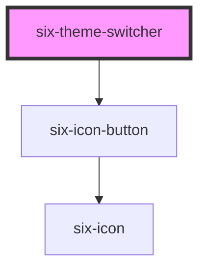

# Theme Switcher

A simple icon button that toggles between light and dark themes. Works with six-root's theme management system.


## Theme Switcher

The `six-theme-switcher` is a simple icon button that toggles between light and dark themes. It automatically syncs with `six-root`'s theme management system.

<docs-demo-six-theme-switcher-0></docs-demo-six-theme-switcher-0>

```html
<div style="background: grey">
  <six-theme-switcher></six-theme-switcher>
</div>
```


## Sizes

Theme switchers inherit the same size options as icon buttons.

<docs-demo-six-theme-switcher-1></docs-demo-six-theme-switcher-1>

```html
<div style="background: grey">
  <six-theme-switcher size="xSmall"></six-theme-switcher>
  <six-theme-switcher size="small"></six-theme-switcher>
  <six-theme-switcher size="medium"></six-theme-switcher>
  <six-theme-switcher size="large"></six-theme-switcher>
  <six-theme-switcher size="xLarge"></six-theme-switcher>
</div>
```


## Disabled

Set the `disabled` attribute to disable the theme switcher.

<docs-demo-six-theme-switcher-2></docs-demo-six-theme-switcher-2>

```html
<div style="background: grey">
  <six-theme-switcher disabled></six-theme-switcher>
</div>
```


## Custom Label

Provide a custom label for screen readers using the `label` attribute. This improves accessibility.

<docs-demo-six-theme-switcher-3></docs-demo-six-theme-switcher-3>

```html
<div style="background: grey">
  <six-theme-switcher label="Switch between light and dark mode"></six-theme-switcher>
</div>
```


## With Tooltip

Wrap a tooltip around the theme switcher to provide contextual information to the user.

<docs-demo-six-theme-switcher-4></docs-demo-six-theme-switcher-4>

```html
<div style="background: grey">
  <six-tooltip content="Toggle theme">
    <six-theme-switcher></six-theme-switcher>
  </six-tooltip>
</div>
```


## In Header

The theme switcher is commonly used in application headers.

<docs-demo-six-theme-switcher-5></docs-demo-six-theme-switcher-5>

```html
<div style="border: 1px solid var(--six-color-web-rock-300); border-radius: 4px">
  <six-root>
    <six-header slot="header">
      <six-header-item>
        <six-icon-button name="menu"></six-icon-button>
      </six-header-item>

      <six-header-item>
        <six-logo></six-logo>
      </six-header-item>

      <six-header-item style="margin-left: auto">
        <six-theme-switcher></six-theme-switcher>
      </six-header-item>

      <six-header-item>
        <six-icon-button name="settings"></six-icon-button>
      </six-header-item>
    </six-header>
  </six-root>
</div>
```


<!-- Auto Generated Below -->


## Properties

| Property   | Attribute  | Description                                     | Type                                                                                | Default          |
| ---------- | ---------- | ----------------------------------------------- | ----------------------------------------------------------------------------------- | ---------------- |
| `disabled` | `disabled` | Set to true to disable the theme switcher.      | `boolean`                                                                           | `false`          |
| `label`    | `label`    | A description that gets read by screen readers. | `string`                                                                            | `'Toggle theme'` |
| `size`     | `size`     | The icon button's size.                         | `"large" \| "medium" \| "small" \| "xLarge" \| "xSmall" \| "xxLarge" \| "xxxLarge"` | `'medium'`       |


## Events

| Event                       | Description                        | Type                     |
| --------------------------- | ---------------------------------- | ------------------------ |
| `six-theme-switcher-change` | Emitted when the theme is changed. | `CustomEvent<undefined>` |


## Shadow Parts

| Part     | Description                   |
| -------- | ----------------------------- |
| `"base"` | The component's base wrapper. |


## Dependencies

### Depends on

- [six-icon-button](six-icon-button.html)

### Graph


----------------------------------------------

Copyright © 2021-present SIX-Group
