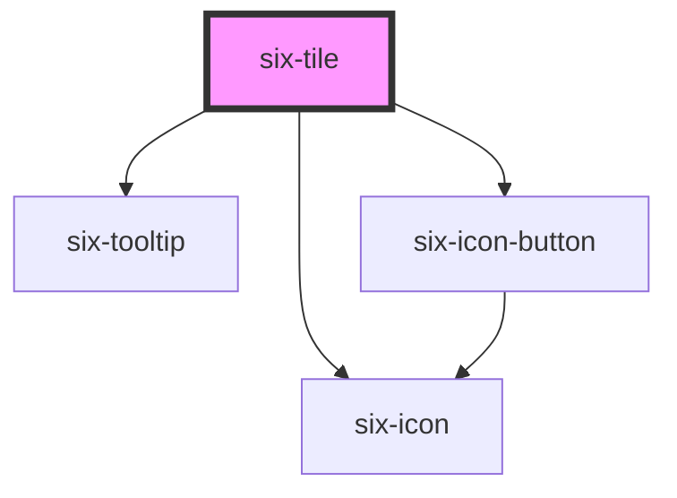

# six-tile


## Tile

Simple tile implementation.

<docs-demo-six-tile-291></docs-demo-six-tile-291>

```html
<six-tile id="tileFancy" label="Fancy Tile" icon-name="favorite"></six-tile>
<script type="module">
  const tile = document.querySelector('#tileFancy');
  tile.addEventListener('six-tile-selected', () => alert('hello fancy tile!'));
</script>
```


## Examples

### Sizes

Use the `size` attribute to change the size of the tile.

<docs-demo-six-tile-292></docs-demo-six-tile-292>

```html
<six-tile label="Small" icon-name="home" size="small"></six-tile>
<six-tile label="Medium" icon-name="home"></six-tile>
<six-tile label="Large" icon-name="home" size="large"></six-tile>
```


### Closeable

Use the `closeable` attribute to avoid that the tile is closable.

<docs-demo-six-tile-293></docs-demo-six-tile-293>

```html
<six-tile label="Medium" icon-name="home" closeable="false"></six-tile>
```


### Elevated

Use the `elevated` attribute to let the tile cast a shadow.

<docs-demo-six-tile-294></docs-demo-six-tile-294>

```html
<six-tile label="Medium" icon-name="home" elevated="true"></six-tile>
```


### Disabled

Use the `disabled` attribute to avoid that the tile is clicked.

<docs-demo-six-tile-295></docs-demo-six-tile-295>

```html
<six-tile label="Medium" icon-name="home" disabled="true"></six-tile>
```


### Passing props via slot

In some cases you might need to have more control over how the icon or label is displayed. In these scenarios use the slot over the props.

<docs-demo-six-tile-296></docs-demo-six-tile-296>

```html
<six-tile id="tileWithLabelSlot" icon-name="home">
  <div slot="label" style="text-align: center; min-height: 4em">
    <div>some very long label</div>
    <div>which requires</div>
    <div>multiple lines</div>
  </div>
</six-tile>
<six-tile id="tileWithIconSlot" sixTileSelected="alert('clicked')">
  <six-icon slot="icon" size="xxLarge" style="color: red">delete</six-icon>
  <div slot="label" style="text-align: center; min-height: 4em; align-items: center; display: flex">
    short label
  </div>
</six-tile>
<script type="module">
  const tile1 = document.querySelector('#tileWithIconSlot');
  tile1.addEventListener('six-tile-selected', () => alert('hello custom icon tile!'));

  const tile2 = document.querySelector('#tileWithLabelSlot');
  tile2.addEventListener('six-tile-selected', () => alert('hello custom label tile!'));
</script>
```


## Adding a tooltip

If you wish to show a tooltip on hover, simply add the attribute `disable-tooltip="false"`

<docs-demo-six-tile-297></docs-demo-six-tile-297>

```html
<six-tile label="Fancy Tile" icon-name="favorite" disable-tooltip="false"></six-tile>
```


<!-- Auto Generated Below -->


## Properties

| Property         | Attribute         | Description                                  | Type                             | Default     |
| ---------------- | ----------------- | -------------------------------------------- | -------------------------------- | ----------- |
| `closeable`      | `closeable`       | Flag, whether the tile is closeable.         | `boolean`                        | `true`      |
| `disableTooltip` | `disable-tooltip` | Enables tile tooltip for tiles               | `boolean`                        | `true`      |
| `disabled`       | `disabled`        | Set to true to disable the tile.             | `boolean`                        | `false`     |
| `elevated`       | `elevated`        | Flag, whether the tile should cast a shadow. | `boolean`                        | `false`     |
| `iconName`       | `icon-name`       | The icon's name.                             | `string \| undefined`            | `undefined` |
| `label`          | `label`           | The tile's label.                            | `string`                         | `''`        |
| `size`           | `size`            | The tile's size.                             | `"large" \| "medium" \| "small"` | `'medium'`  |


## Events

| Event               | Description                        | Type                     |
| ------------------- | ---------------------------------- | ------------------------ |
| `six-tile-closed`   | Emitted when the tile was closed.  | `CustomEvent<undefined>` |
| `six-tile-selected` | Emitted when the tile is selected. | `CustomEvent<undefined>` |


## Methods

### `hide() => Promise<void>`

Hides the tile

#### Returns

Type: `Promise<void>`


### `show() => Promise<void>`

Shows the tile

#### Returns

Type: `Promise<void>`


## Shadow Parts

| Part       | Description |
| ---------- | ----------- |
| `"base"`   |             |
| `"body"`   |             |
| `"footer"` |             |
| `"header"` |             |


## Dependencies

### Depends on

- [six-tooltip](six-tooltip.html)
- [six-icon-button](six-icon-button.html)
- [six-icon](six-icon.html)

### Graph


----------------------------------------------

Copyright © 2021-present SIX-Group
