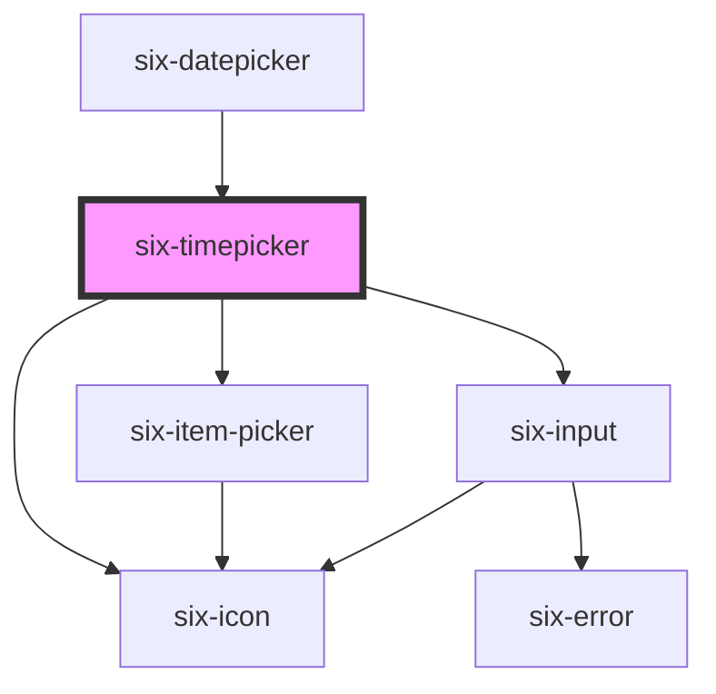

# six-time-picker


# Simple Time Picker

The `six-timepicker` can be used to select the time.

By default the time will be displayed as `HH:mm:ss` and you can either directly modify the time in the input field, or via the picker component in the popup

<docs-demo-six-timepicker-0></docs-demo-six-timepicker-0>

```html
<six-timepicker></six-timepicker>
<style>
  six-timepicker {
    max-width: 15rem;
  }
</style>
```


## Time Formats

You can choose one of the valid formats to define what options should be displayed (default is `HH:mm:ss`):

<docs-demo-six-timepicker-1></docs-demo-six-timepicker-1>

```html
<div class="format-example">
  <six-timepicker format="HH:mm:ss" placeholder="HH:mm:ss"></six-timepicker>
  <six-timepicker format="hh:mm:ss:aa" placeholder="hh:mm:ss:aa"></six-timepicker>
  <six-timepicker format="HH:mm:ss:ms" placeholder="HH:mm:ss:ms"></six-timepicker>
  <six-timepicker format="hh:mm:ss:ms:aa" placeholder="hh:mm:ss:ms:aa"></six-timepicker>
  <six-timepicker format="HH:mm" placeholder="HH:mm"></six-timepicker>
  <six-timepicker format="hh:mm:aa" placeholder="hh:mm:aa"></six-timepicker>
  <six-timepicker format="HH" placeholder="HH"></six-timepicker>
  <six-timepicker format="hh:aa" placeholder="hh:aa"></six-timepicker>
  <six-timepicker format="mm" placeholder="mm"></six-timepicker>
  <six-timepicker format="ss" placeholder="ss"></six-timepicker>
  <six-timepicker format="ms" placeholder="ms"></six-timepicker>
</div>
<style>
  .format-example {
    display: flex;
    flex-wrap: wrap;
  }

  .format-example > * {
    margin-right: 1.5rem;
    margin-bottom: 1.5rem;
  }

  six-timepicker {
    max-width: 15rem;
  }
</style>
```


## Setting the value

If you don't set a custom value the default value for the `timepicker` will be the current time.

<docs-demo-six-timepicker-2></docs-demo-six-timepicker-2>

```html
<div style="display: flex; flex-wrap: wrap">
  <six-card class="time-format-item">
    <div>HH:mm:ss</div>
    <six-timepicker format="HH:mm:ss" value="13:32:35"></six-timepicker>
  </six-card>
  <six-card class="time-format-item">
    <div>hh:mm:ss:aa</div>
    <six-timepicker format="hh:mm:ss:aa" value="11:59:35:AM"></six-timepicker>
  </six-card>
  <six-card class="time-format-item">
    <div>HH:mm:ss:ms</div>
    <six-timepicker format="HH:mm:ss:ms" value="23:11:53:999"></six-timepicker>
  </six-card>
  <six-card class="time-format-item">
    <div>hh:mm:ss:ms:aa</div>
    <six-timepicker format="hh:mm:ss:ms:aa" value="05:32:35:273:AM"></six-timepicker>
  </six-card>
  <six-card class="time-format-item">
    <div>HH:mm</div>
    <six-timepicker format="HH:mm" value="22:13"></six-timepicker>
  </six-card>
  <six-card class="time-format-item">
    <div>hh:mm:aa</div>
    <six-timepicker format="hh:mm:aa" value="10:53:PM"></six-timepicker>
  </six-card>
  <six-card class="time-format-item">
    <div>HH</div>
    <six-timepicker format="HH" value="05"></six-timepicker>
  </six-card>
  <six-card class="time-format-item">
    <div>hh:aa</div>
    <six-timepicker format="hh:aa" value="08:AM"></six-timepicker>
  </six-card>
  <six-card class="time-format-item">
    <div>mm</div>
    <six-timepicker format="mm" value="59"></six-timepicker>
  </six-card>
  <six-card class="time-format-item">
    <div>ss</div>
    <six-timepicker format="ss" value="11"></six-timepicker>
  </six-card>
  <six-card class="time-format-item">
    <div>ms</div>
    <six-timepicker format="ms" value="254"></six-timepicker>
  </six-card>
  <style>
    .time-format-item {
      width: 15rem;
      text-align: center;
      padding: 1rem 0.5rem;
      display: flex;
      flex-wrap: wrap;
      align-items: center;
      justify-content: center;
      margin: 0.75rem;
    }

    .time-format-item > *:first-child {
      width: 15rem;
      font-weight: bold;
      margin-bottom: 0.5rem;
    }

    six-timepicker {
      max-width: 15rem;
    }
  </style>
</div>
```


## Different Separator

You can define a different separator by adding the `separator` attribute

However, please note that the time string you provide must always have a colon (":") and cannot have a different separator

<docs-demo-six-timepicker-3></docs-demo-six-timepicker-3>

```html
<six-timepicker separator="-"></six-timepicker>
<style>
  six-timepicker {
    max-width: 15rem;
  }
</style>
```


## Timeout & Interval

If you keep a navigation button pressed, the items will switch faster. By default the timeout is set to `300ms` and the interval is set to `35ms`.

Feel free to adjust these numbers to your need:

<docs-demo-six-timepicker-4></docs-demo-six-timepicker-4>

```html
<six-timepicker></six-timepicker>
<br>
<six-timepicker timeout="500" interval="150"></six-timepicker>
<br>
<six-timepicker timeout="0" interval="1"></six-timepicker>
<style>
  six-timepicker {
    max-width: 15rem;
  }
</style>
```


## Placeholder

You can define the timepickers placeholder via `placeholder`

<docs-demo-six-timepicker-5></docs-demo-six-timepicker-5>

```html
<six-timepicker placeholder="HH:mm:ss"></six-timepicker>
<style>
  six-timepicker {
    max-width: 15rem;
  }
</style>
```


## Readonly State

If you want to force the user to use the popup instead of manually enter a time, you can simply add the `readonly` property

<docs-demo-six-timepicker-6></docs-demo-six-timepicker-6>

```html
<six-timepicker readonly></six-timepicker>
<style>
  six-timepicker {
    max-width: 15rem;
  }
</style>
```


## Disabled State

To disable the timepicker i.e. nothing will happen when clicking the input field, simply add the `disabled` property

<docs-demo-six-timepicker-7></docs-demo-six-timepicker-7>

```html
<six-timepicker disabled></six-timepicker>
<style>
  six-timepicker {
    max-width: 15rem;
  }
</style>
```


### Clearable

Add the `clearable` property to add a clear button when the input has content.

<docs-demo-six-timepicker-8></docs-demo-six-timepicker-8>

```html
<six-timepicker clearable></six-timepicker>
<style>
  six-timepicker {
    max-width: 15rem;
  }
</style>
```


## Sizes

Use the `size` attribute to change the timepicker size.

<docs-demo-six-timepicker-9></docs-demo-six-timepicker-9>

```html
<six-timepicker size="small" clearable></six-timepicker>
<br>
<six-timepicker size="medium" clearable></six-timepicker>
<br>
<six-timepicker size="large" clearable></six-timepicker>
<style>
  six-timepicker {
    max-width: 15rem;
  }
</style>
```


## Inline State

If you wish you can have the timepicker as an inline component i.e. the popup will always be open

<docs-demo-six-timepicker-10></docs-demo-six-timepicker-10>

```html
<six-timepicker inline="true"></six-timepicker>
<style>
  six-timepicker {
    max-width: 15rem;
  }
</style>
```


## Placement

By default the timepicker will render either below or above the input field depending on the available space.

If you want to enforce a certain placement you can use the `placement` attribute

<docs-demo-six-timepicker-11></docs-demo-six-timepicker-11>

```html
<six-timepicker placement="bottom"></six-timepicker>
<br>
<six-timepicker placement="top"></six-timepicker>
<style>
  six-timepicker {
    max-width: 15rem;
  }
</style>
```


## Icon position

Could be adjusted providing `icon-position` property.

<docs-demo-six-timepicker-12></docs-demo-six-timepicker-12>

```html
<six-timepicker icon-position="right"></six-timepicker>
<br>
<six-timepicker icon-position="right" clearable></six-timepicker>
<br>
<six-timepicker icon-position="right" custom-icon clearable>
  
</six-timepicker>
<style>
  six-timepicker {
    max-width: 15rem;
  }
</style>
```


## Custom icon

The slot `custom-icon` is used to provide a custom timepicker icon.

<docs-demo-six-timepicker-13></docs-demo-six-timepicker-13>

```html
<six-timepicker custom-icon>
  
</six-timepicker>
<style>
  six-timepicker {
    max-width: 15rem;
  }
</style>
```


## Hoisting

Dropdown panels will be clipped if they're inside a container that has overflow: auto|hidden. The hoist attribute forces the panel to use a fixed positioning strategy, allowing it to break out of the container. In this case, the panel will be positioned relative to its containing block, which is usually the viewport unless an ancestor uses a transform, perspective, or filter.

<docs-demo-six-timepicker-14></docs-demo-six-timepicker-14>

```html
<div style="overflow: hidden; border: solid 1px grey; padding: 0.5em; display: flex">
  <six-timepicker placement="bottom" placeholder="no hoisting"></six-timepicker>
  <six-timepicker hoist placement="bottom" placeholder="with hoisting"></six-timepicker>
</div>
<style>
  six-timepicker {
    max-width: 15rem;
  }
</style>
```


## Custom Default Time

You can define a custom default time which will be shown on first appearance of the popup

<docs-demo-six-timepicker-15></docs-demo-six-timepicker-15>

```html
<six-timepicker default-time="23:00:00"></six-timepicker>
<style>
  six-timepicker {
    max-width: 15rem;
  }
</style>
```


## Dynamic changes

The timepicker value can be changed dynamically by setting the `value` attribute.

<docs-demo-six-timepicker-16></docs-demo-six-timepicker-16>

```html
<six-timepicker id="dynamic-timepicker"></six-timepicker>
<div style="margin-top: 1rem">
  <span style="font-weight: bold">Selected: </span><span id="dynamic-timepicker-selected">No Time selected yet!</span>
</div>
<div style="margin-top: 1rem">
  <six-button id="dynamic-timepicker-btn1">20:13:22</six-button>
  <six-button id="dynamic-timepicker-btn2">13:33:59</six-button>
  <six-button id="dynamic-timepicker-btn3">02:30:00</six-button>
</div>
<script type="module">
  const timepicker = document.getElementById('dynamic-timepicker');
  const selectedTime = document.getElementById('dynamic-timepicker-selected');

  const btn1 = document.getElementById('dynamic-timepicker-btn1');
  btn1.addEventListener('click', () => (timepicker.value = '20:13:22'));

  const btn2 = document.getElementById('dynamic-timepicker-btn2');
  btn2.addEventListener('click', () => (timepicker.value = '13:33:59'));

  const btn3 = document.getElementById('dynamic-timepicker-btn3');
  btn3.addEventListener('click', () => (timepicker.value = '02:30:00'));

  timepicker.addEventListener('six-timepicker-change', ({ detail }) => {
    selectedTime.innerHTML = `${detail.valueAsString}`;
  });
</script>
<style>
  six-timepicker {
    max-width: 15rem;
  }
</style>
```


## Events

You can listen to the timepicker change event. The event will give you the `changedProperty` e.g. 'hours', 'minutes', 'seconds' etc.

Additionally you get the current value of the timepicker (not only the changed property), from where you can also read the updated property e.g. `value.hours`. And you can get the whole time as a string e.g. `15:37:25:692`

<docs-demo-six-timepicker-17></docs-demo-six-timepicker-17>

```html
<div style="display: flex">
  <six-timepicker id="timepicker-event-example" format="HH:mm:ss:ms"></six-timepicker>
  <pre style="margin-left: 1.5rem">Fired Event: <span id="event-change-example-selected-time"></span></pre>
</div>
<script type="module">
  const timepicker = document.getElementById('timepicker-event-example');
  const changeEventTime = document.getElementById('event-change-example-selected-time');

  timepicker.addEventListener('six-timepicker-change', ({ detail }) => {
    changeEventTime.innerHTML = JSON.stringify(detail, null, 4);
  });
</script>
<style>
  six-timepicker {
    max-width: 15rem;
  }
</style>
```


In the following you also find an event example for the 12-hour-clock:

<docs-demo-six-timepicker-18></docs-demo-six-timepicker-18>

```html
<div style="display: flex">
  <six-timepicker id="timepicker-event-example-12h" format="hh:mm:ss:ms:aa"></six-timepicker>
  <pre style="margin-left: 1.5rem">Fired Event: <span id="event-example-selected-time-12h"></span></pre>
</div>
<script type="module">
  const timepicker = document.getElementById('timepicker-event-example-12h');
  const selectedTime = document.getElementById('event-example-selected-time-12h');

  timepicker.addEventListener('six-timepicker-change', ({ detail }) => {
    selectedTime.innerHTML = JSON.stringify(detail, null, 4);
  });
</script>
<style>
  six-timepicker {
    max-width: 15rem;
  }
</style>
```


If you keep the navigation button pressed, there will be a lot of change events fired. If you don't want to listen to all of these events but want to "wait" until the user landed on their desired time, then use `six-timepicker-change-debounced` instead.

<docs-demo-six-timepicker-19></docs-demo-six-timepicker-19>

```html
<div style="display: flex">
  <six-timepicker id="timepicker-event-debounced-example" format="HH:mm:ss:ms"></six-timepicker>
  <pre style="margin-left: 1.5rem">Fired Event: <span id="event-debounced-example-selected-time"></span></pre>
</div>
<script type="module">
  const timepicker = document.getElementById('timepicker-event-debounced-example');
  const selectedTime = document.getElementById('event-debounced-example-selected-time');

  timepicker.addEventListener('six-timepicker-change-debounced', ({ detail }) => {
    selectedTime.innerHTML = JSON.stringify(detail, null, 4);
  });
</script>
<style>
  six-timepicker {
    max-width: 15rem;
  }
</style>
```


### Open State

If you wish you can have the timepicker open on startup. It will close as usual (clicking outside etc.)

<docs-demo-six-timepicker-20></docs-demo-six-timepicker-20>

```html
<six-timepicker open="true" placement="bottom"></six-timepicker>
<style>
  six-timepicker {
    max-width: 15rem;
  }
</style>
```


## Error Text

Add a descriptive error message using either the `error-text` prop, or the equally named slot.

warning There are two caveats when using the `error-text` prop/slot:

1.  Remember to set the `invalid` prop as well! If you only provide some content to the `error-text` prop/slot, it won't be shown unless the `invalid` prop is set to true
2.  When using the prop, and you need to show more than one message, remember to also set the `error-text-count` prop to a value that is the same or bigger than the length of the list of messages you are using. Otherwise only one message will be shown at a time

The `error-text` prop accepts either a simple string message, or a list of messages.

<docs-demo-six-timepicker-21></docs-demo-six-timepicker-21>

```html
<six-timepicker label="Simple string message" error-text="This is a simple string message" invalid>
</six-timepicker>
```


<docs-demo-six-timepicker-22></docs-demo-six-timepicker-22>

```html
<six-timepicker id="multiple-error-text" label="List of string message" invalid></six-timepicker>
<script type="module">
  const sixTimepicker = document.getElementById('multiple-error-text');
  sixTimepicker.errorText = ['Message 1', 'Message 2'];
  sixTimepicker.errorTextCount = 3;
</script>
```


When using the `error-text` slot, it is recommended to use the `six-error` component to wrap the error message(s). This will provide the correct styling out of the box

<docs-demo-six-timepicker-23></docs-demo-six-timepicker-23>

```html
<six-timepicker invalid>
  <div slot="error-text">
    <six-error               >An error message
      <a href="https://github.com/six-group/six-webcomponents" target="_blank">with a link</a></six-error>
  </div>
</six-timepicker>
```


<!-- Auto Generated Below -->


## Properties

| Property         | Attribute          | Description                                                                                                                                                                                                                                                                                                                                                                           | Type                                                                                                                                   | Default                          |
| ---------------- | ------------------ | ------------------------------------------------------------------------------------------------------------------------------------------------------------------------------------------------------------------------------------------------------------------------------------------------------------------------------------------------------------------------------------- | -------------------------------------------------------------------------------------------------------------------------------------- | -------------------------------- |
| `clearable`      | `clearable`        | Set to true to add a clear button when the input is populated.                                                                                                                                                                                                                                                                                                                        | `boolean`                                                                                                                              | `false`                          |
| `debounce`       | `debounce`         | Set the amount of time, in milliseconds, to wait to trigger the `six-timepicker-change-debounced` event. If you want your change debounce event to not trigger when keeping the nav button pressed before, make sure debounce is a bit bigger than timeout, otherwise keeping the button pressed will trigger the event twice: once you click (and keep pressed) and once you release | `number`                                                                                                                               | `DEFAULT_DEBOUNCE_FAST`          |
| `defaultTime`    | `default-time`     | The defaultTime defines the default setting for the timepicker when you open the popup. Default time must match the provided format.                                                                                                                                                                                                                                                  | `string \| undefined`                                                                                                                  | `undefined`                      |
| `disabled`       | `disabled`         | If `true` the component is disabled.                                                                                                                                                                                                                                                                                                                                                  | `boolean`                                                                                                                              | `false`                          |
| `errorText`      | `error-text`       | The input's error text. Alternatively, you can use the error-text slot.                                                                                                                                                                                                                                                                                                               | `string \| string[]`                                                                                                                   | `''`                             |
| `errorTextCount` | `error-text-count` | The number of error texts to be shown (if the error-text slot isn't used). Defaults to 1                                                                                                                                                                                                                                                                                              | `number \| undefined`                                                                                                                  | `undefined`                      |
| `format`         | `format`           | Define the time format. Valid formats are:  HH:mm:ss hh:mm:ss:aa HH:mm:ss:ms hh:mm:ss:ms:aa HH:mm hh:mm:aa HH hh:aa mm ss ms  where HH is the 24 hour format and hh is the 12 hour format  Please notice that when using the 12-hour-clock (hh) you always need a period indicator (aa). So the time can be parsed as either am or pm                                                 | `"HH" \| "HH:mm" \| "HH:mm:ss" \| "HH:mm:ss:ms" \| "hh:aa" \| "hh:mm:aa" \| "hh:mm:ss:aa" \| "hh:mm:ss:ms:aa" \| "mm" \| "ms" \| "ss"` | `'HH:mm:ss'`                     |
| `hoist`          | `hoist`            | Enable this option to prevent the panel from being clipped when the component is placed inside a container with `overflow: auto\|scroll`.                                                                                                                                                                                                                                             | `boolean`                                                                                                                              | `false`                          |
| `iconPosition`   | `icon-position`    | Set the position of the icon                                                                                                                                                                                                                                                                                                                                                          | `"left" \| "right"`                                                                                                                    | `'left'`                         |
| `inline`         | `inline`           | Indicates whether the timepicker should be shown as an inline (always open) component                                                                                                                                                                                                                                                                                                 | `boolean`                                                                                                                              | `false`                          |
| `interval`       | `interval`         | Set the amount of time, in milliseconds, to wait between switching to next timeunit (e.g. next hour) when mouse button is held pressed.                                                                                                                                                                                                                                               | `number`                                                                                                                               | `DEFAULT_DEBOUNCE_INSANELY_FAST` |
| `invalid`        | `invalid`          | If this property is set to true and an error message is provided by `errorText`, the error message is displayed.                                                                                                                                                                                                                                                                      | `boolean`                                                                                                                              | `false`                          |
| `label`          | `label`            | The input's label. Alternatively, you can use the label slot.                                                                                                                                                                                                                                                                                                                         | `string`                                                                                                                               | `''`                             |
| `name`           | `name`             | The input's name attribute.                                                                                                                                                                                                                                                                                                                                                           | `string`                                                                                                                               | `''`                             |
| `open`           | `open`             | Indicates whether the timepicker dropdown is open on startup. You can use this in lieu of the show/hide methods.                                                                                                                                                                                                                                                                      | `boolean`                                                                                                                              | `false`                          |
| `placeholder`    | `placeholder`      | The placeholder defines what text to be shown on the input element                                                                                                                                                                                                                                                                                                                    | `string \| undefined`                                                                                                                  | `undefined`                      |
| `placement`      | `placement`        | The enforced placement of the dropdown panel.                                                                                                                                                                                                                                                                                                                                         | `"bottom" \| "top" \| undefined`                                                                                                       | `undefined`                      |
| `readonly`       | `readonly`         | If `true` the user can only select a time via the timepicker but not directly edit the input field.                                                                                                                                                                                                                                                                                   | `boolean`                                                                                                                              | `false`                          |
| `required`       | `required`         | Set to true to show an asterisk beneath the label.                                                                                                                                                                                                                                                                                                                                    | `boolean`                                                                                                                              | `false`                          |
| `separator`      | `separator`        | Define the separator to be shown between the time unit pickers. Please be aware that this property will modify the displayed separator only. The separator for a timestring is always expected to be a colon (eg. '13:52:20')                                                                                                                                                         | `string`                                                                                                                               | `':'`                            |
| `size`           | `size`             | Timepicker size.                                                                                                                                                                                                                                                                                                                                                                      | `"large" \| "medium" \| "small"`                                                                                                       | `'medium'`                       |
| `timeout`        | `timeout`          | Set the amount of time, in milliseconds, to wait to trigger faster switching between timeunits (e.g. hours).                                                                                                                                                                                                                                                                          | `number`                                                                                                                               | `DEFAULT_DEBOUNCE_FAST`          |
| `value`          | `value`            | The value of the timepicker provided as a string. The string mast match the provided format (or default format)                                                                                                                                                                                                                                                                       | `string`                                                                                                                               | `''`                             |


## Events

| Event                             | Description                                                | Type                               |
| --------------------------------- | ---------------------------------------------------------- | ---------------------------------- |
| `six-timepicker-change`           | Emitted when the timepicker's value changes                | `CustomEvent<SixTimepickerChange>` |
| `six-timepicker-change-debounced` | Emitted when the timepicker's value changes, but debounced | `CustomEvent<SixTimepickerChange>` |
| `six-timepicker-clear`            | Emitted when the clear button is activated.                | `CustomEvent<undefined>`           |


## Methods

### `setFocus(options?: FocusOptions) => Promise<void>`

Sets focus on the datepickers input.

#### Parameters

| Name      | Type                        | Description |
| --------- | --------------------------- | ----------- |
| `options` | `FocusOptions \| undefined` |             |

#### Returns

Type: `Promise<void>`


## Slots

| Slot           | Description                                                                                     |
| -------------- | ----------------------------------------------------------------------------------------------- |
| `"error-text"` | Error text that is shown for validation errors. Alternatively, you can use the error-text prop. |


## Shadow Parts

| Part          | Description                           |
| ------------- | ------------------------------------- |
| `"container"` | The container of whole component      |
| `"icon"`      |                                       |
| `"input"`     | The input field                       |
| `"popup"`     | The popup of the timepicker component |


## Dependencies

### Used by

 - [six-datepicker](six-datepicker.html)

### Depends on

- [six-item-picker](six-item-picker.html)
- [six-icon](six-icon.html)
- [six-input](six-input.html)

### Graph


----------------------------------------------

Copyright © 2021-present SIX-Group
