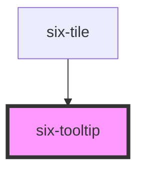

# six-tooltip

Tooltips display additional information based on a specific action.


A tooltip's target is its `first child element` , so you should only wrap one element inside of the tooltip. If you need the tooltip to show up for multiple elements, nest them inside a container first.

Tooltips use `display: contents` so they won't interfere with how elements are positioned in a flex or grid layout.

<docs-demo-six-tooltip-317></docs-demo-six-tooltip-317>

```html
<six-tooltip content="This is a tooltip">
  <six-button>Hover Me</six-button>
</six-tooltip>
```


## Placement

Use the `placement` attribute to set the preferred placement of the tooltip.

<docs-demo-six-tooltip-318></docs-demo-six-tooltip-318>

```html
<div class="tooltip-placement-example">
  <div class="tooltip-placement-example-row">
    <six-tooltip content="top-start" placement="top-start">
      <six-button></six-button>
    </six-tooltip>

    <six-tooltip content="top" placement="top">
      <six-button></six-button>
    </six-tooltip>

    <six-tooltip content="top-end" placement="top-end">
      <six-button></six-button>
    </six-tooltip>
  </div>

  <div class="tooltip-placement-example-row">
    <six-tooltip content="left-start" placement="left-start">
      <six-button></six-button>
    </six-tooltip>

    <six-tooltip content="right-start" placement="right-start" style="margin-left: 400px">
      <six-button></six-button>
    </six-tooltip>
  </div>

  <div class="tooltip-placement-example-row">
    <six-tooltip content="left" placement="left">
      <six-button></six-button>
    </six-tooltip>

    <six-tooltip content="right" placement="right">
      <six-button></six-button>
    </six-tooltip>
  </div>

  <div class="tooltip-placement-example-row">
    <six-tooltip content="left-end" placement="left-end">
      <six-button></six-button>
    </six-tooltip>

    <six-tooltip content="right-end" placement="right-end">
      <six-button></six-button>
    </six-tooltip>
  </div>

  <div class="tooltip-placement-example-row">
    <six-tooltip content="bottom-start" placement="bottom-start">
      <six-button></six-button>
    </six-tooltip>

    <six-tooltip content="bottom" placement="bottom">
      <six-button></six-button>
    </six-tooltip>

    <six-tooltip content="bottom-end" placement="bottom-end">
      <six-button></six-button>
    </six-tooltip>
  </div>
</div>

<style>
  .tooltip-placement-example {
    width: 250px;
  }

  .tooltip-placement-example-row::after {
    content: '';
    display: table;
    clear: both;
  }

  .tooltip-placement-example six-button {
    float: left;
    width: 2.5rem;
    margin-right: 0.25rem;
    margin-bottom: 0.25rem;
  }

  .tooltip-placement-example [placement='top-start'] six-button,
  .tooltip-placement-example [placement='bottom-start'] six-button {
    margin-left: calc(40px + 0.25rem);
  }

  .tooltip-placement-example [placement^='right'] six-button {
    margin-left: calc((40px * 3) + (0.25rem * 3));
  }
</style>
```


## Click Trigger

Set the `trigger` attribute to \`click\` to toggle the tooltip on click instead of hover.

<docs-demo-six-tooltip-319></docs-demo-six-tooltip-319>

```html
<six-tooltip content="Click again to dismiss" trigger="click">
  <six-button>Click to Toggle</six-button>
</six-tooltip>
```


## Manual Trigger

Tooltips can be controller programmatically by setting the `trigger` attribute to \`manual\`. Use the `open` prop to control when the tooltip is shown.

<docs-demo-six-tooltip-320></docs-demo-six-tooltip-320>

```html
<six-button style="margin-right: 4rem">Toggle Manually</six-button>

<six-tooltip content="This is an avatar" trigger="manual" class="manual-tooltip">
  <six-avatar></six-avatar>
</six-tooltip>

<script type="module">
  let tooltip = document.querySelector('.manual-tooltip');
  let toggle = tooltip.previousElementSibling;

  toggle.addEventListener('click', () => (tooltip.open = !tooltip.open));
</script>
```


## Remove Arrows

You can control the size of tooltip arrows by overriding the `--sl-tooltip-arrow-size` design token.

<docs-demo-six-tooltip-321></docs-demo-six-tooltip-321>

```html
<div style="--six-tooltip-arrow-size: 0">
  <six-tooltip content="This is a tooltip">
    <six-button>Above</six-button>
  </six-tooltip>

  <six-tooltip content="This is a tooltip" placement="bottom">
    <six-button>Below</six-button>
  </six-tooltip>
</div>
```


## HTML in Tooltips

Use the `content` slot to create tooltips with HTML content.

<docs-demo-six-tooltip-322></docs-demo-six-tooltip-322>

```html
<six-tooltip>
  <div slot="content">I'm not <strong>just</strong> a tooltip,<br>I'm a <em>tooltip</em> with HTML!</div>
  <six-button>Hover me</six-button>
</six-tooltip>
```


## Disabled State

To disable showing the tooltip simply add the `disabled` attribute

<docs-demo-six-tooltip-323></docs-demo-six-tooltip-323>

```html
<six-tooltip id="six-tooltip-disabled-example" content="This is a tooltip" disabled>
  <six-button>Hover Me</six-button>
</six-tooltip>

<div style="margin-top: 0.5rem">
  <six-switch id="tooltip-disable-switch">Tooltip Disabled</six-switch>
</div>

<script type="module">
  const tooltip = document.getElementById('six-tooltip-disabled-example');
  const tooltipSwitch = document.getElementById('tooltip-disable-switch');

  tooltipSwitch.addEventListener('six-switch-change', ({ detail }) => {
    tooltipSwitch.innerText = detail ? 'Tooltip Enabled' : 'Tooltip Disabled';
    tooltip.disabled = !detail;
  });
</script>
```


<!-- Auto Generated Below -->


## Properties

| Property    | Attribute   | Description                                                                                                                                                                                                                                   | Type                                                                                                                                                                 | Default         |
| ----------- | ----------- | --------------------------------------------------------------------------------------------------------------------------------------------------------------------------------------------------------------------------------------------- | -------------------------------------------------------------------------------------------------------------------------------------------------------------------- | --------------- |
| `content`   | `content`   | The tooltip's content. Alternatively, you can use the content slot.                                                                                                                                                                           | `string`                                                                                                                                                             | `''`            |
| `disabled`  | `disabled`  | Set to true to disable the tooltip, so it won't show when triggered.                                                                                                                                                                          | `boolean`                                                                                                                                                            | `false`         |
| `distance`  | `distance`  | The distance in pixels from which to offset the tooltip away from its target.                                                                                                                                                                 | `number`                                                                                                                                                             | `10`            |
| `open`      | `open`      | Indicates whether the tooltip is open. You can use this in lieu of the show/hide methods.                                                                                                                                                     | `boolean`                                                                                                                                                            | `false`         |
| `placement` | `placement` | The preferred placement of the tooltip. Note that the actual placement may vary as needed to keep the tooltip inside the viewport.                                                                                                            | `"bottom" \| "bottom-end" \| "bottom-start" \| "left" \| "left-end" \| "left-start" \| "right" \| "right-end" \| "right-start" \| "top" \| "top-end" \| "top-start"` | `'top'`         |
| `skidding`  | `skidding`  | The distance in pixels from which to offset the tooltip along its target.                                                                                                                                                                     | `number`                                                                                                                                                             | `0`             |
| `trigger`   | `trigger`   | Controls how the tooltip is activated. Possible options include `click`, `hover`, `focus`, and `manual`. Multiple options can be passed by separating them with a space. When manual is used, the tooltip must be activated programmatically. | `string`                                                                                                                                                             | `'hover focus'` |


## Events

| Event                    | Description                                                                                                  | Type                     |
| ------------------------ | ------------------------------------------------------------------------------------------------------------ | ------------------------ |
| `six-tooltip-after-hide` | Emitted after the tooltip has hidden and all transitions are complete.                                       | `CustomEvent<undefined>` |
| `six-tooltip-after-show` | Emitted after the tooltip has shown and all transitions are complete.                                        | `CustomEvent<undefined>` |
| `six-tooltip-hide`       | Emitted when the tooltip begins to hide. Calling `event.preventDefault()` will prevent it from being hidden. | `CustomEvent<undefined>` |
| `six-tooltip-show`       | Emitted when the tooltip begins to show. Calling `event.preventDefault()` will prevent it from being shown.  | `CustomEvent<undefined>` |


## Methods

### `hide() => Promise<void>`

Shows the tooltip.

#### Returns

Type: `Promise<void>`


### `show() => Promise<void>`

Shows the tooltip.

#### Returns

Type: `Promise<void>`


## Slots

| Slot        | Description                                                                      |
| ----------- | -------------------------------------------------------------------------------- |
|             | The tooltip's target element. Only the first element will be used as the target. |
| `"content"` | The tooltip's content. Alternatively, you can use the content prop.              |


## Shadow Parts

| Part     | Description                   |
| -------- | ----------------------------- |
| `"base"` | The component's base wrapper. |


## CSS Custom Properties

| Name                     | Description                                                  |
| ------------------------ | ------------------------------------------------------------ |
| `--hide-delay`           | The amount of time to wait before hiding the tooltip.        |
| `--hide-duration`        | The amount of time the hide transition takes to complete.    |
| `--hide-timing-function` | The timing function (easing) to use for the hide transition. |
| `--max-width`            | The maximum width of the tooltip.                            |
| `--show-delay`           | The amount of time to wait before showing the tooltip.       |
| `--show-duration`        | The amount of time the show transition takes to complete.    |
| `--show-timing-function` | The timing function (easing) to use for the show transition. |


## Dependencies

### Used by

 - [six-tile](six-tile.html)

### Graph


----------------------------------------------

Copyright © 2021-present SIX-Group
