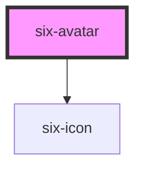

# six-avatar

<!-- EXAMPLES -->

<!-- Auto Generated Below -->

## Properties

| Property   | Attribute  | Description                                                                                | Type                                | Default    |
| ---------- | ---------- | ------------------------------------------------------------------------------------------ | ----------------------------------- | ---------- |
| `alt`      | `alt`      | Alternative text for the image.                                                            | `string`                            | `''`       |
| `image`    | `image`    | The image source to use for the avatar.                                                    | `string`                            | `''`       |
| `initials` | `initials` | Initials to use as a fallback when no image is available (1-2 characters max recommended). | `string`                            | `''`       |
| `shape`    | `shape`    | The shape of the avatar.                                                                   | `"circle" \| "rounded" \| "square"` | `'circle'` |

## Slots

| Slot     | Description                                                    |
| -------- | -------------------------------------------------------------- |
| `"icon"` | The default icon to use when no image or initials are present. |

## Shadow Parts

| Part         | Description                                   |
| ------------ | --------------------------------------------- |
| `"base"`     | The component's base wrapper.                 |
| `"icon"`     | The container that wraps the avatar icon.     |
| `"image"`    | The avatar image.                             |
| `"initials"` | The container that wraps the avatar initials. |

## Dependencies

### Depends on

- [six-icon](../six-icon)

### Graph

----------------------------------------------

Copyright © 2021-present SIX-Group
