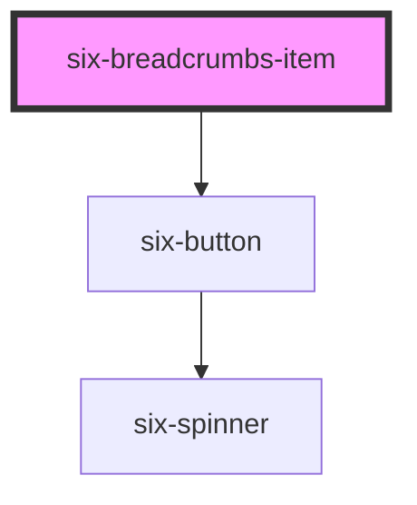

# six-breadcrumb-item

<!-- Auto Generated Below -->

## Properties

| Property   | Attribute  | Description                                 | Type      | Default |
| ---------- | ---------- | ------------------------------------------- | --------- | ------- |
| `disabled` | `disabled` | Set to true to disable the breadcrumb item. | `boolean` | `false` |

## Events

| Event       | Description       | Type                     |
| ----------- | ----------------- | ------------------------ |
| `six-click` | Emitted on click. | `CustomEvent<undefined>` |

## Shadow Parts

| Part       | Description |
| ---------- | ----------- |
| `"base"`   |             |
| `"button"` |             |
| `"prefix"` |             |
| `"suffix"` |             |

## Dependencies

### Depends on

- [six-button](../six-button)

### Graph

---

Copyright © 2021-present SIX-Group
